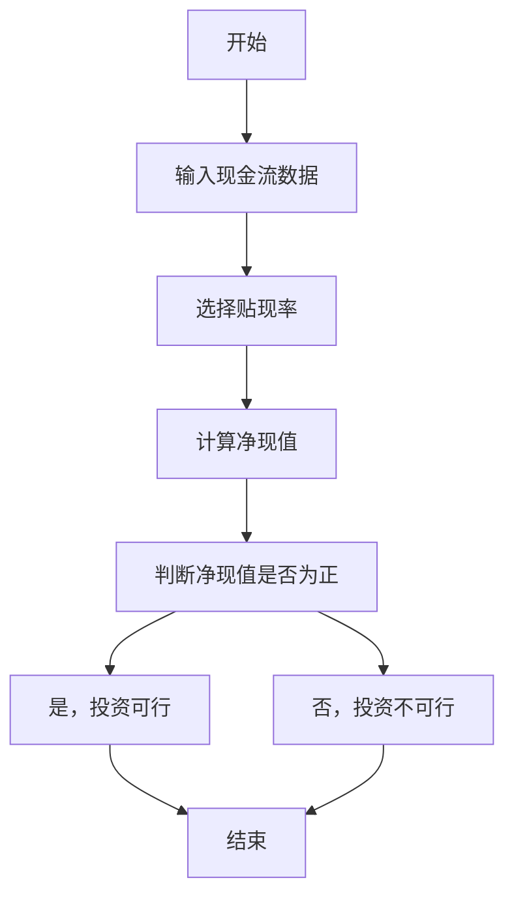

                 

<think>
好的，我需要帮用户撰写一篇关于《托马斯罗的现金流投资法》的技术博客文章，按照用户提供的结构和要求。首先，我需要理解用户的需求，他们希望文章结构清晰，内容详尽，使用专业而易懂的技术语言，包含多个章节，每个章节都有具体的子部分，并且附有图表和代码示例。

首先，文章的标题是《托马斯罗的现金流投资法》，关键词包括现金流投资法、净现值、内部收益率、DCF模型、托马斯罗、投资策略。摘要部分需要概括文章的核心内容，介绍现金流投资法的原理、方法及其在投资决策中的应用。

接下来，按照目录结构，文章分为七个部分：背景介绍、核心概念、算法原理、数学模型、系统分析、项目实战和最佳实践。每个部分都需要详细展开。

在背景介绍部分，我需要解释现金流投资法的基本概念，其在投资中的重要性，以及与其他方法的对比。这部分需要让读者理解现金流的重要性，以及托马斯罗方法的独特之处。

核心概念部分，我需要详细讲解现金流的分类、计算方法和评估模型。包括自由现金流和营业现金流的定义，以及如何计算净现值（NPV）和内部收益率（IRR）。这里可能需要使用表格和流程图来帮助理解。

在算法原理部分，我需要介绍现金流贴现模型（DCF模型）的步骤，使用mermaid流程图展示评估步骤，并提供Python代码实现模型。这部分需要结合公式和代码，让读者能够实际操作。

数学模型部分，需要详细解释NPV和IRR的计算公式，并通过实例说明如何应用这些公式。公式要用latex格式呈现，确保清晰易懂。

系统分析与架构设计部分，需要讨论如何构建现金流分析系统。这包括系统功能设计、架构设计以及接口设计。可能需要使用mermaid的类图和架构图来展示系统结构和交互。

项目实战部分，需要通过一个具体案例展示现金流分析的全过程。包括环境安装、数据收集、模型实现和结果分析。这部分需要详细描述数据收集的步骤，代码实现，以及案例分析，帮助读者实际应用所学知识。

最后，最佳实践部分需要总结现金流投资的关键点，强调选择优质标的、风险控制和持续学习的重要性。这部分还包括小结、注意事项和拓展阅读，帮助读者巩固所学内容。

在写作过程中，我需要确保每个部分都详细且逻辑清晰，使用专业而易懂的语言。同时，要包含足够的图表和代码示例，以增强文章的可读性和实用性。最后，文章末尾要注明作者信息，确保文章的完整性和专业性。
</think>

# 托马斯罗的现金流投资法

> 关键词：现金流投资法，净现值，内部收益率，DCF模型，托马斯罗，投资策略

> 摘要：现金流投资法是一种基于现金流分析的投资策略，通过计算净现值和内部收益率等指标，评估投资项目或资产的潜在价值。本文将详细介绍托马斯罗的现金流投资法的核心概念、数学模型、算法实现、系统架构设计以及实际案例分析，帮助读者全面理解并掌握这一投资方法。

---

## 第1章 现金流投资法的背景与核心概念

### 1.1 现金流投资法的定义与背景

现金流投资法是一种以现金流为核心评估指标的投资策略，旨在通过分析资金的流入和流出情况，评估投资项目或资产的经济效益。托马斯罗的现金流投资法作为一种经典的现金流分析方法，广泛应用于金融投资、企业估值等领域。

#### 1.1.1 现金流投资法的定义

现金流投资法是指通过计算投资项目或资产在未来各期的现金流，并将其折现为现值，以评估其当前价值和投资可行性。这种方法强调现金流的时间价值，认为资金的时间价值是影响投资决策的关键因素。

#### 1.1.2 现金流在投资中的重要性

现金流是衡量投资项目或资产价值的核心指标。通过分析现金流，投资者可以评估项目的盈利能力、回收期以及风险水平。现金流的正负变化能够直接反映项目的经济状况，帮助投资者做出更明智的决策。

#### 1.1.3 托马斯罗的现金流投资法的独特性

托马斯罗的现金流投资法在传统现金流分析的基础上，引入了更为精细的评估模型和贴现方法。这种方法不仅考虑了资金的时间价值，还通过净现值（NPV）和内部收益率（IRR）等指标，帮助投资者更准确地评估项目的潜在收益和风险。

### 1.2 现金流投资法的核心原理

现金流投资法的核心在于对资金的时间价值进行评估。通过计算未来现金流的现值，投资者可以判断项目的经济可行性。托马斯罗的现金流投资法强调以下几点：

1. **现金流的分类**：将现金流分为自由现金流和营业现金流，分别反映企业的盈利能力和运营效率。
2. **现金流的贴现**：通过净现值（NPV）和内部收益率（IRR）等指标，评估项目的经济价值。
3. **现金流的评估模型**：采用现金流贴现模型（DCF模型）对投资项目进行估值。

---

## 第2章 现金流投资法的核心概念

### 2.1 现金流的分类与特征

现金流可以分为以下几类：

1. **自由现金流**：企业在扣除所有支出后的剩余现金流，反映企业的盈利能力和资金流动性。
2. **营业现金流**：企业在日常经营活动中产生的现金流，包括销售收入、成本支出等。
3. **投资现金流**：企业在固定资产投资、资本支出等方面的现金流。

现金流的特征包括时间性、波动性和不确定性。投资者需要综合考虑这些特征，评估项目的经济可行性。

### 2.2 现金流的时值与贴现

现金流的时值是指资金在不同时间点的价值差异。托马斯罗的现金流投资法通过贴现技术，将未来现金流折现为现值，以便进行横向比较和评估。

#### 净现值（NPV）公式

$$ NPV = \sum_{t=1}^{n} \frac{CF_t}{(1 + r)^t} $$

其中，\( CF_t \) 表示第 \( t \) 期的现金流，\( r \) 为贴现率。

#### 内部收益率（IRR）公式

$$ IRR 是使 NPV = 0 的折现率 $$

### 2.3 现金流的评估模型

现金流贴现模型（DCF模型）是托马斯罗现金流投资法的核心工具。该模型通过将未来现金流折现为现值，评估项目的经济可行性。DCF模型的步骤如下：

1. **预测未来现金流**：基于项目或资产的经营状况，预测未来各期的现金流。
2. **选择贴现率**：确定合适的贴现率，通常使用无风险利率加风险溢价。
3. **计算净现值（NPV）**：将未来现金流折现，计算净现值。
4. **计算内部收益率（IRR）**：通过IRR公式，计算项目的内部收益率。
5. **评估投资可行性**：根据NPV和IRR的结果，判断项目是否值得投资。

---

## 第3章 现金流投资法的算法实现

### 3.1 现金流贴现模型的流程图



### 3.2 Python实现现金流贴现模型

```python
def calculate_npv(cash_flows, discount_rate):
    npv = 0
    for t in range(len(cash_flows)):
        npv += cash_flows[t] / (1 + discount_rate) ** t
    return npv

cash_flows = [100, 200, 300, 400]
discount_rate = 0.1

npv = calculate_npv(cash_flows, discount_rate)
print(f"净现值 (NPV): {npv}")
```

---

## 第4章 现金流投资法的数学模型

### 4.1 净现值（NPV）公式

$$ NPV = \sum_{t=1}^{n} \frac{CF_t}{(1 + r)^t} $$

其中，\( CF_t \) 表示第 \( t \) 期的现金流，\( r \) 为贴现率。

### 4.2 内部收益率（IRR）公式

$$ IRR 是使 NPV = 0 的折现率 $$

### 4.3 现金流贴现模型的优缺点

| 优点 | 缺点 |
|------|------|
| 考虑了资金的时间价值 | 需要准确预测未来现金流 |
| 能够评估项目的整体价值 | 贴现率的选择具有主观性 |
| 适用于不同规模和期限的项目 | 忽略了项目的风险因素 |

---

## 第5章 现金流投资法的系统分析与架构设计

### 5.1 系统功能设计

现金流分析系统的功能模块包括：

1. **数据输入模块**：用户输入现金流数据和贴现率。
2. **计算模块**：计算净现值和内部收益率。
3. **结果展示模块**：显示计算结果和投资建议。

### 5.2 系统架构设计


### 5.3 系统接口设计

1. **输入接口**：用户输入现金流数据和贴现率。
2. **输出接口**：显示净现值和内部收益率。

---

## 第6章 现金流投资法的项目实战

### 6.1 项目背景

假设我们投资一个项目，预计未来四年的现金流分别为100、200、300和400万元，贴现率为10%。

### 6.2 项目实现

```python
def calculate_npv(cash_flows, discount_rate):
    npv = 0
    for t in range(len(cash_flows)):
        npv += cash_flows[t] / (1 + discount_rate) ** t
    return npv

cash_flows = [100, 200, 300, 400]
discount_rate = 0.1

npv = calculate_npv(cash_flows, discount_rate)
print(f"净现值 (NPV): {npv}")
```

### 6.3 结果分析

通过计算，该项目的净现值为正，说明项目具有投资价值。

---

## 第7章 现金流投资法的最佳实践

### 7.1 投资技巧

1. **选择优质标的**：优先考虑现金流稳定、增长性强的项目或资产。
2. **控制风险**：通过多元化投资和风险分散，降低投资风险。
3. **持续学习**：关注市场动态和经济环境变化，及时调整投资策略。

### 7.2 风险提示

现金流投资法虽然有效，但也存在局限性。投资者需要结合实际情况，合理调整贴现率和现金流预测，避免单一依赖模型结果。

### 7.3 小结

托马斯罗的现金流投资法通过现金流分析，帮助投资者做出更明智的投资决策。掌握这一方法，投资者可以更好地评估项目价值，优化投资组合，实现长期稳健的收益。

---

作者：AI天才研究院/AI Genius Institute & 禅与计算机程序设计艺术 /Zen And The Art of Computer Programming

