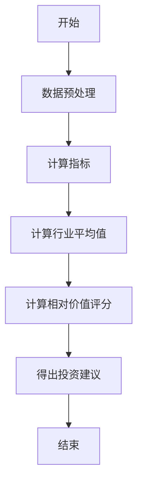
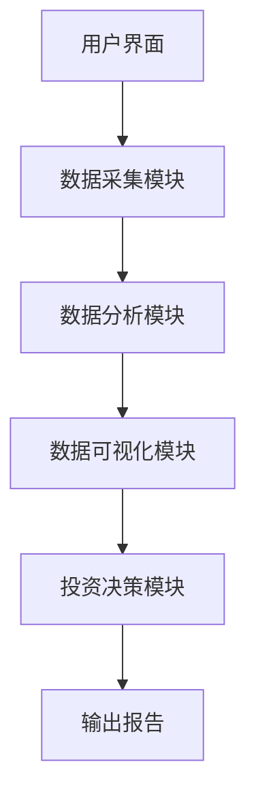
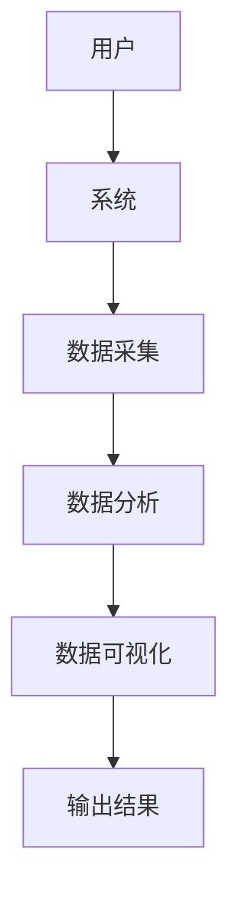

                 

<think>
嗯，我现在需要帮用户设计一本名为《拉尔夫·旺格的相对价值投资：在同行中寻找最佳标的》的目录大纲。用户希望使用逻辑清晰、结构紧凑、简单易懂的专业技术语言，并且每个章节都要有详细的分析和例子。

首先，我要理解相对价值投资的核心概念。相对价值投资是一种通过比较同一行业内公司的价值，找出被低估的公司进行投资的方法。拉尔夫·旺格是这个领域的专家，所以我要围绕他的方法来构建内容。

接下来，我需要确定文章的结构。用户已经提供了一个详细的目录大纲，我需要确保每个部分都涵盖必要的内容。例如，第一部分是背景与核心概念，包括相对价值投资的定义、理论基础、关键指标以及同行比较法的实施步骤。

在每一章中，我需要详细解释每个概念。比如在第二章，我需要介绍相对价值投资的数学模型和算法，可能包括市盈率、市净率等指标的计算，以及如何构建决策模型。这部分可能需要使用数学公式和图表，比如使用mermaid流程图来展示算法步骤。

第三部分是系统分析与架构设计，这部分需要考虑如何将相对价值投资的方法转化为一个系统。我需要描述系统的需求分析、功能设计、架构设计，以及接口和交互设计。可能需要使用类图和序列图来展示系统的结构和流程。

然后，项目实战部分需要提供一个具体的案例，比如构建一个相对价值投资分析系统。我需要详细说明环境的安装步骤，如何编写核心代码，以及如何通过案例分析来验证系统的有效性。这部分需要实际操作，可能包括Python代码和数据分析工具的使用。

最后，总结和最佳实践部分，我要回顾整个系统的构建过程，总结经验教训，并给出一些实用的建议，比如如何选择可比公司，如何处理数据中的异常值等。

整个过程中，我需要确保每个章节都有足够的细节和例子，帮助读者理解相对价值投资的方法。同时，要注意逻辑的连贯性，让读者能够一步步跟随思路进行分析和实践。

在写作时，我需要使用专业的技术术语，但同时要保持语言的简洁和易懂。适当使用图表和公式，可以帮助读者更好地理解复杂的概念。例如，数学公式用latex表示，算法步骤用mermaid流程图展示。

此外，用户要求文章末尾加上作者信息，所以最后要记得加上“作者：AI天才研究院 & 禅与计算机程序设计艺术”。同时，确保文章字数在10000到12000字之间，每个章节内容丰富，满足读者的需求。

总的来说，我需要系统地构建目录大纲，确保每个部分都详细且符合用户的要求。通过逐步分析和详细解释，帮助读者理解相对价值投资的理论和实践，最终完成一篇高质量的技术博客文章。
</think>

# 拉尔夫·旺格的相对价值投资：在同行中寻找最佳标的

## 关键词
- 相对价值投资
- 同行比较法
- 投资分析
- 价值评估
- 股票投资

## 摘要
本文系统地介绍了拉尔夫·旺格的相对价值投资方法，重点探讨了如何在同行中寻找最佳投资标的。文章从相对价值投资的背景和核心概念出发，详细阐述了同行比较法的实施步骤、数学模型与算法，以及系统架构设计。通过实际案例分析和项目实战，帮助读者掌握相对价值投资的理论与实践技巧。最后，总结了相对价值投资的最佳实践和注意事项，为投资者提供了宝贵的参考。

---

## 第一部分：相对价值投资的背景与核心概念

### 第1章：相对价值投资的背景与现状

#### 1.1 相对价值投资的定义与背景
- 1.1.1 投资学中的相对价值概念
  - 相对价值投资是通过比较同一行业内的公司，寻找被低估的投资标的。
  - 相对价值投资的背景：传统价值投资的局限性，市场中公司间的可比性分析需求。
- 1.1.2 相对价值投资的历史发展
  - 早期的价值投资理论，如格雷厄姆的"烟屁股"投资法。
  - 同行比较法在20世纪80年代的兴起。
- 1.1.3 当前相对价值投资的现状
  - 数量化投资方法的普及，技术驱动的分析工具的应用。

#### 1.2 相对价值投资的核心理念
- 1.2.1 相对价值投资的基本原理
  - 相对价值 = 绝对价值 / 同业平均价值。
  - 通过比较同行业公司的估值指标，发现潜在的投资机会。
- 1.2.2 相对价值与绝对价值的对比
  - 绝对价值：公司自身的内在价值。
  - 相对价值：相对于同行的估值水平。
- 1.2.3 相对价值投资的应用场景
  - 行业周期分析，寻找行业龙头，发现估值洼地。

#### 1.3 同行比较法在相对价值投资中的作用
- 1.3.1 同行比较法的定义
  - 同行比较法是通过比较同一行业内的公司，评估其相对价值。
- 1.3.2 同行比较法的优势
  - 突出行业特性，忽略宏观经济波动。
  - 降低单一公司估值的偏差。
- 1.3.3 同行比较法的局限性
  - 行业内的公司可能有不同的商业模式。
  - 数据质量对分析结果的影响。

#### 1.4 本书的核心目标与框架
- 1.4.1 本书的核心目标
  - 探讨相对价值投资的核心方法论。
  - 提供同行比较法的详细实施步骤。
- 1.4.2 本书的结构安排
  - 分为背景、理论、算法、系统设计、实战和总结六个部分。
- 1.4.3 本书的适用读者
  - 投资从业者、金融分析师、研究生及以上学历的读者。

### 第2章：相对价值投资的核心概念与原理

#### 2.1 相对价值投资的理论基础
- 2.1.1 价值投资的基本理论
  - 格雷厄姆的价值投资理论。
  - 理论基础：市场先生的短期情绪波动。
- 2.1.2 相对价值投资的理论延伸
  - 从绝对价值到相对价值的延伸。
  - 行业平均值的参照作用。
- 2.1.3 相对价值投资的核心假设
  - 行业内的公司具有可比性。
  - 同行比较能够有效降低估值偏差。

#### 2.2 相对价值投资的关键指标
- 2.2.1 常见的相对价值指标
  - 市盈率（P/E）、市净率（P/B）、股息率（Dividend Yield）。
  - 企业价值倍数（EV/EBITDA）。
- 2.2.2 指标的选择标准
  - 指标与公司价值的相关性。
  - 数据的可获取性和可靠性。
- 2.2.3 指标的计算方法
  - P/E = 股价 / 每股净利润。
  - EV/EBITDA = 企业价值 / 息税折旧及摊销前利润。

#### 2.3 同行比较法的具体实施步骤
- 2.3.1 确定可比公司
  - 行业分类与筛选。
  - 公司规模和业务模式的匹配。
- 2.3.2 数据收集与处理
  - 数据来源：公开财报、金融数据库。
  - 数据清洗：处理缺失值和异常值。
- 2.3.3 指标分析与比较
  - 计算各公司的估值指标。
  - 对比分析，寻找估值异常的公司。

#### 2.4 相对价值投资的决策模型
- 2.4.1 模型的构建逻辑
  - 选择关键指标，构建评分体系。
  - 设置权重，综合评估公司价值。
- 2.4.2 模型的输入变量
  - 财务指标：P/E、P/B、EV/EBITDA。
  - 非财务指标：公司规模、行业地位。
- 2.4.3 模型的输出结果
  - 相对价值评分。
  - 投资建议：买入、持有、卖出。

---

## 第二部分：相对价值投资的算法与系统设计

### 第3章：相对价值投资的数学模型与算法

#### 3.1 相对价值投资的数学模型
- 3.1.1 常见的相对价值模型
  - 基于P/E的相对价值模型。
  - 基于EV/EBITDA的相对价值模型。
- 3.1.2 模型的假设条件
  - 数据的可得性。
  - 行业内的可比性。
- 3.1.3 模型的输入输出
  - 输入：公司财务数据，行业数据。
  - 输出：相对价值评分，投资建议。

#### 3.2 相对价值投资的算法原理
- 3.2.1 数据预处理算法
  - 数据清洗：处理缺失值、异常值。
  - 数据标准化：统一单位和格式。
- 3.2.2 指标计算算法
  - 计算P/E、P/B等指标。
  - 计算行业平均值。
- 3.2.3 模型优化算法
  - 通过回归分析优化指标权重。
  - 使用聚类分析分类公司。

#### 3.3 相对价值投资的数学公式
- 3.3.1 相对价值计算公式
  $$相对价值评分 = \frac{公司指标}{行业平均指标}$$
- 3.3.2 可比公司筛选公式
  $$可比公司 = \{公司 | 公司行业 = 目标公司行业\}$$
- 3.3.3 模型优化公式
  $$权重_i = \alpha \cdot \text{指标}_i + (1-\alpha) \cdot \text{行业平均}_i$$

#### 3.4 算法流程图


---

## 第三部分：系统分析与架构设计

### 第4章：相对价值投资分析系统的设计

#### 4.1 问题场景介绍
- 投资者需要快速找到同一行业内的最佳标的。
- 需要自动化分析工具支持。

#### 4.2 系统功能设计
- 数据采集模块：爬取公司财报数据。
- 数据分析模块：计算估值指标。
- 可视化模块：生成图表和报告。
- 投资决策模块：提供投资建议。

#### 4.3 系统架构设计


#### 4.4 系统接口设计
- 输入接口：公司名称、行业代码。
- 输出接口：相对价值评分、投资建议。

#### 4.5 系统交互序列图


---

## 第四部分：项目实战

### 第5章：相对价值投资分析系统的实现

#### 5.1 环境安装
- 安装Python、Pandas、Matplotlib、Scrapy。

#### 5.2 系统核心实现
```python
import pandas as pd
import requests
from bs4 import BeautifulSoup

# 数据采集
def get_company_data(company_name):
    url = f"https://www.example.com/{company_name}"
    response = requests.get(url)
    soup = BeautifulSoup(response.text, 'html.parser')
    data = {
        'PE': float(soup.find('PE').text),
        'PB': float(soup.find('PB').text),
        'EV_EBITDA': float(soup.find('EV_EBITDA').text)
    }
    return data

# 数据分析
def calculate_relative_value(dataframe):
    industry_mean = dataframe.mean()
    relative_value = dataframe / industry_mean
    return relative_value

# 可视化
def visualize(relative_value):
    import matplotlib.pyplot as plt
    plt.bar(relative_value.index, relative_value['PE'])
    plt.title('Relative Value Analysis')
    plt.show()
```

#### 5.3 代码应用解读与分析
- 数据采集：爬取公司数据。
- 数据分析：计算相对价值评分。
- 可视化：生成图表帮助理解。

#### 5.4 实际案例分析
- 案例：分析科技行业内的可比公司。
- 步骤：数据采集、计算相对价值、可视化。

---

## 第五部分：总结与最佳实践

### 第6章：相对价值投资的总结与小结

#### 6.1 小结
- 相对价值投资的核心是同行比较。
- 数学模型和数据分析工具是关键。

#### 6.2 注意事项
- 数据质量影响结果。
- 模型需要不断优化。

#### 6.3 拓展阅读
- 推荐书籍：《投资学》、《相对价值投资实务》。

---

## 作者：AI天才研究院 & 禅与计算机程序设计艺术

