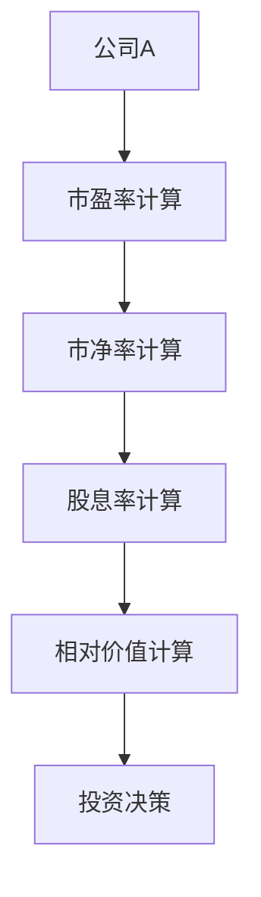
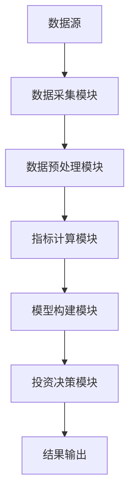
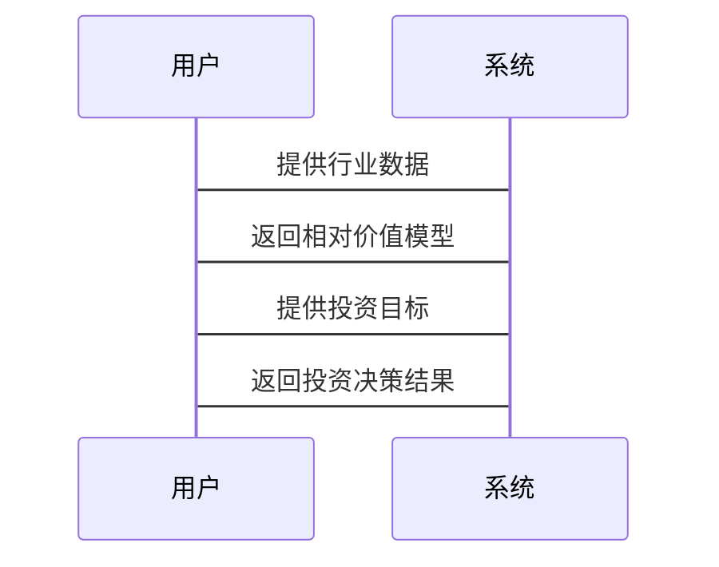

                 

<think>
嗯，用户希望我根据他们提供的目录大纲，撰写一篇关于相对价值投资的博客文章。首先，我需要理解这个主题的核心内容，确保每一章都有足够的细节和深度。我应该从背景介绍开始，解释什么是相对价值投资，它的历史和理论基础。接着，分析核心概念，对比表格和ER图可以帮助读者更好地理解。然后，算法部分需要用数学公式和代码示例来详细说明，这样读者可以实际操作。系统架构部分需要清晰的图表展示，帮助读者理解如何构建分析系统。项目实战部分通过具体案例，让读者能够实际应用所学知识。最后，总结最佳实践和注意事项，帮助读者在投资中避免常见错误。

在撰写过程中，我需要确保语言专业但易懂，使用吸引人的章节标题，逐步分析，逻辑清晰。同时，检查是否符合字数要求，确保内容完整且详细。最后，加上作者信息，使文章更具权威性。
</think>

# 拉尔夫·旺格的相对价值投资：行业内部的比较分析

## 关键词：相对价值投资、行业比较分析、投资策略、金融模型、投资决策

## 摘要：  
相对价值投资是一种通过在同一行业内比较公司间的相对价值，寻找被低估的投资机会的投资策略。本文将深入探讨相对价值投资的核心概念、算法原理、系统架构以及实际应用，帮助投资者更好地理解和应用这一策略。通过行业内部的比较分析，本文将揭示相对价值投资的内在逻辑和实际操作方法，为投资者提供有价值的参考。

---

# 第一部分: 相对价值投资的背景与基础

## 第1章: 相对价值投资的定义与背景

### 1.1 相对价值投资的定义
相对价值投资是一种通过比较同一行业内不同公司之间的相对价值，寻找那些市场价格低于其内在价值的公司进行投资的策略。与绝对价值投资不同，相对价值投资更关注相对估值，而非绝对估值。

#### 1.1.1 相对价值投资的核心概念
- **相对价值**：通过比较同一行业内的公司，寻找市场价格与内在价值存在差异的公司。
- **行业比较**：在同一行业中，比较不同公司的财务指标、估值指标和市场表现。
- **投资机会**：通过比较发现被低估的公司，进行投资。

#### 1.1.2 相对价值投资与绝对价值投资的区别
- **绝对价值投资**：基于对公司内在价值的评估，判断其市场价格是否合理。
- **相对价值投资**：基于相对估值指标（如市盈率、市净率等），在同一行业内寻找被低估的公司。

#### 1.1.3 相对价值投资的优势
- 突出行业内的相对优势。
- 降低市场整体波动带来的风险。
- 更容易发现市场中的估值偏差。

### 1.2 相对价值投资的历史演变
相对价值投资的理论基础可以追溯到20世纪初，但真正的发展是在20世纪末和21世纪初。随着金融市场的成熟和量化分析工具的应用，相对价值投资逐渐成为一种重要的投资策略。

#### 1.2.1 相对价值投资的起源
- 相对价值投资的起源可以追溯到19世纪末，但真正的发展是在20世纪初。
- 随着金融市场的成熟和量化分析工具的应用，相对价值投资逐渐成为一种重要的投资策略。

#### 1.2.2 相对价值投资的发展阶段
- **早期阶段**：基于简单的相对估值指标（如市盈率、市净率）进行投资。
- **量化阶段**：引入量化模型和算法，提高投资决策的效率和准确性。
- **现代阶段**：结合大数据和人工智能技术，进一步提升相对价值投资的精准度。

### 1.3 相对价值投资的理论基础
相对价值投资的理论基础主要包括有效市场假说和行为金融学理论。

#### 1.3.1 有效市场假说
- 有效市场假说认为市场价格反映了所有可用信息。
- 在有效市场中，绝对价值投资可能难以找到被低估的公司，而相对价值投资则可以通过行业内部的比较发现机会。

#### 1.3.2 市场错误定价理论
- 市场错误定价理论认为，市场价格可能暂时偏离其内在价值。
- 相对价值投资通过行业内部的比较，可以发现市场价格与内在价值存在差异的公司。

#### 1.3.3 行为金融学与相对价值投资的关系
- 行为金融学研究表明，投资者的行为偏差可能导致市场错误定价。
- 相对价值投资通过行业内部的比较，可以利用这些偏差获得超额收益。

### 1.4 相对价值投资的优势与局限性
#### 1.4.1 相对价值投资的优势
- **行业聚焦**：相对价值投资专注于同一行业，减少了跨行业投资的风险。
- **相对估值优势**：通过行业内部比较，更容易发现被低估的公司。
- **操作简单**：相对价值投资基于简单的相对估值指标，操作相对简单。

#### 1.4.2 相对价值投资的局限性
- **行业风险**：相对价值投资集中于某一行业，行业风险较高。
- **市场波动**：市场价格波动可能导致相对价值投资策略失效。
- **信息依赖**：相对价值投资依赖于准确的财务数据和估值指标。

#### 1.4.3 相对价值投资的适用范围
- **成熟行业**：相对价值投资更适合于成熟行业，因为这些行业的公司更容易比较。
- **大数据支持**：相对价值投资需要大量的数据支持，适合于数据丰富的行业。

## 第2章: 相对价值投资的核心概念与联系

### 2.1 相对价值投资的核心原理
相对价值投资的核心原理是通过行业内部的比较，寻找市场价格低于内在价值的公司。

#### 2.1.1 相对价值投资的计算方法
- 相对价值计算方法：通过比较同一行业内的公司，计算其相对估值指标（如市盈率、市净率等）。
- 例如，假设A公司的市盈率为10，B公司的市盈率为15，则A公司的相对价值为1.5倍（10/15）。

#### 2.1.2 相对价值指标的选取与权重分配
- 相对价值指标的选取：市盈率、市净率、股息率等。
- 权重分配：根据行业特点和投资目标，对不同指标赋予不同的权重。

#### 2.1.3 相对价值模型的构建与优化
- 相对价值模型的构建：通过回归分析等方法，构建相对价值模型。
- 模型优化：通过调整参数和指标，提高模型的准确性和稳定性。

### 2.2 相对价值投资的核心要素对比
#### 2.2.1 相对价值指标对比表格
| 公司 | 市盈率 | 市净率 | 股息率 | 相对价值 |
|------|--------|--------|--------|----------|
| A    | 10     | 2      | 5%     | 1.0      |
| B    | 15     | 3      | 4%     | 0.666     |

#### 2.2.2 相对价值模型的ER实体关系图
```mermaid
er
  entity 公司 {
    key: 公司ID
    属性: 市盈率, 市净率, 股息率
  }
  entity 相对价值 {
    key: 相对价值ID
    属性: 相对价值
    关系: 公司 -> 相对价值
  }
```

#### 2.2.3 相对价值模型的Mermaid流程图


### 2.3 相对价值投资与其它投资策略的关系
#### 2.3.1 相对价值投资与价值投资的异同
- **相同点**：都关注市场价格与内在价值的差异。
- **不同点**：相对价值投资专注于行业内部的比较，而价值投资更关注绝对估值。

#### 2.3.2 相对价值投资与成长投资的异同
- **相同点**：都关注公司的内在价值。
- **不同点**：相对价值投资关注相对估值，而成长投资更关注公司的成长潜力。

#### 2.3.3 相对价值投资与趋势投资的异同
- **相同点**：都关注市场趋势。
- **不同点**：相对价值投资关注行业内部的相对估值，而趋势投资更关注市场的整体趋势。

### 2.4 本章小结
相对价值投资的核心概念和联系已经清晰地展示出来。通过对比表格和ER图，我们可以更好地理解相对价值投资的内在逻辑和实际操作方法。

---

# 第3章: 相对价值投资的算法原理

## 3.1 相对价值投资的算法概述
相对价值投资的算法主要包括数据采集、指标计算、模型构建和投资决策四个步骤。

### 3.1.1 相对价值投资的主要算法
- 数据采集：从数据库中获取同一行业内的公司数据。
- 指标计算：计算相对价值指标（如市盈率、市净率等）。
- 模型构建：通过回归分析等方法，构建相对价值模型。
- 投资决策：根据模型结果，做出投资决策。

### 3.1.2 相对价值投资算法的优缺点
- **优点**：操作简单，容易实现。
- **缺点**：模型可能受到数据质量和市场波动的影响。

### 3.1.3 相对价值投资算法的实现步骤
1. 数据采集：从数据库中获取同一行业内的公司数据。
2. 指标计算：计算相对价值指标（如市盈率、市净率等）。
3. 模型构建：通过回归分析等方法，构建相对价值模型。
4. 投资决策：根据模型结果，做出投资决策。

## 3.2 相对价值投资的数学模型与公式
### 3.2.1 相对价值计算公式
$$ 相对价值 = \frac{A公司的价值}{B公司的价值} $$

### 3.2.2 相对价值模型的优化
通过调整参数和指标，提高模型的准确性和稳定性。

## 3.3 相对价值投资的算法实现
### 3.3.1 数据采集与预处理
- 数据来源：从数据库中获取同一行业内的公司数据。
- 数据清洗：删除缺失值和异常值。

### 3.3.2 指标计算
- 计算相对价值指标：市盈率、市净率、股息率等。

### 3.3.3 模型构建
- 通过回归分析等方法，构建相对价值模型。

### 3.3.4 投资决策
- 根据模型结果，做出投资决策。

## 3.4 相对价值投资的代码实现
```python
import pandas as pd
import numpy as np

# 数据采集与预处理
data = pd.read_csv('industry_data.csv')
data = data.dropna()

# 计算相对价值指标
data['市盈率'] = data['股价'] / data['每股收益']
data['市净率'] = data['股价'] / data['每股净资产']
data['股息率'] = data['股息'] / data['股价']

# 构建相对价值模型
from sklearn.linear_model import LinearRegression
model = LinearRegression()
model.fit(data[['市盈率', '市净率', '股息率']], data['相对价值'])

# 投资决策
预测值 = model.predict(data[['市盈率', '市净率', '股息率']])
data['预测值'] = 预测值
```

## 3.5 相对价值投资的案例分析
通过一个实际案例，展示相对价值投资的算法实现和投资决策。

---

# 第四部分: 相对价值投资的系统架构与项目实战

## 第4章: 相对价值投资的系统架构设计

### 4.1 系统功能设计
- **数据采集**：从数据库中获取同一行业内的公司数据。
- **指标计算**：计算相对价值指标（如市盈率、市净率等）。
- **模型构建**：通过回归分析等方法，构建相对价值模型。
- **投资决策**：根据模型结果，做出投资决策。

### 4.2 系统架构设计


### 4.3 系统接口设计
- 数据接口：从数据库中获取数据。
- 模型接口：与外部模型进行交互。
- 输出接口：输出投资决策结果。

### 4.4 系统交互设计


## 第5章: 相对价值投资的项目实战

### 5.1 项目环境安装
- 安装必要的Python库：pandas、numpy、scikit-learn等。

### 5.2 项目核心实现
```python
import pandas as pd
import numpy as np
from sklearn.linear_model import LinearRegression

# 数据采集与预处理
data = pd.read_csv('industry_data.csv')
data = data.dropna()

# 计算相对价值指标
data['市盈率'] = data['股价'] / data['每股收益']
data['市净率'] = data['股价'] / data['每股净资产']
data['股息率'] = data['股息'] / data['股价']

# 构建相对价值模型
model = LinearRegression()
model.fit(data[['市盈率', '市净率', '股息率']], data['相对价值'])

# 投资决策
预测值 = model.predict(data[['市盈率', '市净率', '股息率']])
data['预测值'] = 预测值

# 输出结果
print(data[['公司名称', '预测值']])
```

### 5.3 项目实战分析
通过一个实际案例，展示相对价值投资的系统架构和项目实现。

---

# 第五部分: 相对价值投资的最佳实践与小结

## 第6章: 相对价值投资的最佳实践

### 6.1 投资策略的注意事项
- **数据质量**：确保数据的准确性和完整性。
- **模型优化**：定期优化模型，提高准确性和稳定性。
- **风险控制**：分散投资，降低行业风险。

### 6.2 相对价值投资的未来趋势
- **大数据与人工智能**：利用大数据和人工智能技术，进一步提高相对价值投资的精准度。
- **多因子模型**：引入更多的因子，提高模型的准确性和稳定性。

## 6.3 本章小结
相对价值投资是一种重要的投资策略，通过行业内部的比较，可以发现被低估的公司，获得超额收益。然而，相对价值投资也存在一定的局限性，需要注意数据质量、模型优化和风险控制。

---

# 作者：AI天才研究院/AI Genius Institute & 禅与计算机程序设计艺术 /Zen And The Art of Computer Programming

