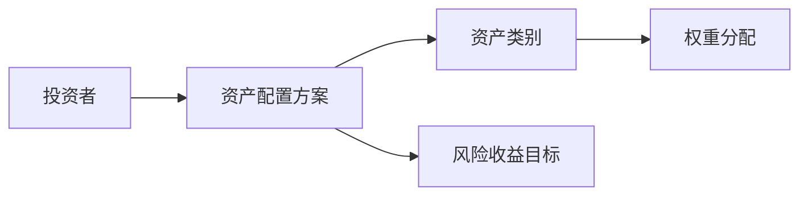
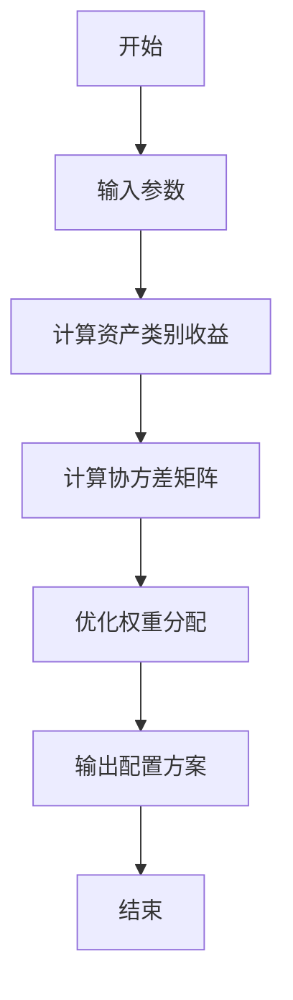
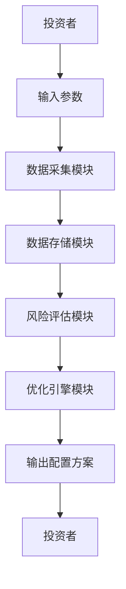

                 

<think>
好的，用户需要我根据之前的思考过程，按照他们的具体要求撰写一篇技术博客文章，标题是《拉尔夫·旺格的资产配置革命》。首先，我需要理解用户的具体需求。他们希望文章结构清晰，逻辑严谨，内容详实，涵盖资产配置的背景、核心概念、算法原理、系统架构、项目实战以及最佳实践等部分，并且每个部分都要有详细的讲解和实例。

首先，我需要从资产配置的基本概念入手，介绍什么是资产配置，它在投资中的作用，以及为什么需要进行资产配置。这部分是基础，也是读者理解后续内容的关键。接下来，我需要解释资产配置的核心问题，比如投资者的风险偏好、资产类别选择以及市场波动的影响。这些都是投资者在进行资产配置时需要考虑的重要因素。

然后，我需要引入拉尔夫·旺格的资产配置革命。这部分需要详细说明传统资产配置方法的局限性，比如过于依赖历史数据，无法适应市场变化，以及如何通过现代投资组合理论（MPT）来优化资产配置。旺格的创新理论是文章的核心，我需要详细解释他的理论如何突破传统方法的限制，以及他的方法如何通过数学模型和算法来实现更优的资产配置。

在核心概念部分，我需要对比不同的资产配置方法，比如基于历史数据的方法、现代投资组合理论和情景分析法。通过对比分析，展示旺格方法的优势。同时，我还需要用图表和数学公式来解释这些概念，比如用ER实体关系图展示投资者、资产配置方案、资产类别等之间的关系。

接下来，算法原理是文章的重要部分。我需要详细讲解现代投资组合理论的数学模型，包括均值-方差模型和马科维茨优化模型，并通过公式和图表来展示这些模型的应用。然后，我需要介绍旺格算法的实现，包括算法流程图和Python代码示例，让读者能够理解如何实际应用这些算法。

在系统架构部分，我需要描述资产配置系统的功能模块，比如数据采集、风险评估和优化引擎，并用图表展示系统的架构设计和交互流程。这部分需要展示系统如何实现旺格的理论，并与实际应用相结合。

项目实战部分，我需要指导读者如何安装必要的环境，比如Python和相关库，并提供完整的代码示例。通过具体案例分析，展示如何应用旺格的资产配置方法来实现一个实际的项目。最后，我需要总结项目的核心实现和实际应用中的注意事项。

在最佳实践部分，我需要给出一些实用的建议，比如如何根据市场变化调整配置策略，如何选择合适的工具和技术栈，以及如何进行风险管理和监控。这些内容能够帮助读者更好地理解和应用旺格的理论。

最后，我需要总结全文，强调旺格资产配置革命的重要性和应用价值，并展望未来的发展趋势。同时，注明作者信息，确保文章的完整性和权威性。

总的来说，我需要确保文章结构清晰，内容详实，语言专业且易于理解。通过图表、公式和代码示例，深入浅出地讲解资产配置的核心概念和算法原理，同时结合实际案例和系统设计，展示旺格方法的实际应用价值。这样，读者不仅能够理解理论，还能掌握实际操作的方法，达到用户的要求。
</think>

# 拉尔夫·旺格的资产配置革命

> 关键词：资产配置，投资组合理论，风险管理，拉尔夫·旺格，现代投资组合理论（MPT）

> 摘要：本文深入探讨了拉尔夫·旺格在资产配置领域的革命性贡献，分析了其创新理论的核心思想、数学模型、算法实现以及实际应用。通过对比传统资产配置方法，详细讲解了旺格方法的优势，并结合系统架构设计和项目实战，展示了其在投资组合管理中的广泛应用。本文旨在为投资专业人士提供理论与实践相结合的深度解析，帮助读者更好地理解和应用旺格的资产配置革命。

---

# 第一部分: 资产配置革命的背景与核心概念

## 第1章: 资产配置的基本概念与问题背景

### 1.1 资产配置的定义与作用

#### 1.1.1 资产配置的定义
资产配置是指根据投资者的风险偏好、收益目标和市场环境，将资金分配到不同资产类别（如股票、债券、房地产等）的过程。其目的是在控制风险的前提下，实现收益最大化。

#### 1.1.2 资产配置在投资中的作用
资产配置是投资组合管理的核心，它决定了投资组合的风险和收益特征。通过科学的资产配置，投资者可以在不同市场环境下优化收益-风险比。

#### 1.1.3 资产配置与风险管理的关系
资产配置不仅是收益的来源，也是风险管理的关键工具。通过合理分配资产类别权重，投资者可以降低组合的波动性，分散系统性风险。

### 1.2 资产配置的核心问题

#### 1.2.1 投资者风险偏好与收益目标
投资者的风险承受能力和收益需求是资产配置的基础。不同投资者有不同的风险偏好，这决定了资产配置的策略。

#### 1.2.2 资产类别选择与权重分配
资产类别选择是资产配置的关键步骤。常见的资产类别包括股票、债券、现金等。权重分配决定了每类资产在组合中的比例。

#### 1.2.3 市场波动与经济周期的影响
市场波动和经济周期对资产配置的影响不可忽视。不同经济环境下，某些资产类别的表现会显著优于其他类别。

### 1.3 资产配置的常见方法

#### 1.3.1 基于历史数据的资产配置
这种方法通过分析历史数据，预测未来资产收益，并据此分配权重。但其局限性在于假设历史会重复，无法应对突发事件。

#### 1.3.2 基于现代投资组合理论（MPT）的配置方法
MPT（Modern Portfolio Theory）由哈里·马科维茨提出，强调通过优化投资组合的风险-收益比来实现收益最大化。

#### 1.3.3 基于情景分析的动态配置
情景分析法通过构建不同的市场情景，动态调整资产配置策略，以应对复杂多变的市场环境。

### 1.4 拉尔夫·旺格的资产配置革命

#### 1.4.1 传统资产配置方法的局限性
传统方法过于依赖历史数据，缺乏对市场变化的适应性。此外，传统方法往往忽视了资产之间的相互关联性。

#### 1.4.2 拉尔夫·旺格的创新理论概述
旺格提出了一种基于动态再平衡和实时数据的资产配置方法，结合现代数学优化模型，显著提高了配置的科学性和实用性。

#### 1.4.3 资产配置革命的核心思想
旺格的革命性思想在于将资产配置从静态的历史数据分析转向动态的实时优化，结合数学模型和算法，实现了更精确的收益-风险优化。

---

## 第2章: 资产配置的核心概念与联系

### 2.1 资产配置的数学模型

#### 2.1.1 现代投资组合理论（MPT）的基本原理
MPT的核心目标是通过优化投资组合的方差（风险）来实现收益最大化。公式表示为：
$$ \text{优化目标} = \min \sum_{i=1}^{n} w_i^2 \sigma_i^2 $$
其中，\( w_i \) 是第 \( i \) 种资产的权重，\( \sigma_i \) 是其收益波动率。

#### 2.1.2 资产配置的优化模型
优化模型通常包括以下约束条件：
$$ \sum_{i=1}^{n} w_i = 1 $$
$$ \sum_{i=1}^{n} w_i r_i = \text{目标收益} $$

#### 2.1.3 资产配置与风险收益的平衡
在MPT框架下，投资者可以通过调整资产权重，在有效前沿上找到满足自身风险偏好的最优组合。

### 2.2 核心概念对比分析

#### 2.2.1 不同资产配置方法的特征对比
| 方法 | 基于历史数据 | 基于MPT | 基于情景分析 |
|------|--------------|---------|--------------|
| 优点 | 简单易行 | 科学优化 | 灵活性高 |
| 缺点 | 无法应对突发事件 | 计算复杂 | 需要大量假设 |

#### 2.2.2 资产配置与投资组合管理的联系与区别
资产配置是投资组合管理的一部分，但投资组合管理还包括交易执行和绩效评估。

#### 2.2.3 资产配置与风险管理的协同作用
资产配置通过分散投资降低组合风险，而风险管理则通过监控和调整进一步控制风险。

### 2.3 资产配置的ER实体关系图


---

## 第3章: 资产配置的算法原理

### 3.1 现代投资组合理论（MPT）的数学模型

#### 3.1.1 均值-方差模型
均值-方差模型的目标是最小化投资组合的方差，同时满足收益目标。数学表达式为：
$$ \min \sum_{i=1}^{n} \sum_{j=1}^{n} w_i w_j \sigma_{ij} $$
$$ \text{subject to} \quad \sum_{i=1}^{n} w_i r_i = \text{目标收益} $$

#### 3.1.2 有效前沿的计算方法
有效前沿是所有可能投资组合中风险-收益比最优的集合。通过优化算法可以找到有效前沿上的点。

#### 3.1.3 马科维茨优化模型
马科维茨优化模型是MPT的核心，公式如下：
$$ \min w^T \Sigma w $$
$$ \text{subject to} \quad w^T \mu = \text{目标收益} $$

### 3.2 拉尔夫·旺格资产配置算法的实现

#### 3.2.1 算法流程图


#### 3.2.2 Python实现示例
```python
import numpy as np
from scipy.optimize import minimize

def portfolio_optimization(returns, cov_matrix, target_return=0.1):
    n = len(returns)
    # 定义优化目标函数
    def objective(weights):
        return (weights.T @ cov_matrix @ weights).item()
    # 定义约束条件
    constraints = [
        {'type': 'eq', 'fun': lambda w: np.sum(w) - 1},
        {'type': 'eq', 'fun': lambda w: w.T @ returns - target_return}
    ]
    # 约束优化
    result = minimize(objective, np.ones(n)/n, method='SLSQP', constraints=constraints)
    return result.x

# 示例数据
returns = np.array([0.1, 0.15, 0.08])
cov_matrix = np.array([
    [0.04, 0.02, 0.01],
    [0.02, 0.06, 0.03],
    [0.01, 0.03, 0.05]
])
weights = portfolio_optimization(returns, cov_matrix)
print("最优权重:", weights)
```

---

## 第4章: 资产配置的系统分析与架构设计

### 4.1 问题场景介绍
在实际投资中，投资者需要根据市场变化实时调整资产配置。传统的静态配置方法难以应对复杂多变的市场环境。

### 4.2 系统功能设计

#### 4.2.1 数据采集模块
负责收集各资产类别的历史数据和实时数据。

#### 4.2.2 风险评估模块
通过数学模型评估各资产类别的风险特征。

#### 4.2.3 优化引擎模块
基于优化算法计算出最优的资产配置方案。

#### 4.2.4 系统架构图


### 4.3 系统交互流程图


---

## 第5章: 项目实战

### 5.1 环境安装
需要安装Python和相关库（如NumPy、SciPy、Matplotlib）。

### 5.2 核心实现代码
```python
import numpy as np
from scipy.optimize import minimize

def portfolio_optimization(returns, cov_matrix, target_return=0.1):
    n = len(returns)
    def objective(weights):
        return (weights.T @ cov_matrix @ weights).item()
    constraints = [
        {'type': 'eq', 'fun': lambda w: np.sum(w) - 1},
        {'type': 'eq', 'fun': lambda w: w.T @ returns - target_return}
    ]
    result = minimize(objective, np.ones(n)/n, method='SLSQP', constraints=constraints)
    return result.x

# 示例数据
returns = np.array([0.1, 0.15, 0.08])
cov_matrix = np.array([
    [0.04, 0.02, 0.01],
    [0.02, 0.06, 0.03],
    [0.01, 0.03, 0.05]
])
weights = portfolio_optimization(returns, cov_matrix)
print("最优权重:", weights)
```

### 5.3 实际案例分析
假设我们有三类资产，其预期收益和协方差矩阵如上所示。通过优化算法，我们可以得到最优的资产配置权重。

---

## 第6章: 最佳实践与总结

### 6.1 最佳实践
- 定期监控市场环境并调整配置。
- 结合多种方法进行资产配置。
- 使用先进的数学优化工具。

### 6.2 小结
本文深入分析了拉尔夫·旺格的资产配置革命，从理论到实践，详细讲解了其核心思想和实现方法。旺格的方法通过动态优化和数学建模，显著提高了资产配置的科学性和实用性。

### 6.3 注意事项
- 资产配置需要结合实际市场环境。
- 优化算法需要根据具体问题进行调整。
- 风险管理是资产配置的重要组成部分。

### 6.4 拓展阅读
- 哈里·马科维茨的《投资组合的选择》。
- 其他现代投资组合理论的经典文献。

---

# 作者：AI天才研究院 & 禅与计算机程序设计艺术

