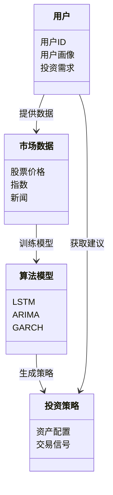

                 

<think>
好的，我需要撰写一篇关于“探索下一代投资理财智能助手的发展方向”的技术博客文章。这篇文章需要符合用户的要求，具有逻辑清晰、结构紧凑、简单易懂的专业技术语言，同时包含丰富的分析和见解。

首先，我需要理解用户的需求。用户希望文章包括以下几个部分：

1. **背景与现状**：介绍人工智能在金融领域的应用，投资理财领域的痛点，以及智能投顾的发展趋势。
2. **核心概念与技术原理**：详细讲解智能投顾的核心概念、体系结构、算法原理和数学模型。
3. **系统分析与架构设计**：分析智能投顾系统的各个模块，包括用户交互、数据处理、策略执行等。
4. **项目实战**：通过实际案例展示智能投顾的实现，包括环境配置、核心代码实现、案例分析等。
5. **未来展望与最佳实践**：总结全文，展望未来发展方向，并提出实践建议。

接下来，我需要确保每个部分都详细展开，逻辑清晰，内容丰富。同时，要使用专业术语，但保持语言的易懂性。

首先，我会从背景介绍开始，说明为什么需要投资理财智能助手，当前市场的需求，以及人工智能技术如何推动这一领域的发展。

然后，我会详细讲解智能投顾的核心概念，如用户画像、资产配置、市场预测等，并通过对比分析表格和实体关系图来展示这些概念之间的联系。

接下来，我会深入探讨算法原理，特别是机器学习和自然语言处理在投资中的应用，同时通过数学公式和图表来解释LSTM、ARIMA和GARCH模型的原理和应用。

在系统分析部分，我会设计智能投顾系统的各个模块，使用架构图和交互流程图来展示系统的结构和功能。

项目实战部分，我会提供具体的代码实现和案例分析，让读者能够实际操作和理解。

最后，我会总结全文，展望未来智能投顾的发展方向，并提出实践中的注意事项和建议。

通过以上步骤，我将逐步构建一篇结构清晰、内容丰富的技术博客文章，满足用户的需求。
</think>

# 探索下一代投资理财智能助手的发展方向

## 关键词：智能投顾、人工智能、投资理财、机器学习、自然语言处理、金融系统

## 摘要：随着人工智能技术的飞速发展，投资理财领域正在经历一场深刻的变革。智能投顾作为这一变革的核心，结合机器学习、自然语言处理和时间序列分析等技术，正在为投资者提供更加精准和个性化的服务。本文将深入探讨下一代投资理财智能助手的发展方向，分析其核心概念、算法原理和系统架构，并通过实际案例展示其应用前景。同时，本文还将展望未来智能投顾的发展趋势，并提出相应的实践建议。

---

# 第一部分：投资理财智能助手的背景与需求

## 第1章：投资理财智能助手的背景与需求

### 1.1 人工智能在金融领域的应用现状

#### 1.1.1 人工智能技术在金融行业的应用领域

人工智能技术在金融领域的应用日益广泛，涵盖了以下几个主要领域：

1. **智能投顾**：通过算法模型为投资者提供个性化的投资建议。
2. **风险控制**：利用机器学习模型进行信用评估和风险管理。
3. **市场预测**：通过自然语言处理和时间序列分析预测市场走势。
4. **量化交易**：基于算法和大数据进行高频交易和策略优化。

#### 1.1.2 投资理财领域的痛点与需求

投资理财领域存在着以下主要痛点：

1. **信息过载**：投资者难以从海量信息中筛选出有价值的内容。
2. **决策复杂性**：投资决策需要考虑多种因素，对个人能力要求较高。
3. **个性化需求**：不同投资者的风险承受能力和收益目标差异较大。
4. **实时性要求**：市场变化迅速，投资决策需要实时响应。

#### 1.1.3 智能投顾的定义与目标

智能投顾（Robo-Advisor）是一种基于人工智能技术的投资顾问服务，其目标是通过算法模型为投资者提供个性化的投资建议，优化资产配置，并实时监控市场变化，帮助投资者实现收益最大化和风险最小化。

---

### 1.2 下一代智能投顾的发展趋势

#### 1.2.1 从传统投顾到智能投顾的演变

传统投资顾问服务依赖于人工分析和经验判断，存在效率低、成本高的问题。随着人工智能技术的发展，智能投顾逐渐成为主流，其优势在于能够快速处理海量数据，提供实时、个性化的投资建议。

#### 1.2.2 下一代智能投顾的核心特征

下一代智能投顾将具有以下核心特征：

1. **智能化**：基于机器学习和深度学习技术，实现自主学习和优化。
2. **个性化**：通过用户画像和行为分析，提供高度个性化的投资建议。
3. **实时性**：能够实时监控市场变化，快速调整投资策略。
4. **多维度数据融合**：整合文本数据、市场数据、用户行为数据等，提供全面的投资分析。

#### 1.2.3 全球智能投顾市场的现状与未来

目前，全球智能投顾市场呈现快速增长态势，主要驱动因素包括技术进步、市场需求增加以及成本降低。未来，智能投顾将更加普及，并与区块链、大数据等新兴技术深度融合，进一步提升服务质量和效率。

---

## 第2章：智能投顾的核心概念与体系结构

### 2.1 智能投顾的核心概念

#### 2.1.1 用户画像与需求分析

用户画像是智能投顾系统的核心输入之一，主要包括以下内容：

1. **用户基本信息**：年龄、性别、职业、收入水平等。
2. **财务状况**：资产规模、负债情况、现金流等。
3. **投资目标**：收益目标、风险承受能力、投资期限等。
4. **行为特征**：投资偏好、交易频率、市场反应等。

通过用户画像，系统可以精准定位用户的需求，并制定个性化的投资策略。

#### 2.1.2 资产配置与风险评估

资产配置是智能投顾的核心任务之一，主要包括以下步骤：

1. **资产分类**：将资产分为股票、债券、基金、现金等类别。
2. **风险评估**：基于历史数据和市场情况，评估各类资产的风险水平。
3. **优化配置**：通过算法模型，优化资产配置比例，实现风险与收益的平衡。

#### 2.1.3 市场预测与投资策略

市场预测是智能投顾的重要组成部分，主要包括以下内容：

1. **市场趋势分析**：基于时间序列分析和机器学习模型，预测市场走势。
2. **行业分析**：分析不同行业的市场表现，制定行业配置策略。
3. **突发事件应对**：实时监控市场变化，应对突发事件带来的风险。

---

#### 2.1.4 核心要素对比分析

以下是智能投顾系统中各核心要素的对比分析表格：

| 核心要素 | 特性1 | 特性2 | 特性3 |
|----------|--------|--------|--------|
| 用户画像 | 个性化 | 数据驱动 | 动态调整 |
| 资产配置 | 风险控制 | 收益最大化 | 灵活性高 |
| 市场预测 | 实时性 | 准确性 | 可解释性 |

---

#### 2.1.5 ER实体关系图

以下是智能投顾系统的核心要素实体关系图：

```mermaid
erd
actor 用户, advisor 智能投顾系统, market 市场数据
用户 --> advisor: 提供用户画像
market --> advisor: 提供市场数据
advisor --> 用户: 提供投资建议
```

---

### 2.2 智能投顾的体系结构

#### 2.2.1 数据采集与处理模块

数据采集与处理模块是智能投顾系统的基础，主要包括以下功能：

1. **数据源**：包括市场数据（股票价格、指数等）、用户数据（用户画像）、新闻数据等。
2. **数据清洗**：对采集的数据进行去噪和标准化处理。
3. **数据存储**：将处理后的数据存储在数据库中，供后续模块使用。

#### 2.2.2 算法模型与策略执行模块

算法模型与策略执行模块是智能投顾的核心，主要包括以下功能：

1. **模型训练**：基于历史数据训练机器学习模型，如LSTM、ARIMA等。
2. **策略生成**：根据用户需求和市场预测生成投资策略。
3. **策略执行**：将生成的投资策略转化为具体的交易指令。

#### 2.2.3 用户交互与反馈模块

用户交互与反馈模块是智能投顾的前端部分，主要包括以下功能：

1. **用户界面**：提供友好的用户界面，方便用户输入需求和查看投资建议。
2. **实时反馈**：根据市场变化和用户需求，实时更新投资建议。
3. **用户反馈**：收集用户的反馈信息，优化系统性能。

---

## 第3章：智能投顾的算法原理与数学模型

### 3.1 机器学习在智能投顾中的应用

#### 3.1.1 监督学习与无监督学习在投资中的应用

- **监督学习**：用于预测股票价格，分类市场状态。
- **无监督学习**：用于客户分群、异常检测。

#### 3.1.2 聚类算法在用户分群中的应用

聚类算法可以将用户分为不同的群体，例如：

- **风险厌恶型**：低风险承受能力，保守型投资者。
- **风险中性型**：中等风险承受能力，平衡型投资者。
- **风险偏好型**：高风险承受能力，积极型投资者。

#### 3.1.3 回归算法在资产定价中的应用

回归算法可以用于预测资产价格，例如：

$$ \text{预测价格} = \beta_0 + \beta_1 \times \text{市场指数} + \epsilon $$

其中，$\epsilon$ 是误差项。

---

### 3.2 自然语言处理（NLP）在投资中的应用

#### 3.2.1 文本挖掘与情感分析

文本挖掘可以用于分析新闻、社交媒体等文本数据，提取市场情绪。情感分析可以判断市场情绪是正面、负面还是中性。

#### 3.2.2 基于NLP的市场情绪预测

市场情绪预测可以通过分析新闻标题、社交媒体评论等文本数据，预测市场走势。例如，使用LSTM模型进行文本序列预测。

---

### 3.3 时间序列分析与投资预测

#### 3.3.1 LSTM模型在时间序列预测中的应用

LSTM（长短期记忆网络）是一种适用于时间序列预测的深度学习模型。其核心思想是通过记忆单元（memory cell）捕获长期依赖关系。LSTM的结构如下图所示：

```mermaid
graph TD
LSTM --> input
LSTM --> forget gate
LSTM --> output
```

#### 3.3.2 ARIMA模型的原理与应用

ARIMA（自回归积分滑动平均模型）是一种广泛应用于时间序列预测的统计模型。其基本假设是时间序列具有平稳性。ARIMA模型的公式如下：

$$ \phi(\theta) = 1 - \theta_1 B - \theta_2 B^2 - \dots - \theta_p B^p $$

其中，$B$ 是延迟算子。

#### 3.3.3 GARCH模型在风险管理中的应用

GARCH（广义自回归条件异方差模型）是一种用于风险管理的模型，主要用于预测金融资产的波动性。其公式如下：

$$ \sigma_t^2 = \alpha_0 + \alpha_1 \sigma_{t-1}^2 + \beta_1 \sigma_{t-2}^2 $$

---

## 第4章：智能投顾的系统分析与架构设计

### 4.1 问题场景介绍

智能投顾系统需要解决的主要问题包括：

1. **数据采集**：如何高效采集和处理多源数据。
2. **模型训练**：如何选择和优化算法模型。
3. **系统交互**：如何实现用户友好的交互界面。

---

### 4.2 系统功能设计

#### 4.2.1 领域模型（Mermaid 类图）

以下是智能投顾系统的领域模型：



---

### 4.3 系统架构设计（Mermaid 架构图）

以下是智能投顾系统的架构图：


---

## 第5章：智能投顾的项目实战

### 5.1 环境配置

#### 5.1.1 Python 环境安装

需要安装以下Python库：

- `pandas`：数据处理
- `numpy`：数值计算
- `keras`：深度学习框架
- `sklearn`：机器学习库
- `datetime`：时间处理
- `requests`：HTTP 请求

#### 5.1.2 数据源配置

数据源包括：

- 股票数据：从Yahoo Finance获取
- 新闻数据：从API获取
- 用户数据：本地存储

---

### 5.2 核心代码实现

#### 5.2.1 数据处理代码

```python
import pandas as pd
import numpy as np

# 从Yahoo Finance获取股票数据
def get_stock_data(ticker):
    data = pd.DataFrame()
    # 获取数据
    return data
```

#### 5.2.2 LSTM 模型实现

```python
from keras.layers import LSTM, Dense, Dropout
from keras.models import Sequential

def build_lstm_model(input_shape):
    model = Sequential()
    model.add(LSTM(units=64, return_sequences=True, input_shape=input_shape))
    model.add(Dropout(0.5))
    model.add(LSTM(units=32, return_sequences=False))
    model.add(Dense(1))
    model.compile(optimizer='adam', loss='mean_squared_error')
    return model
```

---

### 5.3 案例分析

#### 5.3.1 案例背景

假设我们有一个包含多只股票的数据集，目标是预测股票价格走势。

#### 5.3.2 数据分析与建模

1. **数据清洗**：处理缺失值和异常值。
2. **特征工程**：提取技术指标（如移动平均线、相对强弱指数等）。
3. **模型训练**：使用LSTM模型进行训练。
4. **模型评估**：通过回测验证模型的准确性。

---

## 第6章：智能投顾的未来展望与最佳实践

### 6.1 未来发展方向

1. **技术融合**：与其他新兴技术（如区块链、大数据）深度融合。
2. **个性化服务**：进一步提升个性化投资建议的精准度。
3. **实时性优化**：提升系统的实时响应能力。

### 6.2 最佳实践 Tips

1. **数据质量**：确保数据的准确性和完整性。
2. **模型优化**：定期更新和优化算法模型。
3. **风险管理**：建立完善的风险控制机制，降低投资风险。

### 6.3 小结

下一代投资理财智能助手的发展方向是智能化、个性化和实时化。通过人工智能技术的应用，智能投顾将为投资者提供更加精准和高效的服务，帮助投资者实现财富的保值和增值。

---

## 作者：AI天才研究院/AI Genius Institute & 禅与计算机程序设计艺术 /Zen And The Art of Computer Programming

