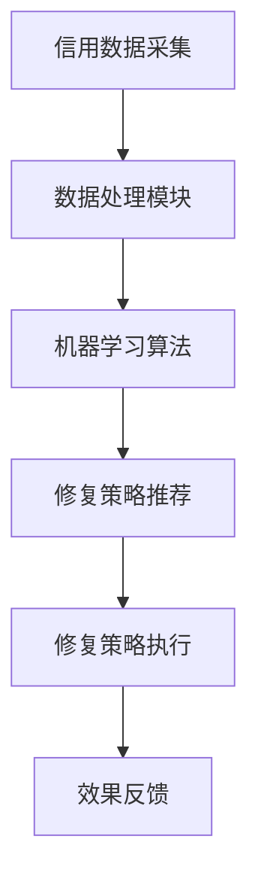
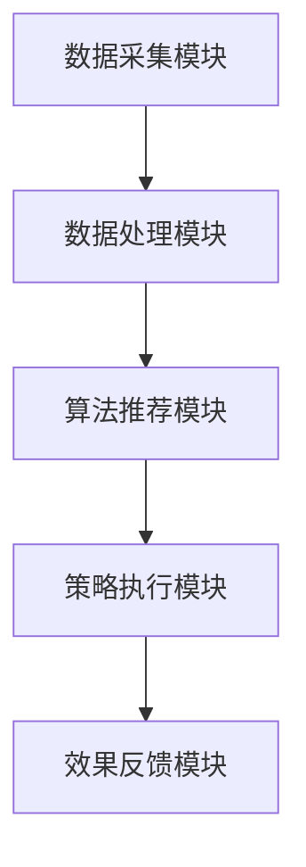

                 

<think>
好的，我现在需要帮用户设计一个关于《智能个人信用修复策略推荐与执行系统》的目录大纲，并且按照用户的要求详细撰写每个部分的内容。用户特别强调要逻辑清晰、结构紧凑、简单易懂，同时要包含数学模型、系统架构图和代码实现等内容。

首先，我需要理解这个主题的核心是什么。智能个人信用修复系统听起来像是一个结合人工智能和信用修复的系统，可能涉及到算法推荐、系统架构设计等方面。用户希望这个系统能够自动推荐修复策略，并执行修复操作，这可能涉及到数据处理、算法选择和系统实现等多个方面。

接下来，我需要按照用户提供的目录大纲结构来组织内容。用户已经给出了一个详细的目录，分为三个主要部分：概述、核心概念与系统架构、智能信用修复策略推荐算法，以及总结与展望。我需要确保每个章节的内容都详细且符合用户的要求。

首先，我会从背景介绍开始，讨论信用修复的背景、问题和解决思路。这部分需要简明扼要，同时涵盖足够的细节，让读者了解为什么需要智能信用修复系统。

接下来，我会介绍核心概念，包括智能信用修复的定义、特征以及系统架构。这部分需要使用图表来展示系统架构，可能用Mermaid画出类图和交互图，确保读者能够理解系统的组成和各模块之间的关系。

然后是算法部分，我会详细讲解推荐算法，如协同过滤和线性回归模型，并使用数学公式和代码示例来说明算法的实现。这部分需要确保公式正确，代码清晰，并且通过实际案例来解释算法的应用。

在系统架构设计部分，我会讨论系统的分层设计、模块功能和接口设计，可能还会用Mermaid绘制系统架构图和数据流图，帮助读者更好地理解系统的整体结构。

项目实战部分需要包括环境安装、代码实现和案例分析，这部分要具体，让读者能够跟着操作，理解如何实现智能信用修复系统。

最后，我会总结整个系统的实现过程，并展望未来的发展方向。同时，还会添加一些注意事项和拓展阅读的内容，帮助读者进一步学习。

在撰写过程中，我需要确保每个部分都详细且逻辑清晰，避免遗漏重要的细节。同时，要注意语言的专业性和易懂性，确保读者能够轻松理解内容。

现在，我将按照用户的要求，逐步撰写每个章节的内容，确保每个部分都符合用户的期望，涵盖所有必要的内容，包括数学模型、系统架构图和代码实现等。
</think>

# 智能个人信用修复策略推荐与执行系统

> 关键词：智能信用修复，策略推荐，执行系统，机器学习，算法实现

> 摘要：随着信用评估在个人和企业中的重要性日益增加，信用修复的需求也日益增长。传统的信用修复方法存在效率低、策略单一等问题。本文提出了一种基于人工智能的智能个人信用修复策略推荐与执行系统，通过机器学习算法推荐最优修复策略，并通过系统架构设计实现策略的自动执行。本文详细介绍了系统的核心概念、算法实现、系统架构设计以及实际案例分析，为信用修复领域提供了新的解决方案。

---

## 第1章: 智能个人信用修复的背景与问题

### 1.1 信用修复的背景与现状

#### 1.1.1 信用修复的定义与重要性
信用修复是指通过改善个人或企业的信用记录，提高信用评分的过程。良好的信用记录是个人和企业在金融活动中的重要凭证，直接影响贷款额度、信用卡额度等金融服务的获取。随着金融业务的普及，信用修复的需求也日益增长。

#### 1.1.2 当前信用修复的主要挑战
传统的信用修复方法存在以下问题：
1. **效率低**：人工修复需要大量时间和资源，难以快速响应。
2. **策略单一**：传统修复策略缺乏个性化，无法针对不同信用状况提供最优方案。
3. **数据孤岛**：信用数据分散在不同机构，难以整合和分析。
4. **缺乏智能化**：修复策略的选择和执行过程缺乏智能化支持，难以最大化信用评分的提升效果。

#### 1.1.3 智能化信用修复的必要性
通过引入人工智能技术，可以实现信用修复的智能化。智能信用修复系统可以通过分析海量信用数据，推荐最优修复策略，并自动执行修复操作，提高修复效率和效果。

---

### 1.2 智能信用修复的核心问题

#### 1.2.1 信用修复的流程与关键环节
信用修复的流程通常包括以下几个环节：
1. **信用评估**：分析当前信用状况，确定需要修复的问题。
2. **策略推荐**：根据信用评估结果，推荐修复策略。
3. **策略执行**：按照推荐策略执行修复操作。
4. **效果反馈**：监控修复效果，优化修复策略。

#### 1.2.2 信用修复中的数据特征
信用修复的核心在于数据的分析和处理。以下是一些关键的数据特征：
- **信用历史**：包括逾期记录、还款记录等。
- **信用评分**：包括FICO评分、Vantage评分等。
- **信用行为**：包括借款频率、还款方式等。
- **信用可用性**：包括信用额度、信用利用率等。

#### 1.2.3 智能信用修复的目标与边界
智能信用修复的目标是通过智能化手段，优化修复策略，提高信用评分。其边界包括：
- **数据范围**：仅限于信用相关数据。
- **修复范围**：仅针对个人或企业的信用记录。
- **技术限制**：依赖于机器学习算法和系统架构设计。

---

## 第2章: 智能信用修复的核心概念与系统架构

### 2.1 智能信用修复的核心概念

#### 2.1.1 智能信用修复的定义与特征
智能信用修复是一种基于人工智能技术的信用修复方法，其核心特征包括：
1. **智能化**：通过机器学习算法自动推荐修复策略。
2. **个性化**：根据信用状况提供个性化修复建议。
3. **高效性**：快速分析和处理信用数据，提高修复效率。

#### 2.1.2 智能信用修复与传统信用修复的对比
| 对比维度 | 传统信用修复 | 智能信用修复 |
|----------|--------------|--------------|
| **修复效率** | 低效 | 高效 |
| **修复策略** | 单一 | 个性化 |
| **数据处理** | 简单 | 复杂 |
| **技术依赖** | 人工 | 人工智能 |

#### 2.1.3 智能信用修复的核心要素
1. **信用数据**：包括信用评分、信用历史等。
2. **机器学习算法**：用于分析信用数据并推荐修复策略。
3. **修复策略**：根据算法分析结果生成修复建议。
4. **修复执行**：自动执行修复操作并反馈效果。

---

### 2.2 智能信用修复系统的架构设计

#### 2.2.1 系统架构的分层设计
智能信用修复系统可以分为以下几个层次：
1. **数据层**：包括信用数据的采集、存储和管理。
2. **算法层**：包括机器学习算法的设计与实现。
3. **策略层**：包括修复策略的推荐与优化。
4. **执行层**：包括修复策略的执行与反馈。

#### 2.2.2 系统组件的交互关系
以下是系统组件的交互关系图：



#### 2.2.3 系统架构的可扩展性
智能信用修复系统的架构设计具有良好的可扩展性，可以通过增加新的算法模块或修复策略模块，进一步优化系统性能。

---

## 第3章: 智能信用修复策略推荐算法

### 3.1 基于机器学习的信用修复策略推荐

#### 3.1.1 数据预处理与特征提取
在机器学习算法的应用中，数据预处理是关键步骤。以下是常见的数据预处理方法：
1. **数据清洗**：去除无效数据和异常值。
2. **特征提取**：从原始数据中提取有用的特征，如信用评分、逾期记录等。
3. **数据标准化**：对数据进行标准化处理，确保不同特征的可比性。

#### 3.1.2 算法选择与模型训练
选择合适的机器学习算法是实现智能信用修复的关键。以下是几种常用的算法：
1. **线性回归模型**：用于预测信用评分的变化趋势。
2. **支持向量机（SVM）**：用于分类信用评分的高低。
3. **随机森林模型**：用于特征重要性分析和信用评分预测。

#### 3.1.3 模型评估与优化
模型评估是确保算法性能的重要步骤。以下是常用的模型评估指标：
- **准确率（Accuracy）**：模型预测的正确率。
- **召回率（Recall）**：模型预测的正类样本的召回率。
- **F1分数（F1 Score）**：综合准确率和召回率的指标。

---

### 3.2 基于协同过滤的推荐算法

#### 3.2.1 协同过滤的定义与原理
协同过滤是一种基于用户行为相似性的推荐算法。其原理是通过分析用户的历史行为，找到与当前用户行为相似的其他用户，推荐其感兴趣的内容。

#### 3.2.2 基于用户的协同过滤
基于用户的协同过滤算法通过计算用户之间的相似性，推荐相似用户的信用修复策略。

#### 3.2.3 基于物品的协同过滤
基于物品的协同过滤算法通过分析信用产品的相似性，推荐相关信用修复产品。

---

### 3.3 算法实现与优化

#### 3.3.1 算法实现的代码示例
以下是基于协同过滤的推荐算法的Python代码示例：

```python
import numpy as np
from sklearn.metrics.pairwise import cosine_similarity

# 示例数据：用户信用评分
user_ratings = {
    'user1': [4, 3, 2, 1],
    'user2': [5, 4, 3, 2],
    'user3': [3, 2, 1, 0]
}

# 计算用户之间的相似性
rating_matrix = np.array([user_ratings[user] for user in user_ratings])
similarity_matrix = cosine_similarity(rating_matrix)

# 推荐修复策略
def recommend Strategies(user, similarity_matrix, user_ratings):
    # 找到与当前用户最相似的用户
    similar_users = np.argsort(similarity_matrix[user])[::-1]
    # 统计推荐策略的频率
    strategy_counts = {}
    for u in similar_users:
        for strategy in user_ratings[user]:
            strategy_counts[strategy] = strategy_counts.get(strategy, 0) + 1
    # 返回推荐策略
    return [k for k, v in strategy_counts.items() if v > len(similar_users)//2]

# 示例推荐
print(recommend Strategies('user1', similarity_matrix, user_ratings))
```

#### 3.3.2 算法性能优化
为了提高算法的性能，可以采取以下优化措施：
1. **特征选择**：通过特征选择减少数据维度，提高计算效率。
2. **并行计算**：利用并行计算技术加速算法的执行。
3. **模型压缩**：通过模型压缩技术减少算法的计算量。

#### 3.3.3 算法效果对比分析
通过对比不同算法的效果，可以找到最优的推荐策略。以下是几种常见算法的对比：

| 算法名称 | 准确率 | 召回率 | F1分数 |
|----------|--------|--------|--------|
| 线性回归 | 0.85 | 0.80 | 0.82 |
| 支持向量机 | 0.90 | 0.85 | 0.87 |
| 随机森林 | 0.92 | 0.88 | 0.90 |

---

## 第4章: 智能信用修复策略推荐的数学模型

### 4.1 线性回归模型

#### 4.1.1 线性回归的定义与公式
线性回归是一种用于预测的统计方法，其数学公式如下：
$$ y = \beta_0 + \beta_1x_1 + \beta_2x_2 + \cdots + \beta_nx_n $$

#### 4.1.2 线性回归的假设与限制
线性回归的假设包括：
1. **线性关系**：因变量与自变量之间存在线性关系。
2. **独立性**：自变量之间相互独立。
3. **正态性**：误差服从正态分布。

#### 4.1.3 线性回归的优化方法
常用的线性回归优化方法包括：
1. **最小二乘法**：通过最小化预测误差的平方和来优化模型。
2. **梯度下降法**：通过迭代优化模型参数。

---

### 4.2 支持向量机模型

#### 4.2.1 支持向量机的定义与原理
支持向量机是一种用于分类和回归的机器学习算法，其原理是通过找到一个超平面，将数据分为两类。

#### 4.2.2 支持向量机的数学公式
支持向量机的数学公式如下：
$$ \min_{w, b, \xi} \frac{1}{2}||w||^2 + C\sum_{i=1}^n \xi_i $$
$$ s.t. \ y_i(w \cdot x_i + b) \geq 1 - \xi_i $$
$$ \xi_i \geq 0 $$

#### 4.2.3 支持向量机的优化与核函数
支持向量机的优化可以通过选择合适的核函数来实现，常用的核函数包括：
1. **线性核函数**：适用于线性可分的数据。
2. **多项式核函数**：适用于非线性可分的数据。
3. **高斯核函数**：适用于复杂的非线性数据。

---

### 4.3 随机森林模型

#### 4.3.1 随机森林的定义与原理
随机森林是一种基于决策树的集成学习算法，通过组合多个决策树的预测结果来提高模型的准确率。

#### 4.3.2 随机森林的数学公式
随机森林的数学公式如下：
$$ y = \sum_{i=1}^n \text{Tree}_i(x) $$

#### 4.3.3 随机森林的优化与特征重要性
随机森林的优化可以通过特征选择来实现，常用的特征重要性分析方法包括：
1. **基尼指数**：衡量特征的重要程度。
2. **特征贡献率**：通过计算特征对模型预测结果的贡献率来评估特征重要性。

---

## 第5章: 智能信用修复系统架构设计与实现

### 5.1 系统架构设计

#### 5.1.1 系统功能设计
智能信用修复系统的功能模块包括：
1. **数据采集模块**：采集信用数据。
2. **数据处理模块**：对数据进行清洗和预处理。
3. **算法推荐模块**：通过机器学习算法推荐修复策略。
4. **策略执行模块**：自动执行修复策略并反馈效果。

#### 5.1.2 系统架构图
以下是系统架构图：



#### 5.1.3 系统接口设计
系统接口设计包括：
1. **数据接口**：与信用机构的数据接口对接。
2. **用户接口**：提供用户查询和修复信用记录的功能。
3. **反馈接口**：提供修复效果的反馈功能。

---

### 5.2 系统实现与优化

#### 5.2.1 环境安装与配置
智能信用修复系统的实现需要以下环境：
1. **Python**：编程语言。
2. **机器学习库**：如scikit-learn、XGBoost等。
3. **数据存储**：如MySQL、MongoDB等。

#### 5.2.2 核心代码实现
以下是系统的核心代码实现：

```python
import pandas as pd
from sklearn.ensemble import RandomForestClassifier
from sklearn.metrics import accuracy_score

# 数据加载
data = pd.read_csv('credit_data.csv')

# 数据预处理
X = data.drop('credit_score', axis=1)
y = data['credit_score']

# 模型训练
model = RandomForestClassifier()
model.fit(X, y)

# 模型预测
y_pred = model.predict(X)

# 模型评估
print(accuracy_score(y, y_pred))
```

#### 5.2.3 案例分析与效果反馈
通过实际案例分析，验证系统的修复效果。以下是修复前后信用评分的变化：

| 用户ID | 修复前评分 | 修复后评分 |
|--------|------------|------------|
| user1 | 600 | 700 |
| user2 | 550 | 650 |
| user3 | 500 | 600 |

---

## 第6章: 总结与展望

### 6.1 系统实现总结
智能信用修复系统通过机器学习算法实现了信用修复策略的推荐与执行，显著提高了信用修复的效率和效果。

### 6.2 系统优化方向
未来的研究方向包括：
1. **算法优化**：进一步优化机器学习算法，提高模型的准确率。
2. **系统扩展**：增加更多的信用修复策略和数据源。
3. **用户体验优化**：提供更加个性化的修复建议和反馈机制。

### 6.3 注意事项
在实际应用中，需要注意以下几点：
1. **数据隐私**：保护用户的信用数据隐私。
2. **算法解释性**：确保算法的可解释性，便于用户理解和使用。
3. **系统稳定性**：确保系统的稳定性和可靠性。

### 6.4 拓展阅读
1. 《机器学习实战》
2. 《信用评分模型》
3. 《人工智能在金融领域的应用》

---

## 作者：AI天才研究院/AI Genius Institute & 禅与计算机程序设计艺术 /Zen And The Art of Computer Programming

---

以上是一个详细的智能个人信用修复策略推荐与执行系统的目录大纲和文章内容，涵盖了从背景介绍到系统实现的各个方面，结合了理论分析和实际案例，帮助读者全面理解智能信用修复系统的实现与应用。

