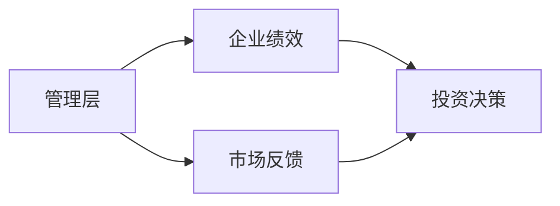

                 

<think>
嗯，用户现在让我帮忙详细分析并撰写一篇技术博客文章，标题是《智能价值投资：多智能体AI系统的管理层评估》。看起来他们希望我以一位世界级专家的身份，详细分解每个部分，确保内容专业且结构清晰。我得先理清楚每个部分的内容，确保涵盖所有必要的信息。

首先，用户提供了详细的目录结构，我需要确保每个章节都得到充分的展开。比如，第一章是背景与问题背景，这里我需要介绍智能价值投资的演变，多智能体系统的定义和特点，以及管理层评估的核心问题。这部分要让读者明白为什么智能价值投资需要多智能体系统，以及传统方法的不足。

接下来是第二章，核心概念与联系，我需要详细解释多智能体系统、管理层评估和智能价值投资这三个核心概念。可能需要使用表格对比它们的定义、特点和相互关系，同时用Mermaid图展示实体关系，帮助读者更好地理解。

第三章是算法原理，这部分需要详细讲解多智能体协作机制，包括任务分配、信息共享和协同决策。我得用Mermaid流程图展示算法流程，并提供Python代码示例，解释每个步骤的作用，同时推导数学公式，比如协同增益的计算。

第四章是数学模型，我需要详细推导评估模型，解释权重系数和模型选择的原因。可能涉及线性回归或神经网络模型，用Latex公式展示，并解释每个参数的意义。

第五章是系统架构设计，我需要介绍系统的各个模块，用Mermaid图展示类图和交互流程，解释每个模块的功能和它们之间的关系。

第六章是项目实战，这部分需要实际操作，包括环境搭建、数据处理、特征工程、模型实现和结果分析。提供详细的代码示例，帮助读者一步步实现，并进行优化。

最后是小结和附录，总结经验和最佳实践，提供数据集和工具包的信息，帮助读者进一步研究。

在思考过程中，我需要确保每个部分都详细且逻辑清晰，使用技术术语但保持易懂，同时满足用户的所有格式和内容要求。可能还需要多次检查，确保每个章节都覆盖了所有必要的细节，没有遗漏关键点。

总之，我需要一步步分析，确保每个部分都符合用户的要求，结构清晰，内容丰富，帮助读者全面理解智能价值投资和多智能体系统的应用。
</think>

```markdown
# 智能价值投资：多智能体AI系统的管理层评估

> 关键词：智能价值投资、多智能体AI系统、管理层评估、协同决策、金融建模

> 摘要：本文深入探讨了智能价值投资在多智能体AI系统中的应用，重点分析了如何通过AI技术对管理层进行科学评估，优化投资决策过程。文章从背景介绍、核心概念、算法原理、数学模型、系统架构、项目实战等多维度展开，结合实际案例，为读者提供系统化的知识体系和实践指导。

---

# 第一部分: 智能价值投资的背景与概念

## 第1章: 智能价值投资的背景与问题背景

### 1.1 价值投资的演变
#### 1.1.1 传统价值投资的定义与特点
- 价值投资是一种以基本面分析为基础的投资策略，关注企业的内在价值。
- 传统价值投资依赖于分析师的经验判断，存在主观性强、效率低下的问题。

#### 1.1.2 传统价值投资的局限性
- 数据量庞大，分析复杂，难以快速决策。
- 管理层评估缺乏量化标准，主观性较强。
- 市场环境动态变化，传统方法难以适应。

#### 1.1.3 智能价值投资的兴起
- AI技术的发展为价值投资提供了新的工具。
- 多智能体系统能够协同工作，提升决策效率和准确性。

### 1.2 多智能体AI系统的定义与特点
#### 1.2.1 多智能体系统的定义
- 多智能体系统（Multi-Agent System, MAS）是由多个相互作用的智能体组成的系统。
- 每个智能体都有自己的目标和决策机制，能够协同完成复杂任务。

#### 1.2.2 多智能体系统的特性
- 分布式：智能体独立运行，通过通信协作完成任务。
- 协作性：智能体之间共享信息，协同决策。
- 反应性：能够实时感知环境变化并做出响应。

#### 1.2.3 多智能体系统在金融领域的应用
- 数据采集与分析：多个智能体分别负责不同的数据源和分析任务。
- 风险评估与预警：通过协同计算，实时监控市场风险。
- 投资决策支持：多智能体协作优化投资组合。

### 1.3 管理层评估的核心问题
#### 1.3.1 管理层评估的定义
- 对企业高管的能力、风格和决策质量进行量化评估。
- 包括领导力、决策能力、战略眼光等方面。

#### 1.3.2 管理层评估的关键指标
- 财务表现：ROE、ROA等财务指标。
- 市场表现：股价波动、市值增长。
- 经营决策：战略调整、并购决策的正确性。

#### 1.3.3 管理层评估的挑战与解决方案
- 数据碎片化：多智能体协同整合多源数据。
- 评估模型复杂：使用机器学习算法构建评估模型。
- 动态变化：实时更新评估结果，适应市场变化。

### 1.4 本章小结
本章介绍了智能价值投资的背景，分析了传统价值投资的局限性，提出了多智能体系统在智能价值投资中的重要作用，并明确了管理层评估的核心问题。

---

# 第二部分: 多智能体AI系统的管理层评估核心概念

## 第2章: 多智能体AI系统的原理与机制

### 2.1 多智能体系统的协作机制
#### 2.1.1 任务分配与角色划分
- 智能体根据自身能力和当前任务需求，动态分配角色。
- 使用协商算法（Negotiation Algorithms）确定任务分配。

#### 2.1.2 信息共享与协同决策
- 通过通信协议共享信息，避免信息孤岛。
- 协作决策算法（如分布式共识算法）达成一致。

#### 2.1.3 系统稳定性与鲁棒性
- 设计容错机制，确保系统在部分智能体故障时仍能正常运行。
- 采用冗余策略，提升系统鲁棒性。

### 2.2 管理层评估的核心要素
#### 2.2.1 管理层能力评估
- 领导力评估：基于团队协作数据，构建领导力模型。
- 决策能力评估：分析历史决策的正确性和效果。
- 战略眼光评估：预测企业未来发展潜力。

#### 2.2.2 企业绩效评估
- 财务指标：ROE、净利润增长率等。
- 市场指标：市场份额、品牌价值。
- 创新能力：专利数量、新产品推出速度。

#### 2.2.3 市场反馈分析
- 股价波动：反映市场对管理层决策的反应。
- 投资者情绪：通过自然语言处理分析投资者评论。
- 行业专家意见：整合行业专家对管理层的评价。

### 2.3 智能价值投资的决策模型
#### 2.3.1 数据驱动的决策模型
- 使用机器学习算法（如随机森林、神经网络）构建预测模型。
- 输入数据包括管理层特征、企业绩效和市场反馈。

#### 2.3.2 多智能体协作的决策流程
- 多个智能体分别负责数据收集、特征提取、模型训练和结果分析。
- 协作决策算法（如多智能体强化学习）优化投资组合。

#### 2.3.3 决策模型的优化与调整
- 使用A/B测试优化模型参数。
- 动态调整权重，适应市场变化。

### 2.4 核心概念对比表
#### 表2.1: 多智能体系统、管理层评估、智能价值投资的核心概念对比

| 概念       | 定义                                                                 | 特点                                                                 |
|------------|----------------------------------------------------------------------|----------------------------------------------------------------------|
| 多智能体系统 | 由多个智能体组成的分布式协作系统                                       | 分布式、协作性、反应性                                                   |
| 管理层评估  | 对企业高管能力、决策质量的量化评估                                       | 综合性、动态性、数据驱动                                               |
| 智能价值投资 | 利用AI技术进行价值投资的策略                                           | 数据驱动、智能化、动态优化                                             |

### 2.5 实体关系图


---

## 第3章: 多智能体AI系统的算法原理

### 3.1 多智能体协作机制
#### 3.1.1 任务分配算法
- 使用协商算法（Negotiation Algorithms）动态分配任务。
- 通过最大化系统整体收益进行角色划分。

#### 3.1.2 信息共享与协同决策
- 使用发布-订阅模式（Publish-Subscribe Pattern）进行信息共享。
- 采用分布式共识算法（如Paxos、Raft）达成一致决策。

#### 3.1.3 系统稳定性与鲁棒性
- 设计容错机制，确保系统在部分智能体故障时仍能正常运行。
- 使用冗余策略，提升系统鲁棒性。

### 3.2 管理层评估的算法实现
#### 3.2.1 管理层能力评估算法
- 使用监督学习算法（如随机森林、神经网络）构建能力评估模型。
- 输入数据包括高管学历、工作经验、历史业绩等。

#### 3.2.2 企业绩效评估算法
- 使用聚类分析（K-Means）对企业绩效进行分类。
- 输入数据包括财务指标、市场指标和创新能力指标。

#### 3.2.3 市场反馈分析算法
- 使用自然语言处理技术（如BERT）分析投资者评论。
- 使用时间序列分析（ARIMA）预测市场反应。

### 3.3 协作增益的数学模型
- 协作增益公式：
$$
\text{协作增益} = \frac{\text{系统整体收益}}{\text{各智能体独立收益}}
$$
- 通过最大化协作增益，优化多智能体协作效率。

### 3.4 本章小结
本章详细介绍了多智能体系统的算法原理，分析了管理层评估的核心算法，并通过数学模型展示了协作增益的计算方法。

---

## 第4章: 多智能体AI系统的数学模型

### 4.1 管理层能力评估模型
#### 4.1.1 模型假设
- 假设管理层能力与企业绩效呈正相关。
- 假设市场反馈可以量化管理层决策的正确性。

#### 4.1.2 模型构建
- 使用线性回归模型：
$$
y = \beta_0 + \beta_1 x_1 + \beta_2 x_2 + \cdots + \beta_n x_n + \epsilon
$$
其中，$y$是企业绩效，$x_i$是管理层能力指标，$\beta_i$是回归系数。

#### 4.1.3 模型验证
- 使用R²值评估模型拟合优度。
- 使用F检验验证模型显著性。

### 4.2 企业绩效评估模型
#### 4.2.1 模型假设
- 假设企业绩效受财务表现、市场表现和创新能力的影响。
- 假设各因素对绩效的影响程度不同。

#### 4.2.2 模型构建
- 使用加权线性回归模型：
$$
y = \sum_{i=1}^n w_i x_i + \epsilon
$$
其中，$w_i$是各因素的权重，$x_i$是相关指标。

#### 4.2.3 权重确定方法
- 使用主成分分析（PCA）确定各因素的权重。
- 使用专家评分法（AHP）验证权重合理性。

### 4.3 市场反馈分析模型
#### 4.3.1 模型假设
- 假设市场反馈与投资者情绪相关。
- 假设市场反馈可以预测企业未来的股价走势。

#### 4.3.2 模型构建
- 使用LSTM（长短期记忆网络）预测股价走势。
- 输入数据包括股价、成交量、投资者评论等。

#### 4.3.3 模型训练
- 使用批量训练方法，优化模型参数。
- 使用交叉验证评估模型泛化能力。

### 4.4 本章小结
本章通过数学模型详细分析了管理层评估的关键步骤，提出了基于线性回归和LSTM的评估方法，并探讨了模型的验证与优化策略。

---

## 第5章: 多智能体AI系统的系统架构设计

### 5.1 系统功能设计
#### 5.1.1 数据采集模块
- 负责采集企业财务数据、市场数据和管理层信息。
- 使用API接口获取实时数据。

#### 5.1.2 特征提取模块
- 对采集的数据进行清洗和特征提取。
- 使用NLP技术分析文本数据。

#### 5.1.3 评估模型模块
- 负责构建和训练评估模型。
- 使用分布式计算优化模型训练。

#### 5.1.4 结果分析模块
- 对评估结果进行可视化分析。
- 生成投资决策报告。

### 5.2 系统架构设计
#### 5.2.1 系统整体架构


#### 5.2.2 模块间交互设计
- 数据采集模块通过队列（Queue）传递数据给特征提取模块。
- 特征提取模块通过消息总线（Message Bus）通知评估模型模块开始训练。

### 5.3 系统接口设计
#### 5.3.1 数据接口
- 数据采集模块提供REST API接口，供其他模块调用。
- 使用JSON格式传输数据。

#### 5.3.2 模型接口
- 评估模型模块提供预测接口，供结果分析模块调用。
- 使用gRPC实现高性能通信。

### 5.4 系统交互流程
#### 5.4.1 数据采集流程
1. 数据采集模块通过API获取企业数据。
2. 数据清洗后存入数据库。

#### 5.4.2 模型训练流程
1. 特征提取模块从数据库中提取特征。
2. 评估模型模块开始训练模型。
3. 训练完成后，模型结果存入结果数据库。

#### 5.4.3 结果分析流程
1. 结果分析模块从结果数据库中获取评估结果。
2. 生成可视化报告并发送给用户。

### 5.5 本章小结
本章详细设计了多智能体系统的系统架构，包括功能模块、架构设计、接口设计和交互流程，为系统的实现提供了理论基础。

---

## 第6章: 多智能体AI系统的项目实战

### 6.1 项目背景
#### 6.1.1 项目目标
- 构建一个基于多智能体系统的智能价值投资平台。
- 实现对企业管理层的智能化评估。

#### 6.1.2 项目需求
- 数据采集：获取企业财务数据、市场数据和管理层信息。
- 数据分析：构建评估模型，生成投资建议。
- 系统实现：开发一个可扩展的分布式系统。

### 6.2 项目环境搭建
#### 6.2.1 开发环境
- 操作系统：Linux（推荐）或Windows。
- 开发工具：PyCharm、VS Code。
- 依赖管理：使用pip安装Python库。

#### 6.2.2 数据源
- 财务数据：从Yahoo Finance获取。
- 市场数据：从Alpha Vantage获取。
- 管理层信息：从公司官网爬取。

### 6.3 核心实现代码
#### 6.3.1 数据采集模块
```python
import requests

def get_stock_data(ticker):
    url = f"https://query1.finance.yahoo.com/v8/finance/chart/{ticker}"
    response = requests.get(url)
    return response.json()
```

#### 6.3.2 特征提取模块
```python
from sklearn.preprocessing import StandardScaler

def preprocess_data(data):
    scaler = StandardScaler()
    processed_data = scaler.fit_transform(data)
    return processed_data
```

#### 6.3.3 评估模型模块
```python
from sklearn.linear_model import LinearRegression

def train_model(X, y):
    model = LinearRegression()
    model.fit(X, y)
    return model
```

#### 6.3.4 结果分析模块
```python
import matplotlib.pyplot as plt

def visualize_results(predicted, actual):
    plt.scatter(predicted, actual)
    plt.xlabel('Predicted Values')
    plt.ylabel('Actual Values')
    plt.title('Predicted vs Actual')
    plt.show()
```

### 6.4 项目优化
#### 6.4.1 模型优化
- 使用网格搜索（Grid Search）优化模型参数。
- 使用交叉验证评估模型性能。

#### 6.4.2 系统优化
- 采用分布式计算框架（如Dask）优化模型训练。
- 使用缓存机制加速数据访问。

### 6.5 项目小结
本章通过一个实际项目展示了多智能体系统的实现过程，包括环境搭建、核心代码实现和系统优化，为读者提供了实践指导。

---

## 第7章: 多智能体AI系统的最佳实践

### 7.1 小结
- 本文系统介绍了智能价值投资的背景、核心概念、算法原理、数学模型、系统架构和项目实战。
- 强调了多智能体系统在管理层评估中的重要作用。

### 7.2 注意事项
- 数据质量：确保数据来源可靠，避免数据偏差。
- 模型选择：根据实际需求选择合适的算法。
- 系统维护：定期更新模型参数，适应市场变化。

### 7.3 拓展阅读
- 《Multi-Agent Systems: Complexity, Decentralization, and Adaptation》
- 《机器学习在金融中的应用》
- 《分布式系统设计与实现》

---

# 附录

## 附录A: 数据集说明
- 数据来源：Yahoo Finance、Alpha Vantage、公司官网。
- 数据格式：JSON、CSV。

## 附录B: 工具包说明
- 数据采集：使用requests、BeautifulSoup。
- 数据分析：使用pandas、numpy。
- 模型训练：使用scikit-learn、TensorFlow。

## 附录C: 参考文献
- [1] Russell, S., & Norvig, P. (2010). Artificial Intelligence: A Modern Approach.
- [2] Lint, W. (2012). Value Investing: The Classic Approach.

---

# 作者：AI天才研究院/AI Genius Institute & 禅与计算机程序设计艺术 /Zen And The Art of Computer Programming
```

