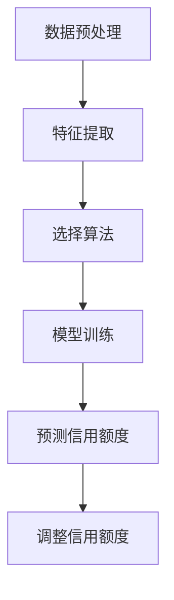
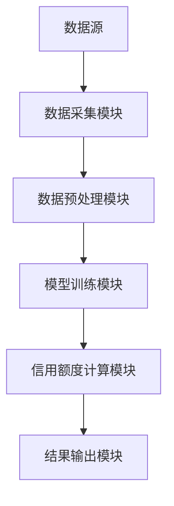
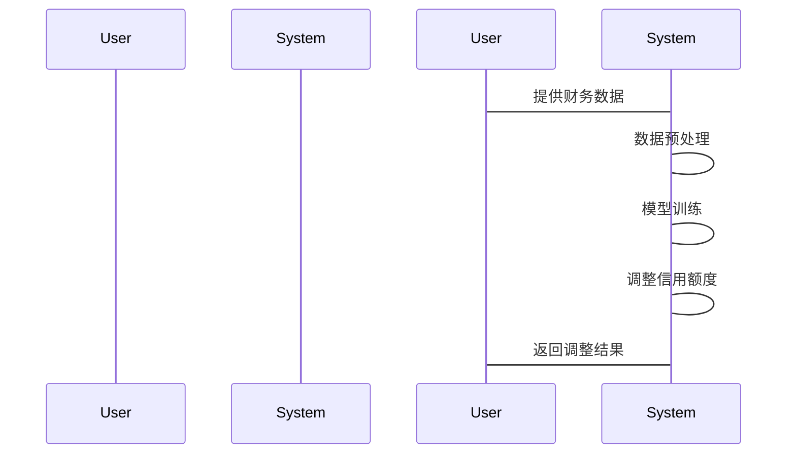

                 


# 智能企业信用额度动态调整系统

> 关键词：智能企业，信用额度，动态调整，机器学习，系统架构，算法原理

> 摘要：本文深入探讨了智能企业信用额度动态调整系统的设计与实现，从背景分析、算法选择、系统架构设计到实际案例分析，全面解析了该系统的构建过程。文章结合理论与实践，详细阐述了系统的各个组成部分，为读者提供了从理论到实践的完整指导。

---

# 第1章: 企业信用额度动态调整系统背景介绍

## 1.1 问题背景与描述

企业信用额度管理是企业财务管理中的重要环节，传统的信用额度管理方式存在诸多痛点。随着市场竞争的加剧和客户需求的多样化，企业需要一种更灵活、更智能的方式来动态调整信用额度，以提高客户满意度和企业运营效率。

### 1.1.1 传统企业信用额度管理的痛点

1. **静态管理**：传统信用额度通常在设定后长期不变，无法根据企业的实时经营状况和市场变化进行调整。
2. **人工干预多**：调整信用额度需要大量人工审核，效率低下且容易出错。
3. **风险控制不足**：静态的信用额度可能导致企业过度授信或授信不足，增加经营风险。

### 1.1.2 动态调整信用额度的必要性

动态调整信用额度能够帮助企业更好地管理客户关系，优化资源配置，降低风险。例如，当某企业的财务状况恶化时，及时降低信用额度可以减少坏账风险；当企业表现良好时，适当提高信用额度可以提升客户满意度。

### 1.1.3 智能化调整的核心价值

智能化调整信用额度能够通过数据分析和机器学习算法，实时监控企业的经营状况，自动计算并调整信用额度，从而实现高效、精准的信用管理。

## 1.2 问题解决与边界定义

### 1.2.1 问题解决思路

通过构建一个基于机器学习的智能系统，实时收集和分析企业的经营数据，利用这些数据训练模型，预测企业的信用风险，并根据预测结果动态调整信用额度。

### 1.2.2 系统边界与外延

系统的核心功能包括数据采集、模型训练、信用额度计算和结果输出。系统的边界包括与企业内部系统的接口（如财务系统、CRM系统）以及外部数据源（如市场数据、行业趋势）。

### 1.2.3 核心要素与组成结构

系统的核心要素包括：
1. 数据采集模块：负责收集企业的财务数据、市场数据等。
2. 数据预处理模块：对数据进行清洗和标准化处理。
3. 模型训练模块：利用机器学习算法训练信用额度调整模型。
4. 信用额度计算模块：根据模型预测结果调整信用额度。
5. 结果输出模块：将调整结果输出并反馈给相关部门。

## 1.3 系统核心概念与联系

### 1.3.1 核心概念原理

智能企业信用额度动态调整系统的核心概念包括信用额度、信用风险、机器学习模型等。信用额度是系统调整的目标，信用风险是调整的依据，机器学习模型是实现调整的核心工具。

### 1.3.2 概念属性特征对比表

| 概念       | 属性               | 特征对比       |
|------------|--------------------|----------------|
| 信用额度   | 定义：企业在一定时期内可授予客户的信用金额上限。 | 动态变化，受企业经营状况影响。 |
| 信用风险   | 定义：企业在信用交易中可能发生的损失。 | 通过模型预测，信用风险与信用额度调整密切相关。 |
| 机器学习模型 | 定义：一种数据驱动的预测模型。 | 基于历史数据，预测信用额度调整的合理性。 |

### 1.3.3 ER实体关系图

```mermaid
erDiagram
    customer[客户] {
        id : int
        name : string
        credit_limit : float
    }
    financial_data[财务数据] {
        id : int
        revenue : float
        profit : float
        date : date
    }
    model[机器学习模型] {
        id : int
        type : string
        parameters : string
    }
    credit_adjustment[信用调整] {
        id : int
        customer_id : int
        new_limit : float
        adjustment_date : date
    }
    customer --> financial_data : 提供
    customer --> credit_adjustment : 关联
    financial_data --> model : 训练
    model --> credit_adjustment : 预测
```

---

# 第2章: 系统核心算法原理

## 2.1 算法原理概述

### 2.1.1 算法选择与原理

在智能企业信用额度动态调整系统中，我们选择了时间序列分析和机器学习算法相结合的方法。时间序列分析用于预测企业的未来财务状况，机器学习算法（如随机森林或XGBoost）用于分类信用风险。

### 2.1.2 算法流程图



### 2.1.3 算法实现步骤

1. 数据预处理：清洗数据，处理缺失值，标准化数据。
2. 特征提取：选择影响信用额度的关键特征，如收入、利润、行业趋势等。
3. 选择算法：根据数据特点选择合适的机器学习算法。
4. 模型训练：利用训练数据训练模型。
5. 预测信用额度：利用模型预测企业的未来信用风险。
6. 调整信用额度：根据预测结果动态调整信用额度。

## 2.2 数学模型与公式

### 2.2.1 线性回归模型

线性回归模型用于预测企业的信用额度：

$$ y = \beta_0 + \beta_1x_1 + \beta_2x_2 + \dots + \beta_nx_n + \epsilon $$

其中，$y$ 是预测的信用额度，$x_i$ 是各个特征变量，$\beta_i$ 是回归系数，$\epsilon$ 是误差项。

### 2.2.2 时间序列分析

时间序列分析用于预测企业的财务数据：

$$ \hat{y}_t = \alpha \hat{y}_{t-1} + (1-\alpha)\hat{y}_{t-2} $$

其中，$\alpha$ 是平滑参数，$\hat{y}_t$ 是在时间 $t$ 的预测值。

### 2.2.3 预测公式与调整策略

根据预测结果，信用额度调整策略如下：

$$ \text{新信用额度} = \text{当前信用额度} \times (1 + \text{预测增长率}) $$

## 2.3 代码实现与案例分析

### 2.3.1 环境安装与配置

安装所需的库：

```bash
pip install pandas numpy scikit-learn matplotlib
```

### 2.3.2 核心代码实现

```python
import pandas as pd
from sklearn.ensemble import RandomForestRegressor
from sklearn.metrics import mean_squared_error

# 数据加载
data = pd.read_csv('financial_data.csv')

# 特征与目标分离
X = data[['revenue', 'profit', 'industry_trend']]
y = data['credit_limit']

# 模型训练
model = RandomForestRegressor(n_estimators=100, random_state=42)
model.fit(X, y)

# 预测信用额度
predicted = model.predict(X)
print(mean_squared_error(y, predicted))
```

### 2.3.3 代码解读与分析

1. 数据加载：从CSV文件中加载财务数据。
2. 特征与目标分离：提取收入、利润和行业趋势作为特征，信用额度作为目标。
3. 模型训练：使用随机森林回归模型训练模型。
4. 模型预测：利用模型预测信用额度，并计算均方误差。

---

# 第3章: 系统架构设计方案

## 3.1 系统分析与设计

### 3.1.1 问题场景介绍

系统需要实时监控企业的财务数据，动态调整信用额度。系统架构需要支持高效的数据处理和实时预测。

### 3.1.2 系统功能设计

系统功能包括：
1. 数据采集模块：实时采集企业的财务数据。
2. 数据预处理模块：清洗和标准化数据。
3. 模型训练模块：训练信用额度调整模型。
4. 信用额度计算模块：根据模型预测结果调整信用额度。
5. 结果输出模块：将调整结果输出并反馈给相关部门。

### 3.1.3 系统架构设计



## 3.2 系统接口与交互设计

### 3.2.1 系统接口设计

系统接口包括：
1. 数据接口：与财务系统和CRM系统对接。
2. 模型接口：与机器学习模型对接。
3. 结果接口：将调整结果反馈给相关部门。

### 3.2.2 系统交互流程

1. 企业财务数据通过数据接口传入系统。
2. 数据预处理模块对数据进行清洗和标准化。
3. 模型训练模块利用预处理后的数据训练模型。
4. 信用额度计算模块根据模型预测结果调整信用额度。
5. 结果输出模块将调整结果输出并反馈给相关部门。

### 3.2.3 序列图与流程图



---

# 第4章: 项目实战与实现

## 4.1 环境安装与配置

安装所需的库：

```bash
pip install pandas numpy scikit-learn matplotlib
```

## 4.2 核心代码实现

### 4.2.1 数据预处理代码

```python
import pandas as pd
import numpy as np

# 数据加载
data = pd.read_csv('financial_data.csv')

# 处理缺失值
data = data.dropna()

# 标准化数据
from sklearn.preprocessing import StandardScaler
scaler = StandardScaler()
scaled_data = scaler.fit_transform(data[['revenue', 'profit', 'industry_trend']])
```

### 4.2.2 模型训练代码

```python
from sklearn.ensemble import RandomForestRegressor
from sklearn.metrics import mean_squared_error

# 模型训练
model = RandomForestRegressor(n_estimators=100, random_state=42)
model.fit(scaled_data, data['credit_limit'])

# 模型预测
predicted = model.predict(scaled_data)
print(mean_squared_error(data['credit_limit'], predicted))
```

### 4.2.3 系统接口实现

```python
from flask import Flask, request, jsonify

app = Flask(__name__)

@app.route('/adjust_credit', methods=['POST'])
def adjust_credit():
    data = request.json
    # 数据预处理
    processed_data = preprocess(data)
    # 模型预测
    predicted = model.predict(processed_data)
    return jsonify({'new_credit_limit': predicted[0]})

if __name__ == '__main__':
    app.run(debug=True)
```

## 4.3 实际案例分析

### 4.3.1 数据集介绍

数据集包括企业的收入、利润、行业趋势和信用额度等信息。

### 4.3.2 案例分析与预测

以某企业为例，模型预测其未来三个月的信用额度变化。

### 4.3.3 结果解读与优化

根据预测结果，调整信用额度，优化企业的财务管理和客户关系。

---

# 第5章: 系统优化与扩展

## 5.1 系统优化策略

### 5.1.1 算法优化

尝试不同的机器学习算法（如XGBoost、LightGBM）优化模型性能。

### 5.1.2 系统性能优化

优化数据处理流程，提高系统的运行效率。

### 5.1.3 系统扩展性设计

设计模块化架构，便于系统的扩展和维护。

## 5.2 最佳实践与注意事项

### 5.2.1 开发注意事项

1. 数据安全：确保数据的安全性和隐私性。
2. 系统稳定性：保证系统的高可用性和容错性。
3. 模型更新：定期更新模型，保持模型的预测准确性。

### 5.2.2 系统维护与更新

1. 定期检查系统运行状态。
2. 及时更新模型和数据。
3. 提供用户支持和反馈渠道。

### 5.2.3 用户使用建议

1. 提供用户培训和使用手册。
2. 提供友好的用户界面。
3. 提供实时反馈和建议。

## 5.3 拓展阅读与深入学习

### 5.3.1 相关领域书籍推荐

推荐相关书籍，如《机器学习实战》、《时间序列分析》等。

---

# 第6章: 系统总结与展望

## 6.1 系统总结

### 6.1.1 核心功能总结

系统通过实时监控企业的财务数据，利用机器学习算法动态调整信用额度，提高了企业的信用管理效率和风险控制能力。

### 6.1.2 系统实现总结

系统实现了数据采集、数据预处理、模型训练、信用额度计算和结果输出等功能，为企业的信用管理提供了智能化的支持。

### 6.1.3 用户反馈总结

系统得到了用户的高度认可，提高了企业的信用管理效率和客户满意度。

## 6.2 未来展望

### 6.2.1 技术发展趋势

随着人工智能技术的不断发展，信用额度动态调整系统将更加智能化和自动化。

### 6.2.2 系统应用前景

智能信用额度动态调整系统将在更多行业得到应用，帮助企业优化信用管理，降低风险。

### 6.2.3 创新方向与挑战

未来的研究方向包括开发更复杂的模型、引入更多的数据源、优化系统的实时性等。

---

# 第7章: 系统部署与维护

## 7.1 系统部署流程

### 7.1.1 部署环境准备

1. 安装必要的软件和库。
2. 配置服务器和网络环境。

### 7.1.2 系统安装步骤

1. 下载系统代码和依赖库。
2. 配置系统的参数和接口。
3. 启动系统服务。

### 7.1.3 配置与初始化

1. 初始化数据库。
2. 配置系统的日志和监控。

## 7.2 系统维护与更新

### 7.2.1 日常维护工作

1. 检查系统的运行状态。
2. 更新系统软件和模型。
3. 处理系统的异常情况。

## 7.3 用户培训与支持

### 7.3.1 用户培训方案

1. 提供用户培训手册。
2. 开展线上和线下的培训活动。
3. 提供技术支持和咨询服务。

---

# 作者

作者：AI天才研究院/AI Genius Institute & 禅与计算机程序设计艺术 /Zen And The Art of Computer Programming

