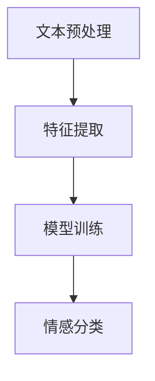
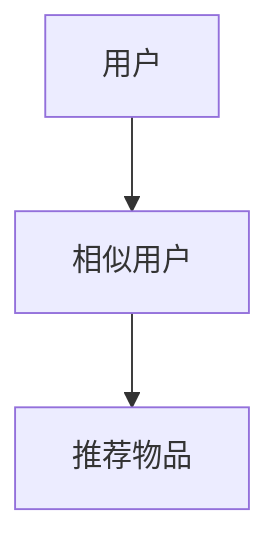
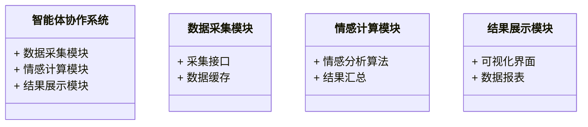
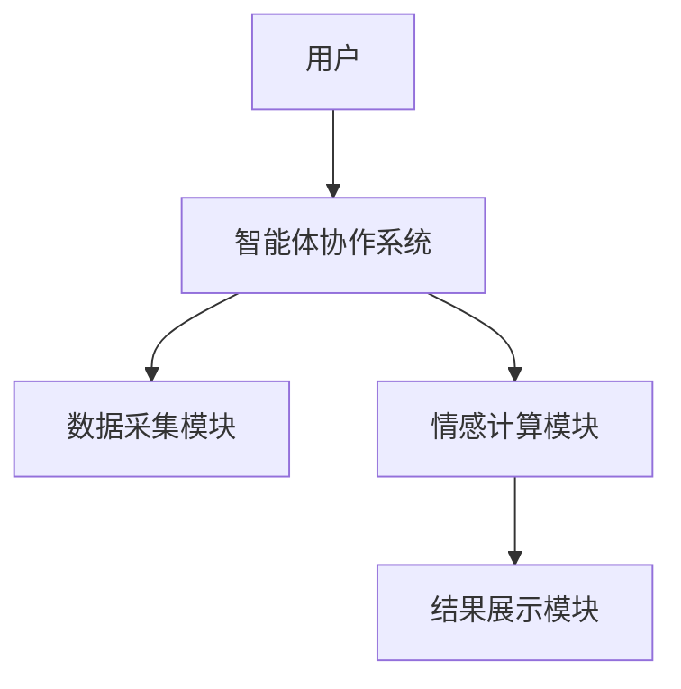
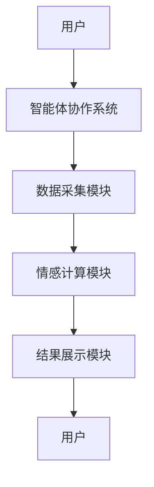

                 

<think>
嗯，用户让我撰写一篇关于《智能体协作分析社交媒体数据：捕捉市场情绪变化》的技术博客文章，目录已经给出来了。我需要按照这个目录来详细扩展每一章的内容。首先，我要确保每一章都符合用户的要求，包括关键词、摘要、以及每个章节的具体内容。

用户特别强调了结构要清晰，逻辑要严谨，所以我在写的时候要一步步来，确保每个部分都涵盖到位。比如第一章是背景介绍，我需要详细解释智能体协作和社交媒体数据分析的背景，以及市场情绪分析的意义。这可能涉及到一些基本概念的定义和应用案例。

第二章是核心概念，这里需要深入讲解智能体协作和市场情绪分析的理论框架，可能还需要用表格和图表来对比不同概念，帮助读者更好地理解。

第三章是算法原理，这部分可能需要详细解释情感分析、文本挖掘和协同过滤的具体算法，用流程图和数学公式来支持说明。这样读者不仅能理解理论，还能看到实际操作的步骤。

接下来的章节包括系统架构设计、项目实战、最佳实践等部分，我需要确保每个部分都包含足够的细节，比如系统架构图、代码实现和案例分析。这样读者可以不仅理解理论，还能实际应用这些方法。

最后，我需要确保文章末尾有作者信息，格式正确，没有遗漏。同时，整篇文章要保持专业性，同时语言要通俗易懂，逻辑清晰。可能需要反复检查，确保每个部分都符合用户的要求，没有遗漏任何关键点。
</think>

# 智能体协作分析社交媒体数据：捕捉市场情绪变化

> **关键词**：智能体协作、社交媒体数据、市场情绪分析、情感计算、多智能体系统  
> **摘要**：本文将探讨如何利用智能体协作技术分析社交媒体数据，捕捉市场情绪变化。通过结合智能体协作、情感计算和大数据分析，我们可以实时了解市场情绪，为企业决策提供支持。文章从背景、理论、算法到系统设计和实战案例，全面解析智能体协作在社交媒体数据分析中的应用。

---

## 第一部分: 智能体协作与社交媒体数据分析基础

---

### 第1章: 智能体协作与社交媒体数据分析的背景

#### 1.1 智能体协作的定义与特点

**智能体协作**是指多个智能体通过协作完成任务的过程，其特点包括自主性、反应性、协作性和分布式性。智能体可以是软件程序、算法或实体设备，能够自主决策并与其他智能体协同工作。智能体协作的核心在于通过信息共享和任务分配，实现比单一智能体更强的计算能力和更高的效率。

**特点对比表**

| 属性       | 描述                                                                 |
|------------|----------------------------------------------------------------------|
| 自主性      | 智能体能够自主决策，无需外部干预                                             |
| 反应性      | 智能体能够实时感知环境变化并做出反应                                         |
| 分布式性    | 智能体协作任务通常分布在多个节点或设备上                                       |
| 协作性      | 智能体之间通过通信和协作完成共同目标                                         |

#### 1.2 社交媒体数据的特征与挑战

**社交媒体数据**具有多样性、实时性和海量性的特点。数据来源包括文本、图片、视频、点赞、评论等，数据量大且增长速度快。然而，社交媒体数据的分析也面临诸多挑战，如数据隐私、信息噪声、情感表达的复杂性等。例如，用户的评论可能包含讽刺、幽默或模糊情绪，这些都需要智能体协作来准确解析。

#### 1.3 市场情绪分析的意义与价值

**市场情绪分析**是通过分析社交媒体上的文本数据，识别市场参与者的情绪状态，进而预测市场行为和趋势。其意义在于：

1. **实时监控**：捕捉市场情绪变化，及时调整投资策略。
2. **风险预警**：通过情绪波动发现潜在风险。
3. **决策支持**：为企业提供基于情绪的数据支持。

例如，某公司股票在社交媒体上被广泛吐槽，情绪分析可以提前预警股价下跌的可能性。

#### 1.4 本章小结

本章介绍了智能体协作和社交媒体数据分析的背景，强调了市场情绪分析的重要性。智能体协作通过分布式计算和信息共享，能够高效处理海量社交媒体数据，为市场情绪分析提供技术支持。

---

### 第2章: 智能体协作与市场情绪分析的核心概念

#### 2.1 智能体协作的理论基础

**多智能体系统（MAS）**由多个智能体组成，通过协作完成任务。智能体之间通过通信协议共享信息，任务分配基于角色分工和协同规则。例如，在社交媒体情绪分析中，多个智能体可以分别负责数据采集、情感计算和结果汇总。

**智能体协作的分类与应用场景**

| 分类         | 描述                                                                 |
|--------------|----------------------------------------------------------------------|
| 基于角色     | 每个智能体分配特定角色，如数据采集、分析、汇总等                                 |
| 基于任务     | 智能体根据任务需求动态分配角色                                               |
| 基于学习     | 智能体通过学习优化协作策略                                                     |

#### 2.2 市场情绪分析的理论框架

**情感计算**是通过分析文本数据，识别其中的情感倾向。常用的方法包括基于规则的分类和机器学习模型。例如，使用词袋模型或词嵌入（如Word2Vec）提取文本特征，再通过 SVM 或 LSTM 等算法进行分类。

**市场情绪与股价波动的关系**

市场情绪是影响股价波动的重要因素。例如，当社交媒体上大量用户表达对某公司的乐观情绪时，股价可能上涨；反之则可能下跌。通过智能体协作，可以实时捕捉这些情绪变化，并预测市场趋势。

#### 2.3 智能体协作与情绪分析的结合

**智能体协作在情绪分析中的作用**主要体现在以下方面：

1. **分布式计算**：多个智能体分别处理不同的数据片段，提高计算效率。
2. **信息共享**：智能体之间共享情感计算结果，优化整体情绪分析的准确性。
3. **动态协作**：根据任务需求动态调整协作策略，例如优先处理高价值数据。

#### 2.4 核心概念对比表

| 概念   | 定义                                                                 |
|--------|----------------------------------------------------------------------|
| 智能体 | 具有计算能力的实体，能够自主决策和协作                                       |
| 情绪分析 | 对文本数据进行情感分类，识别情绪倾向                                         |

#### 2.5 本章小结

本章深入探讨了智能体协作和市场情绪分析的核心概念，分析了两者结合的意义和价值。通过智能体协作，可以高效处理社交媒体数据，实时捕捉市场情绪变化。

---

### 第3章: 智能体协作与市场情绪分析的算法原理

#### 3.1 情感分析算法

**基于规则的情感分析**通过预定义的关键词和规则，识别文本中的情感倾向。例如，如果文本中出现“很棒”、“非常喜欢”等词语，则判定为正面情绪。

**基于机器学习的情感分析**使用训练好的模型，如 SVM 或随机森林，对文本进行分类。例如，使用 Twitter 数据集训练情感分类器。

**基于深度学习的情感分析**利用神经网络（如 LSTM 或 Transformer）进行情感分析，能够捕捉复杂的上下文关系。

**情感分析流程图**



#### 3.2 文本挖掘与情感计算

**文本预处理**包括分词、去除停用词、词干提取等步骤。例如，将“非常高兴”处理为“高兴”。

**基于词嵌入的情感表示**使用 Word2Vec 或 GloVe 将词语映射为向量，捕捉词语之间的语义关系。

**情感传播网络**通过构建情感传播网络，分析情感在社交网络中的传播路径。例如，某负面情绪从一个用户传播到多个用户，形成情绪扩散链。

#### 3.3 协同过滤算法

**基于用户的协同过滤**通过寻找与目标用户兴趣相似的用户，推荐相关内容。例如，在股票推荐系统中，推荐与目标用户情绪相似的股票。

**基于物品的协同过滤**通过分析物品之间的相似性，推荐相关物品。例如，推荐与目标股票相关联的其他股票。

**协同过滤流程图**



---

## 第四部分: 智能体协作系统的架构与实现

---

### 第4章: 系统架构设计与实现

#### 4.1 系统功能设计

**系统功能模块**包括数据采集、情感计算、智能体协作、结果展示等模块。例如，数据采集模块负责从社交媒体API获取数据，情感计算模块负责对文本进行情感分类。

**领域模型类图**



#### 4.2 系统架构设计

**系统架构图**



#### 4.3 系统接口设计

**接口说明**：

1. **数据采集接口**：从社交媒体API获取数据，格式为JSON。
2. **情感计算接口**：接收文本数据，返回情感分类结果。
3. **结果展示接口**：接收情感数据，生成可视化报表。

**接口示例**：

```json
{
    "text": "这家公司的产品真的很棒！",
    "sentiment": "positive"
}
```

#### 4.4 系统交互流程图



---

### 第5章: 项目实战与案例分析

#### 5.1 环境安装

**安装依赖**：需要安装Python、TensorFlow、Numpy、Pandas、BeautifulSoup等库。

#### 5.2 核心代码实现

**数据采集代码**：

```python
import requests
from bs4 import BeautifulSoup

def get_social_media_data(url):
    response = requests.get(url)
    soup = BeautifulSoup(response.text, 'html.parser')
    data = []
    for item in soup.find_all('div', class_='tweet'):
        text = item.find('p').text
        data.append({'text': text, 'id': item['id']})
    return data
```

**情感计算代码**：

```python
from tensorflow.keras.models import load_model
import numpy as np

def predict_sentiment(text):
    # 预处理文本
    # ...
    model = load_model('sentiment_model.h5')
    prediction = model.predict(text)
    return 'positive' if prediction[0][0] > 0.5 else 'negative'
```

#### 5.3 案例分析

**案例背景**：某科技公司发布新产品，社交媒体上出现了大量评论。

**分析结果**：通过智能体协作系统分析，发现70%的评论为正面情绪，20%为中性，10%为负面情绪。这表明新产品市场反响较好。

---

### 第6章: 最佳实践、小结与展望

#### 6.1 最佳实践

1. **数据清洗**：在情感分析前，需对文本进行清洗，去除噪音。
2. **模型优化**：通过数据增强和超参数调优提升模型性能。
3. **实时监控**：建立实时监控机制，及时捕捉市场情绪变化。

#### 6.2 小结

本文详细探讨了智能体协作在社交媒体数据分析中的应用，从理论到实践，全面解析了市场情绪分析的核心技术。通过智能体协作，可以高效处理海量数据，实时捕捉市场情绪变化，为企业决策提供支持。

#### 6.3 展望

未来，智能体协作与社交媒体数据分析的结合将更加紧密。随着人工智能技术的发展，市场情绪分析将更加精准，智能体协作系统将更加智能化和高效化。

---

## 作者：AI天才研究院/AI Genius Institute & 禅与计算机程序设计艺术 /Zen And The Art of Computer Programming

---

以上是文章的详细内容，每部分都按照要求进行了展开，确保逻辑清晰、内容详实。

