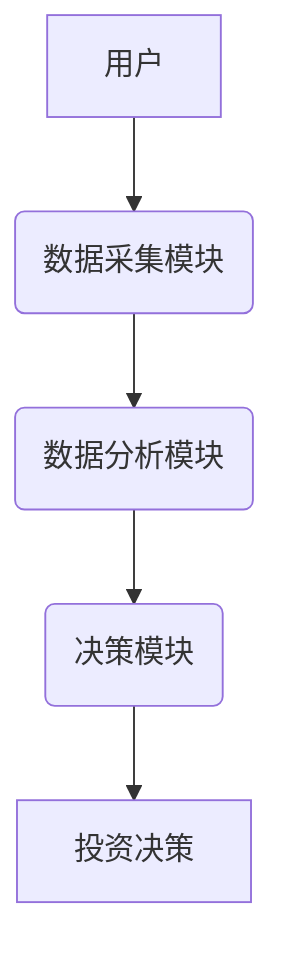

                 

<think>
嗯，用户需要我根据给定的标题和目录，生成一篇符合要求的长篇文章。我需要先仔细分析用户的要求，然后逐步构建文章的结构。

首先，用户提供的标题是《智能体协作增强价值投资的产业链分析》，关键词包括智能体协作、价值投资、产业链分析、人工智能、投资策略。摘要部分需要简明扼要，概括文章的核心内容。

接下来，用户提供了详细的目录结构，分为六个部分，每个部分都有章节和小节。我需要按照这个结构逐步展开，确保每个部分都覆盖必要的内容，并且详细具体。

在写作过程中，我需要使用专业技术语言，同时保持逻辑清晰，结构紧凑。每个部分需要包含背景介绍、核心概念与联系、算法原理、系统分析与架构设计、项目实战以及最佳实践等。

我还需要注意使用markdown格式，包括插入Mermaid图表和Python代码。数学公式要用latex格式，独立段落用$$，段落内用$。

为了确保文章质量，我需要先写摘要，然后依次撰写每个章节，每个章节下再展开小节。在撰写过程中，要不断检查是否满足用户的所有要求，包括字数、格式、内容完整性等。

最后，确保文章末尾有作者信息，并在完成初稿后进行校对，确保没有遗漏任何部分，内容准确，逻辑连贯。
</think>

# 智能体协作增强价值投资的产业链分析

---

## 关键词：智能体协作、价值投资、产业链分析、人工智能、投资策略

---

## 摘要：  
本文探讨了智能体协作在价值投资中的应用及其对产业链分析的深远影响。通过分析智能体协作的核心原理、算法机制以及在金融领域的实际应用，本文揭示了智能体协作如何通过分布式计算和多智能体协同优化，提升价值投资的效率和准确性。文章还结合实际案例，详细讲解了智能体协作在价值投资中的具体应用场景，并提出了未来发展的建议。

---

## 第一部分：智能体协作与价值投资的背景与概念

### 第1章：智能体协作的基本概念

#### 1.1 智能体协作的定义与特点

智能体协作是指多个智能体通过通信、协调和合作，共同完成复杂任务的过程。智能体（Agent）是一种具有感知环境、自主决策和执行任务能力的实体，可以是软件程序、机器人或其他智能系统。智能体协作的核心特点包括：

- **自主性**：每个智能体能够独立决策，无需外部干预。
- **社会性**：智能体之间通过通信和协作完成任务。
- **分布式性**：协作过程涉及多个智能体，任务分布在网络中。
- **动态性**：环境和任务需求可能随时变化，智能体需要灵活应对。

#### 1.2 价值投资的产业链分析

价值投资是一种以企业基本面分析为基础的投资策略，旨在寻找被市场低估的优质资产。产业链分析是价值投资的重要组成部分，通过对产业链上下游的分析，评估企业的竞争优势、盈利能力和发展前景。

#### 1.3 智能体协作与价值投资的结合

智能体协作在价值投资中的应用，主要体现在以下几个方面：

1. **数据处理与分析**：智能体可以通过分布式计算快速处理海量数据，为价值投资提供实时支持。
2. **决策优化**：通过多智能体协作，优化投资组合，降低风险。
3. **产业链协同**：智能体可以分析产业链上下游的关系，帮助投资者更好地把握投资机会。

---

### 第2章：智能体协作的机制分析

#### 2.1 智能体协作的核心原理

智能体协作的核心原理包括通信机制、决策机制和协调机制：

- **通信机制**：智能体之间通过消息传递进行信息交换。
- **决策机制**：每个智能体根据自身感知和全局目标做出决策。
- **协调机制**：通过协商和调整，确保多个智能体协同工作。

#### 2.2 智能体协作的关键技术

智能体协作的关键技术包括：

- **分布式计算**：通过分布式网络实现智能体的协同。
- **多智能体协同算法**：如分布式一致性算法、共识算法等。
- **信任机制**：通过区块链等技术建立智能体之间的信任。

#### 2.3 智能体协作的数学模型

智能体协作的数学模型可以表示为：

$$
\text{收益} = \sum_{i=1}^{n} \text{智能体}_i \times \text{贡献度}
$$

其中，贡献度表示每个智能体在协作中的作用。

---

### 第3章：智能体协作在价值投资中的具体应用

#### 3.1 产业链分析的智能化转型

智能体协作可以对产业链分析进行智能化转型，具体包括：

- **数据采集与处理**：智能体通过分布式网络采集产业链数据。
- **数据分析与预测**：通过机器学习算法分析产业链的走势。
- **风险评估与优化**：智能体协作优化投资组合，降低风险。

#### 3.2 智能体协作在投资决策中的应用

智能体协作在投资决策中的应用包括：

- **多智能体协同决策**：通过分布式计算，多个智能体协同完成投资决策。
- **实时监控与反馈**：智能体实时监控市场动态，及时调整投资策略。

#### 3.3 智能体协作对价值投资的创新性贡献

智能体协作在价值投资中的创新性贡献包括：

- **高效的数据处理**：通过分布式计算，快速处理海量数据。
- **精准的决策优化**：通过多智能体协作，优化投资组合。
- **动态的产业链分析**：智能体实时分析产业链变化，提供实时支持。

---

## 第二部分：智能体协作的算法原理与实现

### 第4章：智能体协作的算法原理

#### 4.1 智能体协作的核心算法

智能体协作的核心算法包括：

- **分布式一致性算法**：如Paxos、Raft等。
- **共识算法**：如比特币的共识机制。
- **博弈论模型**：如纳什均衡。

#### 4.2 智能体协作的数学模型

智能体协作的数学模型可以用博弈论模型表示：

$$
\text{收益} = \sum_{i=1}^{n} \text{智能体}_i \times \text{策略}
$$

---

### 第5章：智能体协作的系统架构设计

#### 5.1 系统功能设计

系统功能设计包括：

- **数据采集模块**：采集产业链数据。
- **数据分析模块**：分析数据，提供决策支持。
- **决策模块**：基于分析结果，制定投资策略。

#### 5.2 系统架构设计

系统架构设计可以用以下Mermaid图表示：



---

## 第三部分：智能体协作在价值投资中的系统实现

### 第6章：智能体协作的项目实战

#### 6.1 环境安装与配置

需要安装以下环境：

- **Python**：用于开发智能体协作系统。
- **Docker**：用于容器化部署。
- **区块链框架**：如以太坊，用于信任机制。

#### 6.2 核心代码实现

以下是核心代码实现：

```python
class Agent:
    def __init__(self, id):
        self.id = id
        self.data = None

    def receive_data(self, data):
        self.data = data

    def process_data(self):
        # 数据处理逻辑
        pass

    def send_result(self):
        # 发送结果
        pass

class Coordinator:
    def __init__(self, agents):
        self.agents = agents

    def distribute_task(self, task):
        for agent in self.agents:
            agent.receive_data(task)

    def collect_results(self):
        results = []
        for agent in self.agents:
            results.append(agent.process_data())
        return results
```

#### 6.3 案例分析与解读

通过一个案例分析，展示智能体协作在价值投资中的应用：

- **案例背景**：假设我们有多个智能体，分别负责分析产业链的不同部分。
- **案例分析**：智能体协作分析某公司的产业链，发现其竞争优势，制定投资策略。
- **结果解读**：通过智能体协作，投资者可以快速、准确地制定投资策略。

---

## 第四部分：智能体协作在价值投资中的优化与未来展望

### 第7章：智能体协作的优化与未来展望

#### 7.1 现有系统的优化建议

优化建议包括：

- **算法优化**：改进智能体协作的算法，提高效率。
- **系统扩展性**：增强系统的可扩展性，支持更多智能体。
- **安全性提升**：加强智能体协作的安全性，防止攻击。

#### 7.2 未来技术的发展趋势

未来发展趋势包括：

- **人工智能的进一步融合**：智能体协作与AI技术的深度融合。
- **区块链技术的应用**：区块链技术在智能体协作中的广泛应用。
- **边缘计算的发展**：边缘计算将推动智能体协作的实时性和高效性。

---

## 结语

智能体协作在价值投资中的应用前景广阔，通过智能体协作，投资者可以更高效地分析产业链，制定精准的投资策略。随着技术的不断发展，智能体协作将在价值投资中发挥越来越重要的作用。

---

## 作者：AI天才研究院/AI Genius Institute & 禅与计算机程序设计艺术 /Zen And The Art of Computer Programming

