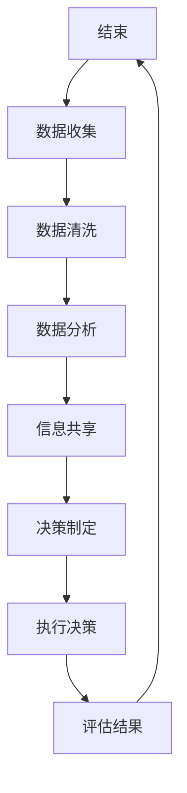
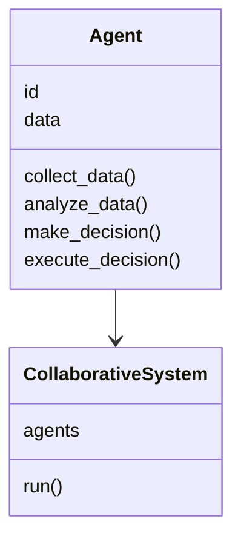
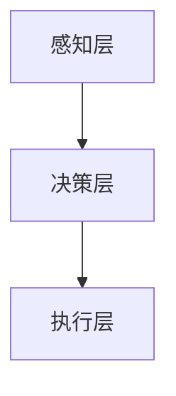

                 


# 智能体协作增强价值投资的新兴市场机会识别

> 关键词：智能体协作，价值投资，新兴市场，机会识别，人工智能，投资策略

> 摘要：本文探讨了智能体协作在价值投资中的应用，特别是在新兴市场机会识别中的潜力。通过分析智能体协作的核心机制、算法原理和系统架构，结合实际项目案例，展示了如何利用智能体协作提升投资决策的准确性和效率。文章还总结了智能体协作的优势与局限性，并展望了未来的研究方向。

---

# 目录大纲

1. **智能体协作与价值投资的背景与基础**
   - 1.1 智能体协作的基本概念
   - 1.2 价值投资的基本原理
   - 1.3 智能体协作与价值投资的结合

2. **智能体协作的核心机制**
   - 2.1 多智能体系统的构建与管理
   - 2.2 智能体协作中的信息处理与决策

3. **智能体协作在新兴市场的机会识别**
   - 3.1 新兴市场的特点与投资挑战
   - 3.2 智能体协作在机会识别中的应用

4. **算法原理讲解**
   - 4.1 智能体协作算法的流程图
   - 4.2 算法实现的Python代码示例
   - 4.3 算法的数学模型与公式

5. **系统分析与架构设计方案**
   - 5.1 系统功能设计
   - 5.2 系统架构设计
   - 5.3 系统接口设计与交互流程

6. **项目实战：智能体协作增强价值投资的实现**
   - 6.1 项目背景与目标
   - 6.2 核心功能实现
   - 6.3 实际案例分析

7. **总结与展望**
   - 7.1 全文总结
   - 7.2 研究的局限性与未来方向
   - 7.3 最佳实践与注意事项

---

## 第1章: 智能体协作与价值投资的背景与基础

### 1.1 智能体协作的基本概念

#### 1.1.1 智能体的定义与特点
智能体（Agent）是指具有感知环境、做出决策并执行动作的实体。智能体可以是软件程序、机器人或其他具备自主决策能力的系统。智能体的特点包括自主性、反应性、主动性和社会性。

- **自主性**：智能体能够自主决策，无需外部干预。
- **反应性**：智能体能够根据环境变化调整行为。
- **主动性**：智能体主动采取行动以实现目标。
- **社会性**：智能体能够与其他智能体或人类进行交互和协作。

#### 1.1.2 智能体协作的定义与核心要素
智能体协作是指多个智能体通过共享信息、分工合作，共同完成复杂任务的过程。其核心要素包括：

1. **通信机制**：智能体之间通过通信协议交换信息。
2. **协作协议**：定义智能体之间的任务分配和责任划分。
3. **激励机制**：通过奖励或惩罚机制激励智能体协作。
4. **协调机制**：确保智能体协作的一致性和高效性。

#### 1.1.3 智能体协作在投资领域的应用前景
在投资领域，智能体协作可以用于市场分析、风险评估和投资决策。通过多个智能体的协作，投资者可以获取更全面的市场信息，提高决策的准确性。

---

### 1.2 价值投资的基本原理

#### 1.2.1 价值投资的定义与核心理念
价值投资是一种投资策略，强调以低于内在价值的价格买入优质资产。其核心理念是寻找市场低估的公司，长期持有，等待其价值回归。

- **内在价值**：资产的真实价值，与市场价格可能偏离。
- **安全边际**：买入价格与内在价值的差距，提供投资的安全性。

#### 1.2.2 价值投资的关键要素与分析方法
价值投资的关键要素包括公司基本面分析、行业地位、财务状况和管理团队。常用的分析方法包括：

1. **基本面分析**：研究公司的财务报表，评估盈利能力、资产负债情况等。
2. **行业分析**：分析行业发展趋势和竞争格局。
3. **管理团队**：评估公司的管理层能力和战略规划。

#### 1.2.3 价值投资与新兴市场的结合
新兴市场通常具有高增长潜力，但同时也伴随着高风险。通过智能体协作，投资者可以更高效地识别新兴市场的投资机会，降低风险。

---

### 1.3 智能体协作与价值投资的结合

#### 1.3.1 智能体协作如何增强价值投资
智能体协作可以通过以下方式增强价值投资：

1. **信息整合**：多个智能体可以收集和分析不同来源的信息，提供更全面的市场分析。
2. **决策优化**：通过协作，智能体可以共同优化投资决策，降低个体决策的偏差。
3. **动态调整**：智能体可以根据市场变化实时调整投资策略。

#### 1.3.2 智能体协作在新兴市场的优势
新兴市场通常具有复杂多变的环境，智能体协作可以通过以下方式发挥优势：

1. **快速响应**：智能体可以实时监控市场变化，迅速做出反应。
2. **风险分担**：多个智能体协作可以分担投资风险，降低个体损失。
3. **知识共享**：智能体可以共享知识和经验，提高整体投资水平。

#### 1.3.3 智能体协作与价值投资的协同效应
智能体协作与价值投资的协同效应体现在以下方面：

1. **提高决策效率**：通过智能体协作，投资者可以更快地获取和分析信息。
2. **降低投资风险**：智能体协作可以帮助投资者识别潜在风险，制定更稳健的投资策略。
3. **增强投资收益**：通过智能体协作，投资者可以发现更多的投资机会，提高投资收益。

---

## 第2章: 智能体协作的核心机制

### 2.1 多智能体系统的构建与管理

#### 2.1.1 多智能体系统的架构设计
多智能体系统通常采用分层架构，包括感知层、决策层和执行层。

- **感知层**：负责收集环境信息，如市场数据、新闻资讯等。
- **决策层**：根据感知信息做出决策，如买入、卖出或持有。
- **执行层**：根据决策执行具体操作，如下单交易。

#### 2.1.2 智能体之间的通信与协作协议
智能体之间的通信需要遵循特定的协议，常见的协作协议包括：

1. **任务分配协议**：定义任务分配的方式和规则。
2. **信息共享协议**：规定信息的格式和共享方式。
3. **协调协议**：确保智能体协作的一致性和高效性。

#### 2.1.3 智能体协作的激励机制
激励机制是确保智能体协作的关键。常见的激励机制包括：

1. **奖励机制**：对表现优秀的智能体给予奖励。
2. **惩罚机制**：对表现不佳的智能体进行惩罚。
3. **声誉机制**：通过声誉评分影响智能体的协作机会。

#### 2.1.4 智能体协作的实现步骤
智能体协作的实现步骤如下：

1. **定义任务目标**：明确协作的目标和任务。
2. **设计通信协议**：制定智能体之间的通信规则。
3. **实现协作算法**：开发协作算法，如分布式协作算法。
4. **测试与优化**：通过实验测试协作效果，并进行优化。

---

### 2.2 智能体协作中的信息处理与决策

#### 2.2.1 信息处理机制
智能体协作中的信息处理机制包括：

1. **数据收集**：通过多种渠道收集市场数据，如股票价格、财务报表等。
2. **数据清洗**：对收集的数据进行清洗，去除噪声数据。
3. **数据分析**：对清洗后的数据进行分析，提取有用信息。
4. **信息共享**：将分析结果共享给其他智能体。

#### 2.2.2 决策算法的设计
决策算法的设计需要考虑以下因素：

1. **决策规则**：定义决策的条件和规则。
2. **决策模型**：建立数学模型，如回归模型、分类模型等。
3. **决策优化**：通过优化算法提高决策的准确性。

#### 2.2.3 决策结果的评估与反馈
决策结果需要进行评估和反馈，以优化协作过程。

1. **评估指标**：如准确率、召回率、F1分数等。
2. **反馈机制**：根据评估结果调整协作策略。

---

## 第3章: 智能体协作在新兴市场的机会识别

### 3.1 新兴市场的特点与投资挑战

#### 3.1.1 新兴市场的特点
新兴市场具有以下特点：

1. **高增长潜力**：新兴市场的经济通常处于快速增长阶段。
2. **市场波动大**：新兴市场容易受到外部因素的影响，市场波动较大。
3. **信息不透明**：新兴市场的信息可能不够透明，投资者获取信息的难度较大。
4. **政策风险**：新兴市场的政策可能不稳定，存在一定的政策风险。

#### 3.1.2 投资新兴市场的挑战
投资新兴市场面临以下挑战：

1. **信息不对称**：投资者可能无法获得足够的市场信息。
2. **高风险**：新兴市场的波动性较大，投资风险较高。
3. **文化差异**：不同国家和地区的文化差异可能影响投资决策。

#### 3.1.3 智能体协作在新兴市场的优势
智能体协作在新兴市场中具有以下优势：

1. **信息整合**：智能体可以整合多来源的信息，提高信息的全面性。
2. **快速响应**：智能体可以实时监控市场变化，迅速做出反应。
3. **风险分担**：通过协作，投资者可以分担风险，降低个体损失。

---

### 3.2 智能体协作在机会识别中的应用

#### 3.2.1 智能体协作在新兴市场的机会识别
智能体协作可以通过以下方式识别新兴市场的投资机会：

1. **市场趋势分析**：通过智能体协作分析市场趋势，识别潜在的投资机会。
2. **行业分析**：分析新兴市场的行业发展趋势，识别具有成长潜力的行业。
3. **公司基本面分析**：通过智能体协作分析公司的基本面，识别具有投资价值的公司。

#### 3.2.2 智能体协作与新兴市场的结合
智能体协作与新兴市场的结合可以通过以下步骤实现：

1. **数据收集**：智能体通过多种渠道收集新兴市场的数据，如经济指标、公司财务报表等。
2. **数据分析**：智能体对收集的数据进行分析，提取有用信息。
3. **机会识别**：通过分析结果识别投资机会。
4. **投资决策**：根据识别的机会制定投资策略。

#### 3.2.3 智能体协作在新兴市场中的案例分析
以某新兴市场为例，通过智能体协作识别投资机会的过程如下：

1. **数据收集**：智能体收集该新兴市场的经济指标、公司财务报表等数据。
2. **数据分析**：智能体对数据进行清洗和分析，识别具有投资价值的公司。
3. **机会识别**：通过分析结果识别具有成长潜力的行业和公司。
4. **投资决策**：根据识别的机会制定投资策略，并执行交易。

---

## 第4章: 算法原理讲解

### 4.1 智能体协作算法的流程图



### 4.2 算法实现的Python代码示例

```python
class Agent:
    def __init__(self, id):
        self.id = id
        self.data = []
    
    def collect_data(self):
        # 收集数据
        pass
    
    def analyze_data(self):
        # 分析数据
        pass
    
    def make_decision(self):
        # 制定决策
        pass
    
    def execute_decision(self):
        # 执行决策
        pass

class CollaborativeSystem:
    def __init__(self, agents):
        self.agents = agents
    
    def run(self):
        for agent in self.agents:
            agent.collect_data()
        for agent in self.agents:
            agent.analyze_data()
        for agent in self.agents:
            agent.make_decision()
        for agent in self.agents:
            agent.execute_decision()
```

### 4.3 算法的数学模型与公式

智能体协作算法的数学模型可以用以下公式表示：

$$
\text{收益} = \sum_{i=1}^{n} \text{智能体}_i \text{的贡献}
$$

其中，$$n$$表示智能体的数量。

---

## 第5章: 系统分析与架构设计方案

### 5.1 系统功能设计

#### 5.1.1 领域模型


#### 5.1.2 功能模块
系统功能模块包括：

1. **数据收集模块**：负责收集市场数据。
2. **数据分析模块**：负责分析数据，提取有用信息。
3. **信息共享模块**：负责信息的共享与交流。
4. **决策制定模块**：负责制定投资决策。
5. **执行决策模块**：负责执行投资决策。

### 5.2 系统架构设计

#### 5.2.1 分层架构
系统采用分层架构，包括：

1. **感知层**：负责数据的收集和初步处理。
2. **决策层**：负责数据分析和决策制定。
3. **执行层**：负责决策的执行和反馈。

#### 5.2.2 系统架构图


### 5.3 系统接口设计与交互流程

#### 5.3.1 系统接口设计
系统接口设计包括：

1. **数据接口**：用于数据的输入和输出。
2. **通信接口**：用于智能体之间的通信。
3. **用户接口**：用于用户的操作和交互。

#### 5.3.2 交互流程
交互流程如下：

1. **用户输入**：用户输入投资目标和参数。
2. **数据收集**：系统收集相关数据。
3. **数据分析**：系统对数据进行分析。
4. **决策制定**：系统制定投资决策。
5. **执行决策**：系统执行投资决策。
6. **结果反馈**：系统反馈投资结果。

---

## 第6章: 项目实战：智能体协作增强价值投资的实现

### 6.1 项目背景与目标

#### 6.1.1 项目背景
本项目旨在通过智能体协作技术，提升价值投资在新兴市场的应用效果。

#### 6.1.2 项目目标
项目目标包括：

1. **实现智能体协作系统**：开发一个多智能体协作系统，用于新兴市场的投资机会识别。
2. **优化投资策略**：通过智能体协作优化投资策略，提高投资收益。
3. **降低投资风险**：通过智能体协作降低投资风险，确保投资的安全性。

### 6.2 核心功能实现

#### 6.2.1 系统实现
系统实现包括：

1. **数据收集模块**：通过API接口获取市场数据。
2. **数据分析模块**：使用Python的pandas库进行数据分析。
3. **信息共享模块**：通过消息队列实现智能体之间的信息共享。
4. **决策制定模块**：使用机器学习算法制定投资决策。
5. **执行决策模块**：通过交易API执行投资决策。

#### 6.2.2 算法实现
算法实现包括：

1. **数据预处理**：使用pandas库进行数据清洗和转换。
2. **特征提取**：提取有用的特征，如市盈率、市净率等。
3. **模型训练**：使用机器学习算法训练模型，如随机森林、支持向量机等。
4. **模型预测**：根据模型预测投资机会。
5. **结果评估**：评估模型的准确率和召回率。

### 6.3 实际案例分析

#### 6.3.1 案例背景
以某新兴市场为例，分析智能体协作在价值投资中的应用。

#### 6.3.2 数据分析
通过智能体协作分析该新兴市场的数据，识别具有投资价值的公司。

#### 6.3.3 投资决策
根据分析结果制定投资策略，并执行交易。

#### 6.3.4 结果评估
评估投资结果，总结经验教训。

---

## 第7章: 总结与展望

### 7.1 全文总结
本文探讨了智能体协作在价值投资中的应用，特别是在新兴市场机会识别中的潜力。通过分析智能体协作的核心机制、算法原理和系统架构，结合实际项目案例，展示了如何利用智能体协作提升投资决策的准确性和效率。

### 7.2 研究的局限性与未来方向
尽管智能体协作在价值投资中具有广阔的应用前景，但目前的研究仍存在一些局限性：

1. **数据质量问题**：新兴市场的数据可能不完整或不准确，影响智能体协作的效果。
2. **模型的可解释性**：智能体协作算法的复杂性可能导致模型的可解释性较差。
3. **计算资源需求**：智能体协作需要大量的计算资源，可能对硬件要求较高。

未来的研究方向包括：

1. **数据质量的提升**：开发更有效的数据清洗和预处理方法。
2. **模型的优化**：优化算法，提高模型的可解释性和准确性。
3. **资源的优化利用**：探索更高效的计算资源利用方法，降低硬件需求。

### 7.3 最佳实践与注意事项

#### 7.3.1 最佳实践
1. **数据质量**：确保数据的准确性和完整性，避免信息不对称。
2. **模型选择**：根据具体需求选择合适的算法，避免过度复杂化。
3. **系统架构**：设计合理的系统架构，确保协作的高效性和稳定性。

#### 7.3.2 注意事项
1. **风险控制**：在投资过程中，需注意风险控制，避免过度依赖智能体协作。
2. **持续学习**：智能体协作技术不断发展，需持续学习和更新知识。
3. **法律合规**：确保投资行为符合相关法律法规。

---

## 作者：AI天才研究院/AI Genius Institute & 禅与计算机程序设计艺术 /Zen And The Art of Computer Programming

