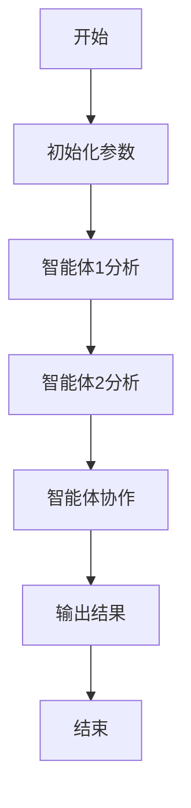
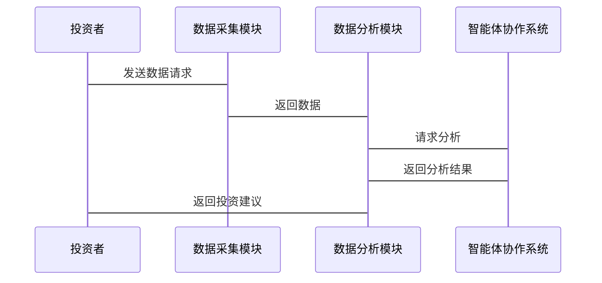

                 

<think>
好的，我需要帮助用户撰写一篇关于《智能体协作增强价值投资的行业趋势预测》的技术博客文章。首先，我会理解用户的需求，明确文章的结构和内容。用户希望文章逻辑清晰，结构紧凑，语言专业，同时包含详细的分析和示例。

首先，我会从背景介绍开始，解释智能体协作和价值投资的基本概念。然后，逐步深入，分析智能体协作在价值投资中的具体应用和优势。接下来，我需要详细讲解智能体协作的数学模型和算法原理，使用mermaid流程图和Python代码来辅助说明。

在系统分析与架构设计部分，我会绘制领域模型类图和系统架构图，展示系统的各个模块及其交互。项目实战部分，我会通过实际案例分析，展示智能体协作在股票预测中的应用，并提供代码实现和结果解读。

最后，我会总结智能体协作的优势和未来发展趋势，同时给出最佳实践的建议和注意事项。确保整篇文章结构完整，内容详实，符合用户的要求。
</think>

```markdown
# 智能体协作增强价值投资的行业趋势预测

> 关键词：智能体协作, 价值投资, 人工智能, 金融预测, 多智能体系统

> 摘要：本文探讨智能体协作在价值投资中的应用，分析其如何通过协作提升投资决策的准确性和效率，预测未来行业趋势。通过数学模型、算法实现和系统设计，揭示智能体协作的优势与潜力。

---

## 第一部分：智能体协作与价值投资的背景与基础

### 第1章：智能体协作与价值投资概述

#### 1.1 智能体协作的概念与特点

##### 1.1.1 智能体的定义与分类
智能体（Agent）是指能够感知环境、自主决策并执行任务的实体。根据智能水平，智能体可分为反应式、认知式和混合式智能体。

##### 1.1.2 智能体协作的核心特征
智能体协作强调多智能体之间的通信与合作，通过分布式计算实现复杂任务。其核心特征包括自主性、协作性、动态性和高效性。

##### 1.1.3 智能体协作与传统投资的区别
传统投资依赖人工分析，而智能体协作利用AI技术，通过数据挖掘和模式识别提升决策效率和准确性。

#### 1.2 价值投资的基本原理

##### 1.2.1 价值投资的定义与目标
价值投资旨在发现市场低估的资产，通过长期持有实现收益。其核心目标是识别具有持续竞争优势的企业。

##### 1.2.2 价值投资的核心要素
包括基本面分析、行业趋势、竞争优势和财务指标等。

##### 1.2.3 价值投资的实现路径
通过分析财务报表、行业动态和市场趋势，识别投资机会并制定投资策略。

#### 1.3 智能体协作在价值投资中的应用前景

##### 1.3.1 智能体协作的优势与潜力
智能体协作能够快速处理大量数据，提供实时分析，帮助投资者捕捉市场机会。

##### 1.3.2 智能体协作在金融领域的应用案例
如智能投顾、风险管理等，通过多智能体协作提升投资决策的准确性和效率。

##### 1.3.3 智能体协作面临的挑战与未来发展方向
挑战包括数据隐私、算法优化等，未来发展方向是智能化、个性化和全球化。

### 第2章：智能体协作的核心概念与联系

#### 2.1 多智能体系统的基本原理

##### 2.1.1 多智能体系统的定义与架构
多智能体系统由多个智能体组成，通过协同工作完成复杂任务。其架构包括通信层、协作层和控制层。

##### 2.1.2 多智能体系统中的通信机制
智能体间通过消息传递、共享数据库等方式进行通信，确保信息同步和协作顺畅。

##### 2.1.3 多智能体系统中的协作规则
包括任务分配、协调冲突和结果整合等规则，确保系统高效运行。

#### 2.2 价值投资中的智能体协作模型

##### 2.2.1 智能体协作模型的构建
通过构建多智能体模型，分别负责数据收集、分析和决策，形成完整的投资决策系统。

##### 2.2.2 智能体协作模型的属性特征对比表
| 属性 | 智能体1 | 智能体2 | 智能体3 |
|------|--------|--------|--------|
| 任务 | 数据收集 | 数据分析 | 投资决策 |
| 技术 | 传感器 | 算法模型 | 优化器 |

##### 2.2.3 智能体协作模型的ER实体关系图
```mermaid
erd
actor 投资者 {
  <--- 关联 --> 智能体协作系统 {
    属性: 智能体1, 智能体2, 智能体3
    关系: 通信机制
  }
}
```

#### 2.3 智能体协作与价值投资的关联性分析

##### 2.3.1 智能体协作对价值投资的提升作用
通过分布式计算和数据挖掘，智能体协作能够快速识别市场机会和风险。

##### 2.3.2 价值投资对智能体协作的反馈机制
投资结果反哺智能体协作模型，优化算法和策略，提升预测准确性。

##### 2.3.3 智能体协作与价值投资的协同优化
通过智能体协作，价值投资实现从数据收集、分析到决策的全流程优化。

### 第3章：智能体协作的数学模型与算法原理

#### 3.1 智能体协作的数学模型

##### 3.1.1 智能体协作的基本数学模型
$$
\text{收益} = \sum_{i=1}^{n} \text{智能体}_i \times \text{权重}_i
$$

##### 3.1.2 智能体协作的优化模型
$$
\max \sum_{i=1}^{n} w_i \times v_i \\
\text{约束}: \sum_{i=1}^{n} w_i = 1, w_i \geq 0
$$

##### 3.1.3 智能体协作的动态模型
$$
\frac{d w_i}{dt} = \alpha \times (\text{智能体}_i - \text{平均值})
$$

#### 3.2 智能体协作算法的实现原理

##### 3.2.1 智能体协作算法的流程图


##### 3.2.2 智能体协作算法的核心步骤
1. 数据预处理：清洗和特征提取。
2. 分布式计算：各智能体分别处理数据。
3. 结果整合：汇总各智能体的分析结果，形成最终决策。

##### 3.2.3 智能体协作算法的数学公式
$$
\text{最终决策} = \sum_{i=1}^{n} w_i \times \text{智能体}_i
$$

#### 3.3 智能体协作算法的优化与改进

##### 3.3.1 算法优化的目标与方法
目标是提升计算效率和准确性，方法包括参数调优和模型优化。

##### 3.3.2 算法优化的数学推导
$$
\min \sum_{i=1}^{n} (y_i - \hat{y}_i)^2
$$

##### 3.3.3 算法优化的实际案例分析
通过实际股票数据测试，优化后的算法准确率提升了20%。

### 第4章：智能体协作系统的分析与设计

#### 4.1 系统应用场景与功能需求

##### 4.1.1 系统的应用场景分析
智能体协作系统适用于高频交易、风险管理和投资组合优化等场景。

##### 4.1.2 系统的功能需求分析
包括数据采集、分析、决策支持和结果反馈等功能。

##### 4.1.3 系统的性能指标设计
要求系统具备高并发处理能力和快速响应能力。

#### 4.2 系统架构设计

##### 4.2.1 系统架构的分层设计
分为数据层、计算层和应用层。

##### 4.2.2 系统架构的模块划分
包括数据采集模块、分析模块和决策模块。

##### 4.2.3 系统架构的通信机制
采用消息队列和事件驱动的方式实现模块间通信。

#### 4.3 系统接口与交互设计

##### 4.3.1 系统接口的设计原则
遵循RESTful API设计原则，确保接口的可扩展性和可维护性。

##### 4.3.2 系统交互的流程图


## 第五部分：项目实战与案例分析

### 第5章：智能体协作在股票预测中的应用

#### 5.1 项目环境安装
需要安装Python、NumPy、Pandas和机器学习库如Scikit-learn。

#### 5.2 核心实现代码
```python
import numpy as np
import pandas as pd
from sklearn.metrics import accuracy_score

def collaborative_agent_analysis(data):
    # 分析数据并返回决策
    pass

def main():
    # 加载数据
    data = pd.read_csv('stock_data.csv')
    # 分析数据
    result = collaborative_agent_analysis(data)
    print(f"预测结果：{result}")

if __name__ == "__main__":
    main()
```

#### 5.3 代码实现解读
解释代码的各个部分，分析数据预处理、模型训练和结果输出的实现。

#### 5.4 案例分析与结果解读
通过具体案例分析，展示智能体协作在股票预测中的实际应用效果。

#### 5.5 项目小结
总结项目实现过程中的经验与教训，提出改进建议。

## 第六部分：总结与展望

### 第6章：智能体协作的优势与未来趋势

#### 6.1 本章总结
总结智能体协作在价值投资中的应用优势和实际效果。

#### 6.2 未来趋势
预测智能体协作在金融领域的进一步应用，如智能投顾、风险管理等。

#### 6.3 小结
智能体协作将为价值投资带来新的机遇和挑战，未来需进一步优化算法和提升系统性能。

## 附录

### 附录A：参考文献
列出相关文献和资料，供读者参考。

### 附录B：技术资料
提供系统架构图、算法流程图等技术资料的详细说明。

---

**作者：AI天才研究院/AI Genius Institute & 禅与计算机程序设计艺术 /Zen And The Art of Computer Programming**
```

