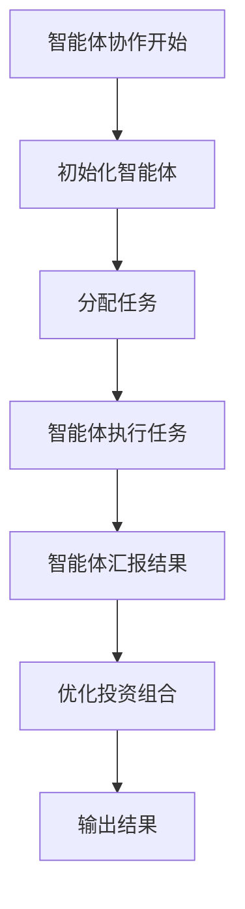

                 


# 智能体协作增强价值投资组合管理效率

> **关键词**：智能体协作，价值投资，投资组合管理，多智能体系统，风险评估，算法优化

> **摘要**：  
> 本文探讨了智能体协作在价值投资组合管理中的应用，通过理论分析、算法设计和系统实现，展示了如何利用多智能体协作机制提升投资组合管理的效率和效果。文章从智能体协作的基本概念出发，结合投资组合管理的理论基础，提出了一种基于智能体协作的优化算法，并通过实际案例验证了该方法的有效性。本文还详细讨论了系统架构设计和项目实战，为读者提供了从理论到实践的完整指南。

---

## 第1章：智能体协作与价值投资组合管理概述

### 1.1 智能体协作的基本概念

智能体（Agent）是指具有感知环境、做出决策并采取行动以实现目标的实体。智能体协作是指多个智能体通过信息共享和协同行动，共同完成复杂任务的过程。

#### 1.1.1 智能体的定义与分类

- **定义**：智能体是一种能够感知环境、自主决策并采取行动的实体，可以是软件程序、机器人或其他智能系统。
- **分类**：
  - **简单反射型智能体**：基于当前感知做出反应，无内部状态。
  - **基于模型的智能体**：维护环境模型，用于决策。
  - **目标驱动型智能体**：根据目标选择行动。
  - **实用驱动型智能体**：根据效用函数优化行动。

#### 1.1.2 智能体协作的特点

- **分布式**：智能体通常分布在不同的节点，各自独立运行。
- **协作性**：通过通信和协调实现共同目标。
- **动态性**：环境和任务可能动态变化，智能体需灵活调整。

### 1.2 价值投资组合管理的核心概念

价值投资是一种投资策略，强调以低于内在价值的价格买入优质资产。投资组合管理则是通过优化资产配置，平衡风险与收益。

#### 1.2.1 投资组合管理的目标

- **最大化收益**：在给定风险下，实现最大收益。
- **最小化风险**：在给定收益下，降低风险。
- **动态调整**：根据市场变化，实时优化投资组合。

### 1.3 智能体协作的应用前景

智能体协作能够通过分布式计算和信息共享，显著提升投资组合管理的效率和决策质量。

---

## 第2章：智能体协作的机制与算法

### 2.1 多智能体系统的协作模型

#### 2.1.1 协作模型的选择

- **基于任务分解的协作模型**：将整体任务分解为子任务，分配给不同的智能体。
- **基于角色分配的协作模型**：根据智能体的能力分配不同角色。

#### 2.1.2 通信机制

- **同步通信**：智能体之间同步交换信息。
- **异步通信**：智能体之间异步交换信息，适用于动态环境。

### 2.2 智能体协作的算法设计

#### 2.2.1 基于强化学习的协作算法

**算法原理**：通过强化学习，智能体学习最优策略，实现协作目标。

**数学模型**：
$$
Q(s, a) = r + \gamma \max_{a'} Q(s', a')
$$

其中，\( Q(s, a) \) 表示状态 \( s \) 下行动 \( a \) 的价值，\( r \) 是奖励，\( \gamma \) 是折扣因子。

---

## 第3章：投资组合管理的理论基础

### 3.1 现代投资组合理论（MPT）

#### 3.1.1 均值-方差模型

**公式**：
$$
\text{收益} = \mathbf{w}^T \mathbf{r} \\
\text{风险} = \mathbf{w}^T \mathbf{C} \mathbf{w}
$$

其中，\( \mathbf{w} \) 是权重向量，\( \mathbf{r} \) 是收益向量，\( \mathbf{C} \) 是协方差矩阵。

### 3.2 风险评估与资产定价

#### 3.2.1 资本资产定价模型（CAPM）

**公式**：
$$
E(R_i) = R_f + \beta_i (R_m - R_f)
$$

其中，\( E(R_i) \) 是资产的预期收益，\( R_f \) 是无风险利率，\( \beta_i \) 是资产的beta值，\( R_m \) 是市场预期收益。

---

## 第4章：智能体协作在投资组合管理中的应用

### 4.1 智能体协作的投资组合优化

#### 4.1.1 基于智能体的任务分解

- **任务分解方法**：将投资组合优化分解为多个子任务，如风险评估、资产配置等。
- **任务分配策略**：根据智能体的能力分配任务。

#### 4.1.2 智能体协作的优化算法

**算法流程图**：


---

## 第5章：系统架构设计与实现

### 5.1 系统功能设计

#### 5.1.1 功能模块划分

- **数据采集模块**：收集市场数据。
- **智能体协作模块**：实现智能体的通信与协作。
- **优化模块**：基于智能体协作结果优化投资组合。

#### 5.1.2 系统架构图


---

## 第6章：项目实战与案例分析

### 6.1 项目环境安装

- **工具安装**：安装Python、Pandas、NumPy等库。
- **环境配置**：配置虚拟环境，安装依赖库。

### 6.2 核心代码实现

#### 6.2.1 智能体协作代码

```python
class Agent:
    def __init__(self, id):
        self.id = id
        self.state = None
    def receive_message(self, message):
        # 处理消息并返回决策
        pass
```

#### 6.2.2 投资组合优化代码

```python
def optimize_portfolio(weights, returns):
    # 使用均值-方差模型优化权重
    return weights
```

### 6.3 案例分析

#### 6.3.1 数据分析与可视化

- **数据可视化**：使用Matplotlib绘制资产回报分布。

```python
import matplotlib.pyplot as plt
returns.plot.hist(bins=20, alpha=0.6)
plt.xlabel('回报率')
plt.ylabel('频率')
plt.show()
```

---

## 第7章：优化与最佳实践

### 7.1 系统优化建议

- **性能优化**：使用并行计算加速处理。
- **算法优化**：改进强化学习算法，提高收敛速度。

### 7.2 小结与展望

智能体协作在投资组合管理中的应用前景广阔，未来可以通过结合更多先进的技术，如区块链和大数据分析，进一步提升系统的智能化水平。

---

## 作者

**作者：AI天才研究院/AI Genius Institute & 禅与计算机程序设计艺术 /Zen And The Art of Computer Programming**

---

**本文由AI天才研究院原创，转载请注明出处。**

