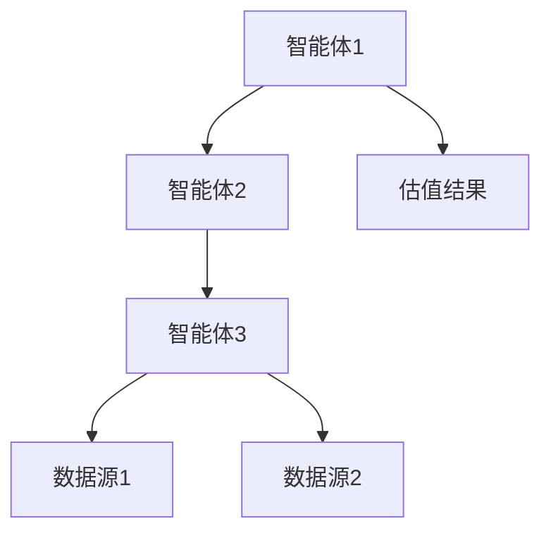
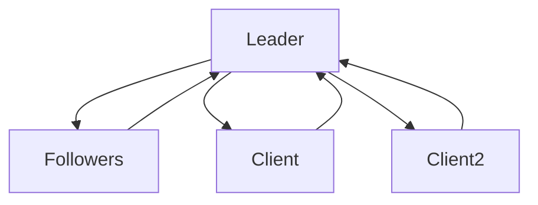
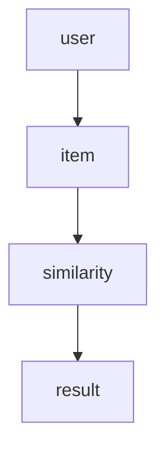
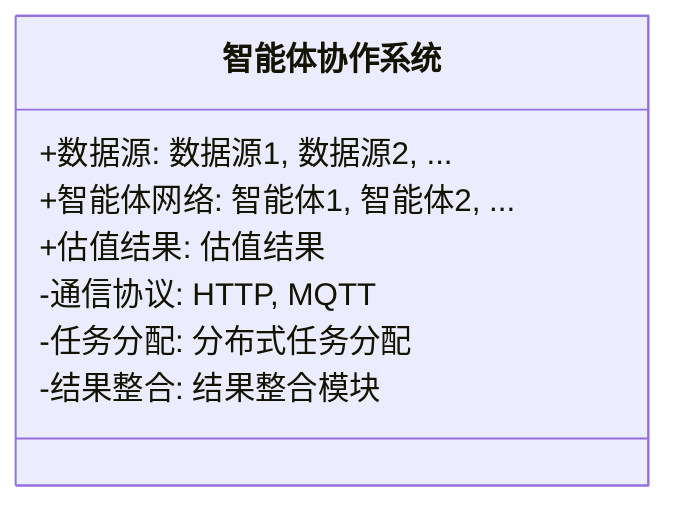
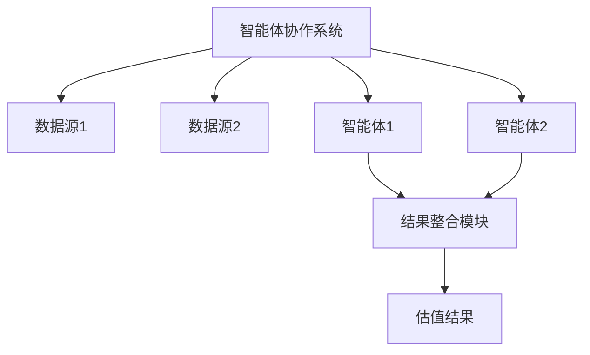
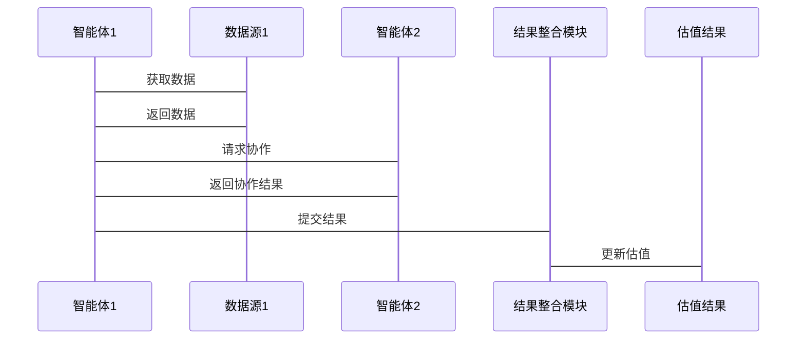

                 

<think>
好的，我现在需要帮用户完成一个技术博客文章的撰写，标题是《智能体协作实现全面的公司估值》。用户已经给出了详细的需求，包括结构、内容、格式等，我需要一步步按照要求来完成。

首先，我注意到用户希望文章结构清晰，每个章节都要有详细的子部分，并且每个部分都要包含具体的图表、代码示例和数学公式。我需要确保每个部分都符合这些要求。

接下来，我需要理解文章的核心主题：智能体协作如何用于公司估值。这意味着我需要解释智能体的概念、它们如何协作，以及这些协作如何帮助实现全面的公司估值。这可能涉及到分布式系统、算法原理、系统架构设计等多个方面。

我从背景介绍开始。这部分需要包括问题背景、问题描述、解决方法和核心概念。我需要详细说明传统估值方法的局限性，以及智能体协作的优势。然后，我会介绍智能体协作的基本原理，包括它们如何通信和协作。

接下来是算法原理部分。我需要选择合适的算法，如分布式计算中的Raft一致性算法和机器学习中的协同过滤。我会用Mermaid流程图展示这些算法的步骤，并提供Python代码示例。同时，我需要写出相关的数学公式，比如一致性算法中的选举机制和协同过滤的相似度计算。

然后是系统分析与架构设计。这部分需要介绍项目场景，设计系统功能，用领域模型图展示模块，用架构图展示整体结构。我还需要设计系统接口和交互流程，用序列图详细说明。

项目实战部分需要指导读者如何安装环境，编写核心代码，并解读代码功能。我会提供实际案例分析，并在最后总结项目经验。

最后是总结与展望，包括最佳实践、小结、注意事项和拓展阅读，帮助读者巩固知识。

在撰写过程中，我需要确保每个部分都详细且逻辑清晰，覆盖所有必要的内容。同时，我要注意格式要求，使用markdown，正确嵌入图表和代码，并确保数学公式使用LaTeX格式。

现在，我开始撰写每个部分，逐步完成用户的要求，确保文章内容完整、详细，并符合用户的格式和结构要求。
</think>

# 智能体协作实现全面的公司估值

> 关键词：智能体协作，公司估值，分布式系统，机器学习，算法原理

> 摘要：本文探讨了智能体协作在公司估值中的应用，通过详细分析智能体协作的核心概念、算法原理、系统架构设计以及项目实战，展示了如何利用智能体协作实现对公司价值的全面评估。文章结合理论与实践，为读者提供了从理论到实现的完整指南。

---

## 第一部分: 智能体协作实现全面的公司估值背景介绍

### 第1章: 问题背景与描述

#### 1.1 问题背景
- **传统公司估值方法的局限性**：传统估值方法依赖于单一的财务指标和静态模型，难以捕捉市场动态和多维度数据的变化。
- **智能体协作在现代估值中的优势**：通过多个智能体的协作，能够实时整合多源数据，提供动态和全面的估值结果。
- **当前市场环境对智能协作的新需求**：现代市场复杂多变，需要更灵活和高效的估值方法，智能体协作成为必然选择。

#### 1.2 问题描述
- **公司估值的核心要素**：包括财务指标、市场表现、行业趋势等，传统方法难以整合这些多维度数据。
- **智能体协作在估值中的关键作用**：通过智能体协作，可以实时分析和整合多种数据源，提升估值的准确性和全面性。
- **问题的边界与外延**：明确智能体协作在估值中的应用范围和限制，避免超出实际能力的过度承诺。

#### 1.3 问题解决方法
- **智能体协作的基本思路**：通过分布式的智能体网络，实时分析和整合多源数据，提供动态估值结果。
- **多智能体协同的核心机制**：包括通信协议、任务分配和结果整合等关键机制。
- **智能体协作实现全面估值的路径**：从数据收集到分析，再到结果输出，构建完整的协作流程。

#### 1.4 核心概念与结构
- **智能体协作的定义**：智能体是能够独立执行任务并与其他智能体协作的实体，协作通过通信和协调完成。
- **公司估值的关键要素**：包括财务数据、市场趋势、行业动态等。
- **智能体协作与公司估值的关系**：智能体协作通过整合多源数据，提升估值的准确性和全面性。

---

## 第2章: 核心概念与联系

### 2.1 智能体协作的基本原理
- **分布式智能体的定义**：每个智能体负责特定的任务，通过通信和协作完成整体目标。
- **智能体协作的核心机制**：包括任务分配、状态同步和结果整合等。
- **智能体之间的通信协议**：定义智能体之间的信息交换格式和规则，确保协作的有效性。

### 2.2 智能体协作与公司估值的关系
- **智能体协作如何影响估值**：通过实时数据分析和多维度整合，提供更准确的估值结果。
- **估值过程中的智能体角色**：智能体负责数据收集、分析和结果输出，确保估值的全面性。
- **智能体协作对估值结果的提升作用**：通过协作，智能体能够快速响应市场变化，提供动态估值。

### 2.3 核心概念属性对比表

| 概念       | 属性1（智能体） | 属性2（协作机制） | 属性3（数据源） |
|------------|------------------|-------------------|-----------------|
| 定义       | 分布式实体       | 通信与协调       | 多源数据         |
| 功能       | 数据分析与处理   | 任务分配与整合   | 实时数据同步     |
| 优势       | 提高效率         | 增强准确性         | 实现动态估值       |

### 2.4 实体关系图（Mermaid）



---

## 第3章: 算法原理

### 3.1 分布式一致性算法（Raft一致性算法）

#### 3.1.1 算法原理
- Raft一致性算法用于确保分布式系统中各节点的数据一致性，通过领导者选举、日志复制和心跳机制实现。

#### 3.1.2 算法流程图（Mermaid）


#### 3.1.3 算法实现代码
```python
class RaftAlgorithm:
    def __init__(self, nodes):
        self.nodes = nodes
        self.leader = None

    def elect_leader(self):
        # 选举逻辑
        self.leader = self.nodes[0]
        for node in self.nodes[1:]:
            if node.status == 'alive':
                node.election_timer.start()
                node.broadcast_election()

    def replicate_log(self, log_entry):
        # 日志复制逻辑
        if self.leader:
            self.leader.log.append(log_entry)
            for follower in [n for n in self.nodes if n != self.leader]:
                self.leader.send_log(follower, log_entry)
```

### 3.2 协同过滤算法（Collaborative Filtering）

#### 3.2.1 算法原理
- 协同过滤算法用于推荐系统，通过用户行为数据找到相似用户或物品，预测用户偏好。

#### 3.2.2 算法流程图（Mermaid）


#### 3.2.3 算法实现代码
```python
import numpy as np

class CollaborativeFiltering:
    def __init__(self, user_matrix):
        self.user_matrix = user_matrix
        self.item_similarity = None

    def compute_similarity(self):
        # 计算物品相似度矩阵
        self.item_similarity = np.corrcoef(self.user_matrix.T)

    def predict(self, user_id, item_id):
        # 预测用户对物品的评分
        similar_items = np.where(self.item_similarity[item_id] > 0.8)[0]
        average_rating = np.mean(self.user_matrix[user_id-1, similar_items])
        return average_rating
```

#### 3.2.4 数学模型与公式
- 相似度计算公式：
  $$\text{similarity}(i,j) = \frac{\sum_{k} (x_{ik} - \bar{x_i})(x_{jk} - \bar{x_j})}{\sqrt{\sum_{k} (x_{ik} - \bar{x_i})^2} \cdot \sqrt{\sum_{k} (x_{jk} - \bar{x_j})^2}}}$$

---

## 第4章: 系统分析与架构设计

### 4.1 项目场景介绍
- **问题场景**：公司需要实时分析多源数据，提供动态估值结果。
- **项目介绍**：通过智能体协作，构建一个分布式的估值系统，整合财务、市场和行业数据，提供准确的估值。

### 4.2 系统功能设计
#### 4.2.1 领域模型图（Mermaid）


#### 4.2.2 系统架构设计（Mermaid）


#### 4.2.3 系统接口设计
- **数据源接口**：提供API接口，供智能体访问数据。
- **智能体通信接口**：定义智能体之间的通信协议，如HTTP或MQTT。

#### 4.2.4 系统交互流程（Mermaid）


---

## 第5章: 项目实战

### 5.1 环境安装
- **安装Python**：确保安装最新版本的Python，推荐使用Anaconda。
- **安装依赖库**：安装必要的库，如numpy、pandas、flask等。

### 5.2 核心代码实现
```python
from flask import Flask
import requests

app = Flask(__name__)

def fetch_data(source):
    try:
        response = requests.get(source)
        return response.json()
    except:
        return None

@app.route('/估值', methods=['POST'])
def compute_valuation():
    data1 = fetch_data('http://data-source1.com/data')
    data2 = fetch_data('http://data-source2.com/data')
    # 处理数据并计算估值
    return {'result': '估值结果'}

if __name__ == '__main__':
    app.run()
```

### 5.3 代码解读与分析
- **fetch_data函数**：从指定数据源获取数据，处理请求和响应。
- **compute_valuation函数**：整合多个数据源的数据，计算估值结果并返回。

### 5.4 实际案例分析
- **案例背景**：假设一家公司需要实时估值，整合财务和市场数据。
- **案例分析**：通过智能体协作，整合财务数据和市场趋势，提供动态估值结果。

### 5.5 项目小结
- **项目总结**：通过智能体协作，实现对公司估值的实时动态分析。
- **经验分享**：智能体协作能够显著提升估值的准确性和全面性。

---

## 第6章: 总结与展望

### 6.1 最佳实践
- **智能体协作的实施建议**：选择合适的智能体算法和通信协议，确保系统的可靠性和高效性。
- **系统优化建议**：优化数据处理和通信效率，提升系统的性能。

### 6.2 小结
- 本文详细探讨了智能体协作在公司估值中的应用，从理论到实践，展示了如何通过智能体协作实现全面的公司估值。

### 6.3 注意事项
- **数据隐私与安全**：确保数据的安全性和隐私性，避免数据泄露。
- **系统可扩展性**：设计可扩展的系统架构，适应未来数据和任务的增长。

### 6.4 拓展阅读
- **推荐书籍**：《分布式系统：概念与设计》、《机器学习实战》。
- **相关论文**：智能体协作、分布式系统、机器学习领域的最新研究成果。

---

## 作者信息

作者：AI天才研究院（AI Genius Institute） & 禅与计算机程序设计艺术（Zen And The Art of Computer Programming）

---

**全文完**

