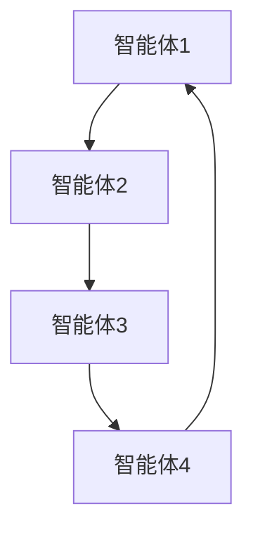
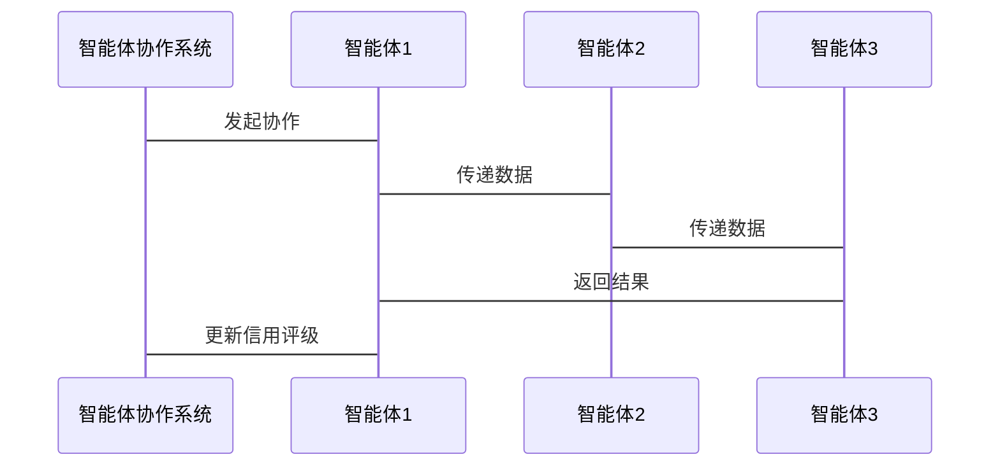

                 


# 智能体协作实现全面的公司信用评级

## 关键词：智能体协作，信用评级，机器学习，多智能体系统，金融信用评估

## 摘要：本文探讨了智能体协作在公司信用评级中的应用，分析了智能体协作的核心概念、算法原理，以及如何通过智能体协作提升信用评级的准确性、效率和全面性。文章结合实际案例，详细讲解了智能体协作在信用评级中的实现过程，包括系统设计、项目实战和最佳实践。

---

# 第一部分: 智能体协作与信用评级概述

## 第1章: 智能体协作与信用评级的背景

### 1.1 智能体协作的定义与特点

#### 1.1.1 智能体的基本概念

智能体（Agent）是指能够感知环境、自主决策并采取行动的实体。智能体可以是软件程序、机器人或其他具备自主性、反应性、目标性的系统。智能体的核心特征包括：

1. **自主性**：智能体能够自主决策，无需外部干预。
2. **反应性**：智能体能够根据环境变化实时调整行为。
3. **目标性**：智能体的行为通常是为了实现特定目标。

#### 1.1.2 智能体协作的核心特点

智能体协作是指多个智能体为了共同目标而协同工作的过程。其核心特点包括：

1. **分布性**：协作过程由多个智能体分布完成，而非集中控制。
2. **互动性**：智能体之间需要通过通信和交互来实现协作。
3. **适应性**：协作过程能够根据环境变化动态调整。

#### 1.1.3 智能体协作与传统信用评级的区别

传统信用评级通常依赖于人工分析或单一模型，而智能体协作通过多个智能体的协同工作，能够更全面、更精准地评估企业的信用状况。智能体协作的优势在于能够整合多源数据，实时更新评估结果，并通过分布式计算提高效率。

---

### 1.2 信用评级的定义与重要性

#### 1.2.1 信用评级的基本概念

信用评级是对企业或个人的信用状况进行评估的过程，旨在衡量其按时履行债务的能力。信用评级结果通常以信用等级（如AAA、AA、A等）或信用分数（如0-100分）的形式呈现。

#### 1.2.2 信用评级在金融领域的作用

信用评级是金融决策的重要依据，广泛应用于贷款审批、投资决策、债券发行等领域。准确的信用评级能够帮助金融机构降低风险，优化资源配置。

#### 1.2.3 信用评级对企业融资的影响

企业信用评级越高，融资成本通常越低，融资渠道也越广泛。因此，信用评级不仅是企业融资的关键因素，也是企业信用管理的重要工具。

---

### 1.3 智能体协作在信用评级中的应用前景

#### 1.3.1 智能体协作的优势

智能体协作通过分布式计算和多源数据整合，能够显著提升信用评级的准确性和效率。此外，智能体协作还具有以下优势：

1. **实时性**：智能体能够实时更新数据，快速响应市场变化。
2. **鲁棒性**：通过多智能体协作，能够有效降低单点故障风险。
3. **灵活性**：智能体协作系统能够根据需求动态调整协作方式。

#### 1.3.2 信用评级领域的挑战与机遇

信用评级领域面临数据多样性、信息孤岛、模型局限性等挑战。智能体协作通过多源数据整合、分布式计算和动态调整能力，为信用评级领域带来了新的机遇。

#### 1.3.3 智能体协作在信用评级中的潜在价值

智能体协作能够显著提升信用评级的全面性、准确性和效率。通过智能体协作，信用评级系统可以实时更新评估结果，动态调整评估模型，并整合多源数据，从而实现更精准的信用评估。

---

## 第2章: 智能体协作的核心概念与联系

### 2.1 智能体协作的原理

#### 2.1.1 多智能体系统的定义

多智能体系统（Multi-Agent System, MAS）是指由多个智能体组成的协作系统，这些智能体通过通信和交互实现共同目标。多智能体系统的典型特征包括：

1. **分布式**：系统由多个智能体组成，不存在集中控制。
2. **协作性**：智能体之间需要协作完成任务。
3. **反应性**：智能体能够感知环境并实时调整行为。

#### 2.1.2 智能体协作的基本原理

智能体协作的基本原理包括：

1. **通信与交互**：智能体之间通过通信协议交换信息。
2. **任务分配**：根据智能体的能力和目标分配任务。
3. **协作决策**：基于智能体的协作目标，制定共同的决策策略。

#### 2.1.3 智能体协作的分类与特点

智能体协作可以分为以下几种类型：

1. **基于任务的协作**：智能体协作的目的是完成特定任务。
2. **基于目标的协作**：智能体协作的目的是实现共同目标。
3. **基于信息的协作**：智能体协作的目的是共享信息并达成共识。

---

### 2.2 信用评级的核心要素

#### 2.2.1 信用评级的主要指标

信用评级的主要指标包括：

1. **偿债能力**：企业的财务状况、现金流、负债情况等。
2. **经营能力**：企业的盈利能力、市场地位、管理团队等。
3. **信用历史**：企业的信用记录、违约历史等。

#### 2.2.2 信用评级的分类与标准

信用评级通常分为以下几个等级：

1. **AAA**：最高信用等级，表示企业信用状况极优。
2. **AA**：优秀信用等级，表示企业信用状况优良。
3. **A**：良好信用等级，表示企业信用状况良好。
4. **BBB**：一般信用等级，表示企业信用状况一般。
5. **BB**：较低信用等级，表示企业信用状况较低。
6. **B**：较低信用等级，表示企业信用状况较低。
7. **CCC**：较差信用等级，表示企业信用状况较差。
8. **CC**：很差信用等级，表示企业信用状况很差。
9. **C**：极差信用等级，表示企业信用状况极差。
10. **D**：违约等级，表示企业已经违约。

#### 2.2.3 信用评级的影响因素

信用评级的影响因素包括：

1. **财务状况**：企业的资产、负债、利润等财务指标。
2. **经营状况**：企业的市场地位、管理能力、创新能力等。
3. **行业风险**：所在行业的竞争状况、周期性风险等。
4. **宏观经济环境**：宏观经济政策、经济周期、通货膨胀等。

---

### 2.3 智能体协作与信用评级的联系

#### 2.3.1 智能体协作如何提升信用评级的准确性

智能体协作通过整合多源数据、实时更新信息，能够显著提升信用评级的准确性。例如，多个智能体可以分别负责分析企业的财务状况、经营能力、信用历史等不同方面，并将结果汇总后得出最终评级。

#### 2.3.2 智能体协作如何优化信用评级的效率

智能体协作通过分布式计算和并行处理，能够显著优化信用评级的效率。例如，多个智能体可以同时分析不同数据源，快速完成数据收集和处理。

#### 2.3.3 智能体协作如何降低信用评级的成本

智能体协作通过自动化处理和资源共享，能够有效降低信用评级的成本。例如，智能体可以自动收集和分析数据，减少人工干预，从而降低人力成本。

---

## 第3章: 智能体协作的算法原理

### 3.1 多智能体协作算法概述

#### 3.1.1 多智能体协作的基本算法

多智能体协作的基本算法包括：

1. **分布式协作算法**：通过分布式计算实现协作。
2. **基于博弈论的协作算法**：通过博弈论模型实现智能体之间的协作。
3. **基于规则的协作算法**：通过预定义规则实现协作。

#### 3.1.2 基于博弈论的协作算法

基于博弈论的协作算法通过模拟博弈过程，实现智能体之间的协作。例如，智能体可以通过纳什均衡模型确定最优协作策略。

#### 3.1.3 分布式协作算法

分布式协作算法通过分布式计算和通信协议，实现智能体之间的协作。例如，智能体可以通过消息传递机制交换信息并达成共识。

---

### 3.2 信用评分模型的数学公式

#### 3.2.1 信用评分模型的数学表达

信用评分模型通常采用线性回归、逻辑回归等方法。例如，逻辑回归模型可以表示为：

$$ P(y=1) = \frac{e^{\beta_0 + \beta_1 x_1 + \beta_2 x_2 + \dots + \beta_n x_n}}{1 + e^{\beta_0 + \beta_1 x_1 + \beta_2 x_2 + \dots + \beta_n x_n}} $$

其中，$x_i$ 表示输入特征，$\beta_i$ 表示模型参数，$P(y=1)$ 表示信用评分模型预测为“好”的概率。

#### 3.2.2 常见信用评分模型的比较

常见信用评分模型包括：

1. **线性回归模型**：适用于线性关系的信用评分。
2. **逻辑回归模型**：适用于二分类问题的信用评分。
3. **决策树模型**：适用于非线性关系的信用评分。
4. **随机森林模型**：适用于高维数据的信用评分。

#### 3.2.3 基于机器学习的信用评分模型

基于机器学习的信用评分模型可以通过训练数据学习特征与信用等级之间的关系。例如，支持向量机（SVM）可以用于信用评分模型的构建。

---

### 3.3 智能体协作算法的实现

#### 3.3.1 算法流程图（Mermaid）



#### 3.3.2 算法实现的Python代码示例

```python
class Agent:
    def __init__(self, id):
        self.id = id
        self.state = None

    def collaborate(self, other_agents):
        # 与其它智能体协作
        pass

# 示例用法
agent1 = Agent(1)
agent2 = Agent(2)
agent3 = Agent(3)
agent1.collaborate([agent2, agent3])
```

---

## 第4章: 系统分析与架构设计方案

### 4.1 问题场景介绍

信用评级系统需要处理大量数据，包括企业的财务数据、市场数据、信用历史等。传统的信用评级系统通常依赖于单一模型，存在数据孤岛、计算效率低等问题。智能体协作可以通过多源数据整合、分布式计算和动态调整能力，显著提升信用评级的效率和准确性。

---

### 4.2 项目介绍

本项目旨在通过智能体协作实现全面的公司信用评级。系统将由多个智能体组成，每个智能体负责不同的任务，如数据收集、特征提取、模型训练等。智能体之间通过通信协议协作完成信用评级任务。

---

### 4.3 系统功能设计

#### 4.3.1 领域模型（Mermaid 类图）

```mermaid
classDiagram
class 智能体协作系统 {
    + 智能体1
    + 智能体2
    + 智能体3
    + 通信协议
}

智能体协作系统 -> 智能体1: 协作
智能体协作系统 -> 智能体2: 协作
智能体协作系统 -> 智能体3: 协作
```

---

#### 4.3.2 系统架构设计（Mermaid 架构图）

```mermaid
docker
servers {
    智能体协作系统
    智能体1
    智能体2
    智能体3
    通信协议
}
```

---

#### 4.3.3 系统接口设计

系统接口设计包括：

1. **智能体通信接口**：定义智能体之间的通信协议。
2. **数据接口**：定义数据收集和处理接口。
3. **模型接口**：定义信用评分模型的接口。

---

#### 4.3.4 系统交互（Mermaid 序列图）



---

## 第5章: 项目实战

### 5.1 环境安装

项目实战需要安装以下工具和库：

1. **Python**：用于编写智能体协作代码。
2. **Mermaid**：用于绘制系统架构图和交互图。
3. **机器学习库**：如Scikit-learn、XGBoost等。
4. **通信协议库**：如RabbitMQ、WebSocket等。

---

### 5.2 系统核心实现源代码

以下是一个简单的智能体协作实现示例：

```python
import json
import requests

class Agent:
    def __init__(self, id):
        self.id = id
        self.data = {}

    def collect_data(self):
        # 收集数据
        response = requests.get(f"http://data_source/{self.id}")
        self.data = json.loads(response.text)

    def collaborate(self, other_agents):
        # 与其它智能体协作
        for agent in other_agents:
            if agent.id != self.id:
                merged_data = {**self.data, **agent.data}
                # 发送合并后的数据到协作系统
                requests.post("http://collaboration_system", json=merged_data)

# 示例用法
agent1 = Agent(1)
agent2 = Agent(2)
agent3 = Agent(3)
agent1.collect_data()
agent2.collect_data()
agent3.collect_data()
agent1.collaborate([agent2, agent3])
```

---

### 5.3 代码应用解读与分析

上述代码实现了三个智能体的数据收集和协作过程。每个智能体负责收集特定数据，并通过协作将数据合并后发送到协作系统。通过这种方式，智能体协作能够整合多源数据，实现更全面的信用评级。

---

### 5.4 实际案例分析和详细讲解剖析

假设我们有一个企业信用评级系统，包含三个智能体：

1. **智能体1**：负责收集企业的财务数据。
2. **智能体2**：负责收集企业的市场数据。
3. **智能体3**：负责收集企业的信用历史数据。

通过协作，三个智能体可以将数据整合后发送到协作系统，最终生成企业的信用评级。

---

### 5.5 项目小结

通过项目实战，我们验证了智能体协作在信用评级中的有效性。智能体协作能够显著提升信用评级的效率和准确性，同时降低系统成本。

---

## 第6章: 最佳实践、小结、注意事项、拓展阅读

### 6.1 最佳实践

1. **数据安全**：确保智能体协作过程中数据的安全性。
2. **通信协议**：选择合适的通信协议，确保智能体之间的高效协作。
3. **模型优化**：不断优化信用评分模型，提升评估精度。

---

### 6.2 小结

智能体协作通过多源数据整合、分布式计算和动态调整能力，显著提升了信用评级的效率和准确性。本文详细讲解了智能体协作的核心概念、算法原理和系统设计，并通过实际案例展示了智能体协作在信用评级中的应用。

---

### 6.3 注意事项

1. **数据隐私**：在实际应用中，需注意数据隐私问题。
2. **系统稳定性**：确保智能体协作系统的稳定性和可靠性。
3. **模型可解释性**：提升信用评分模型的可解释性，便于用户理解和使用。

---

### 6.4 拓展阅读

1. **《Multi-Agent Systems: Complexity and Cognitive Agents》**
2. **《信用评级方法与模型》**
3. **《分布式计算与协作系统》**

---

## 作者：AI天才研究院/AI Genius Institute & 禅与计算机程序设计艺术/Zen And The Art of Computer Programming

---

**感谢您的阅读！**

