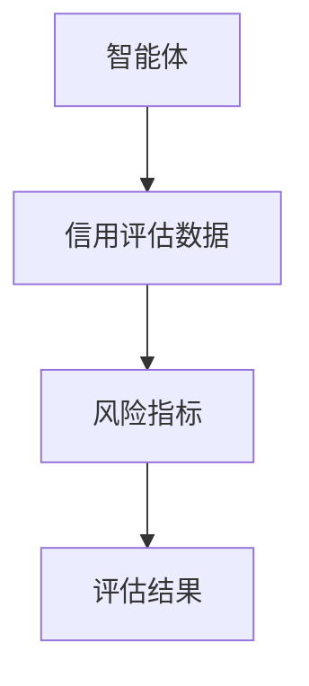
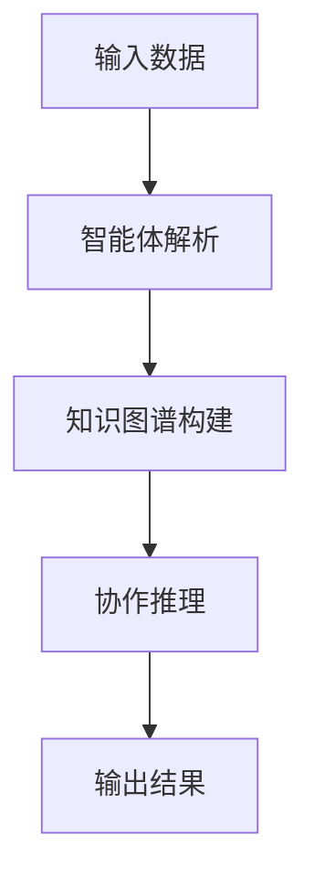
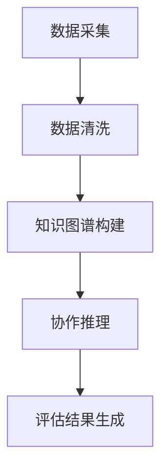
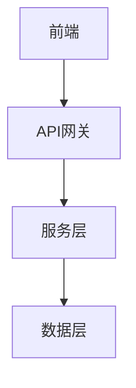
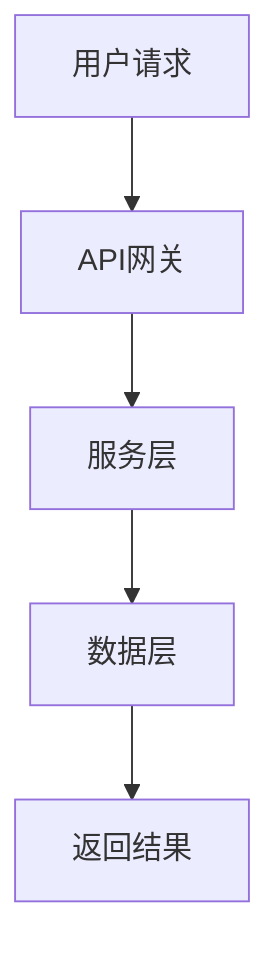

                 

<think>
好的，我现在需要根据用户提供的详细结构和要求，撰写一篇名为《智能体协作实现全面的公司信用风险评估》的技术博客文章。我会按照用户提供的目录大纲，逐步完成每一部分的内容。

首先，我会从第一章开始，介绍智能体协作与信用风险评估的背景。我需要详细解释信用风险评估的重要性，传统方法的局限性，以及智能体协作如何解决这些问题。

接下来，在第二章，我会详细阐述智能体协作的核心概念，包括智能体的定义、协作机制，以及它们如何与信用风险评估结合。我还需要使用表格和Mermaid图来对比不同概念和展示实体关系。

第三章将深入讲解智能体协作的算法原理，包括基于知识图谱的算法。我需要使用Mermaid流程图展示算法步骤，并提供Python代码示例和数学模型。

第四章会分析系统的架构设计，从项目背景到系统功能设计，使用Mermaid图展示类图和架构图，以及接口和交互流程图。

第五章是项目实战，我需要详细描述环境安装、核心代码实现、案例分析，并解读代码和分析结果。

第六章将总结最佳实践，包括小结、注意事项和拓展阅读，帮助读者更好地应用所学知识。

最后，我会确保文章结构完整，内容详细，符合用户的要求，使用正确的格式和标记，如Mermaid图和LaTeX公式，并在末尾添加作者信息。
</think>

# 智能体协作实现全面的公司信用风险评估

## 关键词：智能体协作，信用风险评估，知识图谱，多智能体系统，风险管理

## 摘要：本文探讨了智能体协作在公司信用风险评估中的应用，详细分析了其核心原理、算法实现和系统架构，并通过实际案例展示了其优势与挑战。文章旨在为金融领域的技术实践者提供深入的理论与实践指导。

---

# 第1章: 智能体协作与信用风险评估背景

## 1.1 信用风险评估的背景与挑战

### 1.1.1 信用风险的定义与重要性
信用风险是指在信用交易中，交易对手方未能履行其债务义务而给债权人带来损失的可能性。在公司层面，信用风险的评估直接关系到企业的融资成本、投资决策以及整体风险管理能力。随着全球经济的复杂化和不确定性增加，信用风险的评估变得尤为重要。

### 1.1.2 传统信用风险评估的局限性
传统的信用风险评估方法主要依赖于财务报表分析、历史数据统计以及简单的模型预测。这些方法存在以下问题：
- 数据来源单一，难以捕捉非财务风险因素。
- 模型静态，难以应对市场环境的快速变化。
- 缺乏实时性，无法及时反映企业的最新动态。
- 难以整合多源异构数据，导致评估结果不够全面。

### 1.1.3 智能体协作在信用风险评估中的优势
智能体协作通过多智能体的分布式计算和知识共享，能够整合企业内外部的多源数据，实时分析企业的信用状况。这种方法能够显著提高评估的准确性和及时性，同时降低了人为干预的风险。

## 1.2 智能体协作的基本概念
### 1.2.1 智能体的定义与特点
智能体（Agent）是指在计算机系统中，能够感知环境、自主决策并采取行动的实体。智能体的特点包括自主性、反应性、主动性、协作性和学习能力。

### 1.2.2 智能体协作的核心理念
智能体协作是指多个智能体通过共享信息、协同决策和协作行动来共同完成复杂任务的过程。这种协作基于智能体之间的通信与协调，能够在分布式环境中实现高效的资源分配和任务执行。

### 1.2.3 智能体协作与信用风险评估的结合
在信用风险评估中，智能体协作能够通过整合企业内部数据和外部市场信息，构建全面的信用评估模型。多个智能体分别负责不同的数据源和评估维度，通过协作实现对企业的整体信用风险的准确评估。

---

# 第2章: 智能体协作的核心原理

## 2.1 智能体协作的基本原理

### 2.1.1 分布式智能体的协作机制
分布式智能体协作机制通过智能体之间的通信协议和任务分配算法，实现多个智能体之间的协同工作。常见的协作机制包括基于规则的协作、基于计划的协作和基于市场的协作。

### 2.1.2 多智能体系统的通信与协调
多智能体系统的通信与协调是智能体协作的核心。智能体之间通过消息传递、状态共享和协议协商等方式，实现信息的实时同步和任务的高效分配。

### 2.1.3 智能体协作的决策过程
智能体协作的决策过程包括信息收集、信息处理、决策制定和行动执行四个阶段。每个阶段都需要智能体之间的紧密配合和实时互动。

## 2.2 智能体协作的核心要素

### 2.2.1 智能体的感知能力
智能体的感知能力是指其获取环境信息和数据源的能力。在信用风险评估中，智能体需要能够从企业财务报表、市场动态、行业趋势等多个数据源中获取相关信息。

### 2.2.2 智能体的推理能力
智能体的推理能力是指其基于获取的信息进行分析、判断和推理的能力。在信用风险评估中，智能体需要能够根据企业的历史数据和市场动态，推断出企业的信用状况和潜在风险。

### 2.2.3 智能体的行动能力
智能体的行动能力是指其根据推理结果采取相应行动的能力。在信用风险评估中，智能体可以通过调整评估模型参数、触发预警机制等方式，影响企业的信用评估结果。

## 2.3 智能体协作与信用风险评估的结合

### 2.3.1 信用风险评估中的信息整合
智能体协作通过整合企业内外部的多源数据，构建全面的信用评估模型。这些数据包括企业的财务数据、市场数据、行业数据等，为信用风险评估提供了丰富的信息来源。

### 2.3.2 智能体协作在信用评估中的具体应用
智能体协作在信用风险评估中的具体应用包括：
- 数据清洗与整合：智能体通过分布式协作，对来自不同数据源的信息进行清洗和整合。
- 风险指标计算：智能体基于整合后的数据，计算企业的各项风险指标。
- 信用评估结果生成：智能体根据计算出的风险指标，生成企业的信用评估结果。

### 2.3.3 智能体协作的优势与挑战
智能体协作的优势在于其能够整合多源数据，实现分布式计算和协同决策，从而提高信用风险评估的准确性和效率。然而，智能体协作也面临一些挑战，如数据隐私保护、智能体之间的通信延迟以及协作协议的设计复杂性。

---

# 第3章: 智能体协作的核心概念与联系

## 3.1 智能体协作的核心概念对比

### 3.1.1 智能体类型对比
| 类型       | 描述                                         | 适用场景                                   |
|------------|----------------------------------------------|-------------------------------------------|
| 单智能体    | 单个智能体独立完成任务                     | 适用于简单任务                             |
| 多智能体    | 多个智能体协同完成任务                     | 适用于复杂任务                             |
| 分布式智能体| 智能体分布在不同节点，通过网络协作完成任务 | 适用于大规模分布式系统                   |

### 3.1.2 协作机制对比
| 机制       | 描述                                         | 优缺点                                     |
|------------|----------------------------------------------|-------------------------------------------|
| 基于规则的协作 | 通过预定义的规则进行协作                   | 实现简单，但灵活性差                       |
| 基于计划的协作 | 通过协商制定协作计划                     | 灵活性高，但协商过程复杂                   |
| 基于市场的协作 | 通过市场机制进行资源分配和任务分配       | 自组织能力强，但需要复杂的市场机制         |

### 3.1.3 信用评估方法对比
| 方法       | 描述                                         | 优缺点                                     |
|------------|----------------------------------------------|-------------------------------------------|
| 传统统计模型 | 基于历史数据的统计分析方法                 | 方法简单，但难以捕捉非财务风险因素         |
| 知识图谱方法 | 基于知识图谱的语义分析方法                 | 能够整合多源数据，但构建知识图谱成本较高   |
| 智能体协作方法 | 基于多智能体协作的分布式计算方法         | 能够实时动态评估，但实现复杂               |

## 3.2 智能体协作的ER实体关系图



---

# 第4章: 智能体协作算法原理

## 4.1 基于知识图谱的智能体协作算法

### 4.1.1 算法原理概述
基于知识图谱的智能体协作算法通过构建企业的知识图谱，利用分布式计算和多智能体协作，实现对企业信用风险的实时评估。算法的核心步骤包括知识图谱构建、智能体协作推理和评估结果生成。

### 4.1.2 算法实现步骤
1. 数据清洗与整合：从多个数据源中获取企业相关的数据，包括财务数据、市场数据、行业数据等，并进行数据清洗和整合。
2. 知识图谱构建：基于整合后的数据，构建企业的知识图谱，包括企业的实体关系、属性信息等。
3. 智能体协作推理：多个智能体通过协作推理，基于知识图谱中的信息，计算企业的各项风险指标。
4. 评估结果生成：根据计算出的风险指标，生成企业的信用评估结果。

### 4.1.3 算法流程图



### 4.1.4 算法实现的数学模型

#### 知识图谱表示模型
$$ P(r | e_1, e_2) = \frac{P(e_1, r, e_2)}{\sum_{r'} P(e_1, r', e_2)}$$

其中：
- \( e_1 \) 和 \( e_2 \) 是实体
- \( r \) 是关系
- \( P(e_1, r, e_2) \) 是实体 \( e_1 \) 和 \( e_2 \) 之间存在关系 \( r \) 的概率

#### 协作推理模型
$$ Score(e) = \sum_{i=1}^{n} w_i \cdot f_i(e)$$

其中：
- \( e \) 是企业实体
- \( w_i \) 是特征 \( f_i \) 的权重
- \( f_i(e) \) 是特征 \( f_i \) 对企业信用风险的影响程度

---

# 第5章: 智能体协作的系统分析与架构设计

## 5.1 项目背景介绍

## 5.2 系统功能设计

### 5.2.1 系统功能模块
- 数据采集模块：负责从多个数据源采集企业相关数据
- 数据清洗模块：对采集到的数据进行清洗和预处理
- 知识图谱构建模块：基于清洗后的数据，构建企业的知识图谱
- 智能体协作推理模块：通过多智能体协作，计算企业的各项风险指标
- 信用评估结果生成模块：根据推理结果，生成企业的信用评估报告

### 5.2.2 系统功能流程图



## 5.3 系统架构设计

### 5.3.1 系统架构图



### 5.3.2 系统接口设计
- 数据采集接口：提供数据采集的API接口
- 数据清洗接口：提供数据清洗的API接口
- 知识图谱构建接口：提供知识图谱构建的API接口
- 协作推理接口：提供智能体协作推理的API接口
- 评估结果生成接口：提供信用评估结果生成的API接口

### 5.3.3 系统交互流程图



---

# 第6章: 智能体协作的项目实战

## 6.1 项目环境安装

### 6.1.1 安装Python环境
```bash
python --version
pip install --upgrade pip
```

### 6.1.2 安装必要的Python库
```bash
pip install numpy
pip install pandas
pip install networkx
pip install py2neo
```

## 6.2 系统核心实现源代码

### 6.2.1 数据采集模块
```python
import requests
import json

def fetch_data(url):
    response = requests.get(url)
    return json.loads(response.text)
```

### 6.2.2 数据清洗模块
```python
import pandas as pd

def clean_data(df):
    # 删除缺失值
    df.dropna(inplace=True)
    # 去重
    df.drop_duplicates(inplace=True)
    return df
```

### 6.2.3 知识图谱构建模块
```python
import networkx as nx

def build_knowledge_graph(df):
    G = nx.Graph()
    for index, row in df.iterrows():
        G.add_edge(row['company'], row['relation'], weight=row['weight'])
    return G
```

### 6.2.4 智能体协作推理模块
```python
import numpy as np

def collaborative_inference(G):
    # 初始化得分
    scores = np.ones(len(G.nodes())) / len(G.nodes())
    # 协作推理
    for _ in range(10):
        new_scores = np.zeros(len(G.nodes()))
        for i in range(len(G.nodes())):
            total = 0
            for j in range(len(G.nodes())):
                if G.has_edge(G.nodes()[i], G.nodes()[j]):
                    total += scores[j]
            new_scores[i] = total / len(G.nodes())
        scores = new_scores
    return scores
```

### 6.2.5 评估结果生成模块
```python
def generate_report(scores):
    report = {}
    for i in range(len(scores)):
        report[G.nodes()[i]] = scores[i]
    return report
```

## 6.3 代码应用解读与分析

### 6.3.1 数据采集模块解读
数据采集模块通过API接口从多个数据源获取企业相关数据，包括企业的财务数据、市场数据和行业数据等。

### 6.3.2 数据清洗模块解读
数据清洗模块对采集到的数据进行清洗和预处理，包括删除缺失值和去重等操作，确保数据的质量。

### 6.3.3 知识图谱构建模块解读
知识图谱构建模块基于清洗后的数据，构建企业的知识图谱，包括企业的实体关系和属性信息等。

### 6.3.4 智能体协作推理模块解读
智能体协作推理模块通过多智能体协作，基于知识图谱中的信息，计算企业的各项风险指标。

### 6.3.5 评估结果生成模块解读
评估结果生成模块根据智能体协作推理的结果，生成企业的信用评估报告，包括企业的信用等级和潜在风险分析。

## 6.4 实际案例分析与详细讲解

### 6.4.1 案例背景
某企业希望通过智能体协作实现全面的信用风险评估，以优化其风险管理能力。

### 6.4.2 案例实施步骤
1. 数据采集：从企业的财务报表、市场动态和行业趋势中获取相关数据。
2. 数据清洗：对采集到的数据进行清洗和预处理，确保数据的准确性和完整性。
3. 知识图谱构建：基于清洗后的数据，构建企业的知识图谱，包括企业的实体关系和属性信息等。
4. 智能体协作推理：通过多智能体协作，基于知识图谱中的信息，计算企业的各项风险指标。
5. 评估结果生成：根据推理结果，生成企业的信用评估报告，包括企业的信用等级和潜在风险分析。

### 6.4.3 案例实施结果
通过智能体协作实现的信用风险评估，企业能够实时动态地监控其信用状况，及时发现和应对潜在风险，显著提高了企业的风险管理能力。

---

# 第7章: 智能体协作实现全面的公司信用风险评估总结与展望

## 7.1 最佳实践 tips
- 数据隐私保护：在智能体协作中，需要确保数据的安全性和隐私性，防止数据泄露和滥用。
- 智能体协作协议设计：需要设计合理的智能体协作协议，确保智能体之间的通信与协调高效有序。
- 系统性能优化：需要对系统的性能进行优化，提高智能体协作的效率和实时性。

## 7.2 本章小结
智能体协作通过多智能体的分布式计算和知识共享，能够整合企业内外部的多源数据，实时评估企业的信用风险。这种方法不仅提高了信用风险评估的准确性和效率，还能够为企业提供全面的信用评估报告，优化企业的风险管理能力。

## 7.3 注意事项
在智能体协作的实际应用中，需要注意以下几点：
- 数据来源的多样性和可靠性
- 智能体协作协议的设计和优化
- 系统的实时性和响应速度
- 数据的安全性和隐私保护

## 7.4 拓展阅读
- 多智能体系统在金融领域的应用
- 分布式计算与大数据分析
- 人工智能在信用风险评估中的应用

---

# 作者：AI天才研究院/AI Genius Institute & 禅与计算机程序设计艺术 /Zen And The Art of Computer Programming

