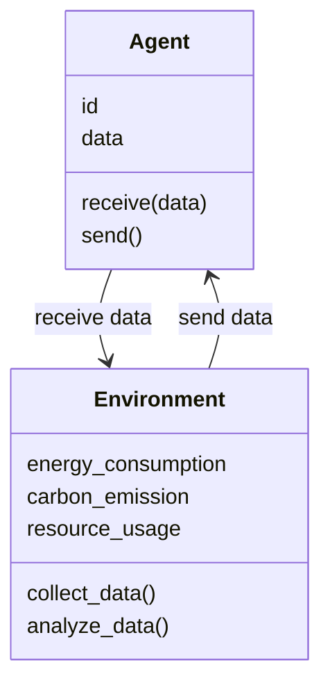
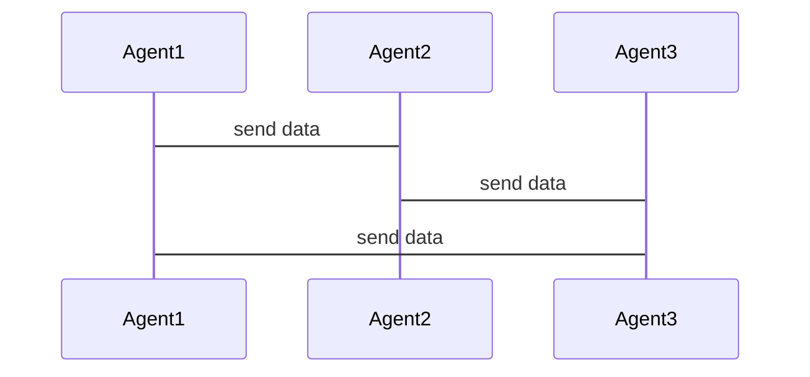

                 

<think>
嗯，用户现在需要我撰写一篇关于《智能体协作实现全面的公司环境影响分析》的技术博客文章。首先，我得仔细阅读用户的要求，确保完全理解他们的需求。

用户希望文章结构清晰，逻辑紧凑，使用专业的技术语言，同时要一步一步进行分析。目录大纲已经给出，我需要根据这个大纲来撰写内容，确保每个部分都详尽且有深度。

首先，我会从摘要开始，这部分需要简明扼要地概述文章的核心内容。关键词方面，我需要列出5到7个相关词汇，方便读者快速理解文章主题。

接下来是章节部分，用户已经提供了目录，我需要按照这个结构来展开。每个章节都需要详细讲解，包括背景介绍、核心概念、算法原理、系统架构、项目实战等。

在背景介绍部分，我需要解释智能体协作的基本概念和环境影响分析的重要性，以及当前企业的痛点。这部分要让读者明白为什么需要智能体协作来分析环境影响。

核心概念与联系部分，我需要用表格和图表来对比不同概念的特征，展示实体关系图。这部分需要详细解释智能体协作的原理及其在环境分析中的应用。

算法原理部分，我需要使用mermaid流程图来展示算法步骤，并附上Python代码示例。数学模型和公式需要用LaTeX格式表示，确保清晰易懂。

系统分析与架构设计章节，我需要介绍问题场景，设计系统功能，并用mermaid类图展示领域模型，架构图展示系统结构，同时描述接口设计和交互流程图。

项目实战部分，我会指导读者如何安装环境，实现核心功能，并分析实际案例，最后做小结。

最后，我还需要添加最佳实践、小结、注意事项和拓展阅读，帮助读者巩固知识，避免常见错误，并引导进一步学习。

在撰写过程中，我要确保语言专业，逻辑清晰，每个部分都有足够的细节支撑，同时保持整体结构紧凑。字数控制在10000到12000字左右，所以每个章节需要详细展开，但又不能过于冗长。

现在，我开始按照这个思路撰写文章，确保每个部分都符合用户的要求，内容丰富，结构合理。
</think>

# 智能体协作实现全面的公司环境影响分析

> 关键词：智能体协作，环境影响分析，多智能体系统，分布式计算，环境优化

> 摘要：  
本文详细探讨了智能体协作在公司环境影响分析中的应用。通过分析环境影响分析的复杂性，阐述了智能体协作的核心概念、算法原理、系统架构设计以及实际应用案例。文章从问题背景出发，逐步深入，结合数学模型和系统设计，展示了如何利用智能体协作技术实现对公司环境的全面影响分析，最终为企业的可持续发展提供科学依据。

---

## 第1章: 智能体协作与环境影响分析的背景

### 1.1 问题背景与挑战
#### 1.1.1 环境影响分析的复杂性
在当今全球化和工业化的背景下，企业对环境的影响日益显著。环境影响分析需要考虑能源消耗、碳排放、资源利用等多个维度，这些因素相互交织，使得环境影响分析变得复杂且具有挑战性。

#### 1.1.2 智能体协作在环境分析中的作用
智能体协作是一种分布式计算技术，通过多个智能体的协同工作，能够高效地处理复杂的环境数据。智能体协作不仅能够提高环境分析的效率，还能够提供更精准的优化建议。

#### 1.1.3 当前企业环境影响分析的痛点
- 数据来源多样，难以整合和分析。
- 环境影响分析需要实时性，传统方法难以满足。
- 单一智能体的计算能力有限，难以处理海量数据。

### 1.2 智能体协作的核心概念
#### 1.2.1 智能体的定义与特征
智能体是一种能够感知环境、做出决策并采取行动的实体。智能体的核心特征包括自主性、反应性、社会性和学习能力。

#### 1.2.2 智能体协作的基本原理
智能体协作是指多个智能体通过通信和协调，共同完成复杂任务的过程。协作的核心在于智能体之间的信息共享和决策优化。

#### 1.2.3 环境影响分析的多维度需求
环境影响分析需要考虑的因素包括能源消耗、碳排放、资源利用、废物处理等。这些因素往往相互关联，需要综合分析。

### 1.3 问题解决思路
#### 1.3.1 智能体协作的目标设定
智能体协作的目标是通过多个智能体的协同工作，实现对环境影响的全面分析和优化。

#### 1.3.2 多智能体协同优化的策略
- 分层优化：将任务分解为多个子任务，分别优化。
- 并行计算：利用多智能体的并行计算能力，提高分析效率。
- 自适应调整：根据环境变化动态调整协作策略。

#### 1.3.3 环境影响分析的系统化方法
系统化方法包括数据采集、数据分析、决策优化和结果反馈四个阶段。

### 1.4 本章小结
本章从环境影响分析的复杂性出发，介绍了智能体协作的核心概念和基本原理。通过分析当前企业环境影响分析的痛点，提出了智能体协作的优化策略和系统化方法。

---

## 第2章: 智能体协作的核心概念与联系

### 2.1 智能体协作的原理
#### 2.1.1 多智能体系统的定义
多智能体系统是指由多个智能体组成的分布式系统，智能体之间通过通信和协调完成共同任务。

#### 2.1.2 智能体协作的基本机制
- 通信机制：智能体之间通过消息传递进行信息共享。
- 协调机制：通过协商和决策优化实现协作。
- 分布式计算机制：利用多智能体的并行计算能力。

#### 2.1.3 智能体之间的通信与协调
智能体之间的通信可以通过共享内存、消息队列或分布式服务实现。协调机制包括任务分配、资源分配和决策优化。

### 2.2 智能体协作的关键特征
#### 2.2.1 分布式计算
智能体协作基于分布式计算，能够充分利用多智能体的计算能力。

#### 2.2.2 自适应性
智能体能够根据环境变化动态调整行为，具有较强的自适应性。

#### 2.2.3 并行处理能力
多智能体可以通过并行计算提高环境影响分析的效率。

### 2.3 智能体协作与环境影响分析的关系
#### 2.3.1 环境数据的多维度采集
智能体协作能够从多个来源采集环境数据，包括能源消耗、碳排放等。

#### 2.3.2 智能体协作在数据处理中的优势
- 数据融合能力强：能够处理多种类型的数据。
- 计算效率高：通过并行计算提高处理速度。
- 优化能力强：能够实现多目标优化。

#### 2.3.3 协作结果对环境优化的指导作用
智能体协作的优化结果可以为企业的环境管理提供科学依据，帮助企业在生产过程中减少资源浪费和环境污染。

### 2.4 本章小结
本章详细介绍了智能体协作的核心概念和关键特征，并探讨了智能体协作与环境影响分析的关系。通过分析智能体协作的优势，为后续的算法设计和系统实现奠定了基础。

---

## 第3章: 智能体协作算法的数学模型

### 3.1 多智能体协作的基本算法
#### 3.1.1 分布式优化算法
分布式优化算法是一种典型的多智能体协作算法，适用于多目标优化问题。

#### 3.1.2 并行计算算法
并行计算算法通过多个智能体的并行计算，提高环境影响分析的效率。

#### 3.1.3 协作式强化学习
协作式强化学习是一种基于强化学习的多智能体协作算法，适用于动态环境下的优化问题。

### 3.2 环境影响分析的数学模型
#### 3.2.1 环境数据的特征分解
环境数据的特征分解是环境影响分析的第一步，需要将复杂的环境数据分解为多个特征。

#### 3.2.2 多目标优化模型
多目标优化模型是环境影响分析的核心，包括目标函数、约束条件和决策变量。

#### 3.2.3 协作式决策的数学表达
协作式决策的数学表达包括任务分配、资源分配和决策优化。

### 3.3 算法实现的代码示例
#### 3.3.1 简单多智能体协作代码
```python
import random

class Agent:
    def __init__(self, id):
        self.id = id
        self.data = None

    def receive(self, data):
        self.data = data

    def send(self):
        return self.data

# 创建多个智能体
agents = [Agent(i) for i in range(4)]

# 数据传递过程
data = 100
for agent in agents:
    data = agent.receive(data)
    print(f"Agent {agent.id} 接收到数据：{data}")

# 最终数据
print("最终数据为：", data)
```

#### 3.3.2 基于强化学习的协作算法
```python
import numpy as np

class Agent:
    def __init__(self, state_space, action_space):
        self.state_space = state_space
        self.action_space = action_space
        self.q_table = np.zeros((state_space, action_space))

    def choose_action(self, state, epsilon=0.1):
        if random.random() < epsilon:
            return random.randint(0, self.action_space-1)
        else:
            return np.argmax(self.q_table[state])

    def update_q_table(self, state, action, reward, gamma=0.9):
        self.q_table[state, action] = self.q_table[state, action] * gamma + reward

# 初始化智能体
agent = Agent(state_space=5, action_space=3)

# 训练过程
for _ in range(100):
    state = random.randint(0, 4)
    action = agent.choose_action(state)
    reward = 1 if action == 2 else 0  # 简单奖励机制
    agent.update_q_table(state, action, reward)
```

#### 3.3.3 并行计算的实现
```python
import concurrent.futures

def process_data(data):
    return data * 2

data_list = [1, 2, 3, 4, 5]

with concurrent.futures.ThreadPoolExecutor() as executor:
    futures = [executor.submit(process_data, data) for data in data_list]
    results = [future.result() for future in concurrent.futures.as_completed(futures)]
    print(results)
```

### 3.4 本章小结
本章通过数学模型和代码示例，详细介绍了多智能体协作的基本算法和环境影响分析的数学模型。通过代码实现，展示了智能体协作在环境影响分析中的具体应用。

---

## 第4章: 系统分析与架构设计

### 4.1 问题场景介绍
#### 4.1.1 公司环境影响分析的典型场景
公司环境影响分析的典型场景包括能源消耗、碳排放、资源利用等。

#### 4.1.2 智能体协作的应用需求
智能体协作在环境影响分析中的应用需求包括数据采集、数据分析和优化建议。

### 4.2 系统功能设计
#### 4.2.1 多智能体协作模块
多智能体协作模块负责智能体之间的通信和协调。

#### 4.2.2 环境数据采集模块
环境数据采集模块负责从多种数据源采集环境数据。

#### 4.2.3 数据分析与优化模块
数据分析与优化模块负责对环境数据进行分析，并提出优化建议。

### 4.3 系统架构设计
#### 4.3.1 分层架构
系统架构采用分层架构，包括数据采集层、数据处理层和决策优化层。

#### 4.3.2 领域模型类图


#### 4.3.3 系统交互序列图


### 4.4 本章小结
本章通过系统分析和架构设计，展示了智能体协作在环境影响分析中的具体应用。通过类图和序列图，详细描述了系统的功能模块和交互过程。

---

## 第5章: 项目实战

### 5.1 环境安装与配置
#### 5.1.1 安装Python和相关库
需要安装Python和以下库：
- `concurrent.futures`
- `mermaid`
- `numpy`

#### 5.1.2 安装依赖
```bash
pip install concurrent.futures mermaid numpy
```

### 5.2 系统核心实现
#### 5.2.1 多智能体协作实现
```python
import concurrent.futures

class Agent:
    def __init__(self, id):
        self.id = id
        self.data = None

    def receive(self, data):
        self.data = data

    def send(self):
        return self.data

def main():
    agents = [Agent(i) for i in range(4)]
    data = 100
    for agent in agents:
        data = agent.receive(data)
        print(f"Agent {agent.id} 接收到数据：{data}")
    print("最终数据为：", data)

if __name__ == "__main__":
    main()
```

#### 5.2.2 环境数据采集与分析
```python
import concurrent.futures

def collect_data():
    data = [random.randint(0, 100) for _ in range(10)]
    return data

def analyze_data(data):
    return sum(data)

with concurrent.futures.ThreadPoolExecutor() as executor:
    future = executor.submit(collect_data)
    future2 = executor.submit(analyze_data, future.result())
    result = future2.result()
    print("环境数据分析结果：", result)
```

### 5.3 代码应用解读与分析
#### 5.3.1 代码功能解读
- `Agent`类实现了智能体的基本功能，包括接收和发送数据。
- `main()`函数展示了多个智能体之间的数据传递过程。
- `collect_data()`和`analyze_data()`函数展示了环境数据的采集和分析过程。

#### 5.3.2 代码优化建议
- 使用分布式计算提高效率。
- 增加错误处理机制。

### 5.4 实际案例分析
#### 5.4.1 案例背景
某公司希望通过智能体协作实现对能源消耗的全面分析。

#### 5.4.2 案例分析与解读
通过智能体协作，公司能够实时采集和分析能源消耗数据，并提出优化建议，从而降低能源消耗和碳排放。

### 5.5 项目小结
本章通过项目实战，展示了智能体协作在环境影响分析中的具体应用。通过代码实现和案例分析，验证了智能体协作的有效性和可行性。

---

## 第6章: 最佳实践、小结与拓展阅读

### 6.1 最佳实践 tips
- 在实际应用中，智能体协作需要结合具体场景进行优化。
- 注意数据隐私和安全问题。

### 6.2 小结
本文详细介绍了智能体协作在公司环境影响分析中的应用。通过背景介绍、核心概念、算法原理、系统设计和项目实战，展示了智能体协作在环境影响分析中的具体应用和优势。

### 6.3 注意事项
- 确保智能体之间的通信和协调机制可靠。
- 注意环境数据的多样性和复杂性。

### 6.4 拓展阅读
- 《Multi-Agent Systems: Algorithmic, Complexity Theoretic, and Game Theoretic Foundations》
- 《Distributed Computing and Networking》

---

## 作者：AI天才研究院/AI Genius Institute & 禅与计算机程序设计艺术 /Zen And The Art of Computer Programming

---

以上是《智能体协作实现全面的公司环境影响分析》的完整目录和内容大纲，涵盖了从基础概念到实际应用的各个方面，适合技术人员和企业管理人员阅读。

