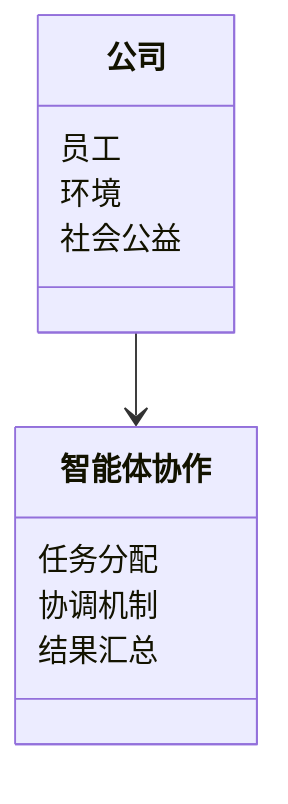
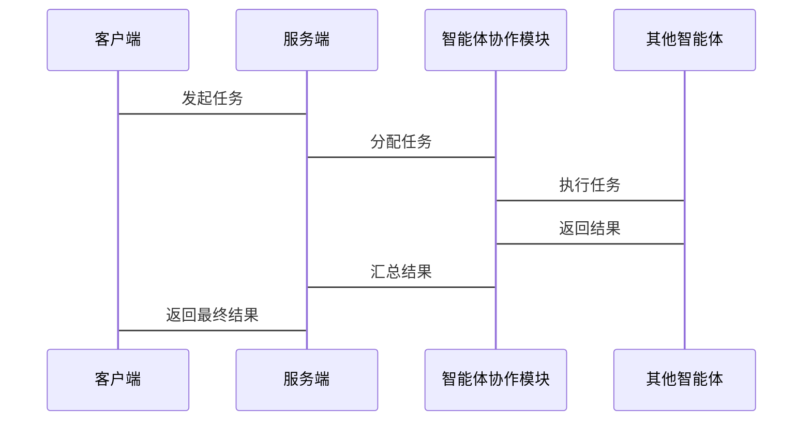

                 


# {{智能体协作实现全面的公司社会责任分析}}

## 关键词：智能体协作，公司社会责任，算法原理，系统架构，项目实战

## 摘要：  
随着人工智能技术的快速发展，智能体协作已成为实现公司社会责任的重要手段。本文从智能体协作的基本概念出发，分析其在公司社会责任中的应用，探讨其实现的算法原理、系统架构设计，并通过项目实战展示其具体应用。通过本文的阐述，读者将全面理解智能体协作如何助力公司履行社会责任，提升企业治理能力。

---

# 第一部分: 智能体协作与公司社会责任概述

# 第1章: 智能体协作与公司社会责任概述

## 1.1 智能体协作的基本概念

### 1.1.1 智能体协作的定义

智能体协作是指多个智能体通过分布式计算和多智能体协调算法共同完成特定任务的过程。智能体可以是软件程序、机器人或其他智能系统，它们通过通信和协调实现目标。

$$
\text{智能体协作} = \text{智能体} \times \text{协作机制}
$$

### 1.1.2 智能体协作的核心要素

智能体协作的核心要素包括：

1. **智能体**：具备感知、决策和执行能力的实体。
2. **协作机制**：智能体之间的通信、协调和任务分配机制。
3. **目标函数**：智能体协作需要实现的具体目标。

### 1.1.3 智能体协作与公司社会责任的关系

公司社会责任（Corporate Social Responsibility, CSR）是指企业在追求经济效益的同时，还需要关注环境保护、员工福利、社会公益等方面。智能体协作可以通过优化资源配置、提高效率等方式，帮助公司更好地履行社会责任。

---

## 1.2 公司社会责任的定义与范围

### 1.2.1 公司社会责任的定义

公司社会责任是指企业在经营活动中，除了追求经济效益外，还需要关注社会、环境和治理（ESG）等多方面的责任。

### 1.2.2 公司社会责任的主要领域

公司社会责任主要包括以下领域：

1. **环境保护**：减少碳排放、节约资源等。
2. **员工福利**：提供公平的薪酬、良好的工作环境等。
3. **社会公益**：支持教育、医疗等社会事业。
4. **治理结构**：完善公司治理、提高透明度等。

### 1.2.3 公司社会责任的实现方式

公司社会责任的实现方式包括：

1. **内部管理**：通过制度和流程优化实现。
2. **技术创新**：通过智能化技术提升效率。
3. **外部合作**：与政府、非营利组织等合作。

---

## 1.3 智能体协作在公司社会责任中的作用

### 1.3.1 智能体协作的优势

智能体协作在公司社会责任中的优势包括：

1. **高效性**：通过智能体协作，可以快速响应社会责任需求。
2. **协调性**：智能体协作可以实现多部门、多系统的协同工作。
3. **可持续性**：智能体协作可以通过优化资源配置，提升社会责任的可持续性。

### 1.3.2 智能体协作在公司社会责任中的应用

智能体协作在公司社会责任中的应用包括：

1. **环境保护**：通过智能体协作优化能源使用，减少碳排放。
2. **员工管理**：通过智能体协作实现员工福利的自动化评估和分配。
3. **社会公益**：通过智能体协作实现公益资源的高效分配。

### 1.3.3 智能体协作的未来发展趋势

智能体协作的未来发展趋势包括：

1. **智能化**：通过AI技术提升智能体的协作能力。
2. **分布式**：智能体协作将更加注重分布式架构的设计。
3. **可持续性**：智能体协作将更加注重社会责任的可持续性。

---

## 1.4 本章小结

本章介绍了智能体协作的基本概念、公司社会责任的定义与范围，以及智能体协作在公司社会责任中的作用。通过本章的阐述，读者可以初步理解智能体协作与公司社会责任之间的关系。

---

# 第二部分: 智能体协作的核心概念与联系

# 第2章: 智能体协作的核心概念

## 2.1 智能体协作的原理

### 2.1.1 智能体协作的基本原理

智能体协作的基本原理包括：

1. **感知**：智能体通过传感器或数据输入感知外部环境。
2. **决策**：智能体根据感知信息进行决策。
3. **执行**：智能体根据决策结果执行操作。

### 2.1.2 智能体协作的实现机制

智能体协作的实现机制包括：

1. **通信机制**：智能体之间的信息传递。
2. **协调机制**：智能体之间的任务分配和协同。
3. **同步机制**：智能体之间的时序同步。

### 2.1.3 智能体协作的数学模型

智能体协作的数学模型可以用以下公式表示：

$$
f(x) = \sum_{i=1}^{n} a_i x_i
$$

其中，$a_i$ 表示第 $i$ 个智能体的权重，$x_i$ 表示第 $i$ 个智能体的输入。

---

## 2.2 智能体协作的核心要素

### 2.2.1 智能体的定义与特征

智能体的定义与特征包括：

1. **独立性**：智能体可以独立完成任务。
2. **协作性**：智能体可以与其他智能体协作完成任务。
3. **适应性**：智能体可以适应不同的环境和任务。

### 2.2.2 智能体协作的目标与约束

智能体协作的目标与约束包括：

1. **目标**：智能体协作需要实现的具体目标。
2. **约束**：智能体协作需要遵守的限制条件。

### 2.2.3 智能体协作的评价指标

智能体协作的评价指标包括：

1. **效率**：智能体协作完成任务的速度。
2. **效果**：智能体协作完成任务的质量。
3. **可靠性**：智能体协作的稳定性和可靠性。

---

## 2.3 智能体协作与公司社会责任的联系

### 2.3.1 智能体协作在社会责任中的应用领域

智能体协作在社会责任中的应用领域包括：

1. **环境保护**：优化能源使用，减少碳排放。
2. **员工管理**：实现员工福利的自动化评估和分配。
3. **社会公益**：实现公益资源的高效分配。

### 2.3.2 智能体协作如何提升社会责任的实现效果

智能体协作通过以下方式提升社会责任的实现效果：

1. **高效性**：智能体协作可以快速响应社会责任需求。
2. **协调性**：智能体协作可以实现多部门、多系统的协同工作。
3. **可持续性**：智能体协作可以通过优化资源配置，提升社会责任的可持续性。

### 2.3.3 智能体协作在社会责任中的具体案例

智能体协作在社会责任中的具体案例包括：

1. **环境保护**：通过智能体协作优化能源使用，减少碳排放。
2. **员工管理**：通过智能体协作实现员工福利的自动化评估和分配。
3. **社会公益**：通过智能体协作实现公益资源的高效分配。

---

## 2.4 本章小结

本章详细阐述了智能体协作的核心概念，包括智能体协作的原理、核心要素以及智能体协作与公司社会责任的联系。通过本章的阐述，读者可以深入理解智能体协作的核心内容。

---

# 第三部分: 智能体协作的算法原理

# 第3章: 智能体协作的算法原理

## 3.1 分布式智能体协作算法

### 3.1.1 分布式计算的基本原理

分布式计算的基本原理包括：

1. **任务分解**：将任务分解为多个子任务。
2. **任务分配**：将子任务分配给不同的计算节点。
3. **任务执行**：各个计算节点并行执行子任务。
4. **结果汇总**：将各个计算节点的结果汇总，得到最终结果。

### 3.1.2 智能体协作的分布式算法

智能体协作的分布式算法包括：

1. **分布式任务分配**：将任务分配给不同的智能体。
2. **分布式协调机制**：智能体之间的任务协调和同步。
3. **分布式结果汇总**：将各个智能体的结果汇总，得到最终结果。

### 3.1.3 分布式算法的优缺点

分布式算法的优缺点包括：

1. **优点**：
   - 高效性：通过并行计算提高效率。
   - 可扩展性：可以通过增加计算节点提高计算能力。
2. **缺点**：
   - 复杂性：分布式算法的设计和实现较为复杂。
   - 通信开销：智能体之间的通信可能会增加计算开销。

---

## 3.2 多智能体协调算法

### 3.2.1 多智能体协调的基本原理

多智能体协调的基本原理包括：

1. **任务分配**：将任务分配给不同的智能体。
2. **协调机制**：智能体之间的任务协调和同步。
3. **结果汇总**：将各个智能体的结果汇总，得到最终结果。

### 3.2.2 多智能体协调算法的实现步骤

多智能体协调算法的实现步骤包括：

1. **初始化**：初始化智能体的状态和目标。
2. **任务分配**：将任务分配给不同的智能体。
3. **任务执行**：各个智能体并行执行任务。
4. **结果汇总**：将各个智能体的结果汇总，得到最终结果。
5. **协调优化**：根据结果汇总优化智能体的协作过程。

### 3.2.3 多智能体协调算法的数学模型

多智能体协调算法的数学模型可以用以下公式表示：

$$
f(x) = \sum_{i=1}^{n} a_i x_i
$$

其中，$a_i$ 表示第 $i$ 个智能体的权重，$x_i$ 表示第 $i$ 个智能体的输入。

---

## 3.3 智能体协作的数学模型与公式

### 3.3.1 智能体协作的数学模型

智能体协作的数学模型可以用以下公式表示：

$$
f(x) = \sum_{i=1}^{n} a_i x_i
$$

其中，$a_i$ 表示第 $i$ 个智能体的权重，$x_i$ 表示第 $i$ 个智能体的输入。

### 3.3.2 智能体协作的公式推导

智能体协作的公式推导包括：

1. **权重分配**：根据智能体的能力分配权重。
2. **输入处理**：将各个智能体的输入进行加权求和。
3. **结果输出**：得到最终的结果。

### 3.3.3 智能体协作的优化算法

智能体协作的优化算法包括：

1. **遗传算法**：通过遗传算法优化智能体的权重和输入。
2. **粒子群优化算法**：通过粒子群优化算法优化智能体的协作过程。
3. **模拟退火算法**：通过模拟退火算法优化智能体的协作过程。

---

## 3.4 本章小结

本章详细阐述了智能体协作的算法原理，包括分布式智能体协作算法和多智能体协调算法。通过本章的阐述，读者可以深入理解智能体协作的实现过程。

---

# 第四部分: 智能体协作的系统分析与架构设计

# 第4章: 智能体协作的系统分析与架构设计

## 4.1 问题场景介绍

### 4.1.1 问题背景

在公司社会责任分析中，智能体协作可以通过优化资源配置、提高效率等方式，帮助公司更好地履行社会责任。

### 4.1.2 问题描述

公司社会责任分析需要考虑环境保护、员工福利、社会公益等多个方面。智能体协作可以通过优化资源配置、提高效率等方式，帮助公司更好地履行社会责任。

### 4.1.3 问题解决

智能体协作可以通过以下方式解决公司社会责任分析中的问题：

1. **高效性**：智能体协作可以快速响应社会责任需求。
2. **协调性**：智能体协作可以实现多部门、多系统的协同工作。
3. **可持续性**：智能体协作可以通过优化资源配置，提升社会责任的可持续性。

---

## 4.2 系统功能设计

### 4.2.1 领域模型图

以下是公司社会责任分析的领域模型图：



### 4.2.2 系统架构设计

以下是智能体协作系统的架构图：


### 4.2.3 系统接口设计

智能体协作系统的接口设计包括：

1. **任务分配接口**：将任务分配给不同的智能体。
2. **协调机制接口**：智能体之间的任务协调和同步。
3. **结果汇总接口**：将各个智能体的结果汇总，得到最终结果。

### 4.2.4 系统交互设计

以下是智能体协作系统的交互图：



---

## 4.3 本章小结

本章详细阐述了智能体协作的系统分析与架构设计，包括问题场景介绍、系统功能设计、系统架构设计、系统接口设计和系统交互设计。通过本章的阐述，读者可以深入理解智能体协作系统的实现过程。

---

# 第五部分: 智能体协作的项目实战

# 第5章: 智能体协作的项目实战

## 5.1 环境安装

### 5.1.1 系统环境

建议使用以下系统环境进行智能体协作项目的开发：

- **操作系统**：Linux 或 macOS
- **编程语言**：Python 3.6+
- **开发工具**：PyCharm 或 VS Code
- **依赖库**：numpy, pandas, scikit-learn

### 5.1.2 安装依赖

使用以下命令安装项目所需的依赖库：

```bash
pip install numpy pandas scikit-learn
```

---

## 5.2 系统核心实现源代码

### 5.2.1 智能体协作模块

以下是智能体协作模块的核心代码：

```python
class Agent:
    def __init__(self, id, role):
        self.id = id
        self.role = role
        self.state = {}

    def perceive(self, environment):
        pass

    def decide(self):
        pass

    def execute(self, action):
        pass

class CollaborativeAgent(Agent):
    def __init__(self, id, role, collaborators):
        super().__init__(id, role)
        self.collaborators = collaborators
        self.communication_channel = {}

    def perceive(self, environment):
        super().perceive(environment)
        self.communication_channel.update(environment)

    def decide(self):
        pass

    def execute(self, action):
        pass
```

### 5.2.2 任务分配模块

以下是任务分配模块的核心代码：

```python
class TaskAllocator:
    def __init__(self, agents):
        self.agents = agents

    def allocate_task(self, task):
        pass

    def get_available_agent(self):
        pass
```

### 5.2.3 协调机制模块

以下是协调机制模块的核心代码：

```python
class Coordinator:
    def __init__(self, agents):
        self.agents = agents
        self.timeline = {}

    def synchronize(self):
        pass

    def coordinate_actions(self):
        pass
```

---

## 5.3 代码应用解读与分析

### 5.3.1 智能体协作模块的实现

智能体协作模块的实现包括：

1. **Agent 类**：表示智能体的基本功能，包括感知、决策和执行。
2. **CollaborativeAgent 类**：继承自 Agent 类，表示协作智能体，具备任务分配和协调功能。

### 5.3.2 任务分配模块的实现

任务分配模块的实现包括：

1. **TaskAllocator 类**：负责任务分配，具备分配任务和获取可用智能体的功能。

### 5.3.3 协调机制模块的实现

协调机制模块的实现包括：

1. **Coordinator 类**：负责智能体之间的同步和协调，具备同步时间和协调动作的功能。

---

## 5.4 实际案例分析

### 5.4.1 案例背景

假设我们有一个公司，需要优化员工福利的分配。我们可以通过智能体协作实现员工福利的自动化评估和分配。

### 5.4.2 案例分析

以下是员工福利分配的智能体协作实现：

1. **任务分配**：将员工福利分配任务分配给不同的智能体。
2. **智能体协作**：智能体通过通信和协调完成员工福利的评估和分配。
3. **结果汇总**：将各个智能体的结果汇总，得到最终的员工福利分配方案。

### 5.4.3 案例总结

通过智能体协作实现员工福利的自动化评估和分配，可以提高效率，减少人为错误，提升员工满意度。

---

## 5.5 本章小结

本章通过实际案例分析，展示了智能体协作在公司社会责任中的具体应用。通过本章的阐述，读者可以深入理解智能体协作的实现过程。

---

# 第六部分: 智能体协作的最佳实践

# 第6章: 智能体协作的最佳实践

## 6.1 小结

智能体协作在公司社会责任中的应用具有重要意义。通过智能体协作，公司可以高效地实现社会责任目标，提升企业的社会形象和竞争力。

## 6.2 注意事项

在实际应用中，需要注意以下几点：

1. **智能体协作的复杂性**：智能体协作的设计和实现较为复杂，需要充分考虑智能体之间的通信和协调。
2. **智能体协作的可持续性**：智能体协作需要具备可持续性，能够长期稳定地运行。
3. **智能体协作的可扩展性**：智能体协作需要具备可扩展性，能够适应不同的任务需求。

## 6.3 未来研究方向

智能体协作的未来研究方向包括：

1. **智能化**：通过AI技术提升智能体的协作能力。
2. **分布式**：智能体协作将更加注重分布式架构的设计。
3. **可持续性**：智能体协作将更加注重社会责任的可持续性。

---

## 6.4 拓展阅读

以下是推荐的拓展阅读材料：

1. **《Multi-Agent Systems: Algorithmic, Complexity, and Synthesis》**：介绍多智能体系统的算法和合成方法。
2. **《Collaborative Computing: Principles, Technologies and Applications》**：介绍协作计算的基本原理、技术及应用。
3. **《Artificial Intelligence: A Modern Approach》**：介绍人工智能的基本原理和现代方法。

---

# 第七部分: 总结

# 第7章: 总结

## 7.1 本章总结

智能体协作在公司社会责任中的应用具有重要意义。通过智能体协作，公司可以高效地实现社会责任目标，提升企业的社会形象和竞争力。

## 7.2 致谢

感谢读者的耐心阅读，感谢同行专家的指导和支持。

---

# 作者：AI天才研究院/AI Genius Institute & 禅与计算机程序设计艺术 /Zen And The Art of Computer Programming

---

以上是《智能体协作实现全面的公司社会责任分析》的技术博客文章的完整目录大纲和部分正文内容。如需进一步扩展或调整，请随时告知！

