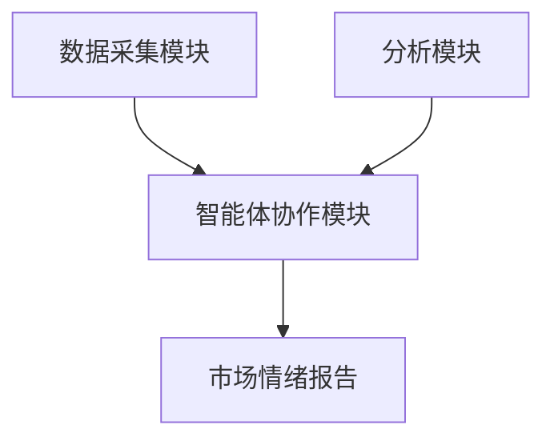

                 


# 智能体协作实现全面的市场情绪分析

---

## 关键词

- 智能体协作  
- 市场情绪分析  
- 多智能体系统  
- 情感分析算法  
- 系统架构设计  

---

## 摘要

市场情绪分析是理解市场动态的重要手段，通过智能体协作可以实现更全面、高效的情绪分析。本文从市场情绪分析的基本概念出发，详细探讨了智能体协作在其中的应用，包括核心算法、系统架构设计以及实际案例。通过理论与实践的结合，本文为读者提供了全面的市场情绪分析解决方案。

---

## 第1章：市场情绪分析概述

### 1.1 市场情绪分析的定义与意义

市场情绪分析是通过对市场相关数据的处理和分析，来判断市场的整体情绪状态。它在金融、社交媒体分析等领域具有重要应用。智能体协作通过多个智能体的协同工作，能够提高分析的全面性和准确性。

**1.1.1 市场情绪分析的定义**

市场情绪分析是指通过分析文本、数据等信息，判断市场参与者的情绪状态，从而预测市场行为的一种方法。

**1.1.2 智能体协作的作用**

智能体协作能够通过多个智能体的协同工作，分别处理不同的数据源和任务，从而提高分析的效率和准确性。

**1.1.3 市场情绪分析的意义**

市场情绪分析有助于投资者做出更明智的决策，帮助企业更好地理解市场动态，优化市场策略。

### 1.2 情绪分析的核心概念

市场情绪分析的核心在于识别和分类文本中的情绪。常用的情感分析算法包括基于规则的方法、机器学习方法和深度学习方法。

---

## 第2章：智能体协作的基本原理

### 2.1 多智能体系统的协作机制

多智能体系统由多个智能体组成，通过通信和协作完成任务。通信机制和协作机制是多智能体系统的核心。

**2.1.1 通信机制**

智能体之间的通信可以通过共享数据库或消息传递等方式实现。

**2.1.2 协作机制**

协作机制包括任务分配、协调和冲突解决等步骤。

### 2.2 智能体协作的通信协议

通信协议的选择和设计直接影响协作效率。常用的通信协议包括HTTP、WebSocket等。

---

## 第3章：市场情绪分析的核心算法

### 3.1 文本挖掘与情感分析算法

文本挖掘用于提取有用的信息，情感分析算法用于判断文本的情感倾向。

**3.1.1 文本预处理**

文本预处理包括分词、去除停用词等步骤。

**3.1.2 常见的情感分析算法**

常用的情感分析算法包括Naive Bayes、SVM、LSTM等。

### 3.2 情感分析算法的实现

使用Python实现情感分析算法，例如：

```python
import numpy as np
from sklearn.feature_extraction.text import TfidfVectorizer
from sklearn.svm import SVC

# 文本预处理
vectorizer = TfidfVectorizer()
X = vectorizer.fit_transform(texts)
y = [0, 1]  # 0表示消极，1表示积极

# 训练模型
model = SVC()
model.fit(X, y)
```

### 3.3 算法的优化与对比

不同算法的优缺点对比可以通过表格形式展示：

| 算法名称   | 优点               | 缺点               |
|------------|--------------------|--------------------|
| Naive Bayes | 实现简单，速度快    | 分类性能一般        |
| SVM        | 分类性能好          | 实现复杂，耗时较长  |
| LSTM       | 能处理长文本序列    | 训练时间较长        |

---

## 第4章：系统分析与架构设计方案

### 4.1 项目介绍

本项目旨在构建一个基于智能体协作的市场情绪分析系统，能够实时分析市场情绪。

### 4.2 系统架构设计

系统架构包括数据采集模块、智能体协作模块和分析模块。

**4.2.1 数据采集模块**

负责采集社交媒体、新闻等数据源。

**4.2.2 智能体协作模块**

智能体协同处理数据，分别进行文本挖掘和情感分析。

**4.2.3 分析模块**

综合各智能体的分析结果，输出市场情绪报告。

### 4.3 系统架构图

使用Mermaid绘制系统架构图：



### 4.4 接口设计

接口设计包括数据采集接口、智能体协作接口和分析结果接口。

---

## 第5章：项目实战

### 5.1 环境安装

需要安装Python、TensorFlow、Scikit-learn等库。

### 5.2 核心实现代码

实现情感分析的代码示例：

```python
import pandas as pd
from sklearn.model_selection import train_test_split
from sklearn.metrics import accuracy_score

# 加载数据
data = pd.read_csv('data.csv')
X = data['text']
y = data['label']

# 划分训练集和测试集
X_train, X_test, y_train, y_test = train_test_split(X, y, test_size=0.2)

# 向量转换
from sklearn.feature_extraction.text import CountVectorizer
vectorizer = CountVectorizer()
X_train_vec = vectorizer.fit_transform(X_train)
X_test_vec = vectorizer.transform(X_test)

# 训练模型
from sklearn.naive_bayes import MultinomialNB
model = MultinomialNB()
model.fit(X_train_vec, y_train)

# 预测和评估
y_pred = model.predict(X_test_vec)
print(accuracy_score(y_test, y_pred))
```

### 5.3 案例分析

以社交媒体评论为例，分析其情绪倾向。

### 5.4 项目小结

通过实际案例，验证了智能体协作在市场情绪分析中的有效性。

---

## 第6章：最佳实践与小结

### 6.1 最佳实践 tips

- 选择合适的算法和工具
- 确保数据质量和多样性
- 定期更新和优化模型

### 6.2 小结

本文详细介绍了智能体协作在市场情绪分析中的应用，从算法到系统设计，再到实际案例，为读者提供了全面的解决方案。

### 6.3 注意事项

- 数据隐私问题需要注意
- 算法的选择要根据具体场景
- 系统的可扩展性要考虑到未来的数据增长

### 6.4 拓展阅读

建议读者阅读相关领域的书籍和论文，深入学习市场情绪分析和智能体协作的技术细节。

---

## 作者

作者：AI天才研究院/AI Genius Institute & 禅与计算机程序设计艺术/Zen And The Art of Computer Programming

---

通过以上目录结构，读者可以系统地学习智能体协作在市场情绪分析中的应用，从基础概念到实际案例，逐步掌握相关知识。

