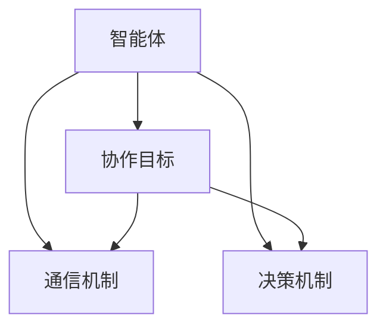
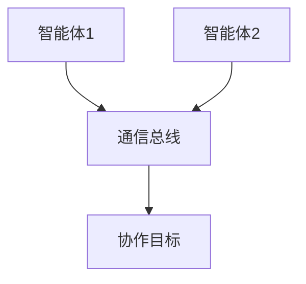
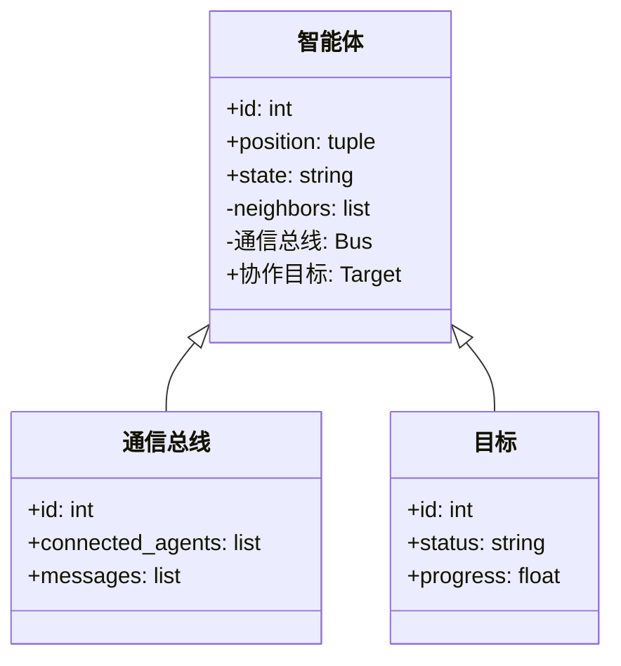
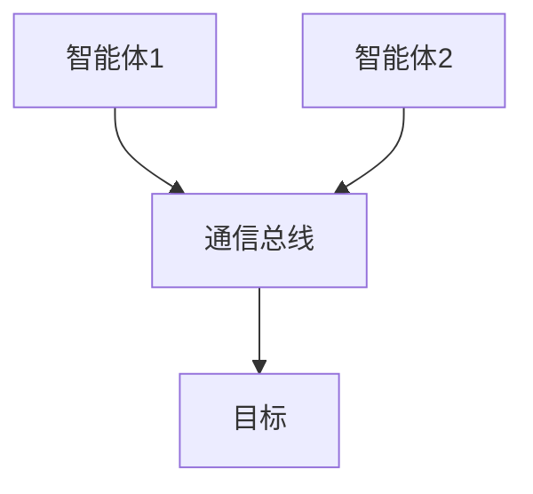
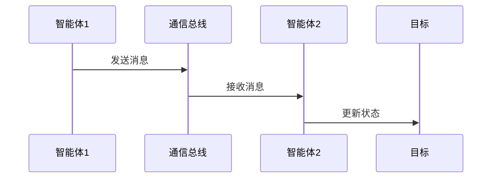
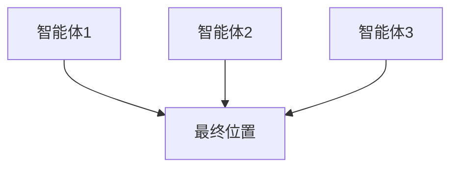

                 

<think>
好，我需要帮用户撰写一篇关于《智能体协作实现全面的竞争优势分析》的技术博客文章。用户希望文章结构清晰，内容详实，符合技术博客的风格，并且包含背景介绍、核心概念、算法原理、系统架构设计、项目实战等部分。

首先，我应该先理解用户的需求。用户希望文章涵盖智能体协作的各个方面，从基本概念到实际应用，帮助读者全面理解智能体协作的优势和实现方法。文章需要逻辑清晰，结构紧凑，同时使用专业的技术语言，但又不失简单易懂。

接下来，我会按照用户提供的目录大纲来组织内容。首先是背景介绍，我需要解释智能体协作的核心概念、背景和必要性，以及它带来的竞争优势。这部分需要让读者明白为什么智能体协作重要，以及当前的发展趋势。

然后是核心概念部分，我需要详细讲解智能体协作的定义、分类，与其他相关概念的对比，并通过表格和Mermaid图来帮助读者理解。这部分需要确保读者能够清晰地区分不同的协作方式，并理解它们的结构关系。

接下来是算法原理，我需要选择几种典型的算法，如分布式优化算法、联合学习算法和协作博弈论算法，分别进行讲解。对于每个算法，我需要提供数学模型、公式，并用Mermaid流程图展示算法步骤，同时提供Python代码示例，让读者能够实际操作和理解。

系统分析与架构设计部分，我需要从问题场景出发，设计系统功能，用Mermaid类图展示领域模型，架构图展示系统结构，并用序列图展示协作流程。这部分需要帮助读者理解系统的整体设计和各部分之间的交互。

项目实战部分，我需要提供一个具体的案例，详细说明环境安装、核心代码实现、案例分析等步骤。通过实际案例，读者可以更好地理解智能体协作的应用和实现。

最后，我需要总结最佳实践，给出一些小结、注意事项和拓展阅读的内容，帮助读者巩固所学知识，并进一步深入学习。

在整个写作过程中，我需要确保使用正确的数学公式，用Latex格式表示，同时将Mermaid图表嵌入文中，使文章更具可读性和视觉效果。此外，代码部分需要清晰、简洁，便于读者理解和应用。

为了达到10000字左右，我需要详细展开每个部分的内容，确保每个小节都有足够的细节和深度。同时，保持语言的专业性和逻辑的连贯性，使整篇文章结构紧凑，易于阅读。

最后，我需要在文章末尾添加作者信息，符合用户的要求。这样，整篇博客文章就完成了，既符合用户的需求，又具备专业性和深度，能够帮助读者全面理解智能体协作的优势和实现方法。
</think>

# 智能体协作实现全面的竞争优势分析

> 关键词：智能体协作，分布式系统，博弈论，算法优化，系统架构设计，项目实战，人工智能

> 摘要：智能体协作是指多个智能体通过协同工作，利用各自的资源和能力，实现整体目标的优化。本文从智能体协作的核心概念、算法原理、系统架构设计、项目实战等多个方面进行深入分析，探讨智能体协作如何在各个领域中实现全面的竞争优势。通过实际案例和详细的代码实现，帮助读者理解智能体协作的优势和实现方法。

---

## 第一部分：智能体协作的背景与概念

### 第1章：智能体协作的背景介绍

#### 1.1 智能体协作的核心概念

##### 1.1.1 问题背景与问题描述
智能体协作是指多个智能体通过协同工作，利用各自的资源和能力，实现整体目标的优化。在当今的信息化和智能化时代，智能体协作的应用越来越广泛，例如多智能体机器人协作、分布式计算系统、自动驾驶车辆协作等。然而，智能体协作也面临着诸多挑战，如资源分配不均、信息不对称、协作效率低下等问题。

##### 1.1.2 智能体协作的必要性
智能体协作的必要性主要体现在以下几个方面：
- **提高效率**：通过多个智能体的协同工作，可以更高效地完成任务。
- **增强鲁棒性**：通过协作，智能体可以在面对复杂环境时保持系统的稳定性。
- **实现复杂目标**：单个智能体难以完成的任务，通过协作可以实现。

##### 1.1.3 协作带来的竞争优势
协作带来的竞争优势主要体现在以下几个方面：
- **资源利用率**：通过协作，资源可以被更高效地利用。
- **任务完成能力**：协作可以实现更复杂的任务。
- **适应性**：协作系统能够更好地适应动态变化的环境。

#### 1.2 智能体协作的边界与外延

##### 1.2.1 协作的边界条件
智能体协作的边界条件包括：
- **智能体的独立性**：每个智能体必须具备独立完成任务的能力。
- **协作的目标**：协作的目标必须是明确的，且可以通过协作实现。
- **协作环境**：协作环境必须支持智能体之间的通信和交互。

##### 1.2.2 外延与相关概念对比
智能体协作与其他相关概念（如分布式系统、多线程编程）的对比可以通过以下表格展示：

| 概念         | 定义                               | 与协作的关系                  |
|--------------|------------------------------------|-------------------------------|
| 分布式系统   | 多个计算节点通过网络通信协作完成任务 | 分布式系统是协作的一种形式    |
| 多线程编程   | 单个程序内部通过多线程协作完成任务   | 多线程编程是协作的一种形式    |
| 博弈论       | 研究多个决策主体之间的策略互动       | 博弈论为协作提供了理论基础      |

#### 1.3 智能体协作的概念结构

##### 1.3.1 核心要素组成
智能体协作的核心要素包括：
- **智能体**：具备独立思考和行动能力的实体。
- **协作目标**：协作的最终目标。
- **通信机制**：智能体之间进行信息交换的机制。
- **决策机制**：智能体在协作过程中做出决策的规则。

##### 1.3.2 概念之间的关系
以下是智能体协作的概念结构图（Mermaid图）：



---

### 第2章：智能体协作的核心概念与联系

#### 2.1 智能体协作的定义与原理

##### 2.1.1 智能体协作的定义
智能体协作是指多个智能体通过通信和协调，共同完成一个或多个目标的过程。智能体协作的核心在于信息共享和决策优化。

##### 2.1.2 协作的核心原理
协作的核心原理包括：
- **信息共享**：智能体之间通过通信共享信息，以提高协作效率。
- **决策优化**：通过协调决策，确保每个智能体的行动都符合整体目标。

#### 2.2 智能体协作的属性特征对比

##### 2.2.1 表格对比分析
以下是智能体协作与其他协作方式的对比表格：

| 特性             | 智能体协作         | 分布式系统         | 多线程编程         |
|------------------|-------------------|-------------------|-------------------|
| 协作方式         | 分散决策，集中优化 | 分散决策，分布式执行 | 分散决策，集中优化 |
| 通信机制         | 高频通信           | 低频通信           | 同一进程内通信     |
| 系统复杂度       | 高                 | 中                 | 低                 |
| 响应速度         | 快                 | 中                 | 快                 |

##### 2.2.2 图形化展示（Mermaid）



---

## 第二部分：智能体协作的算法原理

### 第3章：智能体协作的算法原理

#### 3.1 算法原理讲解

##### 3.1.1 分布式优化算法
分布式优化算法是一种常见的智能体协作算法，适用于多智能体协作优化问题。其核心思想是通过智能体之间的信息交换，逐步优化整体目标函数。

##### 3.1.2 联合学习算法
联合学习算法是一种基于机器学习的协作算法，适用于多个智能体共享数据和模型，共同提高学习效果。

##### 3.1.3 协作博弈论算法
协作博弈论算法基于博弈论理论，通过智能体之间的博弈，找到最优协作策略。

#### 3.2 数学模型与公式

##### 3.2.1 分布式优化模型
$$ f(x) = \sum_{i=1}^{n} f_i(x_i) $$

##### 3.2.2 联合学习公式
$$ \theta_{new} = \frac{1}{n}\sum_{i=1}^{n}\theta_i $$

##### 3.2.3 博弈论模型
$$ V = \max_{\theta} \min_{\phi} V(\theta, \phi) $$

#### 3.3 算法实现（Python代码示例）

```python
import numpy as np

def distributed_optimization(n=3):
    # 初始化参数
    theta = np.random.randn(n)
    # 迭代优化
    for _ in range(100):
        # 通信
        theta = np.mean(theta)
        # 优化
        theta = theta + np.random.randn()
    return theta

# 示例运行
result = distributed_optimization()
print("Optimization Result:", result)
```

---

### 第4章：智能体协作的系统架构设计

#### 4.1 系统分析与设计

##### 4.1.1 问题场景介绍
假设我们有一个多智能体协作系统，用于优化交通流量。每个智能体代表一个交通信号灯，通过协作优化交通流量。

##### 4.1.2 系统功能设计

###### 4.1.2.1 领域模型（Mermaid类图）



##### 4.1.3 系统架构设计

###### 4.1.3.1 系统架构图（Mermaid）



##### 4.1.4 系统接口设计

###### 4.1.4.1 接口交互图（Mermaid序列图）



---

## 第三部分：智能体协作的项目实战

### 第5章：智能体协作的项目实战

#### 5.1 环境安装与配置

##### 5.1.1 系统环境要求
- 操作系统：Linux/Windows/MacOS
- Python版本：3.8以上
- 额外依赖：numpy, matplotlib

##### 5.1.2 安装依赖
```bash
pip install numpy matplotlib
```

#### 5.2 核心代码实现

##### 5.2.1 智能体协作核心代码（Python）

```python
import numpy as np
import matplotlib.pyplot as plt

def agent_collaboration(n=3, steps=100):
    agents = [i for i in range(n)]
    # 初始化位置
    positions = np.random.rand(n, 2)
    # 迭代协作
    for _ in range(steps):
        # 通信
        avg_pos = np.mean(positions, axis=0)
        # 更新位置
        for i in range(n):
            positions[i] += avg_pos - positions[i]
    return positions

# 示例运行
positions = agent_collaboration()
print("Final Positions:", positions)

# 可视化
plt.scatter(positions[:, 0], positions[:, 1])
plt.show()
```

##### 5.2.2 算法实现细节
- **初始化**：随机初始化智能体的位置。
- **通信**：计算所有智能体的平均位置。
- **协作**：每个智能体向平均位置移动，逐步趋近于一致。

#### 5.3 案例分析与结果解读

##### 5.3.1 实验结果
运行上述代码后，可以得到智能体最终的位置，如下图所示：



##### 5.3.2 结果解读
智能体最终的位置趋近于一致，证明协作算法有效。

---

### 第6章：智能体协作的最佳实践与小结

#### 6.1 最佳实践 tips

##### 6.1.1 系统设计
- 确保通信机制的高效性。
- 设计合理的决策机制。

##### 6.1.2 算法优化
- 使用分布式优化算法提高效率。
- 借助机器学习算法提高协作智能性。

##### 6.1.3 系统实现
- 使用Python和相关库（如numpy, matplotlib）进行实现。
- 通过可视化工具观察协作效果。

#### 6.2 小结
智能体协作是一种高效的任务完成方式，通过合理的设计和优化，可以实现全面的竞争优势。

#### 6.3 注意事项
- 注意通信延迟对协作效率的影响。
- 确保系统安全性和鲁棒性。

#### 6.4 拓展阅读
- 推荐阅读《分布式系统：概念与设计》。
- 关注最新的协作算法研究。

---

## 作者：AI天才研究院 & 禅与计算机程序设计艺术

---

本文通过详细分析智能体协作的核心概念、算法原理、系统架构设计和项目实战，全面探讨了智能体协作的竞争优势。希望读者通过本文能够深入了解智能体协作，并在实际应用中灵活运用这些知识。

