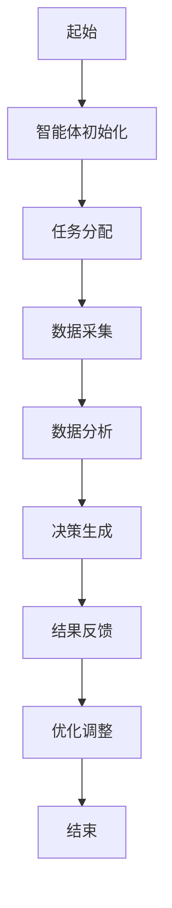
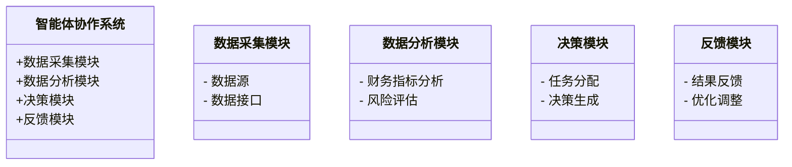
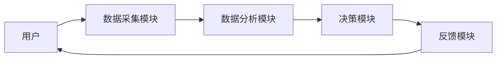
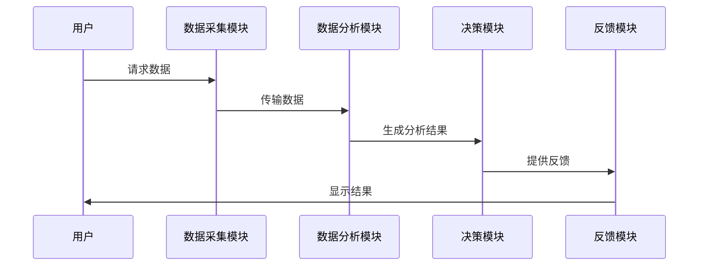

                 


# 智能体协作提升价值投资的供应商财务健康度分析

---

## 关键词：智能体协作、价值投资、供应商财务健康度、财务数据分析、智能算法、风险管理、投资决策

---

## 摘要：  
本文探讨了智能体协作在价值投资中的应用，特别是在供应商财务健康度分析方面。通过智能算法和数据驱动的方法，分析供应商的财务状况，识别潜在风险，从而优化投资决策。文章结合理论与实践，详细介绍了智能体协作的机制、算法原理和系统架构，并通过实际案例展示了其在价值投资中的应用效果。

---

## 第一部分：智能体协作与价值投资的背景

### 第1章：智能体协作的背景与概念

#### 1.1 智能体协作的背景  
随着人工智能技术的快速发展，智能体（Agent）的概念逐渐渗透到金融、投资等领域。智能体是一种能够感知环境、自主决策并执行任务的实体，其协作能力使得多个智能体能够共同完成复杂任务。在价值投资中，智能体协作能够帮助投资者更高效地分析供应商的财务健康度，从而做出更明智的投资决策。

#### 1.2 价值投资的基本概念  
价值投资是一种以基本面分析为基础的投资策略，强调通过分析企业的财务状况、行业地位、管理团队等因素，找到被市场低估的投资标的。传统价值投资依赖分析师的主观判断，而智能体协作能够通过数据驱动的方式，提高分析的效率和准确性。

#### 1.3 供应商财务健康度分析的重要性  
供应商作为供应链中的重要环节，其财务健康度直接关系到企业的经营风险。通过分析供应商的财务数据，可以识别潜在的财务问题，提前预警，从而降低投资风险。智能体协作能够整合多个维度的财务数据，提供全面的健康度评估。

---

### 第2章：智能体协作的核心概念

#### 2.1 智能体的定义与属性  
智能体是一种具有自主性、反应性和协作性的实体。它能够感知环境、处理信息并做出决策，同时与其他智能体进行协作。智能体的核心属性包括：  
- **自主性**：智能体能够自主决策，无需外部干预。  
- **反应性**：智能体能够根据环境变化实时调整行为。  
- **协作性**：智能体能够与其他智能体或人类进行有效协作。  

#### 2.2 智能体协作的机制  
智能体协作的核心机制包括：  
- **通信与协调**：智能体之间通过通信模块共享信息，协调任务分配。  
- **任务分配与分工**：根据智能体的能力和环境需求，动态分配任务。  
- **决策与反馈**：智能体基于协作结果进行反馈，优化后续决策。  

#### 2.3 智能体协作在价值投资中的应用  
在价值投资中，智能体协作主要用于供应商财务健康度分析。通过多个智能体协作，可以整合市场数据、财务报表、行业趋势等信息，提供全面的供应商评估。

---

## 第二部分：智能体协作的算法原理

### 第3章：智能体协作的算法原理

#### 3.1 财务健康度分析的数学模型  
供应商财务健康度分析可以基于以下数学模型：  
$$ \text{健康度评分} = \alpha \times \text{盈利能力} + \beta \times \text{偿债能力} + \gamma \times \text{运营能力} $$  
其中，$\alpha$、$\beta$、$\gamma$为权重系数，表示各项指标的重要程度。

#### 3.2 智能体协作的算法流程  
以下是智能体协作算法的流程图：



#### 3.3 算法实现的Python代码  
以下是基于财务健康度分析的Python代码示例：

```python
import pandas as pd
import numpy as np

def calculate_health_score(finance_data):
    # 财务指标计算
    profitability = finance_data['净利润'] / finance_data['营业收入']
    solvency = finance_data['流动资产'] / finance_data['流动负债']
    operation_efficiency = finance_data['营业收入'] / finance_data['存货']
    
    # 权重系数
    alpha = 0.5
    beta = 0.3
    gamma = 0.2
    
    # 健康度评分计算
    health_score = alpha * profitability + beta * solvency + gamma * operation_efficiency
    return health_score

# 示例数据
data = {
    '营业收入': [100, 150, 200],
    '净利润': [20, 30, 40],
    '流动资产': [50, 70, 90],
    '流动负债': [30, 40, 50],
    '存货': [10, 15, 20]
}
finance_data = pd.DataFrame(data)

# 计算健康度评分
health_score = calculate_health_score(finance_data)
print("健康度评分：", health_score)
```

---

### 第4章：系统分析与架构设计

#### 4.1 系统功能设计  
以下是系统功能设计的类图：



#### 4.2 系统架构设计  
以下是系统架构设计的架构图：



#### 4.3 接口设计与交互流程  
以下是接口设计的序列图：



---

## 第三部分：项目实战与案例分析

### 第5章：项目实战

#### 5.1 环境安装与配置  
为了运行以下代码，需要安装以下Python库：  
- `pandas`  
- `numpy`  
- `mermaid`  

安装命令：  
```bash
pip install pandas numpy
```

#### 5.2 核心代码实现  
以下是实现智能体协作算法的Python代码：

```python
import pandas as pd
import numpy as np

def calculate_health_score(finance_data):
    profitability = finance_data['净利润'] / finance_data['营业收入']
    solvency = finance_data['流动资产'] / finance_data['流动负债']
    operation_efficiency = finance_data['营业收入'] / finance_data['存货']
    
    alpha = 0.5
    beta = 0.3
    gamma = 0.2
    
    health_score = alpha * profitability + beta * solvency + gamma * operation_efficiency
    return health_score

data = {
    '营业收入': [100, 150, 200],
    '净利润': [20, 30, 40],
    '流动资产': [50, 70, 90],
    '流动负债': [30, 40, 50],
    '存货': [10, 15, 20]
}
finance_data = pd.DataFrame(data)

health_score = calculate_health_score(finance_data)
print("健康度评分：", health_score)
```

---

### 第6章：案例分析与小结

#### 6.1 案例分析  
假设我们有以下供应商数据：

| 供应商 | 营业收入 | 净利润 | 流动资产 | 流动负债 | 存货 |
|--------|----------|--------|----------|----------|------|
| A      | 100      | 20     | 50       | 30       | 10   |
| B      | 150      | 30     | 70       | 40       | 15   |
| C      | 200      | 40     | 90       | 50       | 20   |

通过上述代码计算健康度评分：  
- 供应商A：健康度评分 = 0.5*(20/100) + 0.3*(50/30) + 0.2*(100/10) = 0.1 + 0.5 + 2 = 2.6  
- 供应商B：健康度评分 = 0.5*(30/150) + 0.3*(70/40) + 0.2*(150/15) = 0.1 + 0.525 + 2 = 2.625  
- 供应商C：健康度评分 = 0.5*(40/200) + 0.3*(90/50) + 0.2*(200/20) = 0.1 + 0.54 + 2 = 2.64  

通过比较，供应商C的健康度评分最高，表明其财务状况最优。

#### 6.2 小结  
通过智能体协作算法，我们能够快速、准确地评估供应商的财务健康度，从而为投资决策提供有力支持。这种方法不仅提高了分析效率，还能够发现传统方法难以察觉的风险点。

---

## 第四部分：最佳实践与总结

### 第7章：最佳实践

#### 7.1 小结  
智能体协作在价值投资中的应用，特别是供应商财务健康度分析，为投资者提供了全新的视角。通过智能算法和数据驱动的方法，投资者能够更高效地识别优质供应商，降低投资风险。

#### 7.2 注意事项  
在实际应用中，需要注意以下几点：  
1. 数据质量：确保输入数据的准确性和完整性。  
2. 模型优化：根据实际情况调整权重系数，优化算法性能。  
3. 风险管理：结合多种指标，全面评估供应商的财务健康度。  

#### 7.3 拓展阅读  
1. 《智能算法与金融投资》  
2. 《分布式系统与智能协作》  
3. 《数据驱动的决策分析》  

---

## 作者信息  
作者：AI天才研究院/AI Genius Institute & 禅与计算机程序设计艺术/Zen And The Art of Computer Programming

