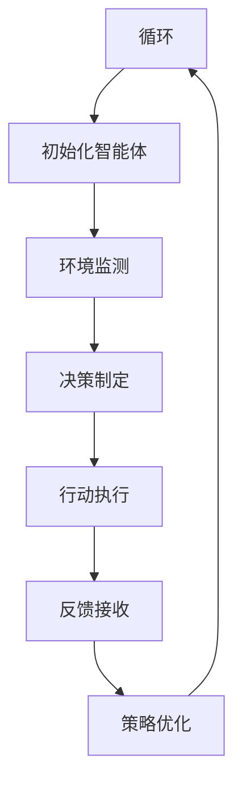
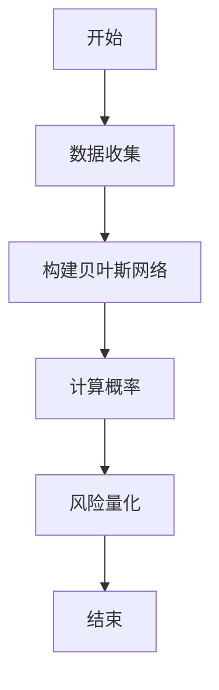
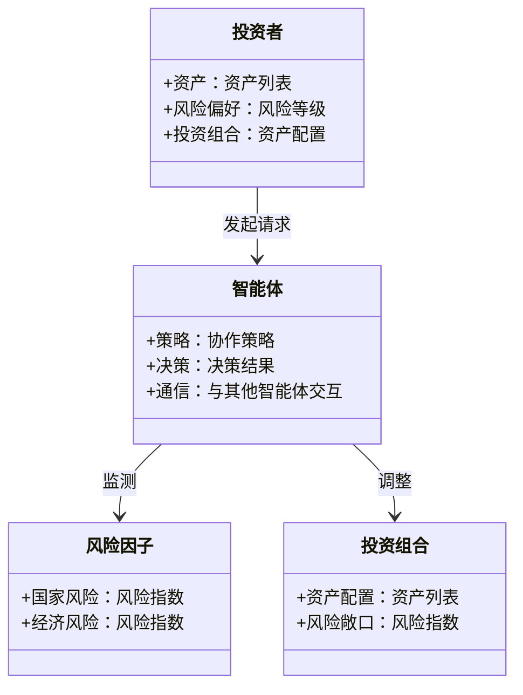
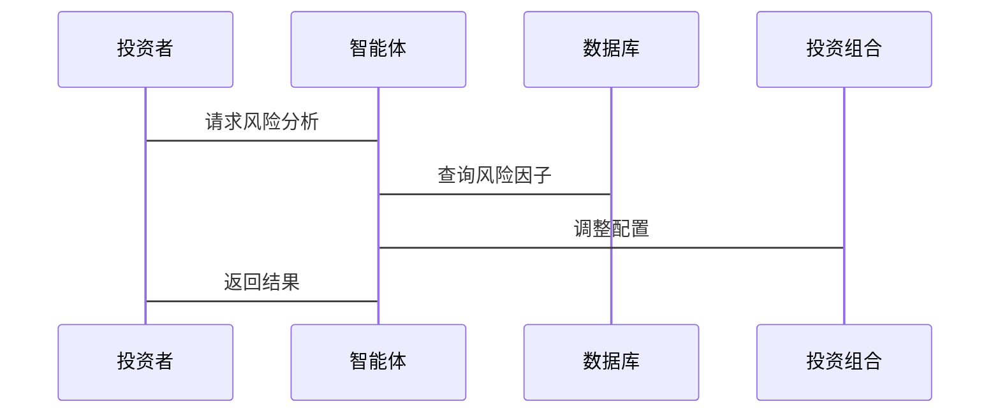

                 


# 智能体协作提升价值投资的地缘政治风险量化分析

---

## 关键词：
智能体协作，地缘政治风险，价值投资，量化分析，多智能体系统，博弈论，贝叶斯网络

---

## 摘要：
本文探讨了智能体协作在价值投资中地缘政治风险量化分析的应用。通过分析智能体协作的核心概念、算法原理及系统架构，结合实际案例，提出了基于博弈论和贝叶斯网络的地缘政治风险量化模型，并展示了如何通过多智能体系统优化投资决策。文章内容丰富，结构清晰，旨在为投资者和研究人员提供理论和实践指导。

---

# 第一部分：智能体协作与地缘政治风险概述

## 第1章：智能体协作与地缘政治风险概述

### 1.1 智能体协作的基本概念

#### 1.1.1 智能体协作的定义
智能体协作是指多个智能体（Agent）通过协同工作，实现共同目标的过程。智能体可以是软件程序、算法或人工代理，能够感知环境、自主决策并采取行动。

#### 1.1.2 智能体协作的核心要素
- **智能体**：具有感知、决策和行动能力的实体。
- **协作**：通过通信和协调实现目标。
- **环境**：智能体所处的外部环境，包括物理和数字环境。

#### 1.1.3 智能体协作的目标与意义
智能体协作的目标是通过协同优化，提升整体效率和效果。在价值投资中，智能体协作可以帮助投资者更好地应对复杂多变的地缘政治风险。

---

### 1.2 地缘政治风险量化分析的背景

#### 1.2.1 地缘政治风险的定义与特征
地缘政治风险是指因政治、经济、军事等因素引发的区域或全球性风险，具有不确定性、复杂性和动态性。

#### 1.2.2 地缘政治风险的量化需求
投资者需要量化地缘政治风险，以便在决策中考虑其影响。量化分析需要结合历史数据、实时事件和模型预测。

#### 1.2.3 地缘政治风险与价值投资的关系
地缘政治风险直接影响投资收益。通过智能体协作，投资者可以实时监控和评估风险，优化投资组合。

---

### 1.3 本章小结
本章介绍了智能体协作和地缘政治风险的基本概念，并阐述了它们在价值投资中的重要性。

---

# 第二部分：智能体协作与地缘政治风险的核心概念与联系

## 第2章：智能体协作与地缘政治风险的核心概念

### 2.1 智能体协作的理论基础

#### 2.1.1 博弈论与智能体协作
博弈论是智能体协作的理论基础，分析智能体在决策中的策略选择和互动。

#### 2.1.2 多智能体系统（MAS）的基本原理
多智能体系统由多个智能体组成，通过通信和协调实现复杂任务。智能体之间可以是竞争或合作关系。

#### 2.1.3 智能体协作的分类与应用场景
智能体协作可以分为基于规则的协作和基于学习的协作。应用场景包括金融投资、供应链管理和灾害应对。

---

### 2.2 地缘政治风险的量化模型

#### 2.2.1 地缘政治风险的构成要素
地缘政治风险由政治稳定性、经济政策、国际关系等因素构成。

#### 2.2.2 地缘政治风险的量化指标
常用指标包括风险指数、波动率和相关性分析。

#### 2.2.3 地缘政治风险的数学模型
地缘政治风险模型可以表示为：
$$ R = \sum_{i=1}^{n} \lambda_i x_i $$
其中，$R$是风险值，$\lambda_i$是权重，$x_i$是风险因子。

---

### 2.3 智能体协作与地缘政治风险的关联性分析

#### 2.3.1 智能体协作在地缘政治风险分析中的作用
智能体协作可以通过数据共享和模型优化，提高地缘政治风险的预测精度。

#### 2.3.2 地缘政治风险对智能体协作的影响
地缘政治风险可能影响智能体协作的稳定性，需要设计鲁棒的协作机制。

#### 2.3.3 智能体协作与地缘政治风险的协同优化
通过智能体协作，投资者可以实时调整策略，降低地缘政治风险的影响。

---

### 2.4 核心概念对比与ER实体关系图

#### 2.4.1 核心概念对比表格
| 概念       | 智能体协作 | 地缘政治风险量化分析 |
|------------|------------|-----------------------|
| 核心要素   | 智能体、协作 | 政治因素、量化指标   |
| 目标       | 提升效率   | 量化风险             |
| 应用场景   | 金融投资   | 投资决策             |

#### 2.4.2 ER实体关系图（Mermaid）
```mermaid
erDiagram
    actor 投资者 {
        string 资产
        string 风险偏好
    }
    actor 智能体 {
        string 策略
        string 决策
    }
    entity 风险因子 {
        string 国家风险
        string 经济风险
    }
    entity 投资组合 {
        string 资产配置
        string 风险敞口
    }
    投资者 --> 风险因子 : 监测
    投资者 --> 投资组合 : 优化
    智能体 --> 风险因子 : 量化
    智能体 --> 投资组合 : 调整
```

---

# 第三部分：智能体协作与地缘政治风险的算法原理

## 第3章：智能体协作的算法原理

### 3.1 多智能体协作算法

#### 3.1.1 多智能体协作的基本算法
多智能体协作算法包括基于规则的协作和基于学习的协作。规则-based协作通过预定义规则实现，而学习-based协作通过强化学习优化策略。

#### 3.1.2 博弈论算法在智能体协作中的应用
博弈论算法如纳什均衡用于分析智能体在协作中的策略选择。

#### 3.1.3 基于强化学习的智能体协作算法
强化学习通过智能体与环境的交互，优化协作策略。例如，使用Q-learning算法训练智能体在地缘政治风险下的决策。

---

### 3.2 地缘政治风险量化分析的算法

#### 3.2.1 基于博弈论的地缘政治风险量化模型
博弈论模型将地缘政治风险视为多方博弈的结果，通过纳什均衡预测风险概率。

#### 3.2.2 基于贝叶斯网络的地缘政治风险分
贝叶斯网络通过概率推理，量化地缘政治风险的影响因素。

---

### 3.3 算法流程图（Mermaid）

#### 3.3.1 基于强化学习的智能体协作算法流程图


#### 3.3.2 基于贝叶斯网络的地缘政治风险量化流程图


---

## 第4章：系统分析与架构设计

### 4.1 系统功能设计

#### 4.1.1 领域模型（Mermaid类图）


---

### 4.2 系统架构设计（Mermaid架构图）


---

### 4.3 接口设计与交互流程图

#### 4.3.1 序列图（Mermaid）



---

# 第四部分：项目实战与案例分析

## 第5章：项目实战

### 5.1 环境安装
安装Python、TensorFlow和Keras库，配置开发环境。

### 5.2 核心代码实现

#### 5.2.1 基于强化学习的智能体协作代码
```python
import numpy as np
import gym

class InvestmentEnv(gym.Env):
    def __init__(self):
        # 定义环境状态和动作空间
        self.observation_space = ...
        self.action_space = ...
    
    def step(self, action):
        # 执行动作，返回新的状态、奖励和终止标志
        return new_obs, reward, done, info
    
    def reset(self):
        # 初始化环境
        return initial_obs

# 初始化环境和智能体
env = InvestmentEnv()
agent = QLearningAgent(env)

# 训练智能体
for episode in range(1000):
    state = env.reset()
    while not done:
        action = agent.act(state)
        next_state, reward, done, info = env.step(action)
        agent.remember(state, action, reward, next_state, done)
        agent.learn()
```

#### 5.2.2 地缘政治风险量化代码
```python
import numpy as np
from sklearn import linear_model

def quantify_risk(factors):
    model = linear_model.LinearRegression()
    # 假设factors是特征矩阵，labels是风险标签
    model.fit(factors, labels)
    return model.predict(new_factors)
```

### 5.3 案例分析
通过具体案例分析智能体协作在地缘政治风险量化中的应用，展示如何优化投资组合。

---

## 第6章：总结与展望

### 6.1 本章总结
智能体协作与地缘政治风险量化分析结合，能够提升价值投资的决策能力。

### 6.2 未来展望
未来研究可以探索更复杂的智能体协作算法和更精细的地缘政治风险模型。

---

## 第7章：最佳实践与注意事项

### 7.1 最佳实践
- 数据质量：确保数据准确性和全面性。
- 模型选择：根据实际需求选择合适的风险量化模型。
- 系统维护：定期更新模型和智能体策略。

### 7.2 注意事项
- 风险模型的局限性：模型可能无法捕捉所有风险因素。
- 系统鲁棒性：设计鲁棒的协作机制以应对突发风险。

---

## 第8章：参考文献与拓展阅读

### 8.1 参考文献
1. 线性回归模型：https://scikit-learn.org/stable/modules/generated/sklearn.linear_model.LinearRegression.html
2. 多智能体系统：Reiter, A. (1991). A formal theory of practical reasoning.
3. 强化学习算法：Sutton, R. S., & Barto, A. G. (2018). Introduction to reinforcement learning.

---

## 第9章：作者信息

作者：AI天才研究院/AI Genius Institute  
联系地址：https://github.com/AI-Genius-Institute  
联系邮箱：contact@ai-genius.org  

---

感谢您的阅读！如需进一步探讨，欢迎联系作者。

