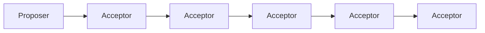
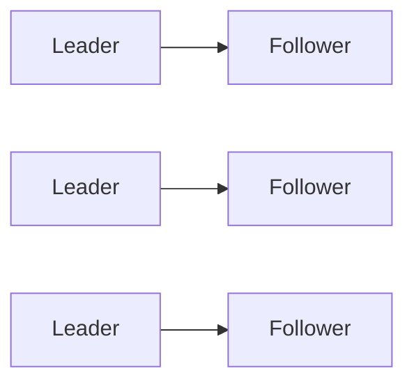
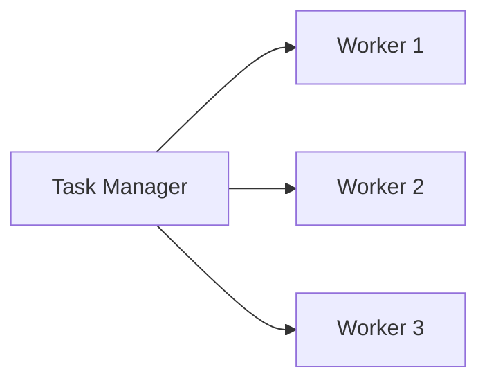
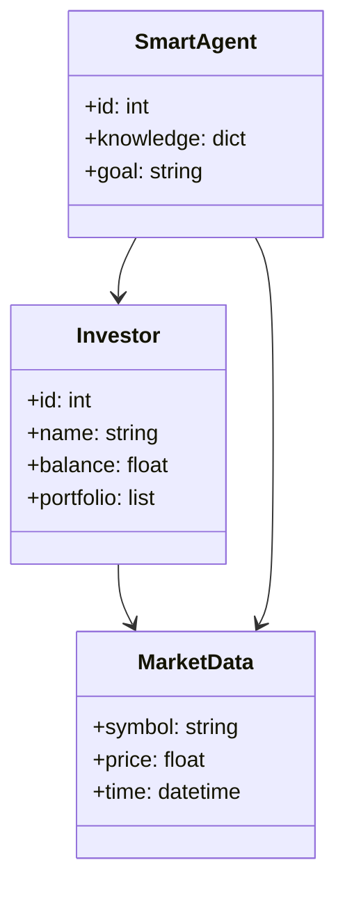
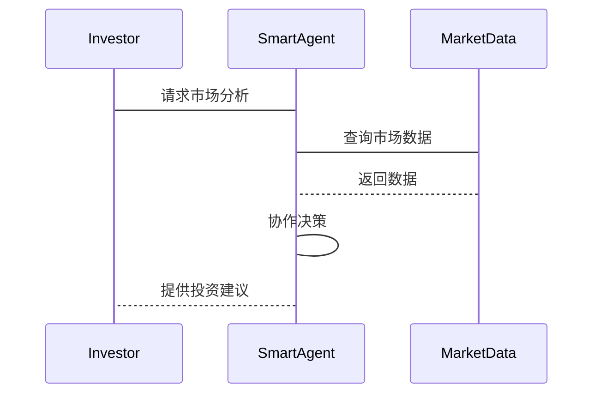

                 


# 智能体协作提升价值投资的时机选择

## 关键词：智能体协作，价值投资，时机选择，多智能体系统，分布式计算，算法原理

## 摘要：本文探讨了智能体协作在价值投资中的应用，特别是如何通过智能体协作优化投资时机的选择。文章首先介绍智能体协作和价值投资的基本概念，然后分析智能体协作的原理和算法，接着讨论价值投资策略和时机选择，最后通过实际案例展示智能体协作在投资中的应用效果。文章内容涵盖背景、原理、算法、系统设计、项目实战等多个方面，为读者提供全面的视角和深入的分析。

---

## 第1章：智能体协作与价值投资的背景

### 1.1 智能体协作的定义与核心概念

#### 1.1.1 智能体协作的定义
智能体协作是指多个智能体通过共享信息和协同决策，共同完成特定任务的过程。智能体可以是软件程序、算法或分布式系统中的独立组件，它们通过通信和协调实现目标。

#### 1.1.2 智能体协作的核心要素
- **智能体**：具有感知、决策和行动能力的实体。
- **通信机制**：智能体之间交换信息的方式。
- **协作协议**：定义智能体之间的交互规则和协作策略。
- **目标函数**：智能体协作所要实现的具体目标。

#### 1.1.3 智能体协作与传统投资的区别
智能体协作通过多智能体的协同决策，克服了传统投资中单点决策的局限性，提高了决策的准确性和鲁棒性。

### 1.2 价值投资的背景与策略

#### 1.2.1 价值投资的定义
价值投资是一种基于对公司内在价值的评估，寻找被市场低估的投资标的的投资策略。

#### 1.2.2 价值投资的核心策略
- **基本面分析**：分析公司的财务状况、行业地位和竞争优势。
- **长期视角**：关注公司的长期价值，而非短期市场波动。

#### 1.2.3 价值投资的时机选择
时机选择是价值投资的关键，投资者需要在市场低估时买入，在高估时卖出。

### 1.3 智能体协作与价值投资的结合

#### 1.3.1 智能体协作在投资中的优势
- **信息处理能力**：智能体协作能够快速处理大量市场数据，提供实时决策支持。
- **分布式决策**：通过多个智能体的协同，提高决策的多样性和鲁棒性。

#### 1.3.2 价值投资时机选择的重要性
时机选择直接影响投资收益，智能体协作能够帮助投资者在最佳时机做出决策。

#### 1.3.3 智能体协作如何优化投资时机
通过分析市场趋势、公司基本面和投资者情绪，智能体协作能够提供精准的买卖时机建议。

---

## 第2章：多智能体系统的原理

### 2.1 多智能体系统的构成

#### 2.1.1 智能体的定义与分类
- **定义**：智能体是具有自主决策能力的实体。
- **分类**：包括简单反射型智能体、基于模型的智能体、目标驱动型智能体和效用驱动型智能体。

#### 2.1.2 多智能体系统的结构
- **层次结构**：包括任务层、协调层、通信层和计算层。
- **通信机制**：通过消息传递实现智能体之间的信息共享。

#### 2.1.3 智能体之间的协作机制
- **一致性算法**：如Paxos和Raft，用于保证系统的一致性。
- **分布式计算**：通过分布式任务分配提高系统的计算效率。

### 2.2 分布式计算与协作算法

#### 2.2.1 分布式计算的基本原理
分布式计算将任务分解成多个部分，由不同的节点并行处理，提高计算效率。

#### 2.2.2 协作算法的分类
- **一致性算法**：确保系统状态一致性的算法。
- **负载均衡算法**：优化资源分配的算法。

#### 2.2.3 常见协作算法的优缺点
- **Paxos算法**：适用于一致性要求高的场景，但实现复杂。
- **Raft算法**：实现简单，但对网络延迟敏感。

### 2.3 智能体协作的通信机制

#### 2.3.1 通信协议的选择
- **选择标准**：考虑系统的实时性、可靠性和安全性。

#### 2.3.2 消息传递机制
- **同步通信**：消息传递需要等待对方确认。
- **异步通信**：消息传递不需要等待确认，提高效率。

#### 2.3.3 通信中的安全性问题
- **加密技术**：保护消息内容的安全。
- **身份认证**：确保消息来源的可靠性。

---

## 第3章：价值投资策略与时机选择

### 3.1 价值投资的策略分析

#### 3.1.1 市场分析
- **市场趋势**：分析市场整体走势。
- **行业分析**：评估行业前景和竞争格局。

#### 3.1.2 公司分析
- **财务状况**：评估公司的盈利能力、资产负债情况。
- **管理团队**：分析管理团队的能力和稳定性。

#### 3.1.3 投资者情绪
- **市场情绪**：通过分析投资者情绪判断市场的高估或低估。

### 3.2 智能体协作优化投资时机

#### 3.2.1 市场数据实时分析
- **实时数据处理**：智能体协作能够快速处理市场数据，提供实时建议。

#### 3.2.2 分散决策与集中决策
- **分散决策**：每个智能体独立决策，降低单点故障风险。
- **集中决策**：通过协作算法达成一致决策，提高决策质量。

#### 3.2.3 动态调整策略
- **自适应算法**：根据市场变化动态调整投资策略。

---

## 第4章：算法原理

### 4.1 一致性算法

#### 4.1.1 Paxos算法



Paxos算法通过Proposer提出提案，Acceptor进行投票，最终确定提案是否通过。算法的关键在于确保所有Acceptor达成一致。

#### 4.1.2 Raft算法



Raft算法通过Leader节点进行提案，Follower节点进行投票，确保系统的一致性。

### 4.2 分布式算法

#### 4.2.1 分布式任务分配



任务管理器将任务分配给不同的Worker，通过分布式计算提高效率。

---

## 第5章：系统设计与架构

### 5.1 系统功能需求

#### 5.1.1 功能模块划分
- **数据采集模块**：采集市场数据。
- **分析模块**：进行市场和公司分析。
- **决策模块**：基于分析结果做出投资决策。

#### 5.1.2 系统目标
- 提供实时市场分析。
- 优化投资策略和时机选择。

### 5.2 系统设计目标

#### 5.2.1 系统架构设计



系统架构包括投资者、市场数据和智能体三个主要实体，智能体通过市场数据和投资者需求进行协作决策。

#### 5.2.2 接口设计
- **数据接口**：提供市场数据的查询和订阅功能。
- **决策接口**：提供投资决策建议的接口。

### 5.3 交互设计

#### 5.3.1 交互流程



投资者请求市场分析，智能体通过协作决策提供投资建议。

---

## 第6章：项目实战

### 6.1 环境配置

#### 6.1.1 技术选型
- **编程语言**：Python
- **框架**：Django或Flask
- **数据库**：MySQL或MongoDB
- **工具**：Jupyter Notebook

#### 6.1.2 安装依赖
```bash
pip install requests pandas numpy matplotlib
```

### 6.2 核心实现

#### 6.2.1 数据采集模块

```python
import requests

def get_market_data(symbol):
    url = f"https://api.example.com/stock/{symbol}"
    response = requests.get(url)
    return response.json()
```

#### 6.2.2 分析模块

```python
from pandas import DataFrame

def analyze_market(data):
    df = DataFrame(data)
    # 数据分析逻辑
    return df
```

#### 6.2.3 决策模块

```python
def make_decision(data):
    # 简单的决策逻辑，可根据实际情况扩展
    if data['price'] < data['value']:
        return '买入'
    else:
        return '卖出'
```

### 6.3 案例分析

#### 6.3.1 案例背景
分析一只股票的历史数据，预测其未来的走势。

#### 6.3.2 实施步骤
1. 采集股票历史数据。
2. 分析数据，评估其内在价值。
3. 基于分析结果，智能体协作做出买卖决策。

#### 6.3.3 结果展示
- 通过图表展示分析结果。
- 提供投资建议，如“建议买入”或“建议卖出”。

### 6.4 项目小结

通过实际案例，展示了智能体协作在价值投资中的应用效果。智能体协作能够提高投资决策的准确性和效率，为投资者提供有力支持。

---

## 第7章：案例分析与总结

### 7.1 案例分析

#### 7.1.1 案例背景
分析某公司股票，评估其内在价值和市场地位。

#### 7.1.2 分析过程
- 数据采集：获取公司财务数据和市场数据。
- 数据分析：评估公司的盈利能力和发展潜力。
- 智能体协作：多个智能体协同决策，提供投资建议。

#### 7.1.3 结果展示
- 投资建议：基于分析结果，建议在特定时机买入或卖出。

### 7.2 总结

智能体协作通过多智能体的协同决策，显著提升了价值投资的时机选择能力。通过实际案例，验证了智能体协作在投资中的有效性和优势。

---

## 最佳实践 Tips

1. **持续学习**：市场环境不断变化，投资者需要持续学习和更新知识。
2. **风险管理**：智能体协作可以帮助投资者更好地管理风险，但不能完全消除风险。
3. **系统维护**：定期维护和更新系统，确保其稳定性和准确性。

---

## 作者：AI天才研究院 & 禅与计算机程序设计艺术

---

通过以上内容，本文详细探讨了智能体协作在价值投资中的应用，从理论到实践，为读者提供了全面的视角和深入的分析。

