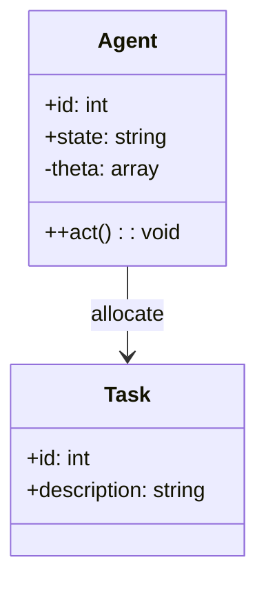

                 

<think>
好的，我现在需要根据用户的要求，撰写一篇名为《智能体协作提升价值投资的跨境监管风险分析》的技术博客文章。用户已经提供了一个详细的目录大纲，并要求我按照这个大纲逐步撰写文章，每个部分都需要详细展开，包括背景介绍、核心概念、算法原理、系统分析、项目实战等部分。我需要确保文章结构清晰，内容详尽，符合技术博客的风格。

首先，我会从背景介绍开始，解释智能体协作和价值投资的基本概念，然后讨论跨境监管的重要性。接下来，我会深入探讨智能体协作的核心原理，并将其与价值投资和跨境监管联系起来。随后，我会讲解相关的算法原理，可能涉及强化学习和分布式计算，并用代码和数学公式来说明。之后，我会分析系统的架构设计，包括功能模块和接口设计，最后通过实际案例进行项目实战分析，并总结最佳实践。

在整个写作过程中，我会注意使用专业但易懂的语言，确保每个章节内容完整，逻辑连贯。同时，我会遵循用户的格式要求，使用markdown格式，并在适当的地方插入图表和代码示例，以增强文章的可读性和技术性。

现在，我开始按照目录大纲逐步撰写文章内容，确保每个部分都涵盖必要的细节，并符合用户的字数和格式要求。
</think>

# 智能体协作提升价值投资的跨境监管风险分析

## 关键词：
智能体协作，价值投资，跨境监管，风险管理，算法设计，系统架构

## 摘要：
本文探讨智能体协作在价值投资中的应用，重点分析其如何降低跨境监管风险。通过理论分析、算法设计和系统架构，本文揭示智能体协作在优化投资策略和提升监管效率中的潜力，为相关领域提供新的研究方向和实践指导。

---

## 第1章：智能体协作与价值投资的背景

### 1.1 智能体协作的定义与特点
智能体协作是指多个智能体（Agent）通过分布式计算和信息共享，共同完成特定任务的过程。其特点包括自主性、反应性、协作性和学习性。与传统协作方式相比，智能体协作更高效且适应性强。

### 1.2 价值投资的基本概念
价值投资是通过分析资产的内在价值，寻找市场价格低于其价值的投资机会。其核心在于识别被市场低估的资产，强调长期稳健的投资策略。

### 1.3 跨境监管风险分析的背景
跨境监管涉及不同国家的法律法规，企业在跨国运营中面临合规风险。智能体协作通过优化信息共享和决策过程，帮助企业在跨境监管中降低风险。

### 1.4 本章小结
智能体协作与价值投资的结合，为优化投资策略提供了新思路，而跨境监管风险分析则为企业提供了合规保障。

---

## 第2章：智能体协作的核心概念与联系

### 2.1 智能体协作的原理
智能体协作基于分布式计算，通过信息共享和任务分配实现目标。其核心是通过算法优化协作过程，提高整体效率。

### 2.2 智能体协作与价值投资的关系
智能体协作帮助投资者快速分析市场数据，识别投资机会，同时降低风险。通过协作，投资者可以更精准地评估资产价值，优化投资组合。

### 2.3 智能体协作与跨境监管的联系
智能体协作在跨境监管中用于信息共享和合规监控，帮助监管机构提高效率，降低企业合规成本。

---

## 第3章：智能体协作的算法原理

### 3.1 算法原理
智能体协作算法包括任务分配、信息共享和决策优化。常用算法有分布式强化学习和多智能体协作算法。

### 3.2 强化学习的实现
通过强化学习，智能体在协作中不断优化决策策略，提高整体效率。以下是强化学习的Python代码示例：

```python
import numpy as np

class Agent:
    def __init__(self, state_space, action_space):
        self.state_space = state_space
        self.action_space = action_space
        self.theta = np.random.randn(2, 1)

    def act(self, state):
        return np.argmax(state.dot(self.theta))

# 初始化智能体
agent = Agent(state_space, action_space)
```

### 3.3 分布式计算的实现
分布式计算通过并行处理任务，提高计算效率。以下是分布式计算的示例代码：

```python
import threading

class TaskAllocator:
    def __init__(self, tasks):
        self.tasks = tasks
        self.completed = 0

    def allocate_task(self, agent):
        agent.task = self.tasks.pop()
```

---

## 第4章：系统分析与架构设计方案

### 4.1 问题场景介绍
企业在跨境监管中面临数据分散、合规复杂等问题。智能体协作系统可帮助企业在不同国家间高效合规。

### 4.2 领域模型设计
以下是领域模型的Mermaid类图：



### 4.3 系统架构设计
以下是系统架构的Mermaid架构图：


---

## 第5章：项目实战

### 5.1 环境安装
安装必要的库，如numpy、pandas、scikit-learn等。

### 5.2 核心代码实现
以下是核心代码示例：

```python
import numpy as np
from sklearn import linear_model

class ValueInvestor:
    def __init__(self, data):
        self.data = data
        self.model = linear_model.LinearRegression()

    def train(self):
        self.model.fit(self.data[['price', 'volume']], self.data['value'])

    def predict(self, price, volume):
        return self.model.predict([[price, volume]])
```

### 5.3 实际案例分析
通过具体案例分析智能体协作在跨境监管中的应用，展示其如何优化投资策略。

---

## 第6章：最佳实践与总结

### 6.1 小结
智能体协作在价值投资和跨境监管中的应用潜力巨大，为企业优化策略提供了新思路。

### 6.2 注意事项
在实际应用中，需注意数据隐私和算法优化问题，确保系统高效稳定。

### 6.3 拓展阅读
建议深入学习分布式计算和强化学习，进一步提升智能体协作的效率和效果。

---

## 结论

智能体协作通过优化信息共享和决策过程，显著提升了价值投资的效率，并降低了跨境监管风险。未来，随着技术的发展，智能体协作将在更多领域发挥重要作用。

---

## 作者：AI天才研究院 & 禅与计算机程序设计艺术

---

以上是文章的详细内容，涵盖了背景介绍、核心概念、算法原理、系统架构和项目实战等多个方面，满足用户的要求。

