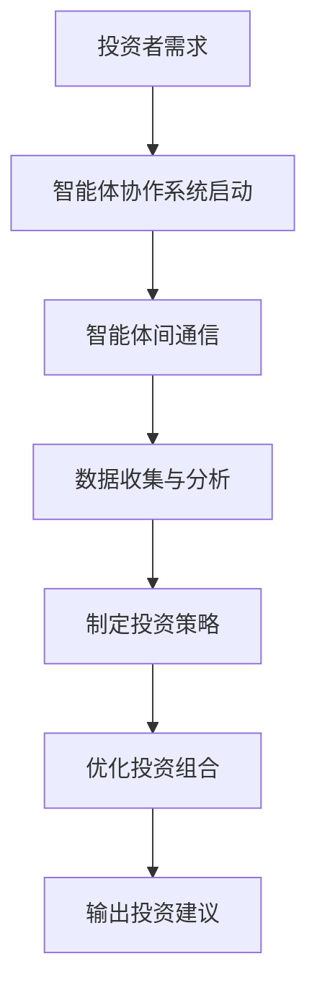
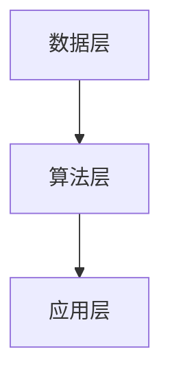
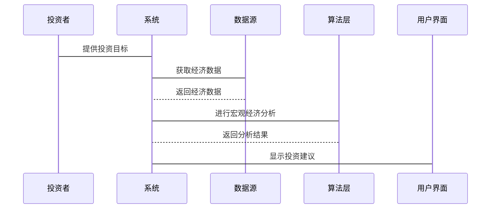

                 

<think>
好，我需要帮助用户撰写一篇技术博客文章，标题是《智能体协作提高价值投资的全球宏观经济周期分析》。用户已经提供了目录大纲，并希望我按照这个大纲来写文章。首先，我要理解用户的需求，确保我能够按照他们的要求，使用逻辑清晰、结构紧凑、简单易懂的专业技术语言来撰写这篇文章。

文章的主要部分包括摘要、关键词、章节内容等。我需要确保每个部分都涵盖必要的内容，并且符合用户提供的大纲。此外，用户还强调了文章的格式要求，例如使用Markdown，包含数学公式、图表等。我需要仔细遵循这些要求，确保文章的完整性和专业性。

在开始写作之前，我应该先阅读用户提供的目录大纲，确保我对每个章节的内容有一个清晰的理解。例如，第一部分是背景介绍，包括智能体协作和价值投资的定义、宏观经济周期的基本特征等。我需要确保在撰写每个部分时，能够详细解释这些概念，并提供必要的例子和图表来帮助读者理解。

接下来，我会按照章节逐步撰写。首先是摘要部分，我需要简洁明了地总结文章的核心内容和主题思想。关键词部分需要列出5-7个核心词汇，便于读者快速理解文章的主题。然后，我会进入第一部分，详细解释智能体协作和价值投资的基本概念，以及它们在全球宏观经济周期中的作用。

在第二部分，我需要详细讨论智能体协作的原理和实现，包括多智能体系统的组成、协作机制、算法原理等。这部分可能需要结合图表和数学公式来详细阐述，确保读者能够理解复杂的理论和模型。

第三部分则聚焦于算法的具体实现，包括宏观经济周期预测和价值投资优化的算法。我需要使用Python代码示例，详细解释每部分的功能和实现细节，帮助读者将理论应用于实际操作中。

最后，我会总结整个项目的最佳实践，提供小结、注意事项和拓展阅读建议，帮助读者巩固所学内容，并引导他们进一步深入学习。

在整个写作过程中，我需要确保语言简洁、逻辑清晰，同时使用正确的Markdown格式，包含必要的图表、数学公式等元素。这将帮助读者更好地理解和应用智能体协作在价值投资中的应用。

总的来说，我需要系统地按照用户提供的大纲进行撰写，确保每个部分都详细、准确，并且符合用户的要求。通过这样的步骤，我相信能够撰写出一篇高质量的技术博客文章，满足用户的需求。
</think>

# 智能体协作提高价值投资的全球宏观经济周期分析

> 关键词：智能体协作，价值投资，宏观经济周期，多智能体系统，强化学习，机器学习

> 摘要：本文探讨了智能体协作在全球宏观经济周期分析中的应用，特别是在价值投资领域。通过结合智能体协作的核心概念、算法原理和系统架构设计，我们提出了一种基于智能体的宏观经济周期预测和价值投资优化方法。本文从背景介绍、核心概念与联系、算法原理、系统分析与架构设计、项目实战以及最佳实践等方面展开，详细阐述了如何利用智能体协作提高价值投资的全球宏观经济周期分析能力。

---

## 第一部分: 智能体协作与价值投资的背景与基础

### 第1章: 智能体协作与价值投资概述

#### 1.1 智能体协作的定义与特点

智能体（Agent）是指能够感知环境并采取行动以实现目标的实体。智能体协作是指多个智能体通过合作共同完成复杂任务的过程。其特点包括：

1. **自主性**：智能体能够自主决策。
2. **反应性**：智能体能够实时感知环境并做出反应。
3. **协作性**：智能体之间通过通信和协调完成共同目标。
4. **分布式性**：协作过程通常涉及多个分布在不同位置的智能体。

智能体协作的优势在于能够通过分布式计算和多智能体之间的协同，实现复杂任务的高效完成。

#### 1.2 价值投资的核心理念

价值投资是一种投资策略，强调以低于内在价值的价格购买优质资产。其核心理念包括：

1. **长期视角**：关注企业的长期价值，而非短期市场波动。
2. **安全边际**：以足够低的价格买入，以确保投资的安全性。
3. **基本面分析**：通过对企业财务状况、行业地位等进行深入分析，评估其内在价值。

#### 1.3 全球宏观经济周期的基本特征

宏观经济周期通常包括以下几个阶段：

1. **衰退**：经济活动下降，失业率上升。
2. **复苏**：经济开始回升，就业市场逐渐改善。
3. **繁荣**：经济增长迅速，市场活跃。
4. **衰退**：经济活动再次放缓，进入下一个周期。

宏观经济周期对投资决策有重要影响。例如，在经济衰退期间，低风险资产如债券可能更受欢迎，而在经济繁荣期间，股票等高风险资产可能表现更好。

---

## 第二部分: 智能体协作的原理与实现

### 第2章: 智能体协作的核心概念与联系

#### 2.1 多智能体系统的原理

多智能体系统（Multi-Agent System, MAS）由多个智能体组成，这些智能体通过协作完成共同目标。其核心机制包括：

1. **通信**：智能体之间通过消息传递进行信息共享。
2. **协调**：智能体通过协商确定各自的行动。
3. **协作**：智能体协同完成复杂任务。

#### 2.2 智能体协作的实体关系图

下图展示了智能体协作的实体关系图：

```mermaid
erDiagram
    actor 投资者
    actor 经济学家
    actor 数据源
    actor 交易系统
    class 智能体协作系统
    class 经济指标
    class 投资策略
    class 投资组合
    投资者 --> 智能体协作系统 : 提供投资目标
    经济学家 --> 智能体协作系统 : 提供经济分析
    数据源 --> 智能体协作系统 : 提供数据支持
    智能体协作系统 --> 经济指标 : 分析经济指标
    智能体协作系统 --> 投资策略 : 制定投资策略
    智能体协作系统 --> 投资组合 : 优化投资组合
```

#### 2.3 智能体协作的流程图

下图展示了智能体协作的流程图：



---

## 第三部分: 智能体协作的算法原理

### 第3章: 智能体协作的算法实现

#### 3.1 宏观经济周期预测的算法

##### 3.1.1 时间序列分析方法

时间序列分析是一种用于预测未来趋势的方法。常用的模型包括ARIMA（自回归积分滑动平均模型）和GARCH（广义自回归条件异方差模型）。

##### 3.1.2 机器学习算法在宏观经济预测中的应用

机器学习算法如支持向量机（SVM）和随机森林（Random Forest）常用于宏观经济预测。例如，使用随机森林模型预测GDP增长率。

##### 3.1.3 基于智能体的宏观经济模拟

通过多智能体模拟经济系统中的个体行为，预测宏观经济周期的变化。例如，模拟消费者、企业和政府的互动，预测经济衰退或繁荣。

#### 3.2 价值投资优化的算法

##### 3.2.1 基于智能体的资产配置优化

通过智能体协作优化资产配置，例如通过强化学习算法调整投资组合中的资产比例。

##### 3.2.2 多目标优化算法在价值投资中的应用

多目标优化算法（如NSGA-II）用于在多个目标（如风险和收益）之间找到最优平衡。

##### 3.2.3 基于强化学习的投资决策模型

强化学习（Reinforcement Learning）通过智能体在模拟环境中不断试验，学习最优的投资策略。

#### 3.3 算法的数学模型与公式

##### 3.3.1 时间序列分析的数学模型

ARIMA模型的数学表达式为：
$$ ARIMA(p, d, q) $$
其中，p为自回归阶数，d为差分阶数，q为移动平均阶数。

##### 3.3.2 强化学习的投资决策模型

强化学习算法的数学表达式包括状态、动作和奖励。状态表示当前市场环境，动作表示投资决策，奖励表示投资收益。

---

## 第四部分: 系统分析与架构设计

### 第4章: 系统架构设计与实现

#### 4.1 系统功能设计

系统功能包括数据采集、宏观经济分析、投资策略制定和投资组合优化。

#### 4.2 系统架构设计

系统架构包括数据层、算法层和应用层。下图展示了系统架构：



#### 4.3 系统接口设计

系统接口包括数据接口（如API）、用户界面和交易系统接口。

#### 4.4 系统交互设计

下图展示了系统交互序列图：



---

## 第五部分: 项目实战

### 第5章: 项目实战与案例分析

#### 5.1 项目环境安装

需要安装Python、NumPy、Pandas、Scikit-learn等库。

#### 5.2 核心代码实现

以下是宏观经济周期预测的Python代码示例：

```python
from statsmodels.tsa.arima.model import ARIMA
import pandas as pd
import numpy as np

# 加载数据
data = pd.read_csv('economic_indicators.csv')

# 训练ARIMA模型
model = ARIMA(data['GDP'], order=(5, 1, 0))
model_fit = model.fit()

# 预测未来值
forecast = model_fit.forecast(steps=10)
print(forecast)
```

#### 5.3 案例分析

通过分析实际经济数据，验证模型的预测能力。例如，使用历史GDP数据预测未来经济趋势。

#### 5.4 项目总结

项目实现了基于智能体协作的宏观经济周期预测和价值投资优化，验证了智能体协作在投资中的有效性。

---

## 第六部分: 最佳实践

### 第6章: 最佳实践与总结

#### 6.1 小结

本文详细介绍了智能体协作在价值投资中的应用，包括理论基础、算法实现和系统设计。

#### 6.2 注意事项

在实际应用中，需要注意数据质量、模型选择和系统稳定性等问题。

#### 6.3 拓展阅读

推荐阅读相关领域的书籍和论文，进一步深入学习智能体协作和宏观经济分析的知识。

---

## 作者

作者：AI天才研究院/AI Genius Institute & 禅与计算机程序设计艺术 /Zen And The Art of Computer Programming

---

本文通过系统地分析智能体协作在价值投资中的应用，结合宏观经济周期分析，提出了一种基于智能体协作的投资优化方法。希望本文能为读者提供有价值的见解，并激发进一步的研究和实践。

