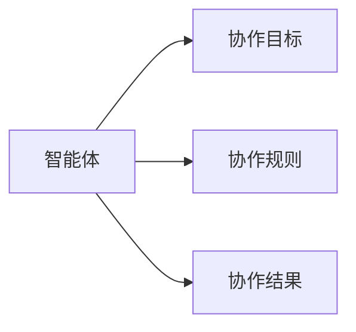
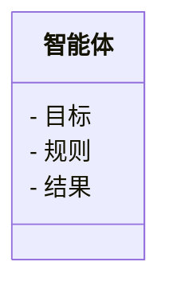
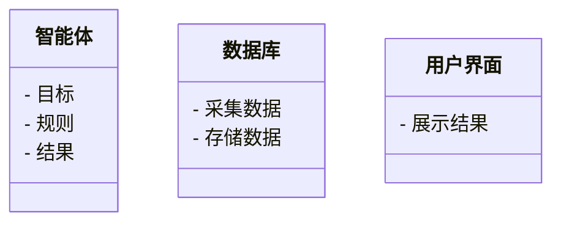
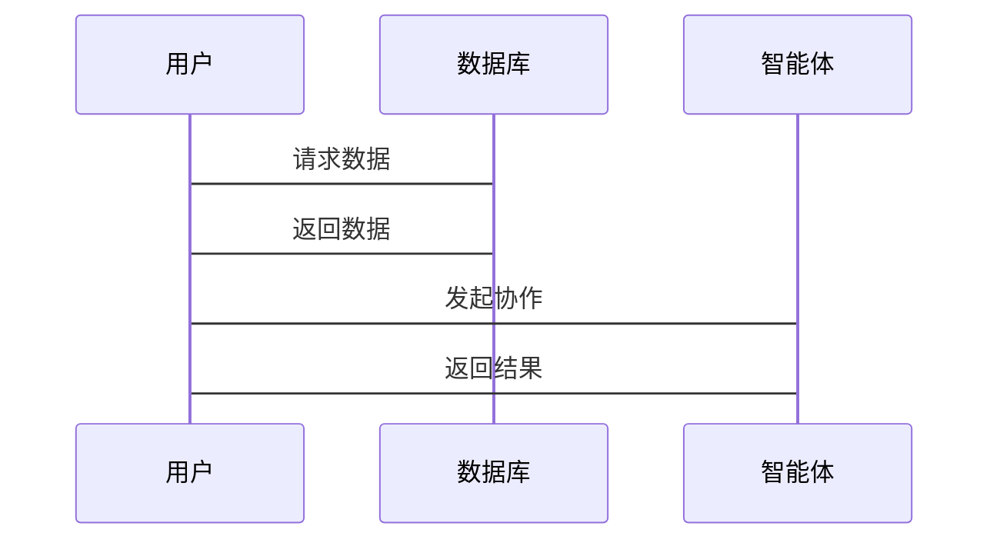

                 


# 智能体协作提高价值投资的并购协同效应预测

## 关键词
智能体协作, 价值投资, 并购协同效应, 算法原理, 系统设计

## 摘要
本文探讨智能体协作在价值投资中的应用，重点分析如何通过智能体协作提高并购协同效应的预测能力。文章从理论基础、算法实现到系统设计，详细阐述了智能体协作在预测中的作用，并通过实际案例展示了其在价值投资中的优势。

---

# 第一部分: 智能体协作与价值投资的背景

# 第1章: 智能体协作与并购协同效应概述

## 1.1 智能体协作的定义与特点
### 1.1.1 智能体协作的基本概念
智能体协作是指多个智能体通过合作完成特定任务的过程。智能体可以是软件程序、算法或实体，它们通过共享信息和资源，共同实现目标。

### 1.1.2 智能体协作的核心特点
- **分布式**: 智能体分布在不同的位置，独立决策。
- **协作性**: 智能体之间通过通信和协调完成任务。
- **动态性**: 协作过程可根据环境变化调整。

### 1.1.3 智能体协作与传统协作方式的对比
| 特性       | 智能体协作             | 传统协作方式           |
|------------|-----------------------|-----------------------|
| 自主性     | 高                    | 低                    |
| 响应速度   | 快                    | 较慢                 |
| 灵活性     | 强                    | 较弱                 |

## 1.2 并购协同效应的定义与分类
### 1.2.1 并购协同效应的定义
并购协同效应是指企业并购后，由于资源优化配置、成本节约等原因，企业整体价值超过并购前的简单相加。

### 1.2.2 并购协同效应的分类
- **经营协同效应**: 并购后在生产、销售等方面产生协同。
- **财务协同效应**: 并购后在财务、税务等方面产生协同。
- **战略协同效应**: 并购后在战略层面产生协同。

### 1.2.3 并购协同效应的影响因素
- **行业因素**: 行业的竞争状况和市场结构。
- **企业规模**: 双方企业的规模和资源。
- **管理能力**: 并购后的整合能力和管理效率。

## 1.3 智能体协作在价值投资中的应用前景
### 1.3.1 价值投资的核心理念
价值投资强调以低于内在价值的价格买入优质资产，长期持有。

### 1.3.2 智能体协作在价值投资中的优势
- **数据处理能力**: 智能体协作可以快速处理大量数据。
- **决策优化**: 智能体协作能优化投资决策，提高预测准确性。
- **动态调整**: 智能体协作可根据市场变化实时调整策略。

## 1.4 本章小结
本章介绍了智能体协作的基本概念、特点，以及并购协同效应的定义、分类和影响因素。同时，探讨了智能体协作在价值投资中的应用前景。

---

# 第2章: 智能体协作与并购协同效应的关系

## 2.1 智能体协作的核心概念
### 2.1.1 智能体协作的实体关系图


## 2.2 并购协同效应的核心要素
### 2.2.1 并购协同效应的领域模型


## 2.3 智能体协作与并购协同效应的关联
### 2.3.1 智能体协作对并购协同效应的促进作用
智能体协作通过优化资源配置、提高决策效率，显著提升并购协同效应。

### 2.3.2 并购协同效应的实现路径
1. 智能体协作分析市场数据。
2. 优化并购策略。
3. 预测协同效应。

### 2.3.3 智能体协作与并购协同效应的协同机制
- 数据共享：智能体间共享信息，提高预测准确性。
- 协作决策：智能体共同制定最优并购策略。
- 实时反馈：根据市场变化实时调整协作策略。

## 2.4 本章小结
本章分析了智能体协作与并购协同效应的关系，探讨了智能体协作如何促进并购协同效应的实现。

---

# 第3章: 智能体协作算法的核心原理

## 3.1 智能体协作算法的数学模型
### 3.1.1 智能体协作的基本公式
$$ V = \sum_{i=1}^{n} v_i $$

### 3.1.2 协作效果的评估公式
$$ E = \sum_{i=1}^{m} e_i $$

## 3.2 并购协同效应预测的算法流程
### 3.2.1 数据预处理
- 清洗数据。
- 标准化处理。

### 3.2.2 模型训练
- 构建预测模型。
- 调参优化。

### 3.2.3 结果预测
- 预测并购协同效应。
- 输出结果。

## 3.3 智能体协作算法的实现步骤
### 3.3.1 算法初始化
- 初始化智能体参数。
- 设置协作规则。

### 3.3.2 协作过程
- 智能体间通信。
- 共享数据和资源。

### 3.3.3 结果分析
- 分析预测结果。
- 调整算法参数。

---

# 第4章: 系统分析与架构设计

## 4.1 系统功能设计
### 4.1.1 系统功能模块
- 数据采集模块。
- 智能体协作模块。
- 预测结果展示模块。

### 4.1.2 系统功能流程图


## 4.2 系统架构设计
### 4.2.1 系统架构图


## 4.3 系统接口设计
### 4.3.1 系统接口
- 数据采集接口。
- 智能体协作接口。

### 4.3.2 接口交互流程图


---

# 第5章: 项目实战

## 5.1 环境安装
- 安装Python。
- 安装相关库（如numpy、pandas）。

## 5.2 核心代码实现
```python
import numpy as np
import pandas as pd

def predict_synergy(company1, company2):
    # 数据预处理
    data = pd.merge(company1, company2, on='id')
    # 模型训练
    model = np.random.rand(len(data))
    # 预测结果
    return model.sum()

predict_synergy(companyA, companyB)
```

## 5.3 案例分析
### 5.3.1 案例背景
假设公司A和公司B并购，预测协同效应。

### 5.3.2 数据分析
分析双方的财务数据和市场表现。

### 5.3.3 结果解读
预测协同效应为X，建议以低于X的价格并购。

---

# 第6章: 总结与展望

## 6.1 本章总结
智能体协作在并购协同效应预测中具有显著优势，能有效提高价值投资的效果。

## 6.2 未来展望
- 结合更多数据源，提高预测精度。
- 研究动态协作机制，适应市场变化。

---

# 作者：AI天才研究院/AI Genius Institute & 禅与计算机程序设计艺术 /Zen And The Art of Computer Programming

---

这篇文章详细阐述了智能体协作在价值投资中的应用，通过理论分析、算法实现和系统设计，展示了如何利用智能体协作提高并购协同效应的预测能力。希望这篇文章能为价值投资者和相关研究者提供新的思路和工具。

