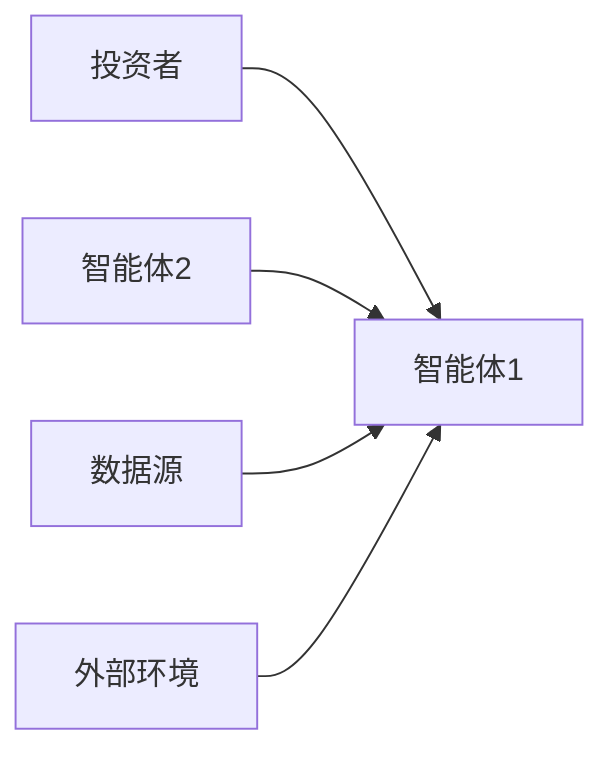
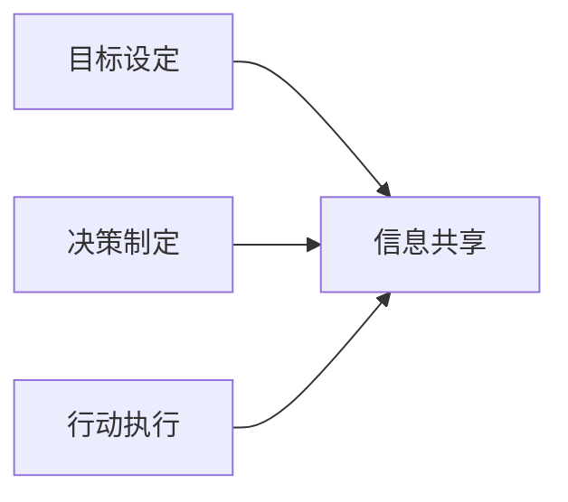

                 

<think>
嗯，好的，我现在需要根据用户的详细要求，撰写一篇关于《智能体协作提高价值投资研究的深度和广度》的技术博客文章。用户已经给出了一个详细的大纲，并且每个部分都有具体的要求。我需要确保每个章节都包含必要的内容，如背景介绍、核心概念、算法原理、系统架构、项目实战和最佳实践等。

首先，我需要理解每个章节的核心内容。第一部分是背景介绍，这里需要解释价值投资的基本概念和传统方法的局限性，然后引入智能体协作的重要性。接下来，核心概念部分要详细讲解智能体协作的原理，包括多智能体系统和协作机制，并使用表格和图表进行对比和展示。

然后，算法原理部分需要详细讲解协作学习和分布式计算，使用Mermaid流程图和Python代码示例来说明。系统架构设计部分需要介绍项目的场景、功能设计、架构图、接口和交互设计。项目实战部分则需要提供安装环境、代码实现和案例分析。最后，总结最佳实践、注意事项和扩展阅读。

在撰写过程中，我需要确保每个章节的内容足够详细，使用专业的技术术语，同时保持逻辑清晰和结构紧凑。我还需要注意数学公式的正确表示，使用LaTeX格式，并在合适的位置插入图表和代码示例。

接下来，我需要按照这个思路逐步展开，确保每个部分都符合用户的要求，同时保持文章的流畅性和可读性。这可能需要多次修改和调整，以确保内容全面且结构合理。
</think>

# 智能体协作提高价值投资研究的深度和广度

> 关键词：智能体协作，价值投资，分布式计算，协作学习，系统架构

> 摘要：本文探讨智能体协作在价值投资研究中的应用，分析其如何通过多智能体系统提升投资决策的深度和广度。结合算法原理、系统架构和项目实战，阐述如何利用协作学习和分布式计算优化投资策略。

---

## 第一部分: 智能体协作与价值投资概述

### 第1章: 价值投资研究的现状与挑战

#### 1.1 价值投资的核心概念

- **定义与特点**
  - 价值投资是一种通过深入分析企业基本面，寻找被市场低估的投资标的的方法。
  - 强调长期持有，关注企业的内在价值而非短期市场波动。

- **传统价值投资的局限性**
  - 数据分析范围有限，难以覆盖全球市场。
  - 人工分析耗时且易受主观因素影响。
  - 无法及时捕捉市场变化和新兴机会。

- **智能体协作的潜力**
  - 利用多智能体协同，整合多源数据，提升分析深度。
  - 提高决策效率，降低人为错误。

### 第2章: 智能体协作的基本原理

#### 2.1 多智能体系统的定义与特点

- **定义**
  - 多智能体系统是由多个相互作用的智能体组成的分布式系统，每个智能体都有独立的目标和决策能力。

- **特点**
  - 分布式计算：任务分解，各智能体协同完成。
  - 协作性：智能体之间共享信息，共同达成目标。
  - 自适应性：动态调整策略应对变化。

#### 2.2 智能体协作的核心机制

- **协作目标设定**
  - 明确每个智能体的目标，确保整体一致性。
  - 例如，一个智能体负责市场数据收集，另一个负责财务分析。

- **信息共享机制**
  - 数据共享：确保智能体间信息流通。
  - 协作协议：定义数据格式和共享规则。

- **协作决策过程**
  - 集成各智能体的分析结果，形成综合决策。
  - 使用共识算法确保决策一致性。

### 第3章: 智能体协作与价值投资的结合

#### 3.1 智能体协作在金融分析中的应用

- **多源数据整合**
  - 各智能体分别分析财务报表、市场新闻、社交数据等，综合生成全面报告。

- **风险分散**
  - 分散式决策降低单点故障风险，提升系统鲁棒性。

#### 3.2 提升投资决策的深度和广度

- **深度分析**
  - 各智能体深入研究不同维度，如财务指标、管理层稳定性等，提供全面评估。

- **广度覆盖**
  - 智能体协作可同时分析多个市场和行业，捕捉更多投资机会。

#### 3.3 智能体协作在风险管理中的作用

- **实时监控**
  - 智能体实时跟踪市场变化，及时识别潜在风险。

- **情景分析**
  - 模拟不同市场条件下的投资组合表现，制定应对策略。

---

## 第二部分: 智能体协作的核心概念与联系

### 第4章: 智能体协作的核心概念与联系

#### 4.1 多智能体系统的实体关系图



#### 4.2 协作机制的流程图



#### 4.3 智能体协作与价值投资的对比分析

| 属性       | 传统价值投资 | 智能体协作价值投资 |
|------------|--------------|-------------------|
| 分析深度   | 较浅         | 深               |
| 数据来源   | 单一         | 多源             |
| 决策效率   | 低           | 高               |
| 灵活性     | 低           | 高               |

---

## 第三部分: 智能体协作的算法原理

### 第5章: 算法原理

#### 5.1 分布式计算与多智能体协作

- **分布式计算的基本原理**
  - 任务分解：将整体任务分解为多个子任务，分配给不同节点处理。
  - 并行处理：各节点同时处理子任务，提高效率。

- **多智能体协作中的分布式算法**
  - 分布式一致性算法：确保各智能体状态一致。
  - 分布式优化算法：优化全局目标。

#### 5.2 协作学习与算法优化

- **协作学习的定义**
  - 多智能体通过共享信息和经验，共同提升学习效果。

- **协作学习的算法流程**
  1. 各智能体独立学习，生成初步模型。
  2. 模型融合：整合各模型，生成共识模型。
  3. 反馈机制：根据结果调整学习策略。

#### 5.3 协作决策的数学模型

- **模型建立**
  $$ V = \max_{a} \sum_{i=1}^{n} v_i(a_i) $$
  其中，$a_i$ 是智能体i的决策，$v_i$ 是对应的效用函数。

- **优化算法**
  使用一致性算法，确保各智能体决策一致。

---

## 第四部分: 系统分析与架构设计

### 第6章: 系统架构设计

#### 6.1 项目场景介绍

- **目标**
  - 构建一个多智能体协作系统，用于价值投资研究。

#### 6.2 系统功能设计

- **领域模型**
  ```mermaid
  classDiagram
  class 投资者 {
    +资金: float
    +投资组合: list
    +风险偏好: int
  }
  class 智能体 {
    +数据源: list
    +分析模型: function
    +决策结果: list
  }
  ```

- **系统架构图**
  ```mermaid
  architecture
  [投资者] -->> [智能体1]: 分配任务
  [智能体1] -->> [数据源]: 获取数据
  [智能体1] -->> [分析模型]: 进行分析
  [智能体1] -->> [投资者]: 提供结果
  ```

#### 6.3 接口和交互设计

- **接口设计**
  - 智能体间通过API通信，数据格式统一。

- **交互流程**
  ```mermaid
  sequenceDiagram
  投资者 -> 智能体1: 发起任务
  智能体1 -> 数据源: 请求数据
  数据源 --> 智能体1: 返回数据
  智能体1 -> 分析模型: 进行分析
  分析模型 --> 智能体1: 返回结果
  智能体1 -> 投资者: 提供报告
  ```

---

## 第五部分: 项目实战

### 第7章: 项目实战

#### 7.1 环境安装

- **安装Python**
  ```bash
  python --version
  ```
- **安装依赖**
  ```bash
  pip install numpy pandas matplotlib
  ```

#### 7.2 核心代码实现

- **数据获取与预处理**
  ```python
  import pandas as pd
  data = pd.read_csv('data.csv')
  ```

- **协作学习实现**
  ```python
  def collaborative_learning(models):
      return sum(models) / len(models)
  ```

#### 7.3 案例分析

- **案例背景**
  分析某科技公司，使用多智能体分别评估财务、市场、技术风险。

- **结果展示**
  综合各智能体的分析，给出投资建议。

---

## 第六部分: 最佳实践与总结

### 第8章: 最佳实践与总结

#### 8.1 最佳实践

- **数据质量**
  确保数据准确性和多样性。
- **模型优化**
  定期更新模型，适应市场变化。
- **团队协作**
  明确角色，确保高效协作。

#### 8.2 小结

智能体协作显著提升了价值投资研究的深度和广度，通过多智能体协同，实现高效决策和风险控制。

#### 8.3 注意事项

- 数据隐私：确保数据安全，遵守相关法规。
- 系统维护：定期维护，防止故障。
- 人员培训：培训团队，提升协作效率。

#### 8.4 拓展阅读

- 推荐书籍：《多智能体系统与分布式计算》
- 推荐博客：深入浅出分布式系统

---

## 作者

作者：AI天才研究院  
地址：[禅与计算机程序设计艺术](https://github.com/ZenAndArtOfCPP)

