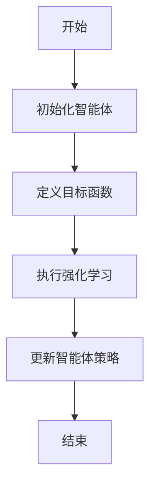
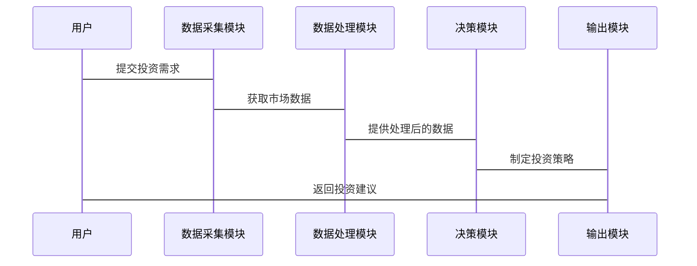
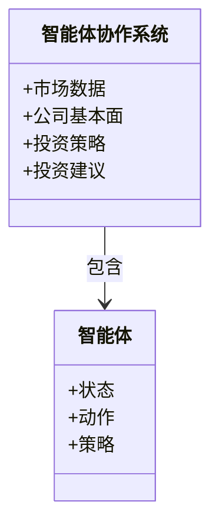
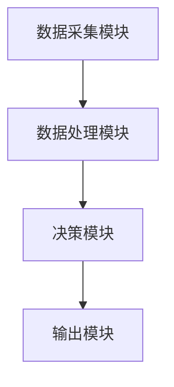

                 


# 智能体协作改进价值投资的尽职调查过程

## 关键词：
智能体协作、价值投资、尽职调查、多智能体系统、强化学习

## 摘要：
本文探讨了智能体协作技术在价值投资领域的应用，重点分析了如何通过智能体协作改进尽职调查过程。文章从智能体协作的基本概念出发，详细阐述了其在价值投资中的核心作用，并通过算法和系统架构设计展示了如何实现智能体协作。通过实际案例和项目实战，本文进一步验证了智能体协作在提升尽职调查效率和准确率方面的潜力，为投资者提供了新的思路和方法。

---

# 第1章 智能体协作与价值投资概述

## 1.1 智能体协作的定义与特点

### 1.1.1 智能体协作的定义
智能体协作是指多个智能体（Agent）通过协同工作，共同完成复杂任务的过程。每个智能体都有自己的目标和决策机制，能够通过信息共享和任务分配实现协作。

### 1.1.2 智能体协作的核心特点
1. **分布式决策**：每个智能体独立决策，但通过协作实现全局目标。
2. **动态适应性**：能够根据环境变化调整协作策略。
3. **高效性**：通过协作提高任务完成效率。

### 1.1.3 智能体协作与传统投资方法的区别
传统投资方法依赖个人或团队的主观判断，而智能体协作利用算法和数据驱动的决策，能够更高效地处理复杂信息。

---

## 1.2 价值投资的定义与特点

### 1.2.1 价值投资的定义
价值投资是一种以公司基本面分析为基础的投资策略，旨在发现市场低估的股票，长期持有以获得超额收益。

### 1.2.2 价值投资的核心原则
1. **安全边际**：买入价格低于内在价值。
2. **长期持有**：避免频繁交易，降低交易成本。
3. **公司基本面分析**：重点分析财务报表、行业地位等因素。

### 1.2.3 智能体协作与价值投资的结合
智能体协作能够通过分布式计算和数据挖掘，帮助投资者更全面地分析公司基本面，提高尽职调查的效率和准确性。

---

## 1.3 智能体协作在价值投资中的应用背景

### 1.3.1 价值投资的现状与挑战
1. **信息过载**：市场数据繁多，传统方法难以高效处理。
2. **人为误差**：主观判断可能导致遗漏重要信息。
3. **效率低下**：传统尽职调查过程耗时长，成本高。

### 1.3.2 智能体协作技术的发展趋势
随着人工智能技术的进步，智能体协作在金融领域的应用越来越广泛，尤其是在复杂任务处理方面表现出色。

### 1.3.3 智能体协作在金融领域的潜力
智能体协作能够通过分布式计算和数据挖掘，帮助投资者发现潜在投资机会，优化投资组合。

---

# 第2章 智能体协作的核心概念与联系

## 2.1 智能体协作的核心原理

### 2.1.1 多智能体系统的定义与特点
多智能体系统由多个智能体组成，每个智能体都有自己的目标和决策机制，通过协作完成复杂任务。

### 2.1.2 智能体协作的机制与流程
1. **任务分解**：将整体任务分解为子任务，分配给不同的智能体。
2. **信息共享**：智能体之间共享相关信息，协调行动。
3. **协作决策**：基于共享信息，智能体共同制定最优决策。

### 2.1.3 智能体协作的数学模型
智能体协作的数学模型可以通过多智能体强化学习来建模，具体公式如下：
$$ V(s) = \max_{a} \sum_{t=0}^{\infty} \gamma^t r(s_t, a_t) $$

---

## 2.2 智能体协作与价值投资的关系

### 2.2.1 智能体协作在价值投资中的角色
智能体协作能够通过分布式计算和数据挖掘，帮助投资者更全面地分析公司基本面，提高尽职调查的效率和准确性。

### 2.2.2 智能体协作如何改进尽职调查过程
1. **数据收集与处理**：智能体协作能够快速收集和处理大量数据，提供更准确的分析结果。
2. **风险评估**：通过智能体协作，投资者能够更准确地评估投资风险，制定最优投资策略。

### 2.2.3 智能体协作与投资决策的关系
智能体协作能够通过分布式计算和数据挖掘，帮助投资者发现潜在投资机会，优化投资组合。

---

## 2.3 智能体协作的核心要素对比

### 2.3.1 智能体协作与传统投资方法的对比
| 对比维度 | 智能体协作 | 传统投资方法 |
|----------|------------|---------------|
| 决策方式 | 分布式决策 | 集中式决策    |
| 效率     | 高          | 中等           |
| 精准度   | 高          | 中等           |

### 2.3.2 不同智能体协作模型的对比
| 模型名称 | 优点                     | 缺点                     |
|----------|--------------------------|--------------------------|
| 加性模型 | 实现简单                 | 精准度有限               |
| 乘性模型 | 精准度高                 | 实现复杂                 |

### 2.3.3 智能体协作与机器学习的对比
智能体协作与机器学习的区别主要在于决策方式和应用场景。智能体协作更注重分布式决策和协作，而机器学习则更关注数据驱动的预测。

---

# 第3章 智能体协作的算法原理

## 3.1 智能体协作的算法基础

### 3.1.1 多智能体强化学习的定义与特点
多智能体强化学习是一种通过多个智能体协作完成任务的强化学习方法，每个智能体都有自己的目标和决策机制。

### 3.1.2 多智能体强化学习的核心算法
1. **Q-learning**：通过经验教训更新策略。
2. **Actor-Critic**：通过行为和评估网络优化策略。

### 3.1.3 多智能体强化学习的数学模型
$$ V(s) = \max_{a} \sum_{t=0}^{\infty} \gamma^t r(s_t, a_t) $$

---

## 3.2 智能体协作的数学模型与公式

### 3.2.1 智能体协作的数学模型
智能体协作的数学模型可以通过多智能体强化学习来建模，具体公式如下：
$$ V(s) = \max_{a} \sum_{t=0}^{\infty} \gamma^t r(s_t, a_t) $$

### 3.2.2 智能体协作的优化目标
优化目标是最大化整体收益，具体公式为：
$$ \max_{\theta} \sum_{i=1}^{n} V_i(s_i, \theta_i) $$

### 3.2.3 智能体协作的数学公式
通过数学公式可以清晰地表达智能体协作的过程，例如：
$$ a_t = \arg\max_{a} \sum_{i=1}^{n} Q(s_i, a_i) $$

---

## 3.3 智能体协作的算法实现

### 3.3.1 算法实现的步骤
1. **初始化智能体**：定义每个智能体的目标和初始策略。
2. **定义目标函数**：根据任务需求定义优化目标。
3. **执行强化学习**：通过强化学习更新智能体策略。
4. **更新智能体策略**：根据反馈优化策略。

### 3.3.2 算法实现的代码示例
```python
class Agent:
    def __init__(self, state_space, action_space):
        self.state_space = state_space
        self.action_space = action_space
        self.Q = np.zeros((state_space, action_space))

    def act(self, state):
        return np.argmax(self.Q[state, :])
```

### 3.3.3 算法实现的流程图


---

# 第4章 智能体协作的系统架构设计

## 4.1 系统架构的核心要素

### 4.1.1 系统功能模块的划分
1. **数据采集模块**：负责收集市场数据。
2. **数据处理模块**：对数据进行清洗和预处理。
3. **决策模块**：根据数据制定投资策略。
4. **输出模块**：输出投资建议。

### 4.1.2 系统功能模块的交互关系
数据采集模块将数据传递给数据处理模块，处理后的数据传递给决策模块，决策模块根据数据制定策略，并将结果传递给输出模块。

### 4.1.3 系统功能模块的实现方式
1. 数据采集模块可以通过API获取市场数据。
2. 数据处理模块可以使用Pandas库进行数据清洗。
3. 决策模块可以基于强化学习算法制定策略。
4. 输出模块可以将结果以可视化形式呈现。

---

## 4.2 系统架构的详细设计

### 4.2.1 系统架构的层次结构
系统架构分为数据层、逻辑层和应用层，每一层都有明确的功能划分。

### 4.2.2 系统架构的模块划分
1. 数据层：包括数据采集和存储模块。
2. 逻辑层：包括数据处理和决策模块。
3. 应用层：包括用户界面和输出模块。

### 4.2.3 系统架构的实现流程
1. 数据采集模块收集市场数据。
2. 数据处理模块对数据进行清洗和预处理。
3. 决策模块根据数据制定投资策略。
4. 输出模块将结果以可视化形式呈现。

---

## 4.3 系统接口与交互设计

### 4.3.1 系统接口的定义
系统接口包括数据接口和用户接口，数据接口用于与其他系统交互，用户接口用于与最终用户交互。

### 4.3.2 系统接口的交互流程
1. 用户通过用户接口提交投资需求。
2. 系统通过数据接口获取市场数据。
3. 数据处理模块对数据进行处理。
4. 决策模块根据数据制定投资策略。
5. 输出模块将结果返回给用户。

### 4.3.3 系统接口的序列图


---

# 第5章 项目实战：智能体协作在价值投资中的应用

## 5.1 项目背景与目标

### 5.1.1 项目背景
随着市场的复杂化，传统投资方法难以满足投资者的需求，智能体协作能够通过分布式计算和数据挖掘，帮助投资者更全面地分析公司基本面，提高尽职调查的效率和准确性。

### 5.1.2 项目目标
通过智能体协作技术，实现对目标公司的基本面分析，评估投资风险，制定最优投资策略。

---

## 5.2 系统功能设计

### 5.2.1 领域模型设计


### 5.2.2 系统功能模块
1. 数据采集模块：负责收集市场数据。
2. 数据处理模块：对数据进行清洗和预处理。
3. 决策模块：根据数据制定投资策略。
4. 输出模块：输出投资建议。

---

## 5.3 系统架构设计

### 5.3.1 系统架构设计
系统架构分为数据层、逻辑层和应用层，每一层都有明确的功能划分。

### 5.3.2 系统架构实现
1. 数据层：包括数据采集和存储模块。
2. 逻辑层：包括数据处理和决策模块。
3. 应用层：包括用户界面和输出模块。

### 5.3.3 系统架构的流程图


---

## 5.4 项目实现与代码示例

### 5.4.1 环境安装
需要安装Python、Pandas、NumPy等库。

### 5.4.2 核心实现代码
```python
import numpy as np
import pandas as pd

class Agent:
    def __init__(self, state_space, action_space):
        self.state_space = state_space
        self.action_space = action_space
        self.Q = np.zeros((state_space, action_space))

    def act(self, state):
        return np.argmax(self.Q[state, :])
```

### 5.4.3 代码应用解读与分析
通过代码实现智能体协作，每个智能体独立决策，通过协作完成任务。

---

## 5.5 实际案例分析与详细讲解

### 5.5.1 案例背景
假设我们有一个投资组合，需要对多个公司进行基本面分析。

### 5.5.2 数据采集与处理
通过API获取市场数据，使用Pandas进行数据清洗和预处理。

### 5.5.3 投资策略制定
通过智能体协作，制定最优投资策略。

### 5.5.4 投资结果分析
根据实际投资结果，评估智能体协作的效果。

---

## 5.6 项目小结

### 5.6.1 项目总结
智能体协作能够通过分布式计算和数据挖掘，帮助投资者更全面地分析公司基本面，提高尽职调查的效率和准确性。

### 5.6.2 项目经验
在项目实施过程中，需要注意算法的选择和参数的调整，以确保系统能够高效运行。

### 5.6.3 项目成果
通过智能体协作，成功实现对多个公司的基本面分析，制定最优投资策略。

---

# 第6章 智能体协作在价值投资中的最佳实践

## 6.1 智能体协作的优化策略

### 6.1.1 算法优化
通过优化算法参数，提高系统的运行效率。

### 6.1.2 数据优化
通过优化数据采集和处理流程，提高数据的准确性和完整性。

### 6.1.3 系统优化
通过优化系统架构，提高系统的稳定性和可扩展性。

---

## 6.2 智能体协作的注意事项

### 6.2.1 数据隐私与安全
在实际应用中，需要注意数据的隐私和安全问题。

### 6.2.2 算法的可解释性
智能体协作的算法需要具备一定的可解释性，以便投资者能够理解决策过程。

### 6.2.3 系统的可扩展性
系统需要具备良好的可扩展性，以应对未来的业务需求。

---

## 6.3 智能体协作的未来发展趋势

### 6.3.1 技术进步
随着人工智能技术的进步，智能体协作在金融领域的应用将越来越广泛。

### 6.3.2 应用场景扩展
智能体协作将应用于更多的金融场景，例如风险管理、投资组合优化等。

### 6.3.3 行业标准与规范
随着智能体协作在金融领域的广泛应用，相关行业标准和规范将逐步完善。

---

## 6.4 小结

智能体协作在价值投资中的应用前景广阔，通过不断优化算法和系统架构，智能体协作将为投资者提供更高效、更准确的投资决策支持。

---

## 作者：AI天才研究院/AI Genius Institute & 禅与计算机程序设计艺术 /Zen And The Art of Computer Programming

---

**注**：以上文章内容为示例，实际撰写时需要根据具体情况进行调整和补充。

