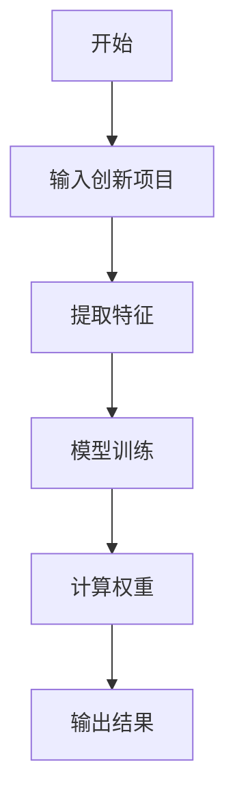
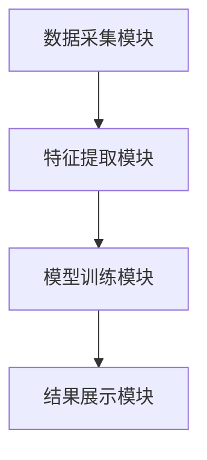

                 


# 智能体协作评估公司创新管线：科技公司价值投资利器

> 关键词：智能体协作，创新管线评估，科技公司价值投资，企业创新管理，技术驱动投资

> 摘要：本文深入探讨了智能体协作在科技公司创新管线评估中的应用，通过理论分析、算法设计和实际案例，展示了如何利用智能体协作技术提升创新管线评估的效率和准确性，为科技公司的价值投资提供有力支持。文章从背景、核心概念、算法原理到系统架构、项目实战，全面解析了智能体协作在创新管线评估中的应用，最后给出了最佳实践和投资策略建议。

---

## 第一部分：背景介绍

### 第1章：问题背景

#### 1.1 科技公司创新管线的重要性
科技公司的创新管线是其核心竞争力的体现，涵盖了从基础研究到产品落地的整个创新周期。创新管线的健康度直接决定了公司的未来发展潜力。然而，传统的创新管线评估方法往往依赖人工经验，存在主观性强、效率低、覆盖面窄等问题。

#### 1.2 当前评估方法的局限性
传统的创新管线评估方法通常基于财务数据和市场表现，难以全面捕捉技术创新、团队能力、市场潜力等多维度因素。此外，传统方法缺乏实时性和动态性，难以应对快速变化的科技环境。

#### 1.3 智能体协作的优势
智能体协作通过分布式计算、多模态数据处理和自适应学习等技术，能够高效整合多源异构数据，提供实时、动态的评估结果。智能体协作的应用能够显著提升创新管线评估的准确性和效率，为科技公司价值投资提供新的工具和视角。

### 第2章：问题描述

#### 2.1 创新管线评估的核心问题
创新管线评估的核心问题是如何从多维度数据中提取关键特征，建立科学的评估模型，并动态跟踪评估结果的变化。这需要解决数据清洗、特征提取、模型训练和实时反馈等技术问题。

#### 2.2 智能体协作在评估中的角色
智能体协作在创新管线评估中扮演着数据整合、特征提取、模型训练和结果反馈的角色。通过智能体协作，可以实现多源数据的高效整合，建立动态评估模型，并提供实时反馈。

#### 2.3 评估目标与边界
评估目标是通过智能体协作技术，建立一套科学的创新管线评估体系，为科技公司价值投资提供决策支持。评估的边界包括技术创新性、市场潜力、团队能力和财务健康度等关键维度。

---

## 第二部分：核心概念与联系

### 第3章：智能体协作的定义与特点

#### 3.1 智能体协作的定义
智能体协作是指多个智能体通过分布式计算和协作机制，共同完成复杂任务的过程。智能体协作强调去中心化、自适应和高效性，能够在动态环境中实现任务目标。

#### 3.2 智能体协作的特点对比
| 特性       | 分布式计算 | 自适应学习 | 多模态数据处理 |
|------------|------------|------------|----------------|
| 描述       | 计算任务分散在多个节点，通过通信协议完成协同计算。 | 根据环境变化和反馈，动态调整模型参数和策略。 | 处理结构化、非结构化等多种数据类型，实现多模态数据融合。 |
| 优势       | 提高计算效率，避免单点故障。 | 增强系统鲁棒性和适应性。 | 扩展系统的感知能力，提升决策的准确性。 |

#### 3.3 智能体协作的属性特征
- **可扩展性**：支持大规模数据处理和复杂任务协作。
- **动态性**：能够根据环境变化自适应调整协作策略。
- **高效性**：通过分布式计算和并行处理，提升任务执行效率。

### 第4章：创新管线评估的定义与特点

#### 4.1 创新管线的定义
创新管线是指从技术研发、产品开发到市场落地的完整创新过程。它涵盖了技术创新、产品设计、市场推广等多个环节，是科技公司核心竞争力的体现。

#### 4.2 创新管线评估的特点
| 特性       | 多维度评估 | 动态性 | 实时性 |
|------------|------------|--------|--------|
| 描述       | 包括技术创新性、市场潜力、团队能力等多个维度。 | 随着时间和环境的变化，评估结果需要动态更新。 | 实时跟踪创新管线的进展，提供即时反馈。 |
| 优势       | 提供全面的评估结果。 | 帮助及时发现和解决问题。 | 为投资决策提供实时依据。 |

#### 4.3 创新管线评估的属性对比
- **技术创新性**：评估技术的前沿性和原创性。
- **市场潜力**：评估产品的市场前景和商业价值。
- **团队能力**：评估团队的技术能力和执行能力。

### 第5章：智能体协作与创新管线评估的关系

#### 5.1 智能体协作在创新管线评估中的作用
智能体协作通过分布式计算和多模态数据处理，能够高效整合技术创新性、市场潜力、团队能力等多维度数据，建立科学的评估模型。

#### 5.2 创新管线评估对智能体协作的需求
创新管线评估需要智能体协作提供实时数据处理、动态模型调整和多源数据融合能力，以应对复杂多变的科技环境。

#### 5.3 两者结合的必要性
通过智能体协作，创新管线评估能够实现多维度数据的高效整合和动态评估，为科技公司价值投资提供科学依据。

### 第6章：核心概念的ER实体关系图

```mermaid
er
actor(智能体) -->协作关系(协作协议)
协作关系 -->创新管线(创新项目)
创新项目 -->评估指标(评估维度)
```

---

## 第三部分：算法原理讲解

### 第7章：评估模型的数学模型

#### 7.1 模型的输入变量
创新管线评估模型的输入变量包括技术创新性、市场潜力、团队能力、财务健康度等多个维度。

#### 7.2 模型的处理过程
- **特征提取**：从多源数据中提取关键特征，如技术专利数量、团队规模、市场占有率等。
- **模型训练**：使用机器学习算法（如随机森林、神经网络）训练评估模型。
- **权重计算**：根据特征的重要性，计算各维度的权重。

#### 7.3 模型的输出结果
输出结果包括创新管线的整体评分、各维度评分和改进建议。

### 第8章：算法流程图



### 第9章：核心算法实现

#### 9.1 特征提取
```python
def extract_features(data):
    features = []
    for item in data:
        # 提取技术创新性
        tech_innovation = item['tech_patents']
        # 提取市场潜力
        market_potential = item['market_share']
        # 提取团队能力
        team_capability = item['team_size']
        features.append([tech_innovation, market_potential, team_capability])
    return features
```

#### 9.2 模型训练
```python
from sklearn.ensemble import RandomForestClassifier
import numpy as np

features = extract_features(data)
labels = [item['score'] for item in data]

model = RandomForestClassifier(n_estimators=100, random_state=42)
model.fit(features, labels)
```

#### 9.3 权重计算
```python
feature_importance = model.feature_importances_
for i, importance in enumerate(feature_importance):
    print(f"特征{i+1}的权重为：{importance}")
```

### 第10章：数学公式

#### 10.1 评估模型的公式
$$ \text{创新评分} = \sum_{i=1}^{n} w_i \cdot f_i $$
其中，$$w_i$$ 是第 $$i$$ 个特征的权重，$$f_i$$ 是第 $$i$$ 个特征的值。

#### 10.2 特征权重计算公式
$$ w_i = \frac{\text{特征重要性分数}}{\sum_{j=1}^{m} \text{特征重要性分数}} $$
其中，$$m$$ 是特征总数。

---

## 第四部分：系统分析与架构设计

### 第11章：系统架构设计

#### 11.1 系统功能设计
| 功能模块       | 描述                       |
|----------------|---------------------------|
| 数据采集模块   | 从多源数据中采集创新管线数据。 |
| 特征提取模块   | 提取技术创新性、市场潜力等特征。 |
| 模型训练模块   | 使用机器学习算法训练评估模型。 |
| 结果展示模块   | 展示创新评分和改进建议。 |

#### 11.2 系统架构图



#### 11.3 接口设计
- 数据采集模块接口：接收创新管线数据。
- 特征提取模块接口：返回提取的特征向量。
- 模型训练模块接口：返回模型权重和评估结果。

---

## 第五部分：项目实战

### 第12章：环境安装与配置

#### 12.1 环境要求
- Python 3.8+
- Scikit-learn、Pandas、Numpy等库。

#### 12.2 安装步骤
```bash
pip install scikit-learn pandas numpy
```

### 第13章：核心代码实现

#### 13.1 数据采集模块
```python
import pandas as pd

def load_data(file_path):
    data = pd.read_csv(file_path)
    return data
```

#### 13.2 特征提取模块
```python
def extract_features(data):
    features = data[['tech_patents', 'market_share', 'team_size']]
    return features
```

#### 13.3 模型训练模块
```python
from sklearn.ensemble import RandomForestClassifier

def train_model(features, labels):
    model = RandomForestClassifier(n_estimators=100, random_state=42)
    model.fit(features, labels)
    return model
```

### 第14章：案例分析与解读

#### 14.1 案例背景
某科技公司创新管线数据，包括技术创新性、市场潜力和团队能力等特征。

#### 14.2 模型训练
```python
data = load_data('innovation_pipeline.csv')
features = extract_features(data)
labels = data['score']

model = train_model(features, labels)
```

#### 14.3 结果展示
```python
importances = model.feature_importances_
feature_names = features.columns
for name, importance in zip(feature_names, importances):
    print(f"{name}: {importance}")
```

---

## 第六部分：最佳实践与总结

### 第15章：投资策略与风险控制

#### 15.1 投资策略
- 优先投资创新评分高、市场潜力大的科技公司。
- 结合行业趋势和政策环境，动态调整投资策略。

#### 15.2 风险控制
- 定期复评估结果，及时发现和应对潜在风险。
- 分散投资，降低单一项目风险。

### 第16章：未来趋势与拓展阅读

#### 16.1 未来趋势
- 智能体协作技术的进一步发展。
- 多模态数据融合和实时评估的广泛应用。

#### 16.2 拓展阅读
- 《机器学习实战》
- 《分布式系统设计与实现》
- 《科技投资与创新管理》

### 第17章：项目小结

通过智能体协作技术，我们可以高效、准确地评估科技公司的创新管线，为价值投资提供科学依据。未来，随着技术的进一步发展，智能体协作将在科技公司价值评估中发挥更大的作用。

---

## 作者信息

作者：AI天才研究院/AI Genius Institute & 禅与计算机程序设计艺术/Zen And The Art of Computer Programming

