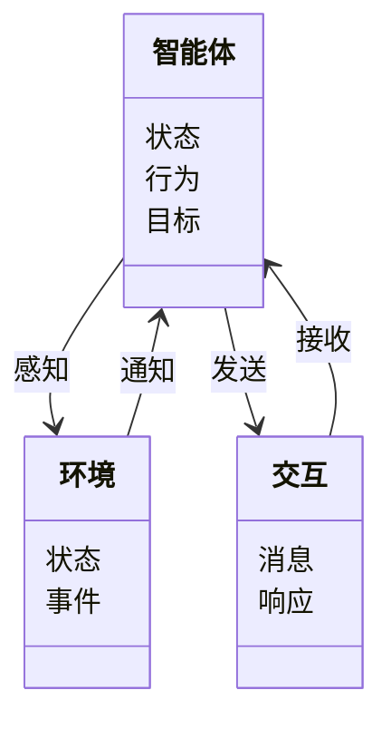
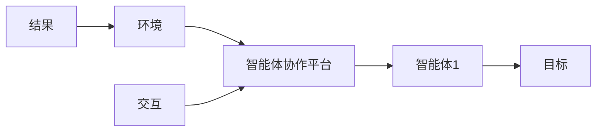
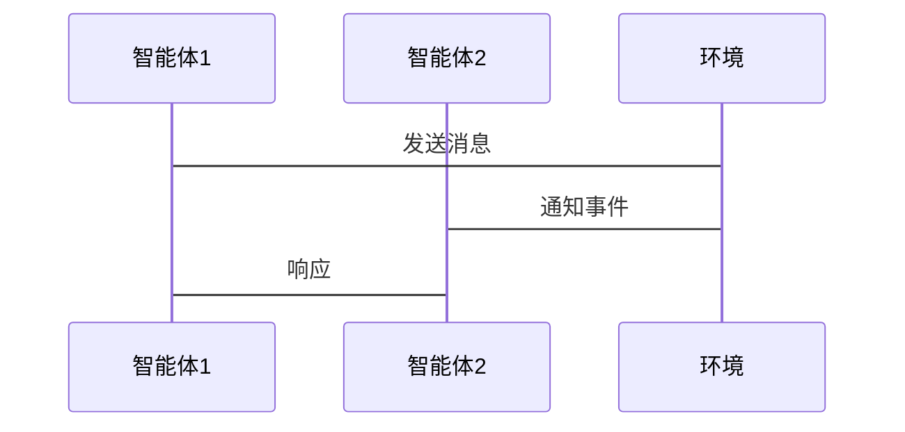

                 


# 智能体协作评估公司数字化转型进程：把握增长机遇

> **关键词**：智能体协作、数字化转型、企业增长、技术评估、系统架构  
> **摘要**：随着数字化转型的深入推进，智能体协作作为一项新兴技术，正在为企业提供更高效、更灵活的协作方式，助力企业在数字化转型中抓住增长机遇。本文从智能体协作的核心概念、算法原理、系统架构、项目实战等多个方面展开分析，为企业提供一份详尽的技术指南。

---

## 第一部分：背景与概述

### 第1章：数字化转型与智能体协作概述

#### 1.1 数字化转型的背景与挑战

- **问题背景**：数字化转型是企业应对市场竞争和技术创新的必然选择。然而，企业在转型过程中常常面临协作效率低下、资源浪费、信息孤岛等问题。
- **问题描述**：企业内部的协作流程复杂，各部门之间的信息不透明，导致决策滞后、执行不力。
- **解决方法**：引入智能体协作技术，通过自动化和智能化的方式优化企业协作流程，提升整体效率。
- **边界与外延**：智能体协作不仅限于企业内部，还可以扩展到供应链、合作伙伴等外部生态系统的协作。
- **概念结构**：智能体协作涉及智能体、目标、环境、交互等多个核心要素。

#### 1.2 智能体协作的基本概念

- **智能体的定义与特征**：智能体是一种能够感知环境、自主决策并执行任务的实体。其特征包括自主性、反应性、协作性和社会性。
- **智能体协作的定义与模式**：智能体协作是指多个智能体通过协同工作，共同完成特定目标的过程。常见的协作模式包括任务分配、信息共享和决策共识。
- **智能体协作与数字化转型的关系**：智能体协作是数字化转型的核心驱动力，通过智能化的协作方式，企业能够更快地响应市场需求，优化资源配置。

#### 1.3 本书的核心目标与框架

- **核心目标**：帮助读者理解智能体协作的技术原理，并将其应用于企业的数字化转型中，实现高效协作和增长。
- **框架与结构**：文章分为背景与概述、算法原理与数学模型、系统分析与架构设计、项目实战、最佳实践与未来展望五个部分。
- **读者群体**：企业IT架构师、数字化转型负责人、技术管理者及对智能体协作感兴趣的研究者。

---

## 第二部分：算法原理与数学模型

### 第2章：智能体协作的核心算法

#### 2.1 协同过滤算法

- **基本原理**：协同过滤基于“用户-用户”或“物品-物品”相似性推荐相关内容或任务。
- **实现步骤**：
  1. 收集用户行为数据。
  2. 计算用户或物品之间的相似度。
  3. 根据相似度推荐相关内容。
- **代码示例**：
  ```python
  def collaborative_filtering(user_matrix):
      # 计算相似度
      similarity = cosine_similarity(user_matrix)
      # 推荐Top 3相似用户
      top_users = np.argsort(similarity, axis=0)[-3:]
      return top_users
  ```

#### 2.2 强化学习算法

- **基本原理**：强化学习通过智能体与环境的交互，学习最优策略以最大化累积奖励。
- **数学模型**：
  - 状态空间：S
  - 行动空间：A
  - 奖励函数：R: S×A→ℝ
  - 动作价值函数：Q: S×A→ℝ
  - 策略：π: S→A
- **代码示例**：
  ```python
  def q_learning(env, num_episodes=1000):
      Q = defaultdict(lambda: np.zeros(env.action_space.n))
      for _ in range(num_episodes):
          state = env.reset()
          while True:
              action = np.argmax(Q[state])
              next_state, reward, done, _ = env.step(action)
              Q[state][action] += reward
              state = next_state
              if done:
                  break
  ```

#### 2.3 联合学习算法

- **基本原理**：联合学习通过多个智能体的协作，共同优化全局目标。
- **实现步骤**：
  1. 初始化各智能体的参数。
  2. 各智能体独立学习并更新参数。
  3. 定期同步各智能体的参数，优化全局模型。
- **代码示例**：
  ```python
  def federated_learning(clients, global_model):
      for client in clients:
          # 更新客户端模型
          client.update_model(global_model)
          # 上传更新参数
          global_model.merge(client.get_params())
  ```

---

## 第三部分：系统分析与架构设计

### 第3章：系统架构与交互设计

#### 3.1 问题场景介绍

- **场景描述**：企业各部门需要通过智能体协作完成任务分配、信息共享和决策共识。
- **系统目标**：实现智能体协作的自动化、智能化和高效化。

#### 3.2 领域模型设计



#### 3.3 系统架构设计



#### 3.4 接口与交互设计



---

## 第四部分：项目实战

### 第4章：智能体协作项目实战

#### 4.1 环境安装与配置

- **工具安装**：安装Python、TensorFlow、Scikit-learn等工具。
- **依赖管理**：使用pip安装所需的依赖包。

#### 4.2 核心代码实现

- **协同过滤实现**：
  ```python
  from sklearn.metrics.pairwise import cosine_similarity

  def collaborative_filtering(user_matrix):
      similarity = cosine_similarity(user_matrix)
      return similarity
  ```

- **强化学习实现**：
  ```python
  import numpy as np

  def q_learning(env, num_episodes=1000):
      Q = defaultdict(lambda: np.zeros(env.action_space.n))
      for _ in range(num_episodes):
          state = env.reset()
          while not done:
              action = np.argmax(Q[state])
              next_state, reward, done, _ = env.step(action)
              Q[state][action] += reward
              state = next_state
      return Q
  ```

#### 4.3 案例分析与解读

- **案例背景**：某企业希望通过智能体协作优化供应链管理。
- **实施步骤**：
  1. 数据收集与预处理。
  2. 智能体协作算法的选择与实现。
  3. 系统测试与优化。

---

## 第五部分：最佳实践与未来展望

### 第5章：最佳实践与经验总结

#### 5.1 小结

- 智能体协作是一项复杂但极具潜力的技术，能够显著提升企业的协作效率和决策能力。

#### 5.2 注意事项

- 确保数据安全和隐私保护。
- 选择合适的协作模式和算法。
- 定期优化和更新系统。

#### 5.3 拓展阅读

- 推荐阅读《分布式系统与一致性》、《强化学习实战》等书籍。

---

## 结语

智能体协作作为数字化转型的重要技术，正在为企业带来前所未有的协作效率和增长机遇。通过本文的详细分析，读者可以深入了解智能体协作的核心原理和实现方法，并将其应用到实际项目中。

---

**作者：AI天才研究院/AI Genius Institute & 禅与计算机程序设计艺术 /Zen And The Art of Computer Programming**

