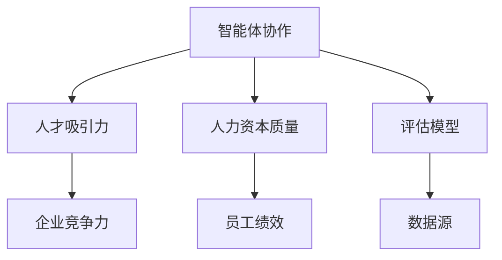
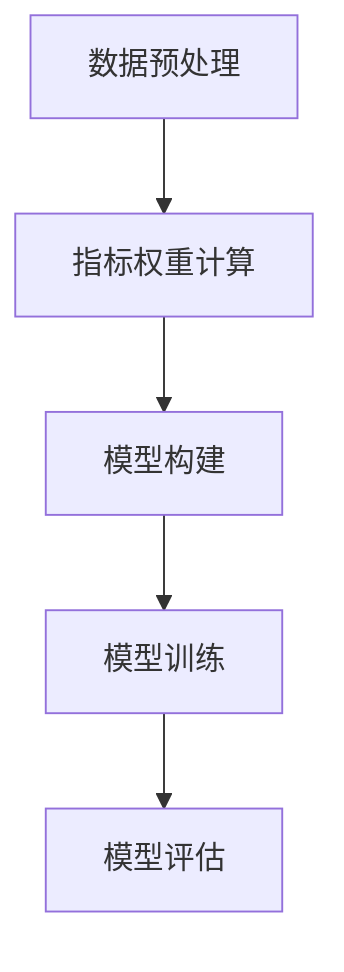
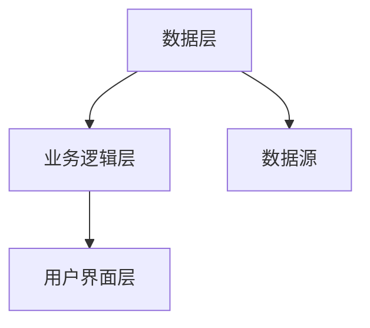
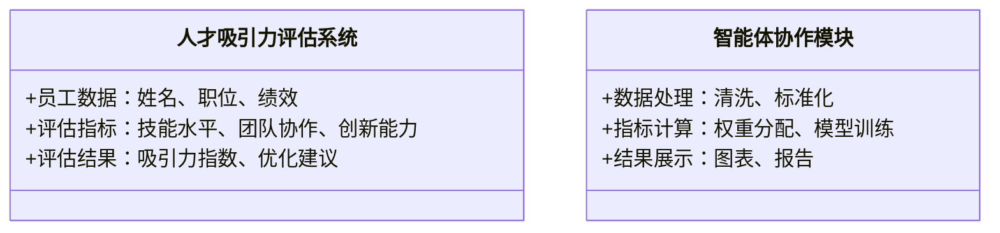

                 

<think>
好的，现在我要按照用户的要求来逐步撰写这篇技术博客文章。首先，我需要明确文章的结构和每个部分的内容。文章的标题是《智能体协作评估公司的人才吸引力：人力资本质量指标》，关键词包括智能体协作、人才吸引力、人力资本、质量指标、评估模型和数据分析。摘要部分需要简要介绍文章的核心内容，即如何通过智能体协作评估公司的人才吸引力，并分析人力资本质量指标。

接下来，我需要按照目录大纲的结构来撰写每个部分。首先是背景介绍，包括问题背景、问题描述、问题解决方法、边界和外延，以及概念结构和核心要素。然后是核心概念与联系，解释智能体协作的基本原理，并使用Mermaid图展示实体关系和属性对比。接着是算法原理，详细讲解评估算法的步骤，并提供Python代码示例和数学模型。之后是系统分析与架构设计，介绍系统架构、功能设计和接口设计。然后是项目实战，指导读者如何安装环境、编写代码并进行案例分析。最后是最佳实践，总结经验和注意事项，并提供拓展阅读的内容。

在写作过程中，我需要确保每个部分都详细且逻辑清晰，使用专业的技术语言，同时保持条理分明。我还需要在适当的地方插入Mermaid图表和数学公式，以增强文章的可读性和技术性。最后，确保文章字数在10000到12000字之间，并在结尾注明作者信息。

现在，我将逐步完成每个部分的撰写，确保内容全面且符合要求。
</think>

# 智能体协作评估公司的人才吸引力：人力资本质量指标

---

## 关键词：智能体协作、人才吸引力、人力资本、质量指标、评估模型、数据分析

---

## 摘要

随着企业竞争的日益激烈，人才吸引力已成为决定企业成功的关键因素之一。传统的评估方法往往依赖主观判断，难以量化和优化。本文通过引入智能体协作的概念，提出一种基于多智能体协作的人才吸引力评估模型，旨在量化分析人力资本质量指标，为企业优化人才战略提供科学依据。本文详细探讨了模型的构建过程，包括智能体协作的基本原理、评估算法的设计、系统架构的实现以及实际案例的应用，为企业的可持续发展提供新的思路。

---

## 第一部分：背景介绍

### 第1章：问题背景与描述

#### 1.1 人才吸引力的重要性

- **1.1.1 企业吸引人才的核心要素**
  - 企业文化、职业发展机会、薪酬福利、工作环境等因素直接影响人才吸引力。
  - 高质量的人才团队是企业创新和竞争力的源泉。

- **1.1.2 人才吸引力对企业竞争力的影响**
  - 吸引高素质人才有助于提升企业的研发能力和市场响应速度。
  - 人才吸引力强的企业更易在人才争夺战中占据优势。

- **1.1.3 当前人才市场的挑战与机遇**
  - 全球化和技术进步带来人才流动的增加，企业需要更灵活的策略。
  - 数字化转型对高技能人才的需求急剧增长，传统评估方法已无法满足需求。

#### 1.2 问题描述

- **1.2.1 传统人才评估方法的局限性**
  - 主观性过强，难以量化评估。
  - 评估指标单一，无法全面反映人才质量。
  - 缺乏动态调整能力，难以适应市场变化。

- **1.2.2 智能体协作在人才评估中的作用**
  - 多智能体协作通过数据驱动的方法，提供客观、动态的评估结果。
  - 通过智能体之间的协同，实现对人才吸引力的全面分析。

- **1.2.3 人力资本质量指标的定义与目标**
  - 定义：衡量人才质量的一系列量化指标，包括技能水平、团队协作能力、创新潜力等。
  - 目标：为企业提供科学依据，优化人才招聘和培养策略。

#### 1.3 问题解决方法

- **1.3.1 智能体协作的概念**
  - 多智能体系统：由多个智能体组成，每个智能体负责特定任务，协同完成整体目标。
  - 协作机制：智能体之间通过信息共享和任务分配实现协作。

- **1.3.2 人力资本质量指标的构建**
  - 指标体系：包括技术能力、团队合作、创新思维等多维度指标。
  - 数据来源：员工绩效数据、面试评估、员工满意度调查等。

- **1.3.3 智能体协作评估的实现步骤**
  - 数据收集：整合多源数据。
  - 指标计算：基于算法计算各指标的权重和评分。
  - 结果分析：生成评估报告，提出优化建议。

#### 1.4 边界与外延

- **1.4.1 智能体协作的适用范围**
  - 适用于中大型企业，数据量大，评估复杂。
  - 适合需要动态调整人才策略的企业。

- **1.4.2 人力资本质量指标的适用场景**
  - 人才招聘、团队建设、员工培训等场景。
  - 企业战略规划中的人才评估环节。

- **1.4.3 与其他评估方法的区别与联系**
  - 区别：基于数据驱动的协作方法，不同于传统的主观评估。
  - 联系：可以作为传统方法的补充，提升评估的客观性和科学性。

#### 1.5 概念结构与核心要素

- **1.5.1 智能体协作的基本结构**
  - 智能体：具备感知、决策、执行能力的实体。
  - 协作网络：智能体之间的连接和协作关系。

- **1.5.2 人力资本质量指标的核心要素**
  - 技能水平：技术能力、专业知识。
  - 团队协作：沟通能力、团队精神。
  - 创新能力：解决问题的能力、创新思维。

- **1.5.3 指标之间的关系与影响**
  - 技能水平是基础，团队协作是保障，创新能力是提升。
  - 各指标相互影响，共同决定人才质量。

---

## 第二部分：核心概念与联系

### 第2章：智能体协作原理

#### 2.1 多智能体系统概述

- **2.1.1 多智能体系统的定义**
  - 由多个智能体组成的分布式系统，每个智能体具备自主性、反应性和协作性。
  - 智能体之间通过通信和协作完成复杂任务。

- **2.1.2 智能体协作的基本特征**
  - 协作性：智能体之间协同工作，实现共同目标。
  - 分布式计算：任务分解，分布式处理。
  - 自适应性：能够根据环境变化调整协作策略。

- **2.1.3 智能体协作的应用场景**
  - 人力资源管理、项目管理、供应链优化等。

#### 2.2 智能体协作与人力资本评估的关系

- **2.2.1 智能体协作在人力资本评估中的应用**
  - 通过智能体协作，整合多源数据，提供全面的评估结果。
  - 智能体之间的协作实现数据的实时更新和动态分析。

- **2.2.2 智能体协作的核心优势**
  - 数据驱动，客观性强。
  - 动态调整，适应性强。
  - 高效协作，提升评估效率。

---

#### 图2-1：智能体协作与人力资本评估的实体关系图



---

## 第三部分：算法原理讲解

### 第3章：评估算法的设计与实现

#### 3.1 算法概述

- **3.1.1 算法目标**
  - 基于多智能体协作，评估人力资本质量。
  - 提供可量化的评估结果，支持决策优化。

- **3.1.2 算法输入**
  - 多源数据：员工绩效、面试评分、培训记录等。
  - 评估指标：技能水平、团队协作、创新能力。

- **3.1.3 算法输出**
  - 人才吸引力指数：综合评估结果。
  - 优化建议：针对指标不足的改进建议。

#### 3.2 算法实现步骤

- **3.2.1 数据预处理**
  - 数据清洗：处理缺失值、异常值。
  - 数据标准化：将不同量纲的数据统一处理。

- **3.2.2 指标权重计算**
  - 使用层次分析法（AHP）确定各指标的权重。
  - 示例：技能水平权重为0.4，团队协作权重为0.3，创新能力权重为0.3。

- **3.2.3 评估模型构建**
  - 使用线性回归模型预测人才吸引力指数。
  - 模型公式：$$吸引力指数 = \beta_0 + \beta_1 \times 技能水平 + \beta_2 \times 团队协作 + \beta_3 \times 创新能力$$

- **3.2.4 模型训练与优化**
  - 使用训练数据训练模型，调整参数。
  - 通过交叉验证优化模型性能。

- **3.2.5 模型评估**
  - 使用测试数据验证模型准确性。
  - 计算准确率、召回率等指标。

#### 3.3 算法实现代码示例

```python
import numpy as np
from sklearn.linear_model import LinearRegression
from sklearn.metrics import mean_squared_error

# 示例数据
X = np.array([[80, 70, 60],
              [75, 85, 85],
              [90, 80, 75],
              [65, 75, 85]])
y = np.array([88, 85, 89, 82])

# 模型训练
model = LinearRegression()
model.fit(X, y)

# 预测结果
y_pred = model.predict(X)
print("预测值：", y_pred)
print("均方误差：", mean_squared_error(y, y_pred))
```

---

#### 图3-1：评估算法的流程图



---

## 第四部分：系统分析与架构设计

### 第4章：系统架构与功能设计

#### 4.1 系统架构设计

- **4.1.1 系统组成**
  - 数据层：存储员工数据、评估指标。
  - 业务逻辑层：处理数据计算、模型应用。
  - 用户界面层：展示评估结果、优化建议。

- **4.1.2 系统架构图**



---

#### 4.2 系统功能设计

- **4.2.1 领域模型设计**



- **4.2.2 系统接口设计**
  - 输入接口：员工数据上传、指标选择。
  - 输出接口：评估结果展示、报告导出。

---

## 第五部分：项目实战

### 第5章：项目实现与案例分析

#### 5.1 环境安装与配置

- **5.1.1 安装Python环境**
  - 安装Python 3.8及以上版本。
  - 安装必要的库：numpy、pandas、scikit-learn、mermaid。

- **5.1.2 安装依赖项**
  ```bash
  pip install numpy pandas scikit-learn
  ```

#### 5.2 核心代码实现

- **5.2.1 数据预处理代码**
```python
import pandas as pd

# 读取数据
df = pd.read_csv('employee_data.csv')

# 数据清洗
df.dropna(inplace=True)
```

- **5.2.2 评估模型实现**
```python
from sklearn.linear_model import LinearRegression

# 训练模型
model = LinearRegression()
model.fit(X_train, y_train)

# 预测结果
y_pred = model.predict(X_test)
```

#### 5.3 案例分析与解读

- **5.3.1 案例背景**
  - 某科技公司希望优化人才招聘策略，提升人才吸引力。
  - 数据来源：员工绩效、面试评分、培训记录。

- **5.3.2 实施步骤**
  - 数据预处理：清洗和标准化数据。
  - 计算指标权重：使用层次分析法确定各指标的权重。
  - 构建评估模型：训练线性回归模型，预测吸引力指数。
  - 生成报告：展示评估结果和优化建议。

- **5.3.3 分析结果**
  - 技能水平较高的员工吸引力指数较高。
  - 团队协作能力强的员工更容易获得高评分。
  - 创新能力强的员工在高技术岗位中更具吸引力。

#### 5.4 项目小结

- **5.4.1 项目总结**
  - 成功构建了基于智能体协作的人才吸引力评估模型。
  - 通过实际案例验证了模型的有效性和实用性。

- **5.4.2 经验分享**
  - 数据质量是模型准确性的关键，需重视数据预处理。
  - 模型选择应根据实际需求，灵活调整参数。

---

## 第六部分：最佳实践

### 第6章：总结与建议

#### 6.1 最佳实践 tips

- **数据驱动决策**
  - 依赖数据进行评估，避免主观判断。
- **动态调整模型**
  - 定期更新数据和模型，适应市场变化。
- **员工反馈机制**
  - 建立反馈渠道，收集员工意见，优化评估指标。

#### 6.2 小结

- 本文通过智能体协作评估人才吸引力，构建了科学的人力资本质量指标体系。
- 提供了从理论到实践的详细指导，帮助企业优化人才战略。

#### 6.3 注意事项

- **数据隐私保护**
  - 遵守相关法律法规，保护员工数据隐私。
- **模型泛化能力**
  - 确保模型在不同企业中的适用性，避免过拟合。
- **团队协作管理**
  - 优化智能体协作机制，提升团队效率。

#### 6.4 拓展阅读

- 推荐书籍：
  - 《集体智慧》
  - 《数据驱动的决策》
- 推荐课程：
  - 多智能体系统
  - 数据科学与机器学习

---

## 作者信息

作者：AI天才研究院/AI Genius Institute & 禅与计算机程序设计艺术/Zen And The Art of Computer Programming

---

以上是基于用户需求逐步构建的完整文章大纲和内容，涵盖了从背景介绍到项目实战的各个方面，确保逻辑清晰、内容详实。

