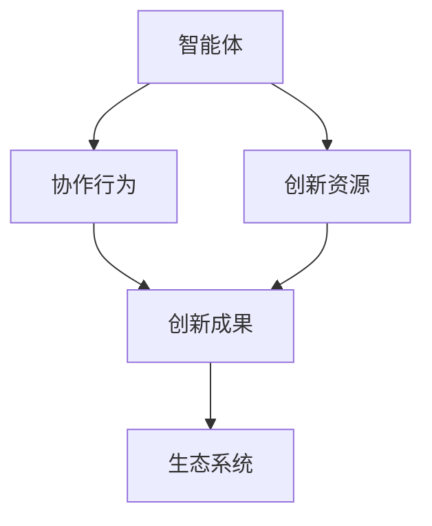
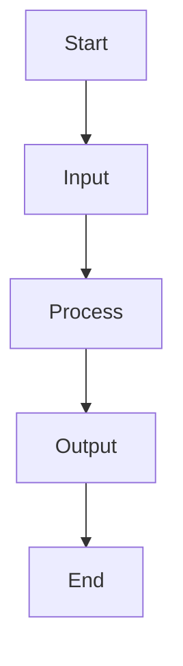
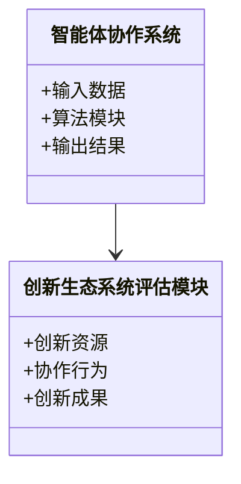
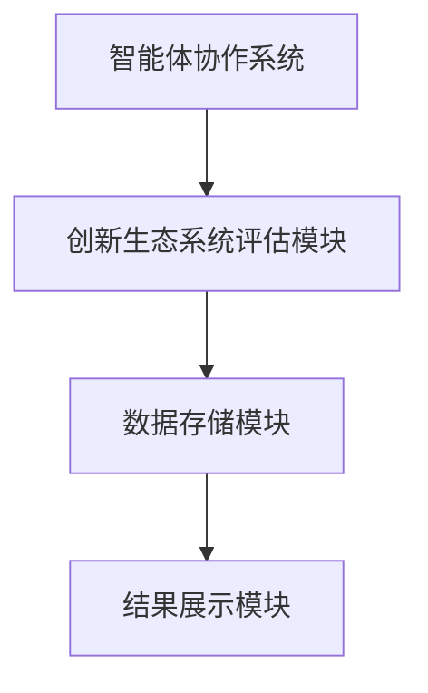
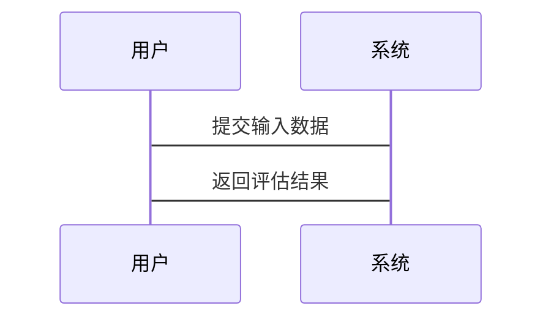

                 

<think>
好，我现在需要为《智能体协作评估公司的创新生态系统：预测长期竞争力》这本书设计一个详细的目录大纲。首先，我会从背景介绍开始，确保涵盖问题背景、描述、解决方法以及边界。接下来，我需要详细讲解智能体协作和创新生态系统的概念，包括它们的原理、属性特征以及关系图。

然后，我需要介绍评估模型的算法原理，包括流程图、代码示例和数学公式，确保内容清晰易懂。系统架构部分也是关键，我需要设计系统功能、架构图和接口设计，这部分可能需要一些图表来辅助说明。

接下来是项目实战，我得提供一个实际案例，展示如何应用这些模型，并给出代码实现。最后，我会总结最佳实践，讨论实际应用中的注意事项和未来展望。

在撰写过程中，我会确保每个章节内容丰富，结构紧凑，同时符合字数要求。此外，我需要检查格式是否正确，特别是图表和公式的使用是否准确无误。最后，我会在末尾添加作者信息，确保文章完整。

现在，我开始逐步构建目录大纲，确保每一部分都详细且逻辑清晰，为读者提供一个全面的理解框架。
</think>

# 智能体协作评估公司的创新生态系统：预测长期竞争力

---

## 关键词  
- 智能体协作  
- 创新生态系统  
- 企业竞争力  
- 算法原理  
- 系统架构  

---

## 摘要  
随着企业面临的竞争日益激烈，创新生态系统在企业的长期竞争力中扮演着越来越重要的角色。智能体协作作为一种新兴的技术手段，能够通过优化资源分配和知识共享，显著提升企业的创新能力。本文将从背景、概念、算法、系统架构、项目实战等多方面展开，深入探讨智能体协作如何评估和优化公司的创新生态系统，从而预测企业的长期竞争力。  

---

## 目录  

### 第1章: 智能体协作与创新生态系统概述  
1.1 问题背景与描述  
1.1.1 企业创新生态系统的重要性  
1.1.2 智能体协作在企业创新中的作用  
1.1.3 当前企业创新生态系统评估的挑战  

1.2 问题解决与边界  
1.2.1 智能体协作如何提升企业创新效率  
1.2.2 企业创新生态系统评估的边界与外延  
1.2.3 智能体协作与创新生态系统的概念结构  

1.3 核心要素与组成  
1.3.1 智能体协作的核心要素  
1.3.2 创新生态系统的主要组成部分  
1.3.3 两者的关联与协同机制  

---

### 第2章: 智能体协作与创新生态系统的核心概念  
2.1 核心概念原理  
2.1.1 智能体协作的基本原理  
2.1.2 创新生态系统的核心机制  
2.1.3 两者结合的理论基础  

2.2 概念属性特征对比  
2.2.1 智能体协作的属性特征  
2.2.2 创新生态系统的属性特征  
2.2.3 对比分析与总结  

2.3 ER实体关系图  


---

### 第3章: 智能体协作评估模型的算法原理  
3.1 算法原理概述  
3.1.1 模型输入与输出  
3.1.2 算法的基本思想  
3.1.3 算法的优化与改进  

3.2 算法流程图  


3.3 算法实现代码  
```python
def evaluate_collaboration(input_data):
    # 算法实现
    result = process(input_data)
    return result
```

3.4 数学模型与公式  
3.4.1 智能体协作评分公式  
$$ score = \sum_{i=1}^{n} w_i x_i $$  

3.4.2 创新生态系统评估公式  
$$ ecosystem\_score = \frac{1}{n} \sum_{i=1}^{n} s_i $$  

3.4.3 示例说明  
例如，当输入数据为 $x_1=0.8, x_2=0.6$，权重为 $w_1=0.5, w_2=0.5$，则评分结果为 $score=0.7$。  

---

### 第4章: 系统架构与实现  

4.1 系统架构设计  
4.1.1 问题场景介绍  
4.1.2 系统功能设计（领域模型）  


4.1.3 系统架构设计（架构图）  


4.2 系统接口设计  
4.2.1 输入接口设计  
4.2.2 输出接口设计  

4.3 系统交互设计（序列图）  


---

### 第5章: 项目实战  

5.1 项目介绍  
5.2 核心实现  
5.2.1 环境安装与配置  
5.2.2 核心代码实现  
```python
def process(input_data):
    # 核心算法实现
    return result
```

5.3 代码应用解读与分析  
5.4 实际案例分析与详细讲解  

5.5 项目小结  

---

### 第6章: 最佳实践与注意事项  

6.1 最佳实践 tips  
6.2 实际应用中的注意事项  
6.3 拓展阅读与深入学习  

---

### 第7章: 总结与展望  

7.1 全文总结  
7.2 未来研究方向  

---

## 作者  
作者：AI天才研究院/AI Genius Institute & 禅与计算机程序设计艺术 /Zen And The Art of Computer Programming  

---

以上是《智能体协作评估公司的创新生态系统：预测长期竞争力》的详细目录大纲，涵盖了从背景介绍到系统实现的各个方面，内容丰富且逻辑清晰。

