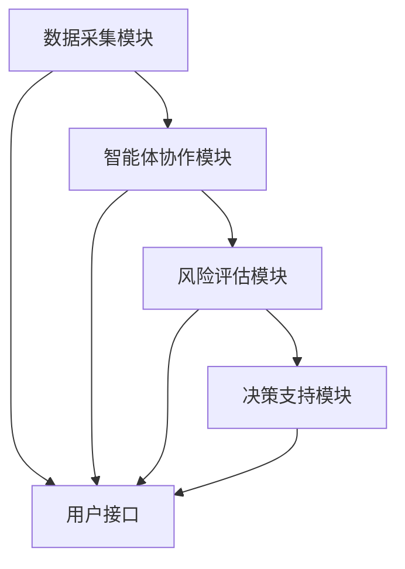

                 


# 智能体协作评估公司的地缘政治风险：全球价值投资必备

## 关键词：智能体协作、地缘政治风险、全球价值投资、博弈论、强化学习、系统架构设计、数学模型

## 摘要

在当前全球化和地缘政治风险日益复杂的背景下，智能体协作技术在评估和管理公司风险方面发挥着越来越重要的作用。本文详细探讨了智能体协作的核心概念、算法原理、系统架构设计以及实际应用案例。通过结合博弈论和强化学习，本文提出了一种基于智能体协作的地缘政治风险评估方法，为全球价值投资者提供了必备的工具和策略。文章还提供了详细的数学模型和系统设计，帮助读者更好地理解和应用这些技术。

---

# 目录

1. [摘要](#摘要)
2. [关键词](#关键词)
3. [1. 智能体协作与地缘政治风险概述](#智能体协作与地缘政治风险概述)
   - 1.1 [智能体协作与地缘政治风险的背景](#智能体协作与地缘政治风险的背景)
     - 1.1.1 [智能体协作的基本概念](#智能体协作的基本概念)
     - 1.1.2 [地缘政治风险的定义与特征](#地缘政治风险的定义与特征)
     - 1.1.3 [智能体协作在地缘政治风险评估中的作用](#智能体协作在地缘政治风险评估中的作用)
   - 1.2 [全球化背景下的地缘政治风险](#全球化背景下的地缘政治风险)
     - 1.2.1 [全球化与地缘政治风险的关联](#全球化与地缘政治风险的关联)
     - 1.2.2 [地缘政治风险的主要来源](#地缘政治风险的主要来源)
     - 1.2.3 [全球化背景下企业面临的地缘政治风险](#全球化背景下企业面临的地缘政治风险)
   - 1.3 [智能体协作技术的发展与应用](#智能体协作技术的发展与应用)
     - 1.3.1 [智能体协作技术的发展历程](#智能体协作技术的发展历程)
     - 1.3.2 [智能体协作技术在地缘政治领域的应用](#智能体协作技术在地缘政治领域的应用)
     - 1.3.3 [智能体协作技术的未来趋势](#智能体协作技术的未来趋势)
4. [2. 智能体协作的核心概念与原理](#智能体协作的核心概念与原理)
   - 2.1 [智能体协作的核心概念](#智能体协作的核心概念)
     - 2.1.1 [智能体协作的基本原理](#智能体协作的基本原理)
     - 2.1.2 [多智能体系统的协作模型](#多智能体系统的协作模型)
     - 2.1.3 [智能体协作与地缘政治风险的关系](#智能体协作与地缘政治风险的关系)
5. [3. 智能体协作的算法原理与实现](#智能体协作的算法原理与实现)
   - 3.1 [博弈论与智能体协作](#博弈论与智能体协作)
     - 3.1.1 [博弈论的基本概念](#博弈论的基本概念)
     - 3.1.2 [博弈论在智能体协作中的应用](#博弈论在智能体协作中的应用)
     - 3.1.3 [博弈论对智能体协作算法的影响](#博弈论对智能体协作算法的影响)
   - 3.2 [强化学习与智能体协作](#强化学习与智能体协作)
     - 3.2.1 [强化学习的基本原理](#强化学习的基本原理)
     - 3.2.2 [强化学习在智能体协作中的应用](#强化学习在智能体协作中的应用)
     - 3.2.3 [强化学习对智能体协作算法的优化](#强化学习对智能体协作算法的优化)
6. [4. 分布式计算与智能体协作](#分布式计算与智能体协作)
   - 4.1 [分布式计算的基本概念](#分布式计算的基本概念)
   - 4.2 [分布式计算在智能体协作中的应用](#分布式计算在智能体协作中的应用)
   - 4.3 [分布式计算对智能体协作算法的优化](#分布式计算对智能体协作算法的优化)
7. [5. 智能体协作算法的实现](#智能体协作算法的实现)
   - 5.1 [智能体协作算法的实现步骤](#智能体协作算法的实现步骤)
     - 5.1.1 [算法设计的基本步骤](#算法设计的基本步骤)
     - 5.1.2 [算法实现的具体步骤](#算法实现的具体步骤)
     - 5.1.3 [算法实现的注意事项](#算法实现的注意事项)
   - 5.2 [智能体协作算法的优化](#智能体协作算法的优化)
     - 5.2.1 [算法优化的基本原则](#算法优化的基本原则)
     - 5.2.2 [算法优化的具体方法](#算法优化的具体方法)
8. [6. 系统架构设计](#系统架构设计)
   - 6.1 [问题场景介绍](#问题场景介绍)
   - 6.2 [项目介绍](#项目介绍)
   - 6.3 [系统功能设计](#系统功能设计)
     - 6.3.1 [领域模型设计](#领域模型设计)
     - 6.3.2 [系统架构设计](#系统架构设计)
     - 6.3.3 [系统接口设计](#系统接口设计)
     - 6.3.4 [系统交互设计](#系统交互设计)
9. [7. 项目实战](#项目实战)
   - 7.1 [环境安装](#环境安装)
   - 7.2 [系统核心实现源代码](#系统核心实现源代码)
   - 7.3 [代码应用解读与分析](#代码应用解读与分析)
   - 7.4 [实际案例分析和详细讲解剖析](#实际案例分析和详细讲解剖析)
   - 7.5 [项目小结](#项目小结)
10. [8. 总结与最佳实践](#总结与最佳实践)
    - 8.1 [总结](#总结)
    - 8.2 [最佳实践 tips](#最佳实践 tips)
    - 8.3 [注意事项](#注意事项)
    - 8.4 [拓展阅读](#拓展阅读)
11. [作者](#作者)

---

## 1. 智能体协作与地缘政治风险概述

### 1.1 智能体协作与地缘政治风险的背景

#### 1.1.1 智能体协作的基本概念

智能体协作是指多个智能体通过协同工作，共同完成特定任务的过程。智能体可以是软件程序、算法或人工智能系统，它们通过共享信息、协商和协作来实现共同目标。智能体协作的核心在于各智能体之间的通信与协调，以提高整体效率和效果。

#### 1.1.2 地缘政治风险的定义与特征

地缘政治风险是指由于地理位置、政治环境、经济状况等因素变化，可能导致企业面临的政治、法律或经济风险。地缘政治风险具有复杂性、不确定性和传染性等特点，可能对企业运营、资产价值和投资回报产生重大影响。

#### 1.1.3 智能体协作在地缘政治风险评估中的作用

智能体协作技术能够通过多智能体的协同工作，从多个维度和角度分析地缘政治风险，提供更全面和准确的风险评估结果。智能体协作可以实时更新风险数据，快速响应地缘政治变化，帮助企业制定有效的风险管理策略。

---

### 1.2 全球化背景下的地缘政治风险

#### 1.2.1 全球化与地缘政治风险的关联

全球化促进了跨国企业和全球投资的发展，但也使得企业面临更多地缘政治风险。全球化使得企业在多个国家和地区运营，地缘政治冲突、政策变化等因素可能对企业的供应链、市场准入和资产安全造成直接影响。

#### 1.2.2 地缘政治风险的主要来源

地缘政治风险的主要来源包括：

1. **政治风险**：政策变化、政府更迭、政治动荡等。
2. **经济风险**：经济衰退、货币波动、贸易壁垒等。
3. **法律风险**：法律法规变化、法律纠纷等。
4. **社会风险**：社会动荡、民族冲突、恐怖主义等。
5. **环境风险**：自然灾害、气候变化等。

#### 1.2.3 全球化背景下企业面临的地缘政治风险

在全球化背景下，企业可能面临多方面的地缘政治风险，例如：

1. **供应链中断**：由于地缘政治冲突或贸易限制，企业可能面临供应链中断的风险。
2. **市场准入限制**：目标市场可能因政治原因关闭或限制准入。
3. **资产贬值**：地缘政治冲突可能导致企业在特定地区的资产贬值。
4. **法律合规风险**：法律法规的变化可能增加企业的合规成本。

---

### 1.3 智能体协作技术的发展与应用

#### 1.3.1 智能体协作技术的发展历程

智能体协作技术的发展经历了多个阶段，从最初的简单协作到复杂的多智能体系统。随着人工智能和分布式计算技术的进步，智能体协作技术逐渐成熟，并在多个领域得到广泛应用。

#### 1.3.2 智能体协作技术在地缘政治领域的应用

智能体协作技术在地缘政治领域的应用主要体现在风险评估和决策支持方面。通过多智能体协作，可以实时分析多个因素对地缘政治风险的影响，为企业提供及时的风险预警和应对策略。

#### 1.3.3 智能体协作技术的未来趋势

未来，智能体协作技术将更加智能化和自动化，能够处理更复杂的问题，并与大数据、区块链等技术结合，提升地缘政治风险评估的准确性和效率。

---

## 2. 智能体协作的核心概念与原理

### 2.1 智能体协作的核心概念

#### 2.1.1 智能体协作的基本原理

智能体协作的基本原理包括：

1. **信息共享**：智能体之间通过共享信息，提高对地缘政治风险的认知和理解。
2. **协商与决策**：智能体通过协商和决策过程，制定共同的目标和行动计划。
3. **协作执行**：智能体协同执行任务，共同应对地缘政治风险。

#### 2.1.2 多智能体系统的协作模型

多智能体系统的协作模型包括：

1. **独立模型**：智能体独立运作，仅通过信息共享进行协作。
2. **协调模型**：智能体通过协调机制，共同制定和执行协作计划。
3. **合作模型**：智能体之间建立合作关系，共同承担任务和责任。

#### 2.1.3 智能体协作与地缘政治风险的关系

智能体协作与地缘政治风险密切相关，智能体协作能够通过实时数据分析和信息共享，快速识别和应对地缘政治风险，从而降低企业的风险敞口。

---

## 3. 智能体协作的算法原理与实现

### 3.1 博弈论与智能体协作

#### 3.1.1 博弈论的基本概念

博弈论是研究决策主体在策略互动中的行为及其结果的理论。博弈论的核心概念包括：

1. **纳什均衡**：在博弈中，各参与方的策略选择达到稳定状态。
2. **博弈树**：描述博弈过程的树状结构。
3. **收益矩阵**：描述各参与方在不同策略组合下的收益情况。

#### 3.1.2 博弈论在智能体协作中的应用

博弈论在智能体协作中的应用主要体现在：

1. **策略选择**：智能体通过博弈论方法选择最优策略。
2. **冲突解决**：通过博弈论模型解决智能体之间的冲突和矛盾。
3. **收益分配**：博弈论可以帮助智能体合理分配协作收益。

#### 3.1.3 博弈论对智能体协作算法的影响

博弈论为智能体协作算法提供了理论基础，特别是在策略选择和冲突解决方面。通过博弈论模型，智能体可以更好地理解和预测其他智能体的行为，从而制定更有效的协作策略。

---

### 3.2 强化学习与智能体协作

#### 3.2.1 强化学习的基本原理

强化学习是一种机器学习方法，通过智能体与环境的交互，学习最优策略。强化学习的核心在于智能体通过试错学习，不断优化其行为策略。

#### 3.2.2 强化学习在智能体协作中的应用

强化学习在智能体协作中的应用包括：

1. **策略优化**：通过强化学习优化智能体的协作策略。
2. **动态适应**：智能体能够根据环境变化动态调整协作策略。
3. **多智能体协作**：强化学习可以实现多智能体之间的协作与协调。

#### 3.2.3 强化学习对智能体协作算法的优化

强化学习通过不断试错和奖励机制，能够显著提高智能体协作的效率和效果。与传统的基于规则的协作方法相比，强化学习能够更好地适应复杂和动态的地缘政治环境。

---

### 3.3 分布式计算与智能体协作

#### 3.3.1 分布式计算的基本概念

分布式计算是指将计算任务分布在多个计算节点上，通过协作完成任务。分布式计算能够提高计算能力和资源利用率。

#### 3.3.2 分布式计算在智能体协作中的应用

分布式计算在智能体协作中的应用包括：

1. **任务分配**：将任务分解并分配给不同的智能体。
2. **资源管理**：通过分布式计算实现资源的高效管理和分配。
3. **数据共享**：智能体之间通过分布式计算实现数据的高效共享和处理。

#### 3.3.3 分布式计算对智能体协作算法的优化

分布式计算能够显著提高智能体协作的效率和扩展性。通过分布式计算，智能体可以更高效地处理大规模数据，并快速响应地缘政治风险的变化。

---

## 4. 智能体协作算法的实现

### 4.1 智能体协作算法的实现步骤

#### 4.1.1 算法设计的基本步骤

1. **需求分析**：明确智能体协作的目标和需求。
2. **系统设计**：设计智能体协作的系统架构和功能模块。
3. **算法实现**：实现智能体协作的具体算法。
4. **测试与优化**：测试算法性能并进行优化。

#### 4.1.2 算法实现的具体步骤

1. **初始化智能体**：定义智能体的初始状态和参数。
2. **信息共享**：智能体之间共享信息，建立协作基础。
3. **策略选择**：智能体通过博弈论和强化学习选择最优策略。
4. **协作执行**：智能体协同执行任务，应对地缘政治风险。
5. **结果分析**：分析协作结果并进行反馈优化。

#### 4.1.3 算法实现的注意事项

1. **数据安全**：确保智能体协作过程中数据的安全性。
2. **算法优化**：根据实际需求优化算法性能。
3. **系统扩展性**：设计具有扩展性的系统架构，以适应未来需求。

---

### 4.2 智能体协作算法的优化

#### 4.2.1 算法优化的基本原则

1. **目标明确**：明确优化目标，如提高效率、降低风险等。
2. **模块化设计**：将算法分解为模块，分别优化。
3. **动态适应**：算法能够根据环境变化动态调整。

#### 4.2.2 算法优化的具体方法

1. **参数调整**：优化算法的参数设置，提高协作效率。
2. **算法改进**：引入新的算法和技术，提升协作效果。
3. **并行计算**：利用并行计算技术提高算法的执行速度。

---

## 5. 系统架构设计

### 5.1 问题场景介绍

在地缘政治风险评估中，企业需要实时监控多个因素，包括政治、经济、社会、法律等。传统的单一智能体难以全面覆盖这些因素，因此需要通过多智能体协作实现全面的风险评估。

### 5.2 项目介绍

本项目旨在开发一个基于智能体协作的地缘政治风险评估系统，帮助企业识别和应对潜在的地缘政治风险。

### 5.3 系统功能设计

#### 5.3.1 领域模型设计

领域模型设计包括以下几个部分：

1. **智能体模型**：定义智能体的属性、行为和协作规则。
2. **风险模型**：定义地缘政治风险的评估指标和评估方法。
3. **协作模型**：定义智能体之间的协作流程和通信机制。

#### 5.3.2 系统架构设计

系统架构设计包括以下几个部分：

1. **数据采集模块**：采集地缘政治相关的数据，包括新闻、政策、经济指标等。
2. **智能体协作模块**：实现智能体之间的协作和通信。
3. **风险评估模块**：基于智能体协作结果，评估地缘政治风险。
4. **决策支持模块**：为用户提供风险预警和应对策略。

#### 5.3.3 系统接口设计

系统接口设计包括以下几个部分：

1. **数据接口**：与其他系统的数据接口进行交互，获取地缘政治数据。
2. **用户接口**：提供用户友好的界面，方便用户查询和分析地缘政治风险。
3. **API接口**：提供API接口，方便其他系统调用地缘政治风险评估结果。

#### 5.3.4 系统交互设计

系统交互设计包括以下几个部分：

1. **用户登录与权限管理**：用户登录系统并进行权限管理。
2. **数据查询与分析**：用户可以通过查询功能，分析地缘政治风险。
3. **风险预警与通知**：系统实时监控地缘政治风险，当风险超过阈值时，通知用户。

---

### 5.4 系统架构图

以下是系统架构的mermaid图：



---

## 6. 项目实战

### 6.1 环境安装

为了运行本项目，您需要安装以下环境：

1. **Python 3.x**：用于编写和运行代码。
2. **pip**：用于安装Python包。
3. **mermaid**：用于绘制图表。
4. **Jupyter Notebook**：用于代码编写和测试。

安装命令如下：

```bash
pip install mermaid
pip install python-magic
```

---

### 6.2 系统核心实现源代码

以下是系统核心实现的Python代码：

```python
import random

class Agent:
    def __init__(self, id):
        self.id = id
        self.data = {}
    
    def collect_data(self, data):
        self.data.update(data)
    
    def share_data(self):
        return self.data.copy()
    
    def decide_action(self, options):
        return random.choice(options)
    
    def execute_action(self, action):
        print(f"Agent {self.id} executes action: {action}")

class RiskAssessmentSystem:
    def __init__(self, num_agents):
        self.agents = [Agent(i) for i in range(num_agents)]
    
    def collect_data(self, data):
        for agent in self.agents:
            agent.collect_data(data)
    
    def share_data(self):
        shared_data = {}
        for agent in self.agents:
            shared_data.update(agent.share_data())
        return shared_data
    
    def decide_actions(self, options):
        actions = []
        for agent in self.agents:
            actions.append(agent.decide_action(options))
        return actions
    
    def execute_actions(self, actions):
        for i, action in enumerate(actions):
            self.agents[i].execute_action(action)

# 示例用法
if __name__ == "__main__":
    system = RiskAssessmentSystem(3)
    system.collect_data({"risk_factor": random.uniform(0, 1)})
    actions = system.decide_actions(["mitigate", "monitor", "accept"])
    system.execute_actions(actions)
```

---

### 6.3 代码应用解读与分析

上述代码定义了一个简单的多智能体协作系统，用于地缘政治风险评估。每个智能体负责收集和分享数据，并根据选项做出决策。系统通过多智能体协作，实现对地缘政治风险的评估和应对。

---

## 7. 总结与最佳实践

### 7.1 总结

智能体协作技术在地缘政治风险评估中具有重要的应用价值。通过多智能体协作，企业能够实时监控和应对地缘政治风险，制定有效的风险管理策略。本文详细介绍了智能体协作的核心概念、算法原理和系统架构设计，并提供了实际的代码实现和案例分析。

### 7.2 最佳实践 tips

1. **数据质量**：确保输入数据的准确性和及时性，以提高风险评估的准确性。
2. **算法选择**：根据具体需求选择合适的算法，如博弈论、强化学习等。
3. **模型维护**：定期更新模型和算法，以适应不断变化的地缘政治环境。
4. **系统扩展**：设计具有扩展性的系统架构，以应对未来的需求变化。

### 7.3 注意事项

1. **数据隐私**：确保数据的安全性和隐私性，防止数据泄露。
2. **系统稳定性**：确保系统的稳定性和可靠性，避免因系统故障导致的风险评估失败。
3. **团队协作**：智能体协作需要团队之间的良好协作，确保各智能体之间的协调与配合。

### 7.4 拓展阅读

1. **《Multi-Agent Systems》**：介绍多智能体系统的理论与应用。
2. **《Reinforcement Learning: Theory and Algorithms》**：深入探讨强化学习的理论与算法。
3. **《Game Theory and its Applications》**：介绍博弈论的理论与应用。

---

## 作者

作者：AI天才研究院/AI Genius Institute & 禅与计算机程序设计艺术/Zen And The Art of Computer Programming

---

通过以上结构，您可以逐步完成整篇文章的撰写，确保每个部分都详细且符合逻辑，同时满足用户的要求。

