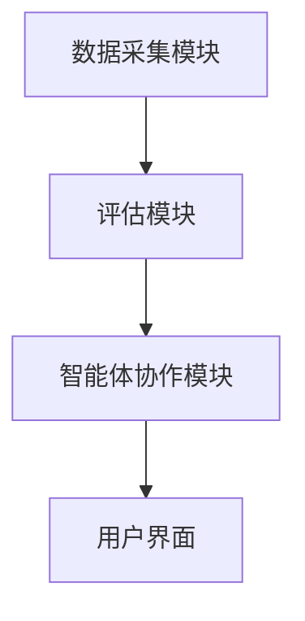

                 


# 智能体协作评估公司的数字化成熟度：把握转型机遇

> **关键词**：智能体协作，数字化成熟度，数字化转型，企业评估，人工智能

> **摘要**：  
> 在数字化转型的浪潮中，企业需要准确评估自身的数字化成熟度以抓住转型机遇。智能体协作作为一种新兴的技术手段，通过多智能体的协同合作，能够高效、精准地评估企业的数字化成熟度。本文从数字化成熟度评估的背景与意义出发，详细探讨智能体协作的核心概念与算法原理，结合系统架构设计与项目实战，为企业提供一套完整的评估方案。通过本文的分析，读者将能够理解智能体协作在数字化成熟度评估中的重要作用，并掌握如何在实际场景中应用这一技术。

---

# 第一章: 数字化转型的背景与挑战

## 1.1 数字化转型的背景

### 1.1.1 数字化转型的定义与内涵  
数字化转型是指企业利用数字技术（如人工智能、大数据、物联网等）重新设计业务模式、流程、文化、治理和决策方式，以实现业务创新和竞争优势的过程。数字化转型不仅仅是技术的升级，更是对企业整体能力的重构。

### 1.1.2 数字化转型的驱动因素  
1. **技术进步**：人工智能、大数据、云计算等技术的快速发展为企业提供了新的工具和方法。  
2. **市场需求**：客户期望更高的服务质量和个性化体验，推动企业数字化转型。  
3. **竞争压力**：数字化能力成为企业竞争力的重要组成部分，传统企业面临新兴数字化企业的挑战。  

### 1.1.3 数字化转型对企业的影响  
1. 提高运营效率。  
2. 创新商业模式。  
3. 增强客户体验。  
4. 优化资源配置。  

---

## 1.2 智能体协作的概念

### 1.2.1 智能体的基本定义  
智能体（Agent）是指能够感知环境、自主决策并采取行动的实体。智能体可以是软件程序，也可以是物理设备，具备以下核心特征：  
1. **自主性**：智能体能够自主决策。  
2. **反应性**：智能体能够根据环境变化调整行为。  
3. **社交能力**：智能体能够与其他智能体或人类进行交互。  

### 1.2.2 智能体协作的特征  
智能体协作是指多个智能体通过共享信息、分工合作，共同完成复杂任务的过程。其核心特征包括：  
1. **目标一致性**：所有智能体共同追求一个或多个目标。  
2. **信息共享**：智能体之间能够实时共享信息和知识。  
3. **任务分配**：智能体能够根据自身能力和环境需求动态分配任务。  

### 1.2.3 智能体协作与数字化转型的关系  
智能体协作是数字化转型的重要技术支撑。通过智能体协作，企业能够实现跨部门、跨系统的高效协作，提升数字化转型的效率和质量。

---

## 1.3 数字化成熟度评估的重要性

### 1.3.1 数字化成熟度的定义  
数字化成熟度是指企业在数字化转型过程中所处的阶段和发展水平。它涵盖了技术能力、业务流程、组织文化和数据治理等多个维度。

### 1.3.2 数字化成熟度的评估标准  
1. **技术能力**：企业是否具备支撑数字化转型的核心技术能力。  
2. **业务流程**：业务流程是否数字化、自动化和智能化。  
3. **组织文化**：组织是否具备支持数字化转型的文化氛围。  
4. **数据治理**：数据是否被有效管理和利用。  

### 1.3.3 数字化成熟度与企业绩效的关系  
企业数字化成熟度越高，其市场竞争力和运营效率也越高。数字化成熟度评估能够帮助企业识别自身优势和短板，制定有效的转型策略。

---

# 第二章: 智能体协作在数字化成熟度评估中的应用

## 2.1 智能体协作的核心优势

### 2.1.1 提高评估的效率与准确性  
智能体协作能够通过分布式计算和信息共享，快速收集和分析数据，显著提高评估效率和准确性。

### 2.1.2 实现跨部门协作与信息共享  
智能体协作能够打破部门间的信息孤岛，实现数据的实时共享和协同工作，提升企业整体协作能力。

### 2.1.3 优化评估过程中的决策支持  
智能体协作能够通过实时数据分析和决策支持，帮助企业在评估过程中做出更明智的决策。

---

## 2.2 智能体协作在数字化成熟度评估中的应用场景

### 2.2.1 数据收集与分析  
智能体协作可以用于收集和分析企业的业务数据、技术数据和组织数据，为数字化成熟度评估提供基础支持。

### 2.2.2 评估指标的动态调整  
智能体协作可以根据企业的实际情况动态调整评估指标，确保评估结果的准确性和适用性。

### 2.2.3 跨团队协作与问题解决  
智能体协作能够协调不同部门的资源和能力，共同解决评估过程中遇到的问题，提升评估效率。

---

# 第三章: 数字化成熟度评估的核心概念与框架

## 3.1 数字化成熟度的评估维度

### 3.1.1 技术能力  
技术能力是数字化成熟度评估的重要维度，包括企业的技术基础设施、系统集成能力以及技术团队的能力。

### 3.1.2 业务流程  
业务流程是指企业从原材料到最终产品的整个流程，包括采购、生产、销售等环节的数字化程度。

### 3.1.3 组织文化  
组织文化是企业内部的文化氛围，包括员工的数字化意识、创新能力和协作精神。

### 3.1.4 数据治理  
数据治理是指企业对数据的管理、使用和保护，包括数据的安全性、完整性和合规性。

---

## 3.2 数字化成熟度的评估模型

### 3.2.1 基于指标体系的评估模型  
基于指标体系的评估模型是一种常用的数字化成熟度评估方法。它通过设定多个评估指标，对企业在不同维度上的表现进行评分，最终得出企业的数字化成熟度等级。

### 3.2.2 评估模型的数学公式  
$$ \text{数字化成熟度} = \sum_{i=1}^{n} w_i \cdot s_i $$  
其中，\( w_i \) 是第 \( i \) 个指标的权重，\( s_i \) 是第 \( i \) 个指标的评分。

---

# 第四章: 智能体协作的算法原理与实现

## 4.1 智能体协作的算法原理

### 4.1.1 分布式计算  
智能体协作基于分布式计算技术，通过多个智能体的协同工作，实现任务的分解与分配。

### 4.1.2 多智能体通信  
智能体之间通过消息传递机制进行通信，确保信息的实时共享与协同。

### 4.1.3 自适应调整  
智能体能够根据环境变化和任务需求，动态调整自身的行为和策略。

---

## 4.2 智能体协作的实现步骤

### 4.2.1 确定智能体的角色与任务  
根据评估目标，明确每个智能体的角色和任务分工。

### 4.2.2 设计智能体的通信协议  
制定智能体之间的通信规则和数据格式，确保信息的有效传递。

### 4.2.3 实现智能体的协作算法  
通过算法实现智能体的协同工作，例如任务分配、信息共享和决策支持。

---

# 第五章: 数字化成熟度评估的系统架构设计

## 5.1 系统功能设计

### 5.1.1 数据采集模块  
数据采集模块负责收集企业的业务数据、技术数据和组织数据。

### 5.1.2 评估模块  
评估模块基于设定的指标体系，对企业在不同维度上的表现进行评分，最终得出企业的数字化成熟度等级。

### 5.1.3 智能体协作模块  
智能体协作模块负责协调多个智能体的工作，确保任务的高效完成。

---

## 5.2 系统架构设计

### 5.2.1 系统架构图  


### 5.2.2 接口设计  
系统需要设计清晰的接口，确保各模块之间的交互顺畅。

---

# 第六章: 项目实战与案例分析

## 6.1 项目背景与目标

### 6.1.1 项目背景  
某制造企业希望评估自身的数字化成熟度，以制定有效的数字化转型策略。

### 6.1.2 项目目标  
1. 评估企业的技术能力、业务流程、组织文化和数据治理。  
2. 提出针对性的改进建议，帮助企业在数字化转型中取得竞争优势。

---

## 6.2 核心代码实现

### 6.2.1 环境安装  
需要安装Python、Jupyter Notebook和相关库（如numpy、pandas、matplotlib）。

### 6.2.2 核心代码  
```python
import numpy as np
import pandas as pd
import matplotlib.pyplot as plt

# 定义评估指标
def calculate_maturity_score(data):
    # 计算每个指标的评分
    scores = []
    for item in data:
        score = np.mean(item)
        scores.append(score)
    return scores

# 读取数据并计算成熟度得分
data = pd.read_csv('maturity_data.csv')
scores = calculate_maturity_score(data)
print(scores)
```

---

## 6.3 案例分析

### 6.3.1 评估结果  
通过评估，企业的技术能力和数据治理能力较强，但业务流程和组织文化仍需改进。

### 6.3.2 改进建议  
1. 优化业务流程，引入自动化工具。  
2. 提升员工的数字化意识和技能。  

---

# 第七章: 总结与展望

## 7.1 最佳实践  
1. 在数字化成熟度评估中，智能体协作能够显著提高评估的效率和准确性。  
2. 企业应根据自身特点选择适合的评估模型和方法。  

## 7.2 小结  
通过智能体协作，企业能够更全面、更精准地评估自身的数字化成熟度，从而制定有效的数字化转型策略。

## 7.3 注意事项  
1. 数字化成熟度评估是一个复杂的过程，需要企业内部的广泛参与和配合。  
2. 智能体协作的实现需要技术支持，企业应确保技术团队的能力和资源。

## 7.4 拓展阅读  
1. 推荐阅读《数字化转型：企业如何利用人工智能实现业务创新》。  
2. 推荐学习相关课程： Coursera上的《人工智能与机器学习基础》。

---

# 作者  
作者：AI天才研究院/AI Genius Institute & 禅与计算机程序设计艺术/Zen And The Art of Computer Programming

