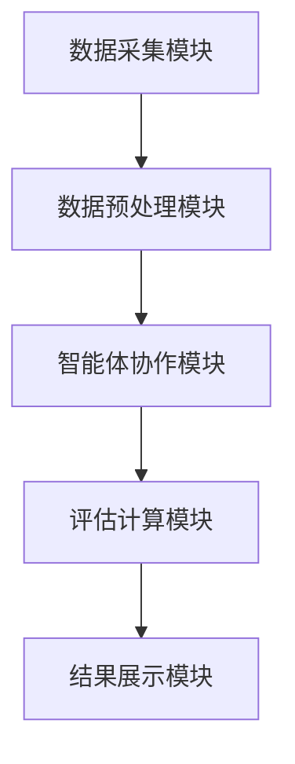

                 


# 智能体协作评估公司的数据资产价值：数字经济时代的关键

## 关键词：智能体协作，数据资产价值评估，数字经济，数据资产评估，智能体算法，系统架构，项目实战

## 摘要：  
在数字经济时代，数据资产已成为企业最重要的资产之一。本文探讨了智能体协作在数据资产价值评估中的应用，详细介绍了智能体协作的基本概念、算法原理、系统架构以及实际项目中的应用案例。通过分析智能体协作的优势，本文展示了如何利用智能体协作技术来提升数据资产的评估效率和准确性，为企业的数字化转型提供关键支持。

---

## 第一部分：智能体协作与数据资产价值评估的背景与概念

### 第1章：智能体协作与数据资产价值评估的背景

#### 1.1 智能体协作的基本概念  
智能体协作是指多个智能体（Intelligent Agents）通过协同工作，共同完成复杂任务的过程。智能体可以是软件程序、算法或具有人工智能的实体。它们通过通信、协调和合作，实现信息共享、资源分配和决策优化。  

在数据资产价值评估中，智能体协作的核心在于利用多个智能体的协同能力，对数据资产进行全面、精准的评估。通过智能体协作，可以将分散的数据资源整合起来，形成更全面的评估结果。

#### 1.2 数据资产的定义与分类  
数据资产是指企业拥有或控制的所有数据资源，包括结构化数据（如数据库中的表格）、半结构化数据（如JSON、XML文件）和非结构化数据（如文本、图像）。数据资产可以按以下分类：  
- **按形态分类**：结构化数据、半结构化数据、非结构化数据。  
- **按用途分类**：业务数据、分析数据、元数据。  
- **按敏感性分类**：敏感数据、非敏感数据。  

#### 1.3 数据资产价值评估的重要性  
数据资产价值评估是企业在数字经济时代的核心任务之一。通过评估数据资产的价值，企业可以更好地管理和利用数据，提升数据驱动的决策能力。智能体协作在数据资产价值评估中的应用，能够提高评估的效率和准确性，同时降低评估成本。

---

### 第2章：智能体协作与数据资产价值评估的核心概念

#### 2.1 智能体协作的原理  
智能体协作的实现依赖于以下几个关键步骤：  
1. **信息共享**：智能体之间通过通信机制共享数据和信息。  
2. **任务分配**：根据智能体的能力和数据的特点，分配具体的评估任务。  
3. **协同决策**：智能体基于共享的信息和数据，共同制定评估策略。  
4. **结果整合**：将各个智能体的评估结果整合，形成最终的评估报告。

#### 2.2 数据资产价值评估的原理  
数据资产价值评估的核心在于将数据资产转化为可量化的价值指标。常见的评估方法包括：  
- **成本法**：基于数据资产的获取成本进行评估。  
- **市场法**：通过市场交易数据推导数据资产的价值。  
- **收益法**：基于数据资产为企业带来的收益进行评估。

#### 2.3 智能体协作在数据资产价值评估中的优势  
智能体协作在数据资产价值评估中的优势体现在以下几个方面：  
1. **高效性**：通过智能体的协同工作，可以快速完成大规模数据的评估任务。  
2. **准确性**：智能体协作能够整合多个智能体的评估结果，提高评估的准确性。  
3. **灵活性**：智能体协作可以根据数据资产的特点动态调整评估策略。

---

## 第二部分：智能体协作与数据资产价值评估的算法原理

### 第3章：智能体协作的算法原理

#### 3.1 智能体协作的数学模型  
智能体协作的数学模型可以表示为：  
$$ V = \sum_{i=1}^{n} v_i $$  
其中，$V$ 表示数据资产的总价值，$v_i$ 表示第 $i$ 个智能体的评估结果。

#### 3.2 智能体协作的算法流程  
智能体协作的算法流程如下：  
1. 初始化：智能体之间建立通信机制，共享初始数据。  
2. 数据预处理：对数据进行清洗、转换和标准化处理。  
3. 任务分配：根据智能体的能力和数据特点，分配具体的评估任务。  
4. 协作评估：智能体基于分配的任务，分别对数据进行评估。  
5. 结果整合：将各个智能体的评估结果整合，形成最终的评估报告。

#### 3.3 智能体协作的实现代码  
以下是一个简单的智能体协作算法的Python实现示例：  

```python
import json
import requests

class IntelligentAgent:
    def __init__(self, name):
        self.name = name
        self.data = None

    def receive_data(self, data):
        self.data = data

    def evaluate(self):
        # 简单的评估逻辑，假设数据价值与数据量成正比
        return len(self.data)

# 初始化智能体
agent1 = IntelligentAgent("Agent1")
agent2 = IntelligentAgent("Agent2")

# 智能体协作流程
data = {
    "name": "example_data",
    "value": [1, 2, 3, 4, 5]
}

agent1.receive_data(data)
agent2.receive_data(data)

# 协作评估
result1 = agent1.evaluate()
result2 = agent2.evaluate()

# 整合结果
total_value = result1 + result2
print(f"Total value: {total_value}")
```

---

### 第4章：数据资产价值评估的算法原理

#### 4.1 数据资产评估的数学模型  
数据资产评估的数学模型可以表示为：  
$$ V = \alpha \cdot \text{成本} + \beta \cdot \text{收益} $$  
其中，$\alpha$ 和 $\beta$ 是模型的系数，表示成本和收益对数据资产价值的影响程度。

#### 4.2 数据资产评估的算法流程  
数据资产评估的算法流程如下：  
1. 数据清洗：对数据进行去重、缺失值处理和异常值检测。  
2. 数据转换：将数据转换为适合评估的格式。  
3. 评估计算：基于数学模型，计算数据资产的价值。  
4. 结果分析：对评估结果进行分析和解释。

---

## 第三部分：智能体协作与数据资产价值评估的系统架构

### 第5章：智能体协作的系统架构

#### 5.1 系统功能设计  
智能体协作系统的功能设计包括：  
- 数据采集模块：负责数据的采集和预处理。  
- 智能体协作模块：实现智能体之间的通信和协作。  
- 评估计算模块：基于智能体的评估结果，计算数据资产的总价值。  
- 结果展示模块：将评估结果以可视化的方式展示出来。

#### 5.2 系统架构设计  
以下是智能体协作系统的架构图：



#### 5.3 系统接口设计  
系统接口设计包括：  
- 数据采集接口：负责接收外部数据源的数据。  
- 智能体协作接口：实现智能体之间的通信和协作。  
- 评估结果接口：返回数据资产的评估结果。

---

## 第四部分：智能体协作与数据资产价值评估的项目实战

### 第6章：项目实战

#### 6.1 项目背景  
本项目旨在利用智能体协作技术，评估某公司的数据资产价值。通过智能体协作，可以高效地完成数据资产的评估任务。

#### 6.2 项目实现  
以下是项目实现的核心代码：  

```python
import requests
import json

# 定义智能体类
class Agent:
    def __init__(self, name):
        self.name = name
        self.data = None

    def receive_data(self, data):
        self.data = data

    def evaluate(self):
        return len(self.data)

# 初始化智能体
agent1 = Agent("Agent1")
agent2 = Agent("Agent2")

# 智能体协作流程
data = {
    "name": "example_data",
    "value": [1, 2, 3, 4, 5]
}

agent1.receive_data(data)
agent2.receive_data(data)

# 协作评估
result1 = agent1.evaluate()
result2 = agent2.evaluate()

# 整合结果
total_value = result1 + result2
print(f"Total value: {total_value}")
```

#### 6.3 项目分析  
通过上述代码，我们可以看到智能体协作在数据资产价值评估中的实际应用。每个智能体负责一部分数据的评估，最终通过整合结果，得到数据资产的总价值。

---

## 第五部分：智能体协作与数据资产价值评估的最佳实践

### 第7章：最佳实践与总结

#### 7.1 小结  
智能体协作在数据资产价值评估中的应用，能够显著提高评估的效率和准确性。通过智能体的协同工作，企业可以更好地管理和利用数据资产，为数字经济时代的竞争提供有力支持。

#### 7.2 注意事项  
- 数据安全：在智能体协作过程中，需要确保数据的安全性和隐私性。  
- 智能体选择：选择合适的智能体算法和工具，确保协作的高效性。  
- 系统维护：定期维护和更新系统架构，确保系统的稳定性和可靠性。

#### 7.3 拓展阅读  
- 智能体协作的进一步研究：探索更复杂的智能体协作算法和应用场景。  
- 数据资产评估的创新方法：研究基于人工智能的评估方法，提高评估的智能化水平。

---

## 作者：AI天才研究院/AI Genius Institute & 禅与计算机程序设计艺术 /Zen And The Art of Computer Programming

---

以上是《智能体协作评估公司的数据资产价值：数字经济时代的关键》的技术博客文章的完整目录大纲和部分内容。希望这篇文章能够为读者提供清晰的思路和深入的分析，帮助他们在智能体协作和数据资产价值评估领域取得更大的成功。

