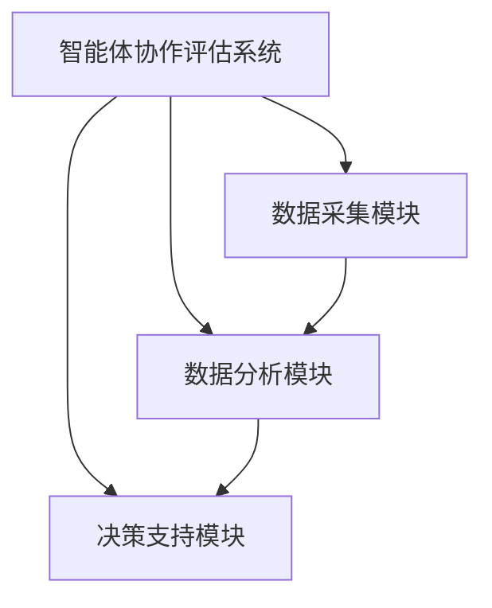
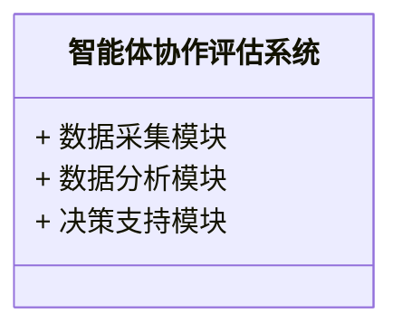

                 


# 智能体协作评估公司的环境适应能力：应对气候变化风险

## 关键词：
智能体协作、环境适应能力、气候变化风险、系统架构、算法原理、数学模型、项目实战

## 摘要：
本文探讨智能体协作在评估公司环境适应能力以应对气候变化风险中的应用。通过详细分析系统架构、算法原理、数据模型和实际案例，本文为读者提供全面的技术视角，展示如何利用智能体协作技术提升企业应对气候变化的能力。

---

# 第一部分：背景介绍

## 第1章：气候变化与企业环境适应能力概述

### 1.1 气候变化对企业的影响

#### 1.1.1 气候变化的现状与趋势
气候变化是当前全球关注的焦点问题。根据联合国政府间气候变化专门委员会（IPCC）的报告，全球气温持续上升，极端天气事件频发，如洪水、干旱和飓风等。这些气候事件对企业运营、供应链和市场环境造成严重影响。

#### 1.1.2 企业面临的气候变化风险
企业面临多种气候变化风险，包括：
- **物理风险**：极端天气可能导致的财产损失和运营中断。
- **监管风险**：政府可能出台更严格的环保法规，增加企业的合规成本。
- **声誉风险**：公众对环保表现的关注可能影响企业的品牌形象。

#### 1.1.3 环境适应能力的定义与重要性
环境适应能力是指企业在面对气候变化时，调整自身策略和运营模式以减轻负面影响的能力。提升环境适应能力可以帮助企业在变化的环境中保持竞争力。

### 1.2 智能体协作的概念与作用

#### 1.2.1 智能体的基本定义
智能体（Agent）是指能够感知环境、做出决策并采取行动的实体。智能体可以是软件程序，也可以是物理设备。

#### 1.2.2 智能体协作的定义
智能体协作是指多个智能体通过通信和协调，共同完成复杂任务的过程。协作智能体能够共享信息、分配任务并同步行动，以实现整体目标。

#### 1.2.3 智能体协作在环境适应能力评估中的作用
在评估企业环境适应能力时，智能体协作可以用于数据收集、分析和决策支持。通过协作，智能体能够快速响应气候变化带来的挑战，提供实时的环境评估和应对策略。

---

## 第2章：智能体协作评估系统的核心概念

### 2.1 系统架构与核心要素

#### 2.1.1 系统架构图
以下是系统的整体架构图：



#### 2.1.2 核心要素分析
- **数据采集模块**：负责收集环境数据，如温度、湿度和天气预报。
- **数据分析模块**：对数据进行处理和分析，识别潜在风险。
- **决策支持模块**：基于分析结果，提供应对策略。

#### 2.1.3 概念属性对比表格

| 概念       | 特性                     |
|------------|--------------------------|
| 智能体     | 自主性、反应性            |
| 环境适应能力 | 灵活性、抗风险能力       |

### 2.2 数据模型与协作机制

#### 2.2.1 数据模型设计
以下是环境数据模型的实体关系图：

```mermaid
erd
    客户
    供应商
    环境数据
    风险评估
    决策建议

    客户 --> 环境数据
    供应商 --> 环境数据
    环境数据 --> 风险评估
    风险评估 --> 决策建议
```

#### 2.2.2 协作机制分析
协作机制包括信息共享、任务分配和同步行动。通过高效的协作机制，智能体可以快速响应环境变化，提供及时的评估和建议。

---

## 第3章：评估模型的算法原理

### 3.1 算法原理概述

#### 3.1.1 智能体协作评估的基本原理
智能体协作评估通过多个智能体协同工作，利用分布式计算和数据共享，实现对环境适应能力的全面评估。

以下是算法流程图：

```mermaid
graph TD
    Start --> Initialize agents
    Initialize agents --> Collect environmental data
    Collect environmental data --> Analyze data
    Analyze data --> Generate risk assessment
    Generate risk assessment --> Provide decision support
    End
```

### 3.2 数学模型与公式推导

#### 3.2.1 环境适应能力的数学模型
环境适应能力可以通过以下公式计算：

$$ \text{环境适应能力} = \frac{\text{应对措施的有效性} \times \text{响应速度}}{\text{资源消耗}} $$

#### 3.2.2 智能体协作的数学表达
智能体协作可以通过以下公式表示：

$$ \text{协作效率} = \sum_{i=1}^{n} \frac{\text{智能体 } i \text{ 的贡献}}{\text{总贡献}} $$

---

## 第4章：系统分析与架构设计

### 4.1 问题场景介绍

#### 4.1.1 气候变化对企业的影响
极端天气可能导致供应链中断，影响企业的生产能力和交付能力。

#### 4.1.2 智能体协作评估的必要性
通过智能体协作，企业可以实时监控环境变化，及时调整运营策略。

#### 4.1.3 系统目标与范围
系统目标是通过智能体协作，评估企业环境适应能力，提供应对气候变化的决策支持。

### 4.2 系统功能设计

#### 4.2.1 系统功能模块
以下是系统功能模块图：



---

## 第5章：项目实战

### 5.1 环境安装

#### 5.1.1 安装依赖
- 安装Python和相关库（如NumPy、Pandas、Scikit-learn）。
- 安装Mermaid和LaTeX工具。

### 5.2 核心代码实现

#### 5.2.1 智能体协作算法实现

```python
class Agent:
    def __init__(self, id):
        self.id = id
        self.data = None

    def collect_data(self, data):
        self.data = data

    def share_data(self):
        return self.data

# 初始化智能体
agents = [Agent(i) for i in range(4)]

# 数据采集
for agent in agents:
    agent.collect_data({'temperature': 25, 'humidity': 60})

# 数据分析
data = [agent.share_data() for agent in agents]
print(data)
```

#### 5.2.2 风险评估模型实现

```python
import numpy as np

def calculate_risk(agents_data):
    avg_temp = np.mean([d['temperature'] for d in agents_data])
    avg_humidity = np.mean([d['humidity'] for d in agents_data])
    return avg_temp + avg_humidity

risk = calculate_risk(data)
print(risk)
```

### 5.3 案例分析

#### 5.3.1 案例背景
假设某企业面临洪水风险，通过智能体协作评估环境适应能力，制定应对策略。

#### 5.3.2 分析过程
智能体协作收集环境数据，分析风险，提供决策支持，帮助企业制定应对措施。

---

## 第6章：总结与展望

### 6.1 总结
智能体协作在评估企业环境适应能力方面具有重要作用。通过系统化的架构设计和高效的算法实现，企业可以更好地应对气候变化风险。

### 6.2 未来研究方向
未来可以研究更复杂的智能体协作算法，如多智能体强化学习，以提高评估系统的准确性和效率。

### 6.3 最佳实践 tips
- 定期更新数据模型，确保评估结果的准确性。
- 建立完善的协作机制，促进智能体之间的高效合作。

---

## 作者

作者：AI天才研究院 & 禅与计算机程序设计艺术

---

希望这篇文章能满足您的需求。如果需要进一步调整或补充，请随时告知！

