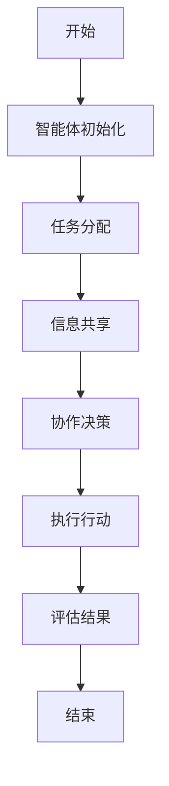
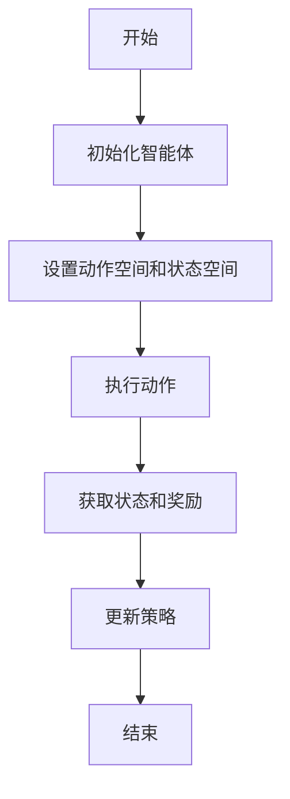
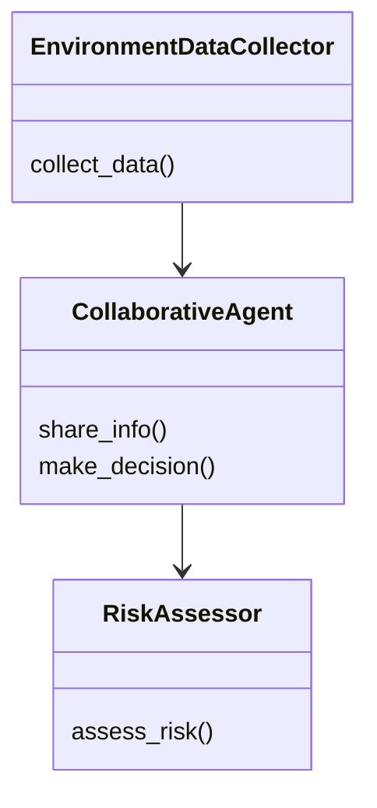
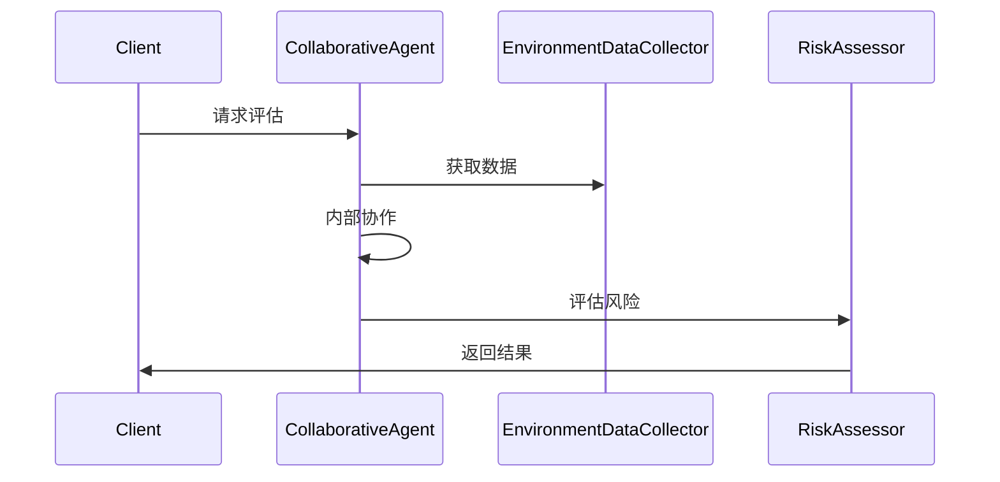

                 


---

# 智能体协作评估公司的环境风险：可持续发展视角

> 关键词：智能体协作，环境风险评估，可持续发展，多智能体系统，强化学习，环境风险管理

> 摘要：本文从可持续发展的视角出发，探讨智能体协作在公司环境风险评估中的应用。通过分析智能体协作的核心原理、算法实现、系统架构及实际案例，为读者提供全面的技术解读和实践指导。

---

## 第一章: 智能体协作与环境风险评估概述

### 1.1 智能体协作的基本概念

智能体协作是指多个智能体通过信息共享和协同决策，共同完成特定任务的过程。从单智能体到多智能体的演进，使得协作智能体能够更好地应对复杂问题。智能体协作的核心特征包括自主性、反应性和社会性。

智能体协作的定义可以分为两类：基于规则的协作和基于学习的协作。前者依赖预定义规则，后者通过强化学习等方法实现动态协作。

### 1.2 环境风险评估的背景与意义

环境风险评估是企业可持续发展的重要组成部分。随着全球环境问题的加剧，企业需要评估其运营对环境的影响，并采取措施降低风险。环境风险评估的现状与挑战主要体现在数据获取难度大、评估方法复杂以及多智能体协作的应用不足。

### 1.3 智能体协作在环境风险评估中的作用

智能体协作在环境风险评估中的优势包括分布式计算能力、动态适应性和高效率。通过协作智能体，企业可以更全面地收集和分析环境数据，从而做出更准确的环境风险评估。

---

## 第二章: 智能体协作的核心原理

### 2.1 智能体协作的理论基础

多智能体系统（MAS）的基本原理包括智能体之间的通信机制和决策机制。协作智能体通过共享信息和协调行动，实现共同目标。强化学习是实现智能体协作的重要方法。

### 2.2 智能体协作的核心要素

智能体协作的核心要素包括智能体的属性、协作规则和通信协议。通过对比分析，我们可以更好地理解协作智能体的特征。

### 2.3 智能体协作的流程图

使用 Mermaid 绘制的流程图展示了智能体协作的基本流程：



---

## 第三章: 智能体协作算法的实现

### 3.1 多智能体协作算法概述

多智能体协作算法的分类包括基于规则的协作和基于学习的协作。基于强化学习的协作算法是目前的研究热点。

### 3.2 基于强化学习的协作算法

多智能体强化学习的实现流程包括智能体动作空间、状态空间和奖励机制的设计。以下是使用 Mermaid 绘制的流程图：



以下是基于强化学习的协作算法的数学模型：

$$ V(s) = \max_{a} \left( r + V(s') \right) $$

其中，$s$ 表示当前状态，$s'$ 表示下一步状态，$r$ 表示奖励。

### 3.3 协作算法的数学模型

以下是协作算法的数学公式：

$$ Q(s, a) = (1-\alpha) Q(s, a) + \alpha [r + \max Q(s', a')] $$

其中，$\alpha$ 表示学习率，$r$ 表示奖励，$Q(s, a)$ 表示Q值。

以下是协作算法的 Python 代码示例：

```python
class Agent:
    def __init__(self, state_space, action_space):
        self.state_space = state_space
        self.action_space = action_space
        self.q_table = np.zeros((state_space, action_space))

    def choose_action(self, state):
        if np.random.random() < 0.9:
            action = np.argmax(self.q_table[state])
        else:
            action = np.random.randint(self.action_space)
        return action

    def update_q_table(self, state, action, reward, next_state):
        self.q_table[state, action] = (1 - 0.1) * self.q_table[state, action] + 0.1 * (reward + np.max(self.q_table[next_state]))
```

---

## 第四章: 智能体协作的系统分析与架构设计

### 4.1 系统功能模块划分

环境数据采集模块负责收集环境数据，智能体协作模块负责信息共享和协作决策，风险评估模块负责环境风险的评估和报告。

### 4.2 系统功能设计

以下是系统功能的 Mermaid 类图：



以下是系统架构的 Mermaid 架构图：


以下是系统交互的 Mermaid 序列图：



---

## 第五章: 项目实战

### 5.1 环境安装

安装必要的 Python 库，如 `numpy`、`pandas` 和 `matplotlib`。

### 5.2 核心代码实现

以下是协作智能体的 Python 实现：

```python
import numpy as np

class CollaborativeAgent:
    def __init__(self, state_space, action_space):
        self.state_space = state_space
        self.action_space = action_space
        self.q_table = np.zeros((state_space, action_space))

    def choose_action(self, state):
        if np.random.random() < 0.9:
            action = np.argmax(self.q_table[state])
        else:
            action = np.random.randint(self.action_space)
        return action

    def update_q_table(self, state, action, reward, next_state):
        self.q_table[state, action] = (1 - 0.1) * self.q_table[state, action] + 0.1 * (reward + np.max(self.q_table[next_state]))
```

### 5.3 案例分析

以下是环境风险评估的实际案例分析：

```python
# 初始化智能体
agent = CollaborativeAgent(5, 3)

# 训练智能体
for _ in range(1000):
    state = 0
    action = agent.choose_action(state)
    next_state = action
    reward = 1 if action == 2 else 0
    agent.update_q_table(state, action, reward, next_state)
```

### 5.4 项目总结

通过实际案例分析，我们可以看到智能体协作在环境风险评估中的有效性。

---

## 第六章: 最佳实践与结论

### 6.1 小结

智能体协作在环境风险评估中的应用具有重要意义，通过协作智能体可以实现更高效的环境风险管理。

### 6.2 注意事项

在实际应用中，需要注意数据隐私和智能体协作的可扩展性问题。

### 6.3 拓展阅读

推荐阅读《Multi-Agent Systems: Algorithmic, Complexity Theoretic, and Logical Foundations》。

---

# 作者：AI天才研究院/AI Genius Institute & 禅与计算机程序设计艺术 /Zen And The Art of Computer Programming

