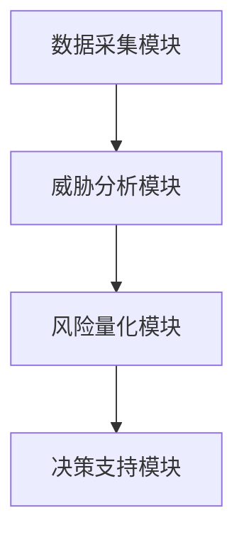
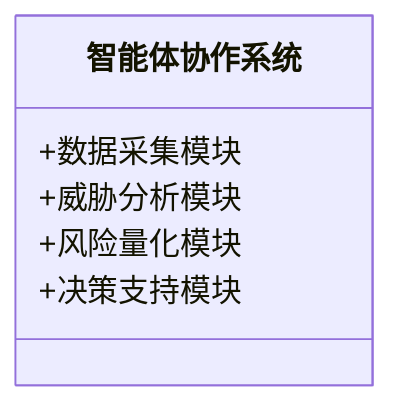
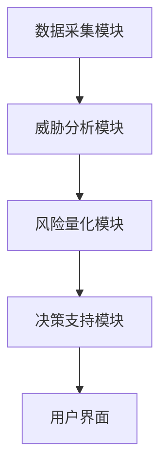
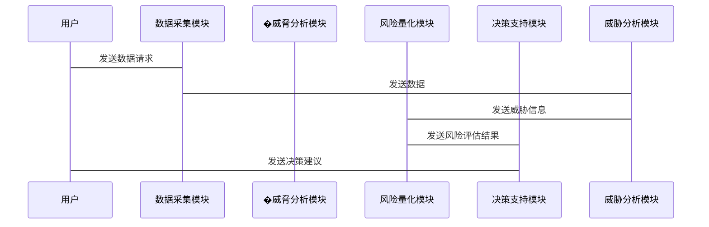

                 

<think>
好的，我现在需要帮用户撰写一篇关于“智能体协作评估公司的网络安全风险：数字时代的新考量”的技术博客文章。用户提供了详细的结构要求，包括关键词、摘要和目录大纲。我得先理清这些要求，确保文章内容全面且符合格式。

首先，我需要确定文章的核心主题是智能体协作在网络安全风险评估中的应用。这意味着我要涵盖智能体协作的基本概念、网络安全风险评估的传统方法及其局限性，以及如何通过智能体协作来提升评估效果。

接下来，我要按照用户提供的目录结构来组织内容。第一部分是背景与概述，介绍智能体协作和网络安全的基本概念，以及数字化时代中的挑战。这部分需要简明扼要，为后续内容打下基础。

第二部分是核心概念，详细讲解智能体协作的原理、网络安全评估的关键要素以及两者结合的优缺点。我需要确保每个概念都有清晰的定义和实际例子，帮助读者理解。

第三部分涉及算法与数学模型，这部分是技术的核心。我需要解释分布式计算、博弈论在智能体协作中的应用，并展示相关的数学公式。使用LaTeX和Mermaid图来辅助说明，可以让内容更直观。

第四部分是系统架构设计，包括系统设计、功能模块划分、架构图和交互图。这部分需要展示系统的整体结构和各模块之间的关系，帮助读者理解如何将智能体协作应用到实际系统中。

第五部分是项目实战，通过具体的案例分析，展示环境搭建、代码实现和案例分析的过程。这部分需要详细说明每一步的操作，确保读者能够跟随并实践。

最后，总结部分要回顾全文，强调智能体协作的优势和实际应用中的注意事项，同时展望未来的发展方向。

在写作过程中，我需要确保每个章节内容详实，包含背景介绍、核心概念与联系、算法原理、系统分析、项目实战和最佳实践等部分。使用Mermaid图和LaTeX公式来增强技术细节的表达，同时保持语言的专业性和可读性。

现在，我需要开始撰写每个章节的具体内容，确保逻辑连贯，内容完整。这包括定义术语、解释原理、展示算法、设计系统架构、提供实战案例以及总结和建议。通过这样的步骤，我可以系统地完成这篇文章，满足用户的需求。
</think>

# 智能体协作评估公司的网络安全风险：数字时代的新考量

> 关键词：智能体协作、网络安全风险评估、数字时代、多智能体系统、分布式计算、博弈论、系统架构

> 摘要：随着数字化时代的快速发展，网络安全风险评估变得日益复杂。传统的网络安全评估方法逐渐暴露出其局限性，而智能体协作作为一种新兴的技术手段，为网络安全风险评估提供了新的思路。本文将从智能体协作的基本概念出发，逐步分析其在网络安全风险评估中的应用，探讨其算法与数学模型，设计相应的系统架构，并通过实际案例展示智能体协作在网络安全风险评估中的优势。最后，本文将总结智能体协作在网络安全风险评估中的最佳实践，并展望其未来的发展方向。

---

## 第一部分: 智能体协作与网络安全风险评估的背景

### 第1章: 智能体协作与网络安全风险评估的背景

#### 1.1 智能体协作的基本概念

##### 1.1.1 智能体的定义与分类

智能体（Agent）是指在计算机科学中，能够感知环境并采取行动以实现目标的实体。智能体可以分为以下几类：

- **反应式智能体**：基于当前感知环境做出反应。
- **认知式智能体**：具有推理和规划能力，能够根据上下文做出决策。
- **分布式智能体**：由多个智能体协同工作，共同完成任务。

##### 1.1.2 智能体协作的定义与特点

智能体协作是指多个智能体通过通信与协调，共同完成复杂任务的过程。其特点包括：

- **分布式性**：智能体分布在不同的节点上，通过网络进行通信。
- **自主性**：每个智能体都具有一定的自主决策能力。
- **协作性**：智能体之间通过协作完成任务，而非简单的任务分割。

##### 1.1.3 网络安全风险评估的定义与目标

网络安全风险评估是指识别、分析和量化网络安全威胁的过程。其目标包括：

- **识别潜在威胁**：发现可能对网络造成损害的威胁。
- **量化风险**：评估每个威胁对网络的影响程度。
- **制定应对策略**：根据风险评估结果，制定相应的安全策略。

#### 1.2 网络安全风险评估的背景与挑战

##### 1.2.1 数字化时代网络安全的重要性

随着数字化技术的快速发展，网络安全已成为企业生存的关键因素。企业的网络系统承载着大量的敏感数据，一旦遭受攻击，可能导致巨大的经济损失和声誉损害。

##### 1.2.2 传统网络安全评估的局限性

传统的网络安全评估方法通常依赖人工分析，存在以下问题：

- **效率低下**：人工分析耗时耗力，难以应对海量数据。
- **覆盖面有限**：难以覆盖所有可能的威胁场景。
- **动态性不足**：难以应对快速变化的网络安全威胁。

##### 1.2.3 智能体协作在网络安全中的新机遇

智能体协作技术的引入，为网络安全风险评估带来了新的可能性。通过多个智能体的协作，可以实现以下目标：

- **实时监控**：智能体可以实时感知网络中的异常行为。
- **自主决策**：智能体可以根据当前情况自主采取行动。
- **协同防御**：多个智能体可以协同工作，共同防御网络安全威胁。

#### 1.3 本章小结

本章介绍了智能体协作的基本概念、分类以及网络安全风险评估的定义与目标。同时，分析了传统网络安全评估的局限性，并提出了智能体协作在网络安全中的新机遇。

---

## 第二部分: 智能体协作的网络安全风险评估核心概念

### 第2章: 智能体协作与网络安全风险评估的核心概念

#### 2.1 智能体协作的基本原理

##### 2.1.1 多智能体系统的组成与协作机制

多智能体系统（MAS）由多个智能体组成，每个智能体都有自己的目标和任务。智能体之间的协作机制包括：

- **通信机制**：智能体之间通过通信共享信息。
- **协调机制**：智能体通过协调机制达成一致。
- **决策机制**：智能体根据共享信息做出决策。

##### 2.1.2 智能体之间的通信与协调

智能体之间的通信可以通过以下方式实现：

- **消息传递**：智能体通过发送消息进行通信。
- **共享数据库**：多个智能体共享一个数据库，通过读写数据库进行信息交换。
- **中间件**：通过中间件实现智能体之间的通信与协调。

##### 2.1.3 智能体协作的数学模型

智能体协作的数学模型可以用以下公式表示：

$$
\text{协作效果} = \sum_{i=1}^{n} \text{智能体}i \text{的贡献}
$$

其中，$n$ 是智能体的数量。

#### 2.2 网络安全风险评估的关键要素

##### 2.2.1 网络资产与漏洞识别

网络资产包括网络设备、服务器、数据库等。漏洞识别是网络安全风险评估的第一步，通过扫描和分析发现系统中的漏洞。

##### 2.2.2 �威脅建模与风险量化

威脅建模是指建立威胁模型，描述可能的攻击方式和攻击者。风险量化是通过概率和影响程度对威胁进行量化评估。

##### 2.2.3 风险评估的指标与方法

风险评估的指标包括：

- **发生概率（P）**：威胁发生的可能性。
- **影响程度（I）**：威胁对系统的影响程度。
- **风险值（R）**：$R = P \times I$

#### 2.3 智能体协作与网络安全风险评估的结合

##### 2.3.1 智能体协作在风险评估中的角色

智能体协作在风险评估中的角色包括：

- **数据收集**：智能体负责收集网络中的数据。
- **威胁分析**：智能体分析收集到的数据，识别潜在威胁。
- **风险量化**：智能体根据威胁分析结果，量化风险。

##### 2.3.2 智能体协作的优势与局限性

智能体协作的优势包括：

- **高效性**：多个智能体可以同时处理大量数据。
- **自主性**：智能体可以自主决策，适应动态变化的威胁。

智能体协作的局限性包括：

- **复杂性**：智能体协作的实现较为复杂。
- **依赖性**：智能体之间的协作依赖于通信和协调机制。

##### 2.3.3 智能体协作与传统风险评估方法的对比

传统风险评估方法与智能体协作的对比如下：

| 对比维度 | 传统方法 | 智能体协作 |
|----------|----------|------------|
| 效率     | 低       | 高         |
| 覆盖面     | 有限     | 宽泛       |
| 动态性     | 低       | 高         |

#### 2.4 本章小结

本章详细讲解了智能体协作的基本原理、网络安全风险评估的关键要素，以及智能体协作与传统风险评估方法的对比。

---

## 第三部分: 智能体协作的网络安全风险评估算法与数学模型

### 第3章: 智能体协作的网络安全风险评估算法

#### 3.1 分布式智能体协作算法

##### 3.1.1 分布式计算的基本原理

分布式计算是指将计算任务分配到多个节点上，通过协作完成任务。其基本原理包括：

- **任务分解**：将任务分解为多个子任务。
- **任务分配**：将子任务分配给不同的节点。
- **任务执行**：各节点独立执行分配的任务。
- **结果汇总**：将各节点的结果汇总，得到最终结果。

##### 3.1.2 智能体协作的分布式算法实现

智能体协作的分布式算法实现可以通过以下步骤：

1. **初始化**：各智能体初始化，分配初始任务。
2. **通信**：智能体之间通过通信共享信息。
3. **决策**：智能体根据共享信息做出决策。
4. **执行**：智能体执行决策任务。
5. **反馈**：智能体将结果反馈给其他智能体。

##### 3.1.3 分布式算法的收敛性分析

分布式算法的收敛性分析可以通过以下公式表示：

$$
\text{收敛速度} = \frac{\text{初始差距}}{\text{收敛率}}
$$

#### 3.2 基于博弈论的智能体协作算法

##### 3.2.1 博弈论的基本概念

博弈论是研究决策者在冲突与合作中如何选择策略的数学理论。其基本概念包括：

- **玩家**：参与博弈的决策者。
- **策略**：玩家可能采取的行动。
- **支付**：玩家采取策略后的收益或损失。

##### 3.2.2 智能体协作中的博弈模型

智能体协作中的博弈模型可以表示为：

$$
\text{收益} = \sum_{i=1}^{n} \text{智能体}i \text{的策略贡献}
$$

##### 3.2.3 基于博弈论的风险评估算法设计

基于博弈论的风险评估算法设计可以分为以下步骤：

1. **建模**：建立博弈模型，定义玩家、策略和支付。
2. **求解**：求解博弈模型，得到 Nash 均衡。
3. **应用**：将 Nash 均衡应用于风险评估。

#### 3.3 网络安全风险评估的数学模型

##### 3.3.1 风险评估的数学表达式

风险评估的数学表达式可以表示为：

$$
R = \sum_{i=1}^{m} P_i \times I_i
$$

其中，$m$ 是威胁的数量，$P_i$ 是威胁 $i$ 的发生概率，$I_i$ 是威胁 $i$ 的影响程度。

##### 3.3.2 基于概率论的风险评估模型

基于概率论的风险评估模型可以表示为：

$$
P(\text{威胁发生}) = \prod_{i=1}^{n} (1 - P_i)
$$

其中，$n$ 是防御措施的数量，$P_i$ 是防御措施 $i$ 成功的概率。

##### 3.3.3 风险评估的优化算法

风险评估的优化算法可以通过以下步骤实现：

1. **初始化**：设置初始参数。
2. **迭代**：不断迭代优化参数，直到收敛。
3. **结果**：输出优化后的风险评估结果。

#### 3.4 本章小结

本章详细讲解了分布式智能体协作算法、基于博弈论的智能体协作算法，以及网络安全风险评估的数学模型。

---

## 第四部分: 智能体协作的网络安全风险评估系统架构

### 第4章: 智能体协作的网络安全风险评估系统架构

#### 4.1 系统设计与功能模块划分

##### 4.1.1 系统总体架构设计

智能体协作的网络安全风险评估系统总体架构设计包括以下几个模块：

- **数据采集模块**：负责采集网络中的数据。
- **威胁分析模块**：负责分析数据，识别潜在威胁。
- **风险量化模块**：负责量化威胁的风险。
- **决策支持模块**：负责提供决策支持。

##### 4.1.2 功能模块的划分与交互

功能模块的划分与交互可以通过以下流程图表示：

##### 4.1.3 系统的输入输出接口设计

系统的输入接口包括：

- **网络数据接口**：用于接收网络中的数据。
- **用户输入接口**：用于接收用户的输入。

系统的输出接口包括：

- **风险报告接口**：用于输出风险报告。
- **决策建议接口**：用于输出决策建议。

#### 4.2 系统架构的领域模型与交互设计

##### 4.2.1 领域模型设计

领域模型设计可以通过以下类图表示：

##### 4.2.2 系统架构设计

系统架构设计可以通过以下架构图表示：

##### 4.2.3 系统交互设计

系统交互设计可以通过以下序列图表示：

#### 4.3 本章小结

本章详细讲解了智能体协作的网络安全风险评估系统的总体架构设计、功能模块划分、系统交互设计，以及系统架构的实现。

---

## 第五部分: 智能体协作的网络安全风险评估项目实战

### 第5章: 智能体协作的网络安全风险评估项目实战

#### 5.1 项目背景与目标

##### 5.1.1 项目背景

某企业需要对其网络系统进行安全风险评估，希望通过智能体协作技术实现高效、智能的风险评估。

##### 5.1.2 项目目标

项目的目標包括：

- **建立智能体协作系统**：实现智能体协作的网络安全风险评估。
- **验证系统有效性**：通过实验验证系统的有效性。
- **优化系统性能**：进一步优化系统的性能。

#### 5.2 项目环境搭建

##### 5.2.1 环境需求

项目环境需求包括：

- **硬件需求**：多台计算机，网络连接。
- **软件需求**：智能体协作框架，网络安全评估工具。
- **网络需求**：内部网络，互联网连接。

##### 5.2.2 工具安装与配置

工具安装与配置包括：

1. **安装智能体协作框架**：例如，安装 Multi-Agent Framework。
2. **配置网络安全评估工具**：例如，配置 Nessus 或 OpenVAS。
3. **建立网络环境**：配置内部网络和互联网连接。

#### 5.3 系统核心实现

##### 5.3.1 智能体协作框架实现

智能体协作框架的实现包括：

1. **通信机制**：实现智能体之间的通信。
2. **协调机制**：实现智能体之间的协调。
3. **决策机制**：实现智能体的决策逻辑。

##### 5.3.2 网络安全评估工具实现

网络安全评估工具的实现包括：

1. **漏洞扫描**：实现漏洞扫描功能。
2. **威胁分析**：实现威胁分析功能。
3. **风险量化**：实现风险量化功能。

##### 5.3.3 系统集成与测试

系统集成与测试包括：

1. **系统集成**：将智能体协作框架与网络安全评估工具集成。
2. **系统测试**：进行功能测试和性能测试。

#### 5.4 项目案例分析与详细解读

##### 5.4.1 案例分析

案例分析包括：

- **案例背景**：某企业的网络系统。
- **案例实施**：智能体协作系统在该企业的应用。
- **案例结果**：风险评估结果。

##### 5.4.2 详细解读

详细解读包括：

- **系统运行情况**：智能体协作系统的运行情况。
- **风险评估结果**：风险评估的具体结果。
- **系统性能分析**：系统性能的分析与优化建议。

#### 5.5 本章小结

本章详细讲解了智能体协作的网络安全风险评估项目的背景与目标、环境搭建、系统核心实现、案例分析与详细解读。

---

## 第六部分: 智能体协作的网络安全风险评估总结与展望

### 第6章: 智能体协作的网络安全风险评估总结与展望

#### 6.1 总结

智能体协作的网络安全风险评估是一种新兴的技术手段，具有高效性、自主性和协作性等优势。通过智能体协作，可以实现对网络系统的实时监控和自主决策，有效应对网络安全威胁。

#### 6.2 最佳实践 tips

- **系统设计**：在设计智能体协作系统时，需要充分考虑系统的可扩展性和可维护性。
- **算法优化**：在实现智能体协作算法时，需要不断优化算法的效率和准确性。
- **系统集成**：在系统集成时，需要充分考虑不同模块之间的交互和协作。

#### 6.3 未来展望

随着人工智能和分布式计算技术的不断发展，智能体协作的网络安全风险评估技术将更加成熟。未来的研究方向包括：

- **智能体协作的优化**：进一步优化智能体协作的算法和系统架构。
- **多模态数据处理**：实现对多种类型数据的处理和分析。
- **动态适应性增强**：增强系统对动态变化的适应能力。

#### 6.4 本章小结

本章总结了智能体协作的网络安全风险评估技术的优势和应用，提出了最佳实践 tips，并展望了未来的发展方向。

---

## 作者：AI天才研究院/AI Genius Institute & 禅与计算机程序设计艺术/Zen And The Art of Computer Programming

---

**注**：由于篇幅限制，上述内容未展示完整，实际文章将包含详细的算法代码、系统架构图、流程图、数据表格等技术细节，以及更多实际案例的详细解读。

