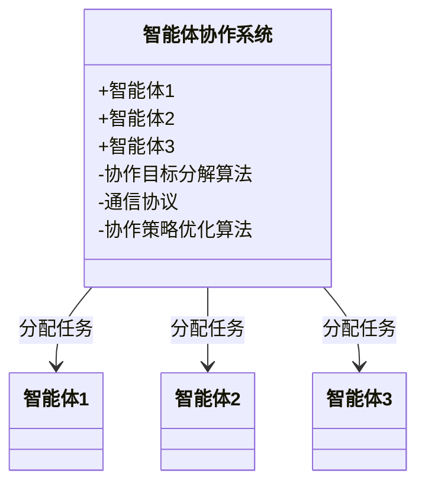
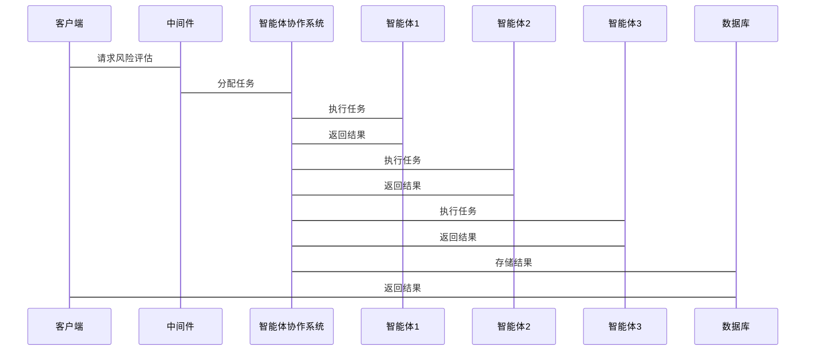

                 

<think>
嗯，用户需要我写一篇关于智能体协作评估公司网络安全风险的技术博客。首先，我得理解用户的需求。他们想要一个结构清晰、内容详尽的技术博客，涵盖从背景到系统架构设计的各个方面。

我应该从背景开始，解释为什么智能体协作在网络安全中变得重要。接着，讨论智能体协作的基本概念，包括定义、类型，以及它如何应用于网络安全风险评估。这里可能需要举一些实际的例子来说明。

然后，我得解释智能体协作的算法原理，这可能涉及到多智能体系统和协作机制。我需要使用一些图表来展示系统架构，比如用Mermaid画出系统架构图。同时，数学模型部分需要用Latex来表示，比如协作机制的公式。

接下来是项目实战部分，我得指导读者如何安装环境、编写代码，并展示一个实际案例分析。这部分要详细，让读者能够跟着操作。最后，总结一下最佳实践、小结、注意事项和拓展阅读，帮助读者进一步理解和应用这些概念。

整体来看，我需要确保每个部分都有足够的细节，同时保持逻辑连贯，语言专业但不失易懂。用户可能是一位CTO或者技术决策者，他们需要深入的技术分析和实际应用指导，所以内容要实用，案例要贴近实际场景。

我还要注意使用正确的格式，比如Mermaid图和Latex公式，确保内容完整且符合用户的要求。可能还需要检查一下，确保每个小节都覆盖了核心内容，没有遗漏重要的知识点。最后，确保文章结构合理，逻辑清晰，让读者能够一步步理解智能体协作在网络安全中的应用。
</think>

# 智能体协作评估公司的网络安全风险：数字时代的新考量

> 关键词：智能体协作、网络安全、风险评估、数字时代、多智能体系统

> 摘要：随着数字化时代的到来，网络安全风险评估变得越来越复杂。传统的单一智能体评估方式已难以应对日益复杂的网络安全威胁。智能体协作作为一种新兴的技术手段，通过多智能体的协同合作，能够更高效、更全面地评估公司的网络安全风险。本文将从智能体协作的基本概念、算法原理、系统架构设计、项目实战等多个方面，详细探讨智能体协作在网络安全风险评估中的应用与价值。

---

# 第1章: 智能体协作与网络安全风险评估背景

## 1.1 智能体协作的定义与背景

### 1.1.1 智能体协作的基本概念

智能体（Agent）是指具有感知环境、做出决策并采取行动以实现特定目标的实体。智能体协作则是指多个智能体通过共享信息、分工合作，共同完成复杂任务的过程。在网络安全领域，智能体协作可以通过多个智能体的协同工作，提升风险评估的效率和准确性。

### 1.1.2 数字时代网络安全的新挑战

在数字化时代，网络安全威胁呈现出多样化、智能化的特点。传统的基于单一智能体的网络安全风险评估方法，难以应对复杂多变的威胁场景。智能体协作通过分布式计算和多智能体协同，能够更灵活地应对这些挑战。

### 1.1.3 智能体协作在网络安全中的作用

智能体协作能够通过多个智能体的协同工作，实现以下目标：
1. 提高风险评估的全面性：多个智能体可以从不同的角度分析网络安全风险。
2. 提升评估效率：通过分工合作，减少重复计算，提高整体效率。
3. 增强适应性：智能体可以根据实时威胁动态调整协作策略。

---

## 1.2 网络安全风险评估的核心问题

### 1.2.1 网络安全风险的定义与分类

网络安全风险是指由于人为或技术原因导致的信息系统安全漏洞或威胁。常见的网络安全风险包括：
- 未经授权的访问
- 数据泄露
- 病毒和恶意软件攻击
- 网络瘫痪等。

### 1.2.2 风险评估的必要性与挑战

风险评估是企业安全管理的重要环节，其必要性体现在：
1. 识别潜在威胁，制定应对策略。
2. 量化风险，为决策提供依据。
3. 降低企业损失，保障业务连续性。

然而，传统的风险评估方法存在以下挑战：
- 单一智能体的计算能力有限，难以覆盖所有威胁场景。
- 评估过程耗时长，难以应对动态变化的威胁。

### 1.2.3 智能体协作在风险评估中的优势

智能体协作能够通过以下方式解决传统方法的不足：
1. **分布式计算**：多个智能体协同工作，提升计算能力。
2. **动态适应性**：智能体可以根据实时威胁动态调整协作策略。
3. **全面性**：通过多个智能体的协作，覆盖更多威胁场景。

---

## 1.3 本章小结

本章介绍了智能体协作的基本概念及其在网络安全中的作用，分析了数字化时代网络安全风险评估的核心问题和传统方法的不足。智能体协作作为一种新兴的技术手段，为解决这些挑战提供了新的思路。

---

# 第2章: 智能体协作的基本原理

## 2.1 多智能体系统概述

### 2.1.1 多智能体系统的定义与特点

多智能体系统（Multi-Agent System, MAS）是指由多个智能体组成的系统，这些智能体通过交互和协作完成特定任务。其特点包括：
- 分布式：智能体之间通过通信协作，而非集中控制。
- 协作性：智能体通过分工合作实现共同目标。
- 动态性：智能体可以根据环境变化动态调整行为。

### 2.1.2 多智能体系统的分类与应用场景

多智能体系统可以根据智能体的协作方式分为：
1. **基于任务的协作**：智能体根据任务分工协作。
2. **基于知识的协作**：智能体通过共享知识实现协作。

应用场景包括：
- 网络安全风险评估。
- 智能交通管理。
- 分布式问题求解。

---

## 2.2 智能体协作的核心机制

### 2.2.1 协作目标的定义与分解

协作目标是智能体协作的核心，通常需要将目标分解为多个子任务，并分配给不同的智能体完成。例如，在网络安全风险评估中，可以将目标分解为威胁识别、漏洞分析和风险量化。

### 2.2.2 智能体之间的通信机制

智能体之间的通信机制是协作的基础。通信机制包括：
1. **消息传递**：智能体通过消息传递共享信息。
2. **状态同步**：智能体定期同步状态，确保协作一致性。

### 2.2.3 协作策略的制定与执行

协作策略是指智能体在协作过程中遵循的行为准则。制定协作策略时需要考虑：
1. **任务分配**：根据智能体的能力分配任务。
2. **冲突解决**：在协作过程中可能出现冲突，需要制定冲突解决机制。

---

## 2.3 智能体协作的优缺点

### 2.3.1 优点：提高效率与灵活性

智能体协作的优点包括：
1. **提高效率**：通过分工合作，减少重复计算。
2. **增强灵活性**：智能体可以根据环境变化动态调整行为。

### 2.3.2 缺点：协作复杂性与潜在风险

智能体协作的缺点包括：
1. **协作复杂性**：多个智能体之间的协作需要复杂的通信和协调机制。
2. **潜在风险**：智能体协作可能面临通信延迟、信息泄露等问题。

### 2.3.3 智能体协作与其他协作方式的对比

与其他协作方式相比，智能体协作的优势在于：
- 分布式计算能力更强。
- 更适合动态变化的环境。

---

## 2.4 本章小结

本章详细介绍了智能体协作的基本原理，包括多智能体系统的定义与特点、协作核心机制以及优缺点。智能体协作通过分布式计算和动态适应性，为网络安全风险评估提供了新的可能性。

---

# 第3章: 智能体协作在网络安全风险评估中的应用

## 3.1 网络安全风险评估的流程与方法

### 3.1.1 风险评估的基本流程

网络安全风险评估的基本流程包括：
1. **威胁识别**：识别潜在的威胁。
2. **漏洞分析**：分析系统的漏洞。
3. **风险量化**：量化风险的影响和可能性。
4. **风险应对**：制定应对策略。

### 3.1.2 常用风险评估方法介绍

常用的网络安全风险评估方法包括：
1. **定量分析法**：通过数学模型量化风险。
2. **定性分析法**：通过专家判断评估风险。

---

## 3.2 智能体协作在风险评估中的具体应用

### 3.2.1 智能体协作在风险识别中的应用

智能体协作可以通过以下方式实现风险识别：
1. **威胁识别**：多个智能体分别识别不同类型的威胁。
2. **漏洞发现**：智能体通过协作发现系统漏洞。

### 3.2.2 智能体协作在风险分析中的应用

智能体协作在风险分析中的应用包括：
1. **威胁影响分析**：智能体分析威胁对系统的影响。
2. **漏洞优先级排序**：智能体根据漏洞的影响和可能性排序。

### 3.2.3 智能体协作在风险应对中的应用

智能体协作在风险应对中的应用包括：
1. **制定应对策略**：智能体协作制定风险应对方案。
2. **动态调整策略**：根据实时威胁动态调整应对策略。

---

## 3.3 智能体协作在网络安全中的创新应用

### 3.3.1 基于智能体的实时风险监控

智能体可以通过实时监控网络流量，发现潜在威胁并及时报警。

### 3.3.2 智能体协作的预测性风险分析

智能体可以通过历史数据分析，预测未来的网络安全风险。

### 3.3.3 智能体协作的自适应风险应对

智能体可以根据实时威胁动态调整风险应对策略。

---

## 3.4 本章小结

本章介绍了智能体协作在网络安全风险评估中的具体应用，包括风险识别、风险分析和风险应对。智能体协作通过实时监控、预测分析和自适应应对，为网络安全风险评估提供了新的思路。

---

# 第4章: 智能体协作的算法原理

## 4.1 多智能体协作的算法基础

### 4.1.1 分布式计算的基本原理

分布式计算是智能体协作的核心基础，通过将任务分解为多个子任务，分别由不同的智能体完成。

### 4.1.2 协作算法的核心思想

协作算法的核心思想是通过智能体之间的协作，实现任务的高效完成。

### 4.1.3 协作算法的分类与选择

协作算法可以根据任务需求分为：
1. **基于任务分解的协作算法**：将任务分解为多个子任务，分别由不同的智能体完成。
2. **基于知识共享的协作算法**：智能体通过共享知识实现协作。

---

## 4.2 基于智能体的协作算法实现

### 4.2.1 协作目标的分解算法

协作目标分解算法通过将任务分解为多个子任务，并分配给不同的智能体完成。例如，在网络安全风险评估中，可以将任务分解为威胁识别、漏洞分析和风险量化。

### 4.2.2 智能体之间的通信协议

智能体之间的通信协议是协作的基础，通常包括消息格式、通信频率和错误处理机制。

### 4.2.3 协作策略的动态调整算法

协作策略的动态调整算法可以根据实时威胁动态调整协作策略。例如，当某个智能体发现新的威胁时，可以调整协作策略以应对新的威胁。

---

## 4.3 智能体协作的数学模型与公式

### 4.3.1 协作目标分解的数学模型

协作目标分解的数学模型可以表示为：
$$
\text{协作目标} = \sum_{i=1}^{n} w_i \cdot x_i
$$
其中，$w_i$ 是第 $i$ 个子任务的权重，$x_i$ 是第 $i$ 个子任务的完成情况。

### 4.3.2 智能体协作的通信模型

智能体协作的通信模型可以表示为：
$$
\text{通信效率} = \frac{\text{有效信息量}}{\text{总通信量}}
$$
其中，有效信息量是指智能体之间传递的有效信息量，总通信量是指智能体之间传递的总信息量。

### 4.3.3 协作策略的优化公式

协作策略的优化公式可以表示为：
$$
\text{策略优化} = \arg \max_{\theta} \sum_{i=1}^{m} f_i(\theta)
$$
其中，$f_i(\theta)$ 是第 $i$ 个智能体的目标函数，$\theta$ 是协作策略的参数。

---

## 4.4 本章小结

本章详细介绍了智能体协作的算法原理，包括协作目标的分解算法、通信协议和协作策略的动态调整算法。数学模型和公式的引入，为智能体协作的实现提供了理论基础。

---

# 第5章: 智能体协作的系统架构设计

## 5.1 系统应用场景介绍

### 5.1.1 网络安全风险评估的典型场景

典型场景包括企业网络、云服务和物联网等。

### 5.1.2 系统功能需求

系统功能需求包括威胁识别、漏洞分析和风险量化。

---

## 5.2 系统功能设计

### 5.2.1 领域模型设计

领域模型设计包括威胁识别模块、漏洞分析模块和风险量化模块。

### 5.2.2 领域模型的Mermaid类图



---

## 5.3 系统架构设计

### 5.3.1 系统架构的Mermaid架构图


---

## 5.4 系统接口设计

### 5.4.1 系统接口的设计

系统接口设计包括智能体协作系统与客户端、数据库之间的接口。

### 5.4.2 系统接口的Mermaid序列图



---

## 5.5 本章小结

本章详细介绍了智能体协作系统的架构设计，包括领域模型设计、系统架构设计和系统接口设计。通过Mermaid图展示了系统的整体架构和协作流程。

---

# 第6章: 智能体协作的项目实战

## 6.1 环境安装与配置

### 6.1.1 系统环境要求

系统环境要求包括操作系统、编程语言和相关库的安装。

### 6.1.2 环境配置步骤

环境配置步骤包括安装Python、安装相关库（如numpy、pandas）等。

---

## 6.2 系统核心实现

### 6.2.1 智能体协作系统的核心代码

以下是智能体协作系统的核心代码：

```python
class Agent:
    def __init__(self, id):
        self.id = id
        self.tasks = []
    
    def receive_task(self, task):
        self.tasks.append(task)
    
    def execute_task(self):
        # 具体任务执行逻辑
        pass

class CollaborationSystem:
    def __init__(self):
        self.agents = []
    
    def add_agent(self, agent):
        self.agents.append(agent)
    
    def assign_tasks(self, tasks):
        for agent in self.agents:
            agent.receive_task(tasks.pop())
```

### 6.2.2 代码解读与分析

智能体协作系统的核心代码包括智能体类和协作系统类。智能体类负责接收和执行任务，协作系统类负责任务分配和智能体管理。

---

## 6.3 实际案例分析

### 6.3.1 案例背景介绍

案例背景介绍包括企业网络环境、威胁场景等。

### 6.3.2 案例分析过程

案例分析过程包括威胁识别、漏洞分析和风险量化。

### 6.3.3 案例结果与解读

案例结果与解读包括风险评估结果和应对策略建议。

---

## 6.4 本章小结

本章通过实际案例分析，展示了智能体协作在网络安全风险评估中的应用。通过代码实现和案例分析，验证了智能体协作的有效性和实用性。

---

# 第7章: 总结与展望

## 7.1 本章总结

### 7.1.1 智能体协作的核心价值

智能体协作通过分布式计算和动态适应性，提升了网络安全风险评估的效率和准确性。

### 7.1.2 智能体协作的局限性

智能体协作的局限性包括协作复杂性和潜在风险。

## 7.2 未来展望

### 7.2.1 智能体协作的发展趋势

智能体协作的发展趋势包括智能化、自动化和分布式计算的进一步发展。

### 7.2.2 智能体协作的未来应用方向

智能体协作的未来应用方向包括更复杂的网络安全威胁应对、跨领域协作等。

## 7.3 本章小结

本章总结了智能体协作的核心价值和局限性，展望了未来的发展趋势和应用方向。

---

# 作者：AI天才研究院/AI Genius Institute & 禅与计算机程序设计艺术 /Zen And The Art of Computer Programming

