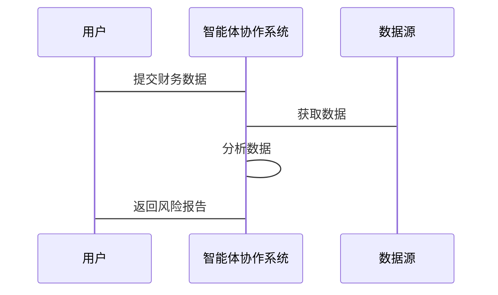

                 


# 智能体协作评估管理层诚信：防范财务欺诈风险

## 关键词：智能体协作，管理层诚信，财务欺诈，风险管理，数据挖掘，系统架构

## 摘要：  
本文探讨了智能体协作技术在评估管理层诚信、防范财务欺诈风险中的应用。通过分析财务数据中的异常模式和关联关系，智能体协作能够有效识别潜在的欺诈行为。本文从背景介绍、核心概念、算法原理、系统架构到项目实战，全面解析智能体协作在管理层诚信评估中的技术实现与应用。

---

# 第一部分：智能体协作评估管理层诚信的背景与核心概念

## 第1章：背景介绍与问题描述

### 1.1 企业诚信管理的重要性  
企业在经营过程中，管理层的诚信是企业稳健发展的基石。然而，财务欺诈行为（如虚假交易、账务造假等）屡见不鲜，严重威胁企业的健康发展。传统的财务审计方法依赖人工审查，效率低且易受主观因素影响。  

### 1.2 管理层诚信评估的核心问题  
管理层诚信评估需要从财务数据、业务流程和管理层行为模式等多个维度入手。财务欺诈通常表现为异常交易模式、关联方交易频繁、财务数据不一致等问题。  

### 1.3 智能体协作技术的应用前景  
智能体协作技术通过分布式计算、自适应学习和多智能体协作，能够实时分析海量财务数据，识别潜在的欺诈风险。  

## 第2章：核心概念与联系

### 2.1 智能体协作评估的原理  
智能体协作评估通过多个智能体协同工作，分别负责数据采集、模式识别和风险评估。每个智能体专注于特定任务，并通过通信机制共享结果。  

### 2.2 核心概念属性对比表  
以下表格对比了智能体协作评估的核心概念及其属性：  

| 概念       | 属性1：分布式 | 属性2：自适应 | 属性3：可扩展 |
|------------|---------------|---------------|---------------|
| 智能体协作 | 多节点协作     | 动态调整策略   | 支持大规模数据 |

### 2.3 ER实体关系图  
以下是管理层诚信评估的ER实体关系图：  

```mermaid
erDiagram
    actor 管理层 <<--- entity 交易数据
    entity 交易数据 --> entity 财务报表
    entity 财务报表 <<--- entity 审计报告
```

---

# 第二部分：智能体协作评估的算法与数学模型

## 第3章：算法原理讲解

### 3.1 异常检测算法  
异常检测用于识别财务数据中的异常交易。常用算法包括：  

#### 3.1.1 基于统计的异常检测  
使用z-score方法检测异常值：  
$$ z = \frac{x - \mu}{\sigma} $$  
其中，$\mu$是均值，$\sigma$是标准差。  

#### 3.1.2 基于机器学习的异常检测  
使用Isolation Forest算法：  
$$ score = \text{outlier\_score}(x) $$  

#### 3.1.3 基于深度学习的异常检测  
使用LSTM网络捕捉时间序列中的异常模式：  
$$ y = \text{LSTM}(x_t) $$  

### 3.2 关联规则挖掘算法  
关联规则挖掘用于发现财务数据中的关联模式。  

#### 3.2.1 Apriori算法原理  
Apriori算法通过频繁项集挖掘关联规则：  
$$ \text{支持度} = \frac{\text{频繁项集的出现次数}}{\text{总交易数}} $$  

#### 3.2.2 FP-Growth算法优化  
FP-Growth算法通过构建前缀树优化关联规则挖掘：  
$$ \text{支持度} = \frac{\text{项集的出现次数}}{\text{总交易数}} $$  

---

## 第4章：系统分析与架构设计

### 4.1 问题场景介绍  
系统需实现智能体协作评估管理层诚信，实时监控企业财务数据，识别潜在欺诈风险。  

### 4.2 系统功能设计  
系统功能包括：数据采集、异常检测、关联分析、风险评估和报告生成。  

### 4.3 系统架构设计  
以下是系统架构图：  


### 4.4 系统接口设计  
系统提供API接口，支持与其他系统（如ERP、财务系统）集成。  

### 4.5 系统交互流程  
以下是系统交互流程图：  



---

## 第5章：项目实战

### 5.1 环境安装  
安装Python、TensorFlow、scikit-learn等工具。  

### 5.2 核心代码实现  

#### 数据采集模块  
```python
import pandas as pd

def fetch_financial_data(company_id):
    # 数据获取逻辑
    pass
```

#### 异常检测模块  
```python
from sklearn.ensemble import IsolationForest

model = IsolationForest(random_state=42)
model.fit(X_train)
y_pred = model.predict(X_test)
```

#### 关联分析模块  
```python
from mlxtend.frequent_patterns import apriori

frequent_itemsets = apriori(df, min_support=0.001)
```

### 5.3 案例分析  
以某企业为例，分析其财务数据，发现异常交易并生成风险报告。  

### 5.4 项目小结  
通过项目实战，验证了智能体协作技术在管理层诚信评估中的有效性。

---

## 第6章：最佳实践与总结

### 6.1 最佳实践 Tips  
- 数据预处理是关键，确保数据质量。  
- 选择合适的算法，避免过度复杂化。  
- 定期更新模型，适应新的欺诈模式。  

### 6.2 小结  
智能体协作技术为企业防范财务欺诈风险提供了新的解决方案，未来可进一步优化算法和系统架构。

### 6.3 注意事项  
- 数据隐私保护需严格遵守相关法规。  
- 模型需定期更新，避免过时。  

### 6.4 拓展阅读  
推荐阅读《数据挖掘导论》和《分布式系统：概念、方法与挑战》。

---

# 作者：AI天才研究院 & 禅与计算机程序设计艺术

---

本文详细探讨了智能体协作技术在评估管理层诚信、防范财务欺诈风险中的应用。通过理论分析与实践案例，展示了智能体协作技术的优势与潜力。

