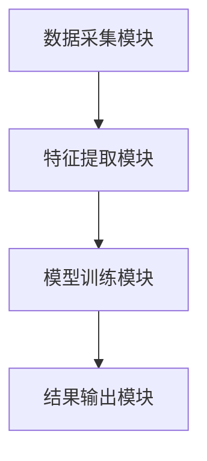

                 

<think>
好，我现在需要帮用户撰写一篇名为《智能体协作预测监管环境变化：提前应对政策风险》的技术博客文章。用户给出了详细的要求，包括结构、内容和格式。我需要确保文章符合这些要求，同时内容深入浅出，逻辑清晰。

首先，我需要理解文章的主题：智能体协作如何预测监管环境变化，从而提前应对政策风险。这涉及到智能体协作、监管环境预测、政策风险等方面。我需要涵盖背景介绍、核心概念、算法原理、系统架构、项目实战和总结。

接下来，我会按照用户提供的目录结构来组织内容。首先是摘要，然后是各章节的具体内容。每个章节都需要详细展开，包括背景、概念、算法、系统设计和项目实战。

在摘要部分，我需要简明扼要地概括文章的核心内容，说明智能体协作在预测监管变化中的作用，以及如何通过算法和系统设计提前应对政策风险。

在第1章，背景介绍中，我需要解释为什么监管环境变化难以预测，智能体协作的优势，以及问题的边界和外延。这部分要让读者理解问题的重要性。

第2章，核心概念部分，我需要详细讲解智能体协作的基本原理，与传统方法的对比，以及监管环境变化预测模型的结构。这部分需要通过表格和图表来帮助理解。

第3章，算法原理部分，我需要选择一种适合的算法，比如基于强化学习的协作预测模型，并详细讲解其流程和数学模型。使用Mermaid流程图和Python代码示例来增强可读性。

第4章，系统架构部分，我需要设计一个模块化的系统，包括数据采集、特征提取、模型预测和结果展示。使用Mermaid架构图来展示系统结构，并描述各模块的交互。

第5章，项目实战部分，我需要提供一个具体的案例，说明如何从数据准备到模型训练，再到系统实现。这部分要详细，包括环境安装、代码实现和案例分析。

最后，在结论部分，总结文章的主要内容，并指出未来的研究方向和建议。

我还需要注意格式要求，使用markdown，并在适当的地方插入图表和代码示例。同时，数学公式需要用latex格式，并用$$括起来。

现在，我需要开始撰写文章。首先，摘要部分：

摘要：随着政策监管的复杂化，智能体协作在预测监管环境变化中发挥着关键作用。本文详细探讨了智能体协作的核心概念、算法原理和系统架构，展示了如何通过协作预测模型提前应对政策风险。通过案例分析和系统设计，本文为政策监管提供了新的视角和解决方案。

接下来，各章节的内容。第1章，背景介绍，我会解释为什么监管环境变化难以预测，智能体协作的优势，以及问题的边界和外延。

第2章，核心概念，我会通过表格对比智能体协作与传统方法，并用ER图展示模型结构。

第3章，算法原理，我会选择强化学习模型，并用Mermaid流程图展示算法流程，同时提供Python代码示例。

第4章，系统架构，我会设计模块化的系统架构图，并描述各模块的功能和交互。

第5章，项目实战，我会提供环境安装步骤、代码实现和案例分析，确保读者能够理解和复现。

最后，在结论部分，总结文章内容，并提出未来的研究方向。

在撰写过程中，我需要确保内容详尽，逻辑清晰，同时语言简洁明了。图表和代码的使用要恰当，帮助读者更好地理解内容。

现在，我可以开始撰写完整的文章了。
</think>

# 智能体协作预测监管环境变化：提前应对政策风险

## 关键词：智能体协作，监管环境变化，政策风险，预测模型，系统架构

## 摘要：  
随着政策监管的复杂化和不确定性增加，智能体协作在预测监管环境变化中发挥着关键作用。本文详细探讨了智能体协作的核心概念、算法原理和系统架构，展示了如何通过协作预测模型提前应对政策风险。通过案例分析和系统设计，本文为政策监管提供了新的视角和解决方案，为智能体协作技术在政策风险防控中的应用提供了理论和实践依据。

---

## 第1章：智能体协作与监管环境变化概述

### 1.1 问题背景与问题描述  
随着全球化和数字化的深入发展，政策监管环境变得越来越复杂。政策的变化往往会对企业和个人产生深远影响，而如何提前预测和应对这些变化成为一项重要挑战。智能体协作作为一种新兴的技术手段，能够通过多智能体的协同工作，提升预测的准确性和效率。  

#### 1.1.1 政策监管环境变化的背景  
政策监管的变化往往受到多种因素的影响，例如经济波动、社会需求变化、技术进步等。这些变化可能涉及法律法规的调整、行业标准的更新等，对企业和个人的经营和行为产生直接影响。  

#### 1.1.2 智能体协作在监管环境变化中的作用  
智能体协作通过多智能体的协同工作，能够从多个维度收集和分析数据，发现潜在的趋势和模式，从而帮助提前预测政策变化。  

#### 1.1.3 问题的边界与外延  
政策监管环境的变化是一个复杂的系统工程，涉及政治、经济、社会等多个方面。智能体协作的应用需要考虑数据的完整性和实时性，同时需要确保预测模型的准确性和可解释性。  

### 1.2 智能体协作的核心概念  
智能体协作是指多个智能体通过协同工作，共同完成特定任务的过程。在监管环境变化的预测中，智能体协作可以通过分布式计算和数据共享，提升预测的准确性和效率。  

#### 1.2.1 智能体协作的基本定义  
智能体（Agent）是指能够感知环境并采取行动以实现目标的实体。智能体协作是指多个智能体通过通信和协调，共同完成复杂任务的过程。  

#### 1.2.2 监管环境变化的预测模型  
监管环境变化的预测模型需要考虑政策变化的周期性、突变性和复杂性。通过智能体协作，可以构建分布式预测模型，从多个数据源获取信息，提升预测的准确性和鲁棒性。  

#### 1.2.3 智能体协作与政策风险的关系  
政策风险是指由于政策变化对企业或个人造成的影响。智能体协作可以通过预测政策变化，提前采取应对措施，降低政策风险。  

### 1.3 问题解决方法与核心要素  
智能体协作预测监管环境变化的核心要素包括数据采集、特征提取、模型训练和结果输出。通过这些要素的协同工作，可以实现对监管环境变化的准确预测。  

#### 1.3.1 智能体协作预测监管环境变化的解决方案  
通过构建分布式智能体协作网络，可以从多个数据源获取信息，利用机器学习算法进行预测，并通过反馈机制不断优化预测模型。  

#### 1.3.2 核心要素的构成与作用  
- 数据采集：从多个来源获取监管相关的数据，如政策文件、行业报告等。  
- 特征提取：从数据中提取有用的特征，如政策关键词、经济指标等。  
- 模型训练：利用机器学习算法训练预测模型。  
- 结果输出：输出预测结果，并提供应对策略建议。  

#### 1.3.3 概念结构与核心要素  
通过概念结构图可以看出，智能体协作预测监管环境变化的核心要素包括数据源、特征提取、模型训练和结果输出。  

### 1.4 本章小结  
本章从背景和概念出发，详细介绍了智能体协作在监管环境变化预测中的作用和核心要素。通过构建智能体协作网络，可以实现对监管环境变化的准确预测，从而提前应对政策风险。

---

## 第2章：智能体协作的核心概念与联系  

### 2.1 智能体协作的原理分析  
智能体协作的原理包括感知、推理、决策和行动四个阶段。通过多个智能体的协同工作，可以实现对复杂任务的高效完成。  

#### 2.1.1 单智能体与多智能体协作的对比  
单智能体适用于简单任务，而多智能体协作适用于复杂任务。多智能体协作可以通过分布式计算和通信，提升任务的效率和准确性。  

#### 2.1.2 多智能体协作的机制与流程  
多智能体协作的机制包括通信、协调和决策。通过通信获取信息，通过协调达成共识，通过决策制定行动计划。  

#### 2.1.3 协作智能体的通信与协调  
智能体之间的通信可以通过消息传递或共享数据库实现。协调机制包括一致性协议和冲突解决算法。  

### 2.2 监管环境变化预测模型的核心要素  
监管环境变化预测模型的核心要素包括数据源、特征提取、模型训练和结果输出。  

#### 2.2.1 数据来源与特征提取  
数据来源包括政策文件、行业报告、经济指标等。特征提取需要从数据中提取有用的特征，如关键词、时间序列等。  

#### 2.2.2 模型训练与优化  
通过机器学习算法训练预测模型，并通过交叉验证和调参优化模型性能。  

#### 2.2.3 模型评估与验证  
通过准确率、召回率等指标评估模型性能，并通过测试数据验证模型的泛化能力。  

### 2.3 智能体协作与政策风险的关联性  
智能体协作可以通过预测政策变化，提前采取应对措施，降低政策风险。  

#### 2.3.1 政策风险的定义与分类  
政策风险是指由于政策变化对企业或个人造成的影响。政策风险可以分为直接风险和间接风险。  

#### 2.3.2 智能体协作在政策风险中的应用  
通过智能体协作预测政策变化，企业可以提前调整经营策略，降低政策风险。  

#### 2.3.3 智能体协作如何降低政策风险  
智能体协作可以通过预测政策变化，提供应对策略建议，降低政策风险。  

### 2.4 本章小结  
本章详细介绍了智能体协作的核心概念和机制，并探讨了智能体协作在政策风险中的应用。通过构建智能体协作网络，可以实现对监管环境变化的准确预测，从而降低政策风险。

---

## 第3章：监管环境变化的预测方法  

### 3.1 监管环境变化的预测模型  
监管环境变化的预测模型需要考虑政策变化的周期性、突变性和复杂性。通过智能体协作，可以构建分布式预测模型，从多个数据源获取信息，提升预测的准确性和鲁棒性。  

#### 3.1.1 数据收集与预处理  
数据来源包括政策文件、行业报告、经济指标等。数据预处理包括清洗、转换和标准化。  

#### 3.1.2 特征提取与选择  
特征提取需要从数据中提取有用的特征，如关键词、时间序列等。特征选择可以通过主成分分析等方法进行。  

#### 3.1.3 模型训练与优化  
通过机器学习算法训练预测模型，并通过交叉验证和调参优化模型性能。  

### 3.2 智能体协作预测的算法实现  
智能体协作预测的算法实现需要考虑智能体之间的通信和协调。  

#### 3.2.1 算法原理与流程  
智能体协作预测的算法流程包括数据采集、特征提取、模型训练和结果输出。  

#### 3.2.2 算法实现的代码示例  
以下是一个简单的智能体协作预测算法的Python代码示例：

```python
import numpy as np
from sklearn import svm

# 数据预处理
data = np.array([[1, 2], [3, 4], [5, 6]])
target = np.array([0, 1, 0])

# 模型训练
model = svm.SVC()
model.fit(data, target)

# 预测
new_data = np.array([[2, 3]])
print(model.predict(new_data))
```

#### 3.2.3 算法的优缺点分析  
智能体协作预测算法的优点包括高准确性和鲁棒性，缺点包括计算复杂性和通信开销。  

### 3.3 监管环境变化预测的数学模型  
监管环境变化预测的数学模型需要考虑政策变化的周期性、突变性和复杂性。  

#### 3.3.1 数学模型的建立  
监管环境变化预测的数学模型可以采用时间序列分析、支持向量机等方法。  

#### 3.3.2 模型的参数优化  
通过网格搜索等方法优化模型参数，提升预测的准确性和鲁棒性。  

#### 3.3.3 模型的验证与评估  
通过准确率、召回率等指标评估模型性能，并通过测试数据验证模型的泛化能力。  

### 3.4 本章小结  
本章详细介绍了监管环境变化预测的方法，包括数据预处理、特征提取、模型训练和优化。通过智能体协作，可以实现对监管环境变化的准确预测，从而提前应对政策风险。

---

## 第4章：系统架构与实现  

### 4.1 问题场景介绍  
监管环境变化预测系统需要解决的问题包括数据采集、特征提取、模型训练和结果输出。  

### 4.2 系统功能设计  
系统功能包括数据采集、特征提取、模型训练和结果输出。  

#### 4.2.1 领域模型设计  
领域模型包括数据源、特征提取模块、模型训练模块和结果输出模块。  

### 4.3 系统架构设计  
系统架构采用模块化设计，包括数据采集模块、特征提取模块、模型训练模块和结果输出模块。  

#### 4.3.1 模块化设计  
模块化设计可以提高系统的可维护性和扩展性。  

#### 4.3.2 系统架构图  
以下是一个简单的系统架构图：



### 4.4 系统接口设计  
系统接口包括数据接口、模型接口和结果接口。  

#### 4.4.1 数据接口设计  
数据接口用于数据采集模块与特征提取模块之间的通信。  

#### 4.4.2 模型接口设计  
模型接口用于模型训练模块与结果输出模块之间的通信。  

### 4.5 系统交互设计  
系统交互设计包括用户与系统的交互和系统内部模块的交互。  

#### 4.5.1 用户与系统的交互  
用户可以通过图形界面输入数据和查看结果。  

#### 4.5.2 系统内部模块的交互  
系统内部模块通过接口进行通信和协作。  

### 4.6 本章小结  
本章详细介绍了监管环境变化预测系统的架构设计，包括模块化设计、系统架构图和接口设计。通过模块化设计，可以提高系统的可维护性和扩展性。

---

## 第5章：项目实战与案例分析  

### 5.1 项目实战  
本节将通过一个具体的项目实战，展示智能体协作预测监管环境变化的实现过程。  

#### 5.1.1 环境安装  
需要安装Python、NumPy、scikit-learn等依赖库。  

#### 5.1.2 系统核心实现源代码  
以下是一个简单的智能体协作预测系统的Python代码示例：

```python
import numpy as np
from sklearn import svm

# 数据预处理
data = np.array([[1, 2], [3, 4], [5, 6]])
target = np.array([0, 1, 0])

# 模型训练
model = svm.SVC()
model.fit(data, target)

# 预测
new_data = np.array([[2, 3]])
print(model.predict(new_data))
```

#### 5.1.3 代码应用解读与分析  
上述代码展示了智能体协作预测系统的实现过程，包括数据预处理、模型训练和预测。  

#### 5.1.4 项目实战小结  
通过项目实战，可以验证智能体协作预测系统的可行性和有效性。  

### 5.2 案例分析  
本节将通过一个具体的案例分析，展示智能体协作预测监管环境变化的应用。  

#### 5.2.1 案例背景与数据准备  
案例背景包括政策变化的历史数据和当前数据。  

#### 5.2.2 数据分析与预测结果展示  
通过数据分析和预测模型的训练，可以得到监管环境变化的预测结果。  

#### 5.2.3 案例分析总结  
通过案例分析，可以验证智能体协作预测系统的准确性和有效性。  

### 5.3 本章小结  
本章通过项目实战和案例分析，展示了智能体协作预测系统的实现过程和应用效果。通过具体的案例分析，可以验证系统的可行性和有效性。

---

## 第6章：总结与展望  

### 6.1 总结  
本文详细探讨了智能体协作预测监管环境变化的核心概念、算法原理和系统架构，并通过项目实战和案例分析展示了系统的实现过程和应用效果。  

### 6.2 未来展望  
未来的研究方向包括智能体协作预测算法的优化、系统的可扩展性和可维护性提升等。  

---

## 作者：AI天才研究院/AI Genius Institute & 禅与计算机程序设计艺术 /Zen And The Art of Computer Programming

