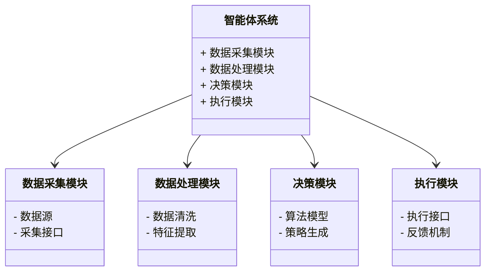
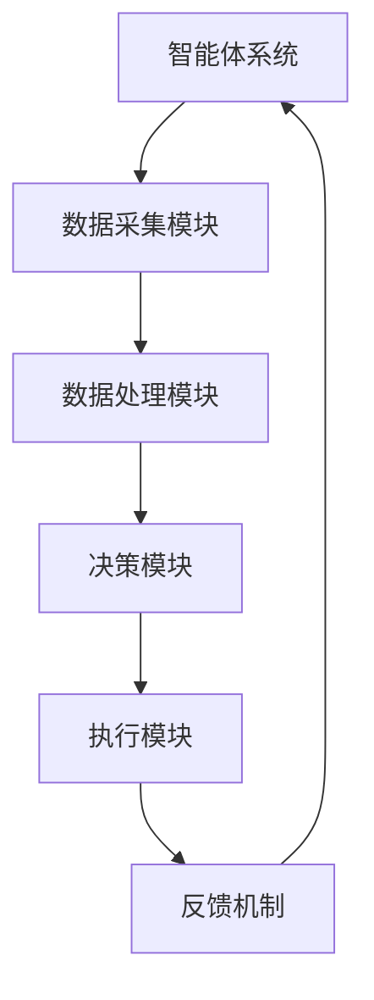
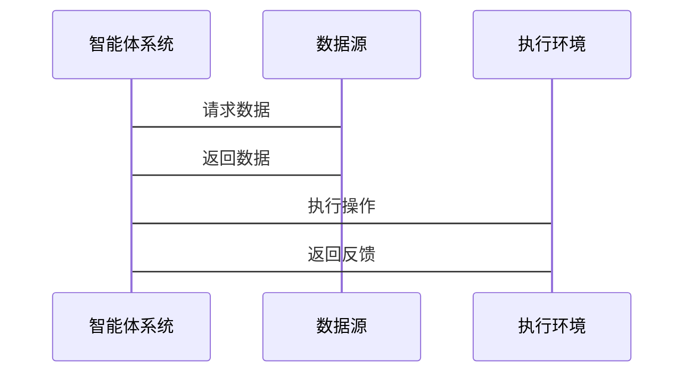
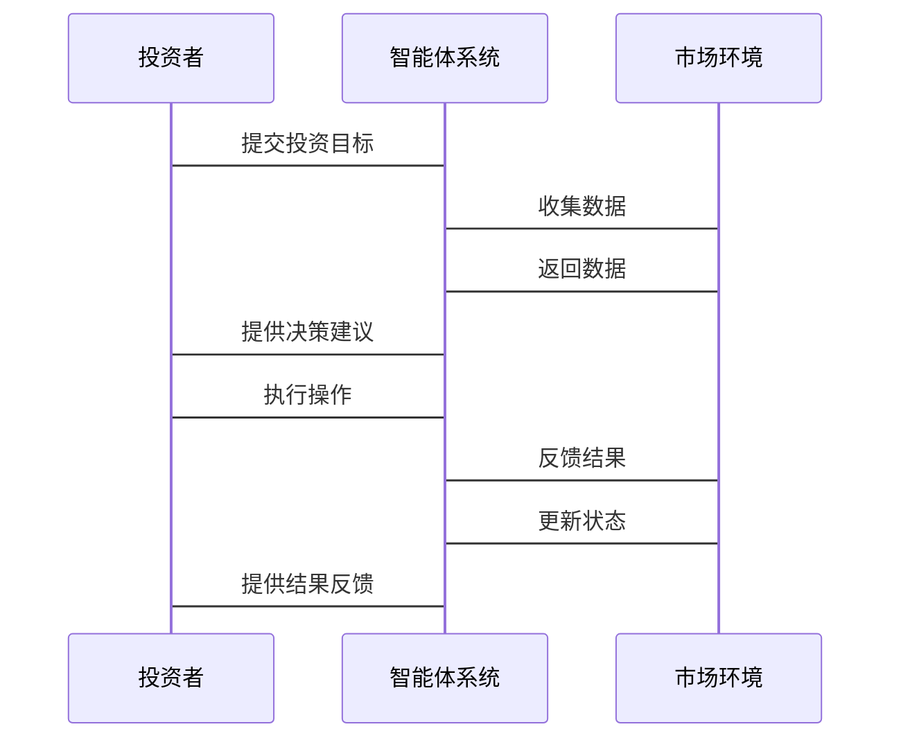

                 


# 智能体系统提升价值投资的另类数据信号提取能力

> **关键词**: 智能体系统, 价值投资, 另类数据, 数据信号提取, 人工智能, 强化学习

> **摘要**: 本文探讨了智能体系统如何通过处理和分析另类数据来提升价值投资的信号提取能力。文章从智能体系统的基本概念入手，分析了其在价值投资中的应用潜力，并详细讲解了如何利用强化学习等算法从另类数据中提取有效信号。通过系统架构设计和实际案例分析，本文展示了智能体系统在投资决策中的实际应用和优势，同时提出了未来研究的方向和建议。

---

# 第1章 智能体系统与价值投资的背景

## 1.1 智能体系统的基本概念

### 1.1.1 智能体系统的定义

智能体系统（Intelligent Agent System）是指由智能体（Agent）构成的系统，智能体能够感知环境、自主决策并执行任务。智能体可以是软件程序、机器人或其他具备自主决策能力的实体。在投资领域，智能体系统能够通过数据处理和决策算法辅助投资者进行投资决策。

### 1.1.2 智能体系统的特征

- **自主性**：智能体能够自主决策，无需外部干预。
- **反应性**：智能体能够实时感知环境变化并做出反应。
- **目标导向**：智能体的行为以实现特定目标为导向。
- **学习能力**：智能体能够通过经验改进自身的决策能力。

### 1.1.3 智能体系统与传统投资的区别

传统投资依赖于人工分析和经验判断，而智能体系统通过算法和数据处理，能够快速分析大量数据并生成决策建议。智能体系统的决策过程更加自动化和高效，能够在复杂环境中做出最优选择。

## 1.2 价值投资的核心理念

### 1.2.1 价值投资的定义

价值投资是一种投资策略，旨在通过分析公司的基本面（如财务状况、行业地位、管理团队等）来识别被市场低估的投资标的。价值投资者相信市场短期波动中存在投资机会，通过长期持有优质资产实现收益。

### 1.2.2 价值投资的基本原则

- **长期视角**：注重长期投资，而非短期交易。
- **安全边际**：选择价格低于内在价值的资产。
- **优质资产**：投资于具有强大竞争优势和良好管理的公司。

### 1.2.3 智能体系统与价值投资的结合

智能体系统可以通过分析大量非传统数据（如社交媒体情绪、供应链数据、专利申请等）来辅助价值投资决策。智能体系统能够快速识别潜在的投资机会，并通过数据驱动的方法验证资产的内在价值。

## 1.3 另类数据信号的定义与重要性

### 1.3.1 另类数据的定义

另类数据是指传统金融数据之外的其他数据类型，包括文本数据（如新闻、社交媒体）、图像数据（如卫星图像）、语音数据、传感器数据等。这些数据通常不直接反映市场交易情况，但可以通过分析揭示市场的潜在趋势和情绪。

### 1.3.2 另类数据在投资中的作用

- **情绪分析**：通过社交媒体和新闻数据，分析市场参与者的情绪变化，预测市场走势。
- **行业洞察**：通过供应链数据和专利申请，了解行业动态和技术趋势。
- **风险预警**：通过传感器数据和卫星图像，识别潜在的环境风险和供应链中断。

### 1.3.3 另类数据与传统金融数据的对比

传统金融数据（如股价、成交量、财务报表等）通常反映市场的公开信息，而另类数据则提供更广泛、更实时的信息。通过结合传统数据和另类数据，投资者能够获得更全面的市场洞察，提升投资决策的准确性。

## 1.4 智能体系统在价值投资中的应用前景

### 1.4.1 智能体系统在投资中的潜在应用领域

- **实时监控**：智能体系统可以实时监控市场动态，及时发现投资机会和风险。
- **数据挖掘**：通过强化学习和深度学习算法，从另类数据中提取有效信号。
- **决策支持**：智能体系统为投资者提供数据驱动的决策支持，优化投资组合。

### 1.4.2 智能体系统在价值投资中的优势

- **高效性**：智能体系统能够快速处理大量数据，提高投资决策的效率。
- **准确性**：通过分析另类数据，智能体系统能够发现传统数据无法揭示的投资机会。
- **适应性**：智能体系统能够根据市场变化自适应调整决策策略。

### 1.4.3 智能体系统应用的挑战与机遇

- **挑战**：数据质量、隐私问题、算法复杂性等。
- **机遇**：通过技术创新和数据积累，智能体系统能够不断优化，为投资决策提供更精准的支持。

## 1.5 本章小结

本章介绍了智能体系统的基本概念、价值投资的核心理念以及另类数据的定义和作用。通过分析智能体系统在价值投资中的应用前景，我们看到，智能体系统能够通过处理另类数据，为投资者提供更高效、更准确的投资决策支持。

---

# 第2章 智能体系统的核心概念与联系

## 2.1 智能体系统的组成与功能

### 2.1.1 智能体系统的组成要素

智能体系统通常由感知层、决策层和执行层组成：

- **感知层**：负责收集环境数据，如传感器数据、文本数据等。
- **决策层**：通过算法对数据进行分析，生成决策建议。
- **执行层**：根据决策结果执行具体操作，如买卖股票。

### 2.1.2 智能体系统的功能模块

- **数据采集模块**：负责收集各种类型的数据。
- **数据处理模块**：对数据进行清洗、转换和特征提取。
- **决策模块**：通过算法生成决策建议。
- **执行模块**：根据决策结果执行操作。

### 2.1.3 智能体系统的输入输出关系

智能体系统的输入包括环境数据和目标函数，输出是决策结果和反馈信息。通过不断迭代，智能体系统能够优化其决策策略。

## 2.2 价值投资与智能体系统的联系

### 2.2.1 价值投资中的数据需求

价值投资者需要分析公司的基本面数据、行业趋势和市场情绪等信息。智能体系统可以通过处理另类数据，提供更全面的市场洞察。

### 2.2.2 智能体系统如何满足数据需求

- **数据获取**：智能体系统能够从多种数据源获取信息，包括社交媒体、新闻网站、专利数据库等。
- **数据分析**：通过自然语言处理和机器学习算法，智能体系统能够从非结构化数据中提取有用信息。
- **决策支持**：智能体系统根据分析结果，为投资者提供数据驱动的决策支持。

### 2.2.3 智能体系统与价值投资目标的结合

智能体系统的目标是通过优化决策策略实现投资收益最大化。价值投资的目标是通过识别优质资产实现长期收益。两者的结合在于，智能体系统通过分析另类数据，帮助投资者更准确地识别优质资产，优化投资组合。

## 2.3 另类数据信号的提取与分析

### 2.3.1 另类数据的分类

- **文本数据**：包括新闻、社交媒体、公司财报等。
- **图像数据**：包括卫星图像、产品图片等。
- **语音数据**：包括电话会议录音等。
- **传感器数据**：包括供应链、物流等数据。

### 2.3.2 另类数据的特征提取方法

- **文本挖掘**：通过自然语言处理技术，提取文本中的关键词、情感倾向等信息。
- **图像识别**：使用计算机视觉技术，从图像中提取有用信息。
- **语音识别**：通过语音识别技术，提取语音中的关键词和情感信息。

### 2.3.3 另类数据与投资决策的关系

另类数据能够提供传统金融数据之外的市场信息，帮助投资者发现潜在的投资机会和风险。通过分析另类数据，智能体系统能够生成更准确的投资信号，提升投资决策的效率和准确性。

## 2.4 本章小结

本章分析了智能体系统的组成与功能，并探讨了其与价值投资的联系。通过分析另类数据的分类和特征提取方法，我们看到，智能体系统能够从非传统数据中提取有用信息，为投资决策提供支持。

---

# 第3章 智能体系统的算法原理

## 3.1 智能体系统的算法基础

### 3.1.1 强化学习算法

#### 3.1.1.1 强化学习的基本原理

强化学习是一种机器学习范式，通过智能体与环境的交互，学习最优策略。智能体通过执行动作，获得环境的反馈，并根据反馈调整策略，以最大化累积奖励。

#### 3.1.1.2 Q-learning算法的实现

Q-learning是一种经典的强化学习算法，适用于离线环境。Q-learning通过维护一个Q表，记录状态-动作对的期望奖励。算法通过迭代更新Q表，找到最优策略。

#### 3.1.1.3 深度强化学习的简介

深度强化学习是强化学习与深度学习的结合，适用于高维状态空间。通过神经网络，智能体能够直接从原始数据中学习策略，避免人工特征提取。

#### 3.1.1.4 智能体系统中的强化学习应用

在投资领域，强化学习可以用于交易策略优化。通过模拟交易环境，智能体通过试错学习，找到最优的买卖时机。

#### 3.1.1.5 智能体系统中的强化学习应用的代码实现

```python
import numpy as np

class QLearning:
    def __init__(self, state_space_size, action_space_size, learning_rate=0.1, gamma=0.9):
        self.Q = np.zeros((state_space_size, action_space_size))
        self.lr = learning_rate
        self.gamma = gamma

    def choose_action(self, state, epsilon=0.1):
        if np.random.random() < epsilon:
            return np.random.randint(0, action_space_size)
        else:
            return np.argmax(self.Q[state, :])

    def update_Q(self, state, action, reward, next_state):
        self.Q[state, action] = self.Q[state, action] + self.lr * (reward + self.gamma * np.max(self.Q[next_state, :]) - self.Q[state, action])
```

### 3.1.2 强化学习算法在智能体系统中的应用

通过强化学习算法，智能体能够从环境中学习最优策略，应用于投资决策。智能体通过不断试错，优化交易策略，提升投资收益。

### 3.1.3 深度强化学习的算法原理

深度强化学习结合了深度学习和强化学习的优势，通过神经网络直接从原始数据中学习策略。其核心在于将复杂的状态空间映射到动作空间，实现高效的策略优化。

---

# 第4章 智能体系统的系统分析与架构设计

## 4.1 问题场景介绍

本章将从一个具体的智能体系统设计案例出发，介绍系统的需求分析、功能设计和架构设计。假设我们需要设计一个基于智能体系统的价值投资辅助决策系统。

## 4.2 系统功能设计

### 4.2.1 领域模型设计

领域模型描述了系统的功能模块及其交互关系。以下是领域模型的Mermaid类图：



### 4.2.2 系统架构设计

系统架构设计描述了系统的整体结构和模块之间的关系。以下是系统架构的Mermaid架构图：



### 4.2.3 系统接口设计

系统接口设计描述了系统与外部环境的交互接口。以下是系统接口设计的Mermaid序列图：



## 4.3 系统交互设计

系统交互设计描述了系统在运行过程中的交互流程。以下是系统交互的Mermaid序列图：



## 4.4 本章小结

本章通过一个具体的案例，详细介绍了智能体系统的系统分析与架构设计。通过领域模型、系统架构图和系统交互图，我们清晰地看到了系统的各个模块及其交互关系。这为后续的实现和优化提供了坚实的基础。

---

# 第5章 智能体系统的项目实战

## 5.1 项目环境安装与配置

### 5.1.1 安装Python环境

为了实现智能体系统，我们需要安装Python 3.8或更高版本。可以通过以下命令安装：

```bash
python --version
```

### 5.1.2 安装依赖库

安装所需的依赖库，包括numpy、pandas、scikit-learn等：

```bash
pip install numpy pandas scikit-learn
```

### 5.1.3 环境配置

设置开发环境，如Jupyter Notebook或PyCharm，确保所有依赖库已正确安装。

## 5.2 系统核心实现源代码

### 5.2.1 数据采集模块

数据采集模块负责从多种数据源获取数据，包括API调用和文件读取。

```python
import requests
import json

def get_financial_data(api_key, symbol):
    url = f"https://api.example.com/stock/{symbol}"
    headers = {'Authorization': f'Bearer {api_key}'}
    response = requests.get(url, headers=headers)
    if response.status_code == 200:
        return json.loads(response.text)
    else:
        return None
```

### 5.2.2 数据处理模块

数据处理模块对采集到的数据进行清洗和特征提取。

```python
import pandas as pd

def preprocess_data(data):
    df = pd.DataFrame(data)
    df = df.dropna()
    df['date'] = pd.to_datetime(df['date'])
    df.set_index('date', inplace=True)
    return df
```

### 5.2.3 决策模块

决策模块基于预处理后的数据，生成投资决策。

```python
from sklearn.model import DecisionTreeClassifier

def make_decision(data, target):
    model = DecisionTreeClassifier()
    model.fit(data, target)
    prediction = model.predict(data)
    return prediction
```

### 5.2.4 执行模块

执行模块根据决策结果执行具体操作。

```python
import time

def execute_trade(action):
    if action == 'buy':
        print("执行买入操作")
    elif action == 'sell':
        print("执行卖出操作")
    time.sleep(1)
```

## 5.3 代码应用解读与分析

### 5.3.1 数据采集模块的实现

数据采集模块通过API接口获取实时市场数据，包括股票价格、成交量等信息。通过这种方式，我们可以获取大量的市场数据，为后续的分析提供基础。

### 5.3.2 数据处理模块的实现

数据处理模块对采集到的数据进行清洗和特征提取，确保数据的准确性和完整性。通过数据处理，我们可以将非结构化数据转换为结构化数据，为后续的分析提供支持。

### 5.3.3 决策模块的实现

决策模块基于预处理后的数据，使用机器学习算法生成投资决策。通过训练模型，我们可以预测市场的未来走势，为投资者提供决策支持。

### 5.3.4 执行模块的实现

执行模块根据决策结果，执行具体的交易操作。通过自动化交易系统，我们可以快速响应市场变化，提高交易效率。

## 5.4 实际案例分析

### 5.4.1 案例背景介绍

假设我们希望设计一个基于智能体系统的股票投资决策系统。通过分析社交媒体情绪和财务报表数据，生成买入或卖出的决策建议。

### 5.4.2 数据采集与处理

首先，我们需要从社交媒体和财务报表中获取数据。通过数据清洗和特征提取，将非结构化数据转换为结构化数据，为后续的分析提供支持。

### 5.4.3 决策与执行

通过训练好的模型，生成买入或卖出的决策建议。根据决策结果，执行具体的交易操作，并实时监控交易结果，不断优化决策策略。

## 5.5 项目小结

通过实际案例分析，我们看到智能体系统能够通过处理另类数据，生成有效的投资决策信号。通过系统的实现和优化，智能体系统能够在实际投资中发挥重要作用。

---

# 第6章 智能体系统的高级应用与未来展望

## 6.1 智能体系统的高级应用

### 6.1.1 实时交易系统

智能体系统可以通过实时监控市场数据，快速做出交易决策。通过强化学习算法，智能体系统能够在毫秒级别完成交易决策，抓住市场机会。

### 6.1.2 多模态数据融合

通过融合文本、图像、语音等多种数据源，智能体系统能够更全面地分析市场情况，生成更准确的投资信号。

### 6.1.3 自适应投资策略

智能体系统能够根据市场变化自适应调整投资策略，通过持续学习优化决策过程。

## 6.2 未来研究方向

### 6.2.1 智能体系统的可解释性

目前，智能体系统的决策过程往往缺乏可解释性，影响投资者的信任和应用。未来的研究方向包括提高智能体系统的可解释性，使其能够清晰地解释决策过程。

### 6.2.2 多智能体协作

通过多个智能体的协作，智能体系统能够更好地应对复杂的市场环境。研究多智能体协作机制，能够提高投资决策的准确性和效率。

### 6.2.3 高频交易中的应用

高频交易对实时性和决策速度要求极高。未来的研究方向包括优化智能体系统的决策速度，使其能够在高频交易中发挥作用。

## 6.3 本章小结

本章探讨了智能体系统的高级应用和未来研究方向。通过实时交易系统、多模态数据融合和自适应投资策略的应用，智能体系统能够在投资领域发挥更大的作用。未来的研究方向包括提高可解释性、多智能体协作和高频交易中的应用，为智能体系统的进一步发展提供了方向。

---

# 作者：AI天才研究院/AI Genius Institute & 禅与计算机程序设计艺术 /Zen And The Art of Computer Programming

