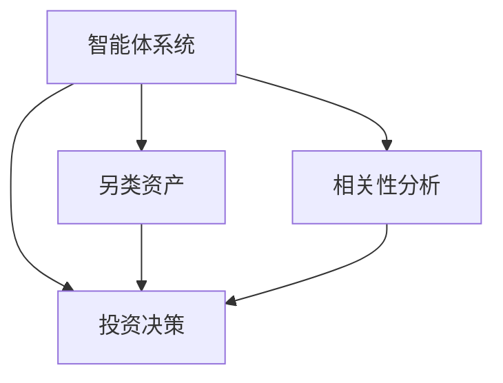
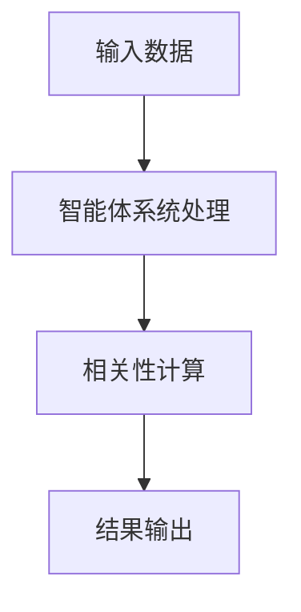

                 


# 智能体系统提升价值投资的另类资产相关性分析

## 关键词：智能体系统、价值投资、另类资产、相关性分析、投资决策优化

## 摘要：本文深入探讨了智能体系统在价值投资中的应用，特别是如何通过分析另类资产的相关性来优化投资决策。通过结合智能体系统的核心原理和相关性分析的数学模型，本文提出了一个创新的解决方案，展示了如何利用智能体系统提升投资效果。文章内容包括背景介绍、核心概念、算法原理、系统架构以及项目实战等部分，帮助读者全面理解智能体系统在投资中的潜力。

---

## 第一部分: 背景介绍与核心概念

### 第1章: 智能体系统与价值投资概述

#### 1.1 问题背景与问题描述
- **1.1.1 传统价值投资的局限性**  
  传统价值投资依赖于人类经验与市场分析，存在主观性高、决策滞后、覆盖范围有限等问题。

- **1.1.2 智能体系统在投资中的应用潜力**  
  智能体系统通过实时数据分析、自动化决策和自我优化，能够显著提升投资效率和准确性。

- **1.1.3 另类资产相关性分析的重要性**  
  另类资产（如房地产、艺术品、私募基金等）的相关性分析能够帮助投资者发现新的投资机会，优化资产配置。

#### 1.2 问题解决与边界外延
- **1.2.1 智能体系统如何提升投资决策**  
  智能体系统通过实时监控市场数据、预测市场趋势，辅助投资者做出更明智的决策。

- **1.2.2 另类资产相关性分析的边界与外延**  
  相关性分析的边界包括数据质量和模型假设，外延则涉及多资产类别和跨市场的应用。

- **1.2.3 智能体系统与另类资产的结合方式**  
  智能体系统通过数据采集、特征提取和模型训练，对另类资产的相关性进行分析，并提供投资建议。

#### 1.3 核心概念与结构
- **1.3.1 智能体系统的核心要素**  
  包括感知能力（数据采集）、决策能力（模型训练）、执行能力（自动化交易）和学习能力（自适应优化）。

- **1.3.2 另类资产相关性分析的模型结构**  
  包括数据预处理、特征提取、相关性计算和结果可视化。

- **1.3.3 智能体系统与相关性分析的交互机制**  
  智能体系统通过实时数据反馈，动态调整相关性分析的参数，提升分析精度。

### 第2章: 智能体系统与另类资产相关性分析的核心概念

#### 2.1 核心概念原理
- **2.1.1 智能体系统的定义与特征**  
  智能体系统是一种能够感知环境、做出决策并执行操作的自动化系统，具备自主性、反应性、目标性和社交性。

- **2.1.2 另类资产相关性分析的基本原理**  
  相关性分析通过统计方法或机器学习模型，计算不同资产之间的相关性系数，评估资产之间的关联程度。

- **2.1.3 智能体系统在相关性分析中的作用**  
  智能体系统能够实时更新数据，动态调整分析模型，提高相关性分析的准确性和实时性。

#### 2.2 概念属性特征对比
- **2.2.1 智能体系统与传统投资模型的对比**  
  | 特性 | 智能体系统 | 传统投资模型 |
  |------|------------|--------------|
  | 数据依赖 | 高 | 低 |
  | 自适应能力 | 强 | 弱 |
  | 决策效率 | 高 | 低 |

- **2.2.2 另类资产与传统资产的相关性分析对比**  
  另类资产的相关性分析更复杂，涉及更多非线性关系和长尾分布。

- **2.2.3 智能体系统在相关性分析中的独特优势**  
  智能体系统能够处理海量数据，发现隐藏的相关性模式，提供实时反馈和动态优化。

#### 2.3 ER实体关系图架构


---

## 第二部分: 算法原理与数学模型

### 第3章: 智能体系统相关性分析的算法原理

#### 3.1 算法原理概述
- **3.1.1 智能体系统相关性分析的基本流程**  
  数据采集 → 特征提取 → 相关性计算 → 结果分析。

- **3.1.2 相关性分析的核心算法**  
  使用皮尔逊相关系数或斯皮尔曼相关系数计算资产之间的相关性。

- **3.1.3 智能体系统在算法中的角色**  
  智能体系统通过实时数据更新和模型优化，提升相关性分析的准确性和效率。

#### 3.2 算法流程图


#### 3.3 数学模型与公式
- **3.3.1 相关性计算公式**  
  $$ r = \frac{\sum (x_i - \bar{x})(y_i - \bar{y})}{\sqrt{\sum (x_i - \bar{x})^2} \sqrt{\sum (y_i - \bar{y})^2}} $$

- **3.3.2 智能体系统优化模型**  
  $$ \text{优化目标} = \min_{\theta} \sum (y_i - f(x_i, \theta))^2 $$

#### 3.4 通俗易懂的举例说明
- 例如，计算两只股票的相关性：股票A和股票B在过去一年的收益率数据分别为 [10%, 15%, 8%, 12%] 和 [12%, 14%, 9%, 13%]。通过公式计算，得到相关性系数约为 0.85，表明两者高度正相关。

---

## 第三部分: 系统分析与架构设计

### 第4章: 系统分析与架构设计方案

#### 4.1 问题场景介绍
- 某投资机构希望通过智能体系统分析另类资产的相关性，优化投资组合。

#### 4.2 系统功能设计
- **领域模型图**  
  ```mermaid
  classDiagram
  class 智能体系统 {
    + 数据源: 数据来源
    + 模型训练: 训练相关性分析模型
    + 数据分析: 计算相关性系数
  }
  ```

- **系统架构图**  
  ```mermaid
  container 智能体系统 {
    component 数据采集模块 {
      数据来源: API接口
    }
    component 数据分析模块 {
      计算相关性系数
    }
    component 投资决策模块 {
      输出投资建议
    }
  }
  ```

- **系统交互图**  
  ```mermaid
  sequenceDiagram
  智能体系统-> 数据采集模块: 获取市场数据
  数据采集模块-> 数据分析模块: 提供数据
  数据分析模块-> 智能体系统: 返回相关性分析结果
  智能体系统-> 投资决策模块: 输出投资建议
  ```

---

## 第四部分: 项目实战

### 第5章: 项目实战与代码实现

#### 5.1 环境安装
- 安装Python、Pandas、NumPy、Scikit-learn等库。

#### 5.2 核心代码实现
```python
import numpy as np
import pandas as pd

def calculate_correlation(data):
    # 计算相关性矩阵
    correlation_matrix = data.corr()
    return correlation_matrix

def main():
    # 示例数据
    data = pd.DataFrame({
        'Asset1': [10, 15, 8, 12],
        'Asset2': [12, 14, 9, 13]
    })
    correlation_matrix = calculate_correlation(data)
    print("相关性矩阵:\n", correlation_matrix)

if __name__ == "__main__":
    main()
```

#### 5.3 代码应用解读与分析
- 代码功能：计算并返回资产的相关性矩阵。
- 应用场景：投资者可以通过该代码快速了解不同资产之间的相关性，优化投资组合。

#### 5.4 实际案例分析
- 案例：某投资者有三只股票，通过相关性分析发现其中两只股票高度相关，因此选择分散投资以降低风险。

#### 5.5 项目小结
- 通过代码实现，投资者能够快速掌握资产的相关性，优化投资策略。

---

## 第五部分: 最佳实践

### 第6章: 最佳实践与小结

#### 6.1 小结
- 智能体系统通过实时数据分析和相关性分析，显著提升了投资决策的效率和准确性。

#### 6.2 注意事项
- 数据质量对相关性分析结果影响重大，需确保数据来源可靠。
- 模型选择需结合实际场景，避免过度拟合。

#### 6.3 拓展阅读
- 推荐阅读《机器学习在金融中的应用》和《智能体系统与投资策略》。

---

## 作者：AI天才研究院/AI Genius Institute & 禅与计算机程序设计艺术 /Zen And The Art of Computer Programming

