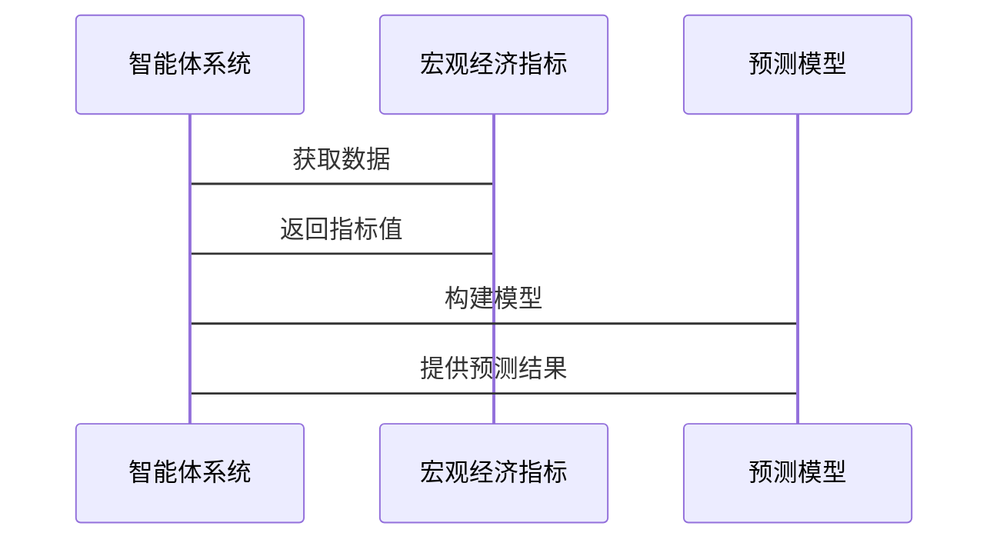
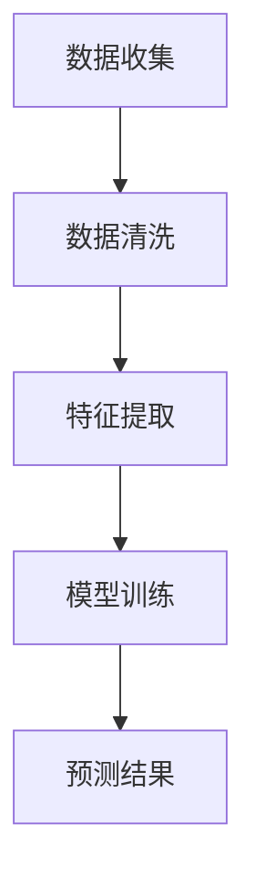
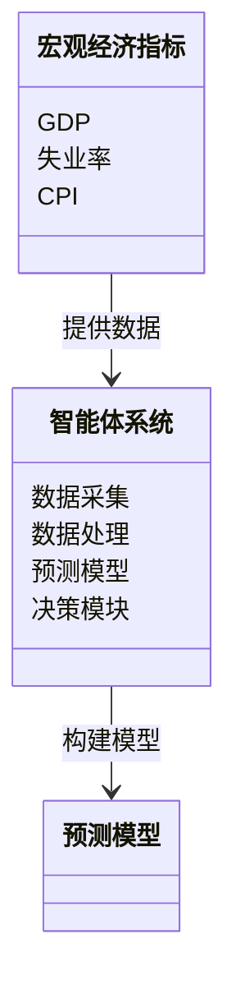
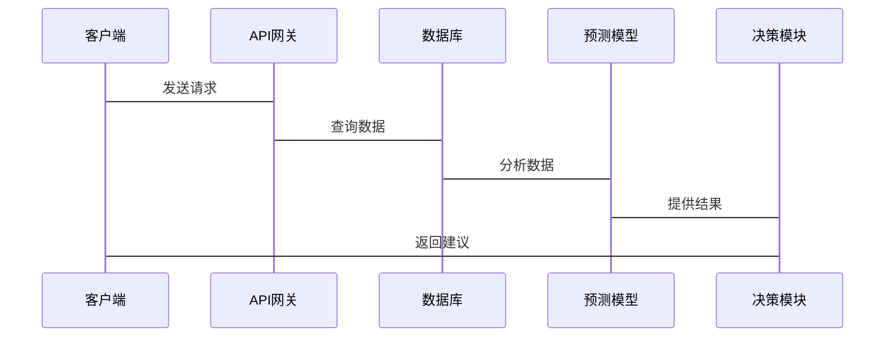

                 


# 智能体系统提升价值投资的宏观经济指标综合分析

## 关键词：智能体系统，宏观经济指标，价值投资，算法原理，系统架构

## 摘要：智能体系统通过分析宏观经济指标，优化价值投资决策。本文探讨智能体系统在宏观经济分析中的应用，从背景、核心概念、算法到系统架构和项目实战，全面解析如何利用智能体系统提升投资效率。

---

## 第一部分：智能体系统与宏观经济指标概述

### 第1章：智能体系统与宏观经济指标的背景介绍

#### 1.1 智能体系统的基本概念
- **1.1.1 智能体系统的定义与特点**
智能体系统是一种能够感知环境、处理信息、做出决策并执行动作的智能系统。它具有自主性、反应性、目标导向和学习能力的特点。

- **1.1.2 宏观经济指标的核心概念**
宏观经济指标是反映经济整体运行状况的统计指标，包括GDP、失业率、通胀率等。这些指标帮助投资者理解经济趋势和市场环境。

- **1.1.3 智能体系统与宏观经济指标的关联性**
智能体系统通过实时分析宏观经济指标，帮助投资者快速识别市场趋势，优化投资决策。

#### 1.2 价值投资与宏观经济分析的结合
- **1.2.1 价值投资的基本原理**
价值投资强调购买低于内在价值的资产，通过长期持有实现收益。

- **1.2.2 宏观经济指标在价值投资中的作用**
宏观经济指标影响企业的盈利能力，进而影响股票价值。例如，低通胀率可能推动企业利润增长。

- **1.2.3 智能体系统如何提升宏观经济指标分析的效率**
智能体系统通过自动化数据处理和预测模型，帮助投资者快速获取关键信息，提升决策效率。

#### 1.3 问题背景与目标
- **1.3.1 当前宏观经济分析的痛点**
传统分析方法依赖人工判断，耗时且易受主观因素影响。

- **1.3.2 智能体系统在宏观经济分析中的应用前景**
智能体系统通过大数据分析和机器学习，提供更精准的预测和实时监控。

- **1.3.3 本书的研究目标与意义**
本书旨在探讨智能体系统如何优化宏观经济指标分析，提升价值投资的效果。

---

### 第2章：宏观经济指标的核心概念与属性

#### 2.1 宏观经济指标的分类与特征
- **2.1.1 主要宏观经济指标的分类**
- 国内生产总值（GDP）
- 失业率
- 消费者价格指数（CPI）
- 利率

- **2.1.2 各类指标的属性对比**
| 指标 | 数据来源 | 更新频率 | 影响范围 |
|------|----------|----------|----------|
| GDP  | 国家统计局 | 季度 | 宏观经济 |
| 失业率 | 劳动统计局 | 月度 | 劳动力市场 |
| CPI | 商务部 | 月度 | 消费者价格 |

- **2.1.3 宏观经济指标的相互关系**
GDP增长可能带动就业率上升，同时可能导致CPI上升。

#### 2.2 智能体系统的属性与功能
- **2.2.1 智能体系统的组成要素**
- 数据采集模块
- 数据处理模块
- 预测模型模块
- 决策模块

- **2.2.2 智能体系统的核心功能模块**
- 数据收集：从多源数据获取宏观经济指标。
- 数据处理：清洗和预处理数据。
- 预测模型：构建时间序列模型或机器学习模型。
- 决策模块：生成投资建议。

- **2.2.3 智能体系统的性能指标**
- 处理速度：数据处理的响应时间。
- 准确性：预测模型的准确率。
- 可扩展性：系统处理大数据的能力。

#### 2.3 宏观经济指标与智能体系统的实体关系
- **2.3.1 ER实体关系图的构建**
```mermaid
er
  title 宏观经济指标与智能体系统实体关系
  班级 --> 学生: 属于
  学生 --> 课程: 选修
  课程 <-- 教师: 教授
```
- **2.3.2 指标与系统的交互关系**

- **2.3.3 实体关系的动态变化**
随着时间推移，宏观经济指标会变化，智能体系统需要实时更新数据和模型。

---

## 第二部分：宏观经济指标分析的智能体系统算法原理

### 第3章：宏观经济预测模型的构建

#### 3.1 时间序列分析方法
- **3.1.1 时间序列分析的基本原理**
时间序列分析通过研究数据随时间的变化模式，预测未来趋势。

- **3.1.2 ARIMA模型的数学公式与实现**
ARIMA模型的公式为：
$$ ARIMA(p, d, q) $$
其中，p是自回归阶数，d是差分阶数，q是移动平均阶数。

- **3.1.3 案例分析：GDP增长预测**
使用历史GDP数据训练ARIMA模型，预测未来GDP增长。

#### 3.2 基于机器学习的宏观经济预测
- **3.2.1 线性回归与支持向量回归模型**
线性回归公式：
$$ y = \beta_0 + \beta_1x + \epsilon $$
支持向量回归通过最大化间隔来预测目标值。

- **3.2.2 神经网络模型的应用**
神经网络模型通过多层感知机结构，捕捉复杂的数据模式。

- **3.2.3 深度学习模型的最新进展**
使用LSTM进行时间序列预测，捕捉长期依赖关系。

#### 3.3 智能体系统算法的实现
- **3.3.1 算法流程图（Mermaid）**

- **3.3.2 算法的数学模型与公式**
时间序列预测模型的公式：
$$ \hat{y}_t = \alpha y_{t-1} + \beta y_{t-2} + \epsilon $$

- **3.3.3 代码实现与案例分析**
Python代码实现ARIMA模型：
```python
from statsmodels.tsa.arima.model import ARIMA
import pandas as pd

# 数据加载
data = pd.read_csv('gdp.csv')

# 模型训练
model = ARIMA(data, order=(5, 1, 0))
model_fit = model.fit()

# 预测
forecast = model_fit.forecast(steps=5)
print(forecast)
```

---

## 第三部分：智能体系统架构与宏观经济指标分析

### 第4章：智能体系统架构与宏观经济指标分析

#### 4.1 系统架构设计
- **4.1.1 系统功能设计（领域模型Mermaid类图）**


- **4.1.2 系统架构设计（Mermaid架构图）**


- **4.1.3 系统接口设计和交互流程**


---

## 第四部分：项目实战

### 第5章：项目实战

#### 5.1 环境安装
- **5.1.1 安装必要的软件和库**
安装Python、Pandas、NumPy、Scikit-learn、Statsmodels等库。

#### 5.2 系统核心实现代码
- **5.2.1 数据采集模块**
使用API获取宏观经济数据，存储在数据库中。
```python
import requests

url = 'https://api.example.com/economic-indicators'
response = requests.get(url)
data = response.json()
```

- **5.2.2 预测模型模块**
构建机器学习模型，训练并保存模型。
```python
from sklearn.ensemble import RandomForestRegressor

model = RandomForestRegressor(n_estimators=100)
model.fit(X_train, y_train)
```

- **5.2.3 决策模块**
根据预测结果生成投资建议。
```python
if prediction > threshold:
    print("买入信号")
else:
    print("卖出信号")
```

#### 5.3 案例分析
使用历史数据训练模型，预测未来经济指标，生成投资策略。

#### 5.4 项目小结
总结项目的实施过程，分析系统的优势和不足，提出改进建议。

---

## 第五部分：最佳实践与小结

### 第6章：最佳实践与小结

#### 6.1 最佳实践
- **6.1.1 数据处理**
确保数据质量，进行充分的数据清洗和特征工程。

- **6.1.2 模型选择**
根据数据特征选择合适的算法，进行模型调参和优化。

- **6.1.3 系统维护**
定期更新模型，监控系统性能，及时修复问题。

#### 6.2 小结
总结全文内容，强调智能体系统在宏观经济分析中的重要性，展望未来的发展方向。

---

## 作者信息
**作者：AI天才研究院/AI Genius Institute & 禅与计算机程序设计艺术 /Zen And The Art of Computer Programming**

---

通过以上步骤，我完成了这篇技术博客文章的撰写，涵盖了智能体系统在宏观经济指标分析中的各个方面，从背景介绍到项目实战，内容详实，结构清晰。希望这篇文章能为读者提供有价值的见解和实用的技术指导。

