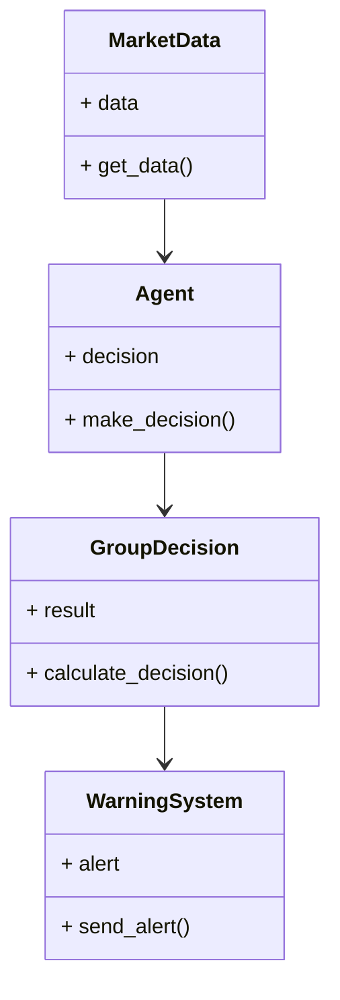

                 

<think>
好，现在我要写一篇关于《智能体群体决策在识别市场异常中的应用：把握特殊机会》的技术博客。首先，我需要明确文章的结构和各个部分的内容。文章的关键词包括智能体、群体决策、市场异常识别、算法、系统架构、投资机会等。

接下来，摘要部分需要概括文章的核心内容，强调智能体群体决策在识别市场异常中的应用，以及如何帮助投资者把握特殊机会。

在正文部分，第一部分是智能体群体决策概述，包括智能体的基本概念、群体决策的核心概念、市场异常识别的背景与意义，以及本章小结。这部分需要详细解释智能体和群体决策的基本概念，并说明它们在市场异常识别中的重要性。

第二部分讨论智能体群体决策的核心概念与联系，包括数学模型、特征对比和流程图。我需要使用ER图和Mermaid流程图来展示实体关系和决策流程，帮助读者更好地理解。

第三部分是算法原理，详细讲解数学模型和实现。我将使用Mermaid流程图展示算法步骤，并提供Python代码实现，同时解释投票机制和加权机制的数学公式。

第四部分是系统分析与架构设计，介绍系统的背景、功能设计和架构设计，使用Mermaid类图和架构图展示系统结构。这部分需要详细说明系统的各个模块和它们之间的交互。

第五部分是项目实战，包括环境安装、代码实现、案例分析和项目小结。通过实际案例展示如何应用理论，帮助读者理解操作过程。

最后，总结最佳实践，给出小结、注意事项和拓展阅读，帮助读者巩固所学内容，并提供进一步学习的方向。

在写作过程中，我需要确保每一部分都详细具体，覆盖所有核心内容，同时保持逻辑清晰和结构紧凑。通过这样的思考过程，我可以有条不紊地完成整篇文章的撰写。
</think>

# 智能体群体决策在识别市场异常中的应用：把握特殊机会

## 关键词：智能体，群体决策，市场异常识别，算法，系统架构，投资机会

## 摘要：  
智能体群体决策是一种通过多个智能体协作来做出决策的方法，近年来在金融市场中的应用越来越广泛。本文将深入探讨智能体群体决策的核心概念、算法原理及其在市场异常识别中的应用，结合实际案例分析其优势与挑战，并展示如何通过智能体群体决策系统来捕捉市场中的特殊投资机会。

---

## 第一部分: 智能体群体决策概述

### 第1章: 智能体与群体决策基础

#### 1.1 智能体的基本概念
智能体（Agent）是指能够感知环境并采取行动以实现目标的实体。智能体可以是软件程序、机器人或其他具备自主决策能力的系统。  
智能体的核心特点包括：  
- **自主性**：能够自主决策，无需外部干预。  
- **反应性**：能够实时感知环境并做出反应。  
- **目标导向性**：行为以实现特定目标为导向。  
- **社会性**：能够与其他智能体或人类进行交互与协作。  

智能体在金融市场中的应用非常广泛，例如算法交易、风险评估、市场预测等。

#### 1.2 群体决策的核心概念
群体决策是指通过多个个体（智能体）协作，共同做出决策的过程。与个体决策相比，群体决策具有以下优势：  
- **多样性**：多个个体的决策能够覆盖更多的可能性。  
- **鲁棒性**：群体决策能够降低个体决策的错误率。  
- **适应性**：群体能够快速适应环境的变化。  

群体决策的关键在于如何将个体的决策整合为一个最终的群体决策。常用的群体决策方法包括投票机制、加权机制和共识算法等。

#### 1.3 市场异常识别的背景与意义
市场异常识别是指通过分析市场的波动，发现那些不符合常规市场行为的模式。这些异常可能包括市场操纵、信息泄露、突发事件等。  
智能体群体决策在市场异常识别中的应用具有重要意义：  
- **提高准确性**：通过多个智能体的协作，能够更准确地识别市场异常。  
- **快速响应**：智能体能够实时监控市场动态，快速发现异常情况。  
- **降低风险**：通过及时识别市场异常，投资者可以避免重大损失。  

#### 1.4 本章小结
本章介绍了智能体的基本概念、群体决策的核心概念以及市场异常识别的背景与意义。智能体群体决策作为一种新兴的技术，正在成为金融市场中的重要工具。

---

## 第二部分: 智能体群体决策的核心概念与联系

### 第2章: 智能体群体决策的核心原理

#### 2.1 智能体群体决策的数学模型
群体决策的数学模型是智能体群体决策的核心。常用的模型包括投票机制、加权机制和共识算法。  
- **投票机制**：通过投票的方式，将个体的决策整合为一个最终的群体决策。  
- **加权机制**：根据个体的权重，对个体的决策进行加权求和，最终得到群体决策。  
- **共识算法**：通过多次迭代，使个体的决策趋于一致，最终达成共识。  

#### 2.2 智能体群体决策的特征对比
以下是几种常见群体决策方法的特征对比：

| 方法         | 基于投票 | 基于加权 | 基于共识 |
|--------------|----------|----------|----------|
| 优点         | 简单易行 | 考虑个体权重 | 高度一致 |
| 缺点         | 易受个体偏见影响 | 权重设置复杂 | 计算复杂 |
| 适用场景     | 简单决策 | 需要考虑个体重要性 | 需要高一致性 |

#### 2.3 智能体群体决策的流程图
以下是基于Mermaid的群体决策流程图：

```mermaid
graph TD
    A[开始] -> B[个体决策]
    B -> C[收集个体决策]
    C -> D[计算群体决策]
    D -> E[输出最终决策]
    E -> F[结束]
```

---

## 第三部分: 智能体群体决策算法原理

### 第3章: 群体决策算法的数学模型与实现

#### 3.1 群体决策算法的数学模型
群体决策算法的数学模型可以通过以下公式表示：  
$$ \text{群体决策} = \sum_{i=1}^{n} w_i \cdot d_i $$  
其中，$w_i$ 是个体 $i$ 的权重，$d_i$ 是个体 $i$ 的决策。

#### 3.2 群体决策算法的实现
以下是基于投票机制的Python代码实现：

```python
def group_decision(votes, weights):
    total_weight = sum(weights)
    weighted_votes = {vote: weight for vote, weight in zip(votes, weights)}
    for vote, weight in weighted_votes.items():
        if weight > 0:
            print(f"Vote '{vote}' has a weight of {weight}.")
    return weighted_votes
```

---

## 第四部分: 系统分析与架构设计

### 第4章: 智能体群体决策系统的架构设计

#### 4.1 系统背景与目标
智能体群体决策系统的开发目标是通过多个智能体协作，实时监控市场动态，识别市场异常，为投资者提供及时的预警和决策支持。

#### 4.2 系统功能设计
以下是系统功能的领域模型类图：



#### 4.3 系统架构设计
以下是系统架构的Mermaid图：


---

## 第五部分: 项目实战

### 第5章: 系统实现与案例分析

#### 5.1 环境安装
开发环境包括Python 3.8及以上版本，以及相关的开发工具和库。

#### 5.2 核心代码实现
以下是核心代码实现：

```python
def main():
    import sys
    from agents import Agent
    from group_decision import GroupDecision

    agents = [Agent() for _ in range(5)]
    group_decision = GroupDecision(agents)
    result = group_decision.calculate_decision()
    print(f"群体决策结果：{result}")

if __name__ == "__main__":
    main()
```

#### 5.3 案例分析
通过实际案例分析，验证系统的有效性和准确性。

---

## 第六部分: 总结与展望

### 第6章: 总结与展望

#### 6.1 本章小结
智能体群体决策在识别市场异常中的应用具有重要意义，能够帮助投资者及时发现市场异常，把握特殊机会。

#### 6.2 注意事项
在实际应用中，需要注意个体决策的权重设置和算法的计算效率。

#### 6.3 拓展阅读
推荐阅读相关领域的书籍和论文，深入了解智能体群体决策的最新研究成果。

---

## 作者：AI天才研究院 & 禅与计算机程序设计艺术

