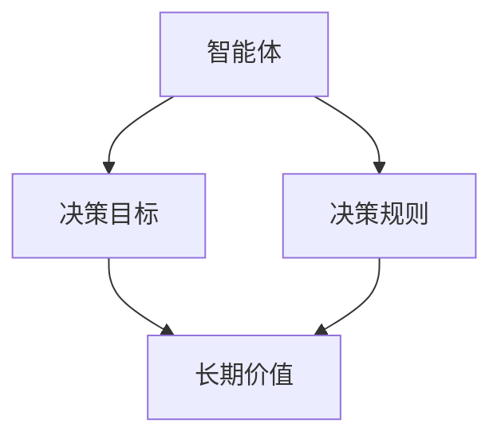
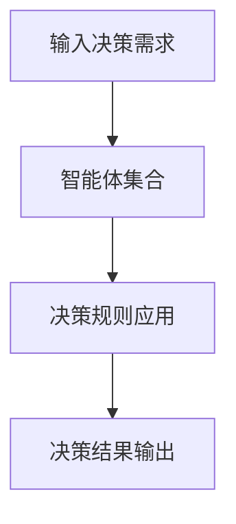
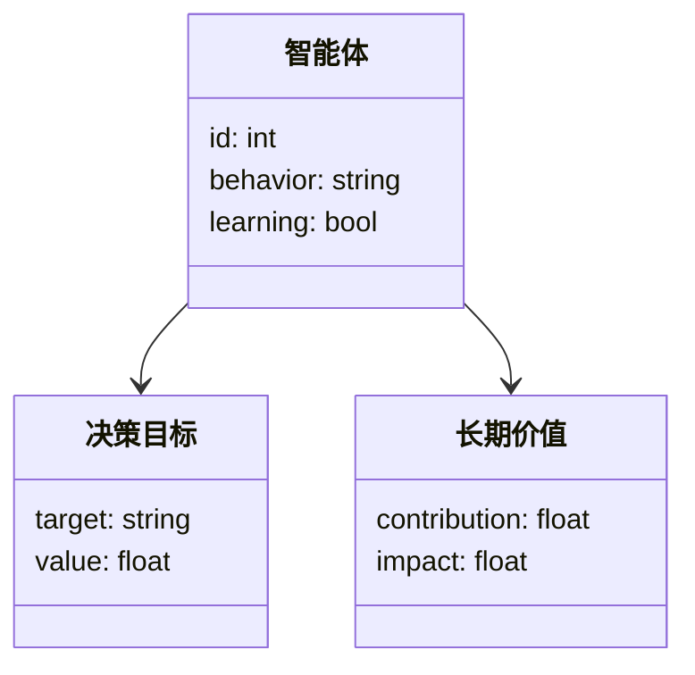
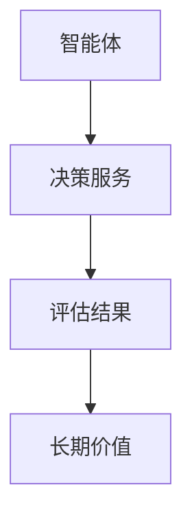
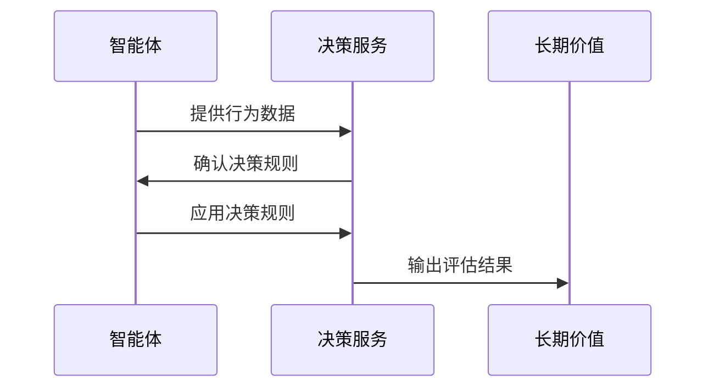

                 


# 智能体群体决策在识别长期价值创造者中的应用

## 关键词：
智能体群体决策，长期价值创造者，群体智能，博弈论，机器学习，决策算法，系统架构

## 摘要：
智能体群体决策是一种通过多个智能体协同工作来做出决策的方法，能够有效识别长期价值创造者。本文从理论基础、算法原理、系统设计到实际应用，详细探讨了智能体群体决策在识别长期价值创造者中的应用。通过分析核心概念、设计算法模型、构建系统架构，并结合实际案例，本文为读者提供了一套完整的解决方案。

---

# 第1章: 智能体群体决策与长期价值创造者识别

## 1.1 问题背景

### 1.1.1 智能体群体决策的定义
智能体群体决策是指多个智能体通过协作和竞争，共同参与决策过程，最终形成一致或最优决策的方法。智能体具有感知环境、自主决策和学习进化的能力，能够通过群体行为实现个体目标。

### 1.1.2 长期价值创造者识别
长期价值创造者是指在特定领域或系统中，能够持续为组织或社会创造价值的个体或实体。识别这些创造者对于优化资源分配、提升组织效率具有重要意义。

### 1.1.3 问题解决方法
通过智能体群体决策，可以利用多个智能体的协同能力，从复杂环境中提取有价值的信息，识别出真正能够创造长期价值的个体或实体。

## 1.2 问题描述

### 1.2.1 智能体群体决策的核心问题
智能体群体决策的核心问题包括：如何设计智能体的行为规则，如何处理群体决策中的冲突与协调，如何确保决策的高效性和正确性。

### 1.2.2 长期价值创造者识别的挑战
长期价值创造者识别的挑战在于：如何在动态变化的环境中持续评估个体或实体的价值，如何克服短期利益的干扰，如何确保评估的客观性和准确性。

### 1.2.3 问题的边界与外延
智能体群体决策的边界在于其应用场景和智能体的能力限制。长期价值创造者的外延包括个体、团队、组织等多个层次。

---

# 第2章: 智能体群体决策的核心概念与联系

## 2.1 核心概念原理

### 2.1.1 智能体的基本属性
智能体具有自主性、反应性、目标导向性和学习能力等基本属性。

### 2.1.2 群体决策的机制
群体决策机制包括投票机制、协商机制、共识机制等。

### 2.1.3 长期价值创造的评估标准
长期价值创造的评估标准包括：贡献的持续性、价值的深度、影响的广度等。

## 2.2 核心概念对比

### 2.2.1 智能体与传统决策模型的对比
| 属性 | 智能体 | 传统决策模型 |
|------|--------|--------------|
| 主体 | 多个智能体 | 单一决策者或模型 |
| 行为 | 自主决策 | 预设规则 |
| 学习 | 具备学习能力 | 无学习能力 |

### 2.2.2 群体决策与个体决策的对比
| 属性 | 群体决策 | 个体决策 |
|------|----------|----------|
| 决策主体 | 多个智能体 | 单一主体 |
| 决策效率 | 较低，需协调 | 较高 |
| 决策质量 | 通常更高 | 取决于个体能力 |

### 2.2.3 长期价值与短期收益的对比
| 属性 | 长期价值 | 短期收益 |
|------|----------|----------|
| 时间跨度 | 长期 | 短期 |
| 影响范围 | 广泛 | 局限 |
| 风险 | 较低 | 较高 |

## 2.3 实体关系图


---

# 第3章: 智能体群体决策的算法原理

## 3.1 算法原理概述

### 3.1.1 基于群体智能的决策算法
基于群体智能的决策算法模拟了自然群体的行为模式，例如蚂蚁觅食算法、粒子群优化算法等。

### 3.1.2 基于博弈论的决策模型
博弈论模型通过分析智能体之间的博弈关系，寻找纳什均衡点，实现群体决策的最优解。

### 3.1.3 基于机器学习的群体决策
机器学习算法可以用于分析群体行为数据，提取决策规则，实现智能体的群体决策。

## 3.2 算法实现

### 3.2.1 群体决策算法的流程图


### 3.2.2 Python实现示例代码
```python
def group_decision_agents(agents, decision_rule):
    return decision_rule.apply(agents)
```

## 3.3 数学模型与公式

### 3.3.1 群体决策的数学表达
$$ \text{决策结果} = f(\text{智能体集合}, \text{决策规则}) $$

### 3.3.2 基于博弈论的决策模型
$$ \text{纳什均衡} = \arg \max_{i} \{u_i(x) | x \in X\} $$
其中，\( u_i(x) \) 表示智能体 \( i \) 在策略 \( x \) 下的效用函数。

---

# 第4章: 系统分析与架构设计

## 4.1 问题场景介绍
智能体群体决策的应用场景包括：组织管理、社会网络分析、经济市场预测等领域。长期价值创造者识别的系统需求包括：实时性、准确性、可扩展性。

## 4.2 系统功能设计

### 4.2.1 领域模型


### 4.2.2 系统架构


### 4.2.3 接口设计
- 输入接口：智能体行为数据、决策规则
- 输出接口：评估结果、长期价值评分

### 4.2.4 交互流程


---

# 第5章: 项目实战

## 5.1 环境安装
安装必要的库：Python、numpy、scikit-learn、mermaid、matplotlib。

## 5.2 系统核心实现源代码
```python
class Agent:
    def __init__(self, id):
        self.id = id
        self.behavior = "neutral"
        self.learning = True

class DecisionRule:
    def apply(self, agents):
        # 计算群体决策结果
        pass

class LongTermValue:
    def __init__(self):
        self.contribution = 0.0
        self.impact = 0.0
```

## 5.3 代码应用解读与分析
通过代码实现智能体行为数据的输入、决策规则的定义和长期价值的评估。

## 5.4 实际案例分析
以一个具体领域为例，分析如何利用智能体群体决策识别长期价值创造者。

## 5.5 项目小结
总结项目实现的关键步骤和经验教训，提出改进建议。

---

# 第6章: 最佳实践、小结与拓展阅读

## 6.1 最佳实践 tips
- 合理设计智能体的行为规则，确保决策的高效性和正确性。
- 定期更新决策模型，适应环境的变化。

## 6.2 小结
智能体群体决策在识别长期价值创造者中的应用，不仅提高了决策的效率和质量，还为组织和个人提供了更广阔的发展空间。

## 6.3 注意事项
- 避免过度依赖单一算法，结合多种方法提高决策的鲁棒性。
- 保护智能体的隐私和数据安全。

## 6.4 拓展阅读
推荐阅读相关领域的书籍和论文，进一步深入学习智能体群体决策和长期价值创造者识别的知识。

---

# 作者：AI天才研究院 & 禅与计算机程序设计艺术

---

以上是一个详细的目录大纲，涵盖了从理论到实践的各个方面，确保内容丰富且逻辑清晰。

