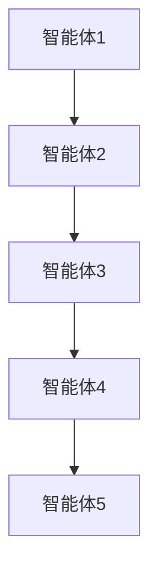
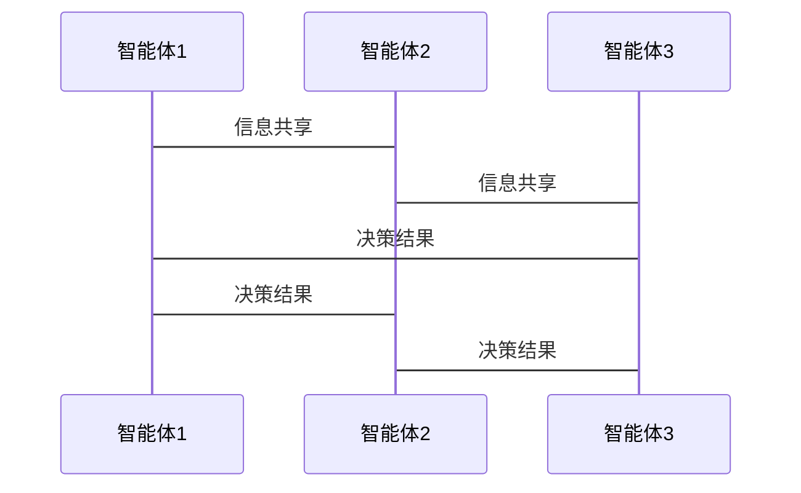

                 


# 智能体群体决策在资产配置中的应用：优化投资组合

> 关键词：智能体，群体决策，资产配置，投资组合优化，分布式计算，博弈论，机器学习

> 摘要：本文深入探讨了智能体群体决策在资产配置中的应用，通过分析智能体的核心概念、群体决策的机制以及在投资组合优化中的具体应用，结合算法原理、系统架构设计和实际项目案例，展示了如何利用智能体群体决策优化投资组合，提升资产配置的效率和效果。本文内容涵盖从理论到实践的各个方面，旨在为读者提供全面而深入的指导。

---

## 第1章: 智能体与群体决策概述

### 1.1 智能体的基本概念

#### 1.1.1 智能体的定义
智能体（Agent）是指在环境中能够感知并自主行动以实现目标的实体。智能体可以是软件程序、机器人或其他具备自主决策能力的系统。

#### 1.1.2 智能体的分类
智能体可以分为以下几类：
1. **简单反射型智能体**：基于当前感知直接行动。
2. **基于模型的反应型智能体**：利用内部模型和环境信息进行决策。
3. **目标驱动型智能体**：根据目标选择最优行动。
4. **效用驱动型智能体**：通过最大化效用来决策。

#### 1.1.3 智能体的核心属性
智能体具备以下核心属性：
- **自主性**：无需外部干预即可运行。
- **反应性**：能够感知环境并实时调整行为。
- **目标导向性**：以特定目标为导向进行决策。
- **学习能力**：通过经验改进决策能力。

### 1.2 群体决策的基本原理

#### 1.2.1 群体决策的定义
群体决策是指多个智能体通过协同或竞争，共同完成任务或达成目标的过程。

#### 1.2.2 群体决策的特征
群体决策具有以下特征：
- **分布式决策**：每个智能体独立决策，但通过协同实现整体目标。
- **信息共享**：智能体之间共享信息以提高决策质量。
- **行为协调**：智能体之间通过协调行为实现最优结果。

#### 1.2.3 群体决策与个体决策的区别
- **个体决策**：单个智能体基于自身信息做出决策。
- **群体决策**：多个智能体协同决策，信息共享，行为协调。

### 1.3 智能体群体决策在金融中的应用

#### 1.3.1 金融领域的群体决策场景
- **股票交易**：多个智能体协同决策，优化投资组合。
- **风险管理**：通过群体决策降低投资风险。
- **资产配置**：智能体协同配置资产，提升收益。

#### 1.3.2 智能体在资产配置中的作用
- **分散决策风险**：多个智能体决策降低个体风险。
- **信息共享与优化**：智能体共享信息，优化整体决策。
- **动态调整**：根据市场变化实时调整资产配置。

#### 1.3.3 智能体群体决策的优势与挑战
- **优势**：提高决策效率，降低个体决策风险，充分利用信息。
- **挑战**：信息同步难度大，协调复杂，可能存在利益冲突。

---

## 第2章: 资产配置与投资组合优化

### 2.1 资产配置的基本概念

#### 2.1.1 资产配置的定义
资产配置是指根据投资目标，将资金分配到不同资产类别（如股票、债券、房地产等）以实现最优收益。

#### 2.1.2 资产配置的分类
- **主动型配置**：积极调整资产比例以获取超额收益。
- **被动型配置**：保持固定资产比例，追求市场平均收益。

#### 2.1.3 资产配置的目标
- **收益最大化**：在风险可控的前提下，追求最大收益。
- **风险最小化**：通过分散投资降低风险。
- **流动性管理**：确保资产的流动性需求。

### 2.2 投资组合优化的数学模型

#### 2.2.1 投资组合优化的基本假设
- **收益与风险的线性关系**：资产的收益与其风险相关。
- **投资者理性**：基于理性决策，追求效用最大化。
- **市场有效性**：市场是有效的，价格反映所有可用信息。

#### 2.2.2 马科维茨均值-方差模型
马科维茨均值-方差模型是投资组合优化的经典模型，目标是在给定风险下最大化收益。

**数学公式**：
$$ \text{Minimize } \sigma^2 \text{ s.t. } \mathbb{E}[r] = \mu, \mathbf{w}^T \mathbf{1} = 1 $$

其中：
- $\sigma^2$：投资组合的方差（风险）。
- $\mathbb{E}[r]$：投资组合的期望收益。
- $\mathbf{w}$：投资权重向量。
- $\mathbf{1}$：全为1的向量。

#### 2.2.3 资产配置的约束条件
- **权重约束**：$0 \leq w_i \leq 1$，表示各资产的投资权重在0到1之间。
- **总和约束**：$\sum w_i = 1$，表示总权重为1。

### 2.3 智能体群体决策在投资组合优化中的应用

#### 2.3.1 群体决策与资产配置的关系
- **协同优化**：多个智能体协同决策，优化投资组合。
- **信息共享**：智能体共享市场信息，提升决策质量。
- **动态调整**：根据市场变化实时调整资产配置。

#### 2.3.2 智能体群体决策在投资组合优化中的优势
- **分布式计算**：利用多智能体分布式计算，提高计算效率。
- **信息多样性**：多个智能体提供多样化的信息，降低决策偏差。
- **鲁棒性**：群体决策的鲁棒性更强，能够适应复杂市场环境。

#### 2.3.3 智能体群体决策在资产配置中的具体应用
- **动态资产分配**：根据市场变化动态调整资产比例。
- **风险分散**：通过智能体群体决策分散投资风险。
- **收益优化**：通过群体决策优化投资组合收益。

---

## 第3章: 智能体群体决策的核心算法与实现

### 3.1 分布式智能体决策算法

#### 3.1.1 分布式计算的基本原理
分布式计算是指多个计算节点协同完成任务的过程。智能体群体决策可以看作是一种分布式计算的应用。

#### 3.1.2 智能体之间的通信机制
智能体之间通过通信机制共享信息，常见的通信机制包括：
- **广播通信**：所有智能体接收相同的信息。
- **点对点通信**：智能体之间直接通信。
- **组播通信**：特定组内的智能体通信。

#### 3.1.3 分布式决策算法的实现步骤
1. **初始化**：设置智能体数量、初始状态。
2. **信息共享**：智能体之间共享信息。
3. **决策计算**：每个智能体基于共享信息做出决策。
4. **结果汇总**：汇总各智能体的决策结果。
5. **优化调整**：根据结果调整决策，进入下一步。

### 3.2 共识机制在智能体群体决策中的应用

#### 3.2.1 共识机制的定义
共识机制是指智能体之间达成一致意见的过程。

#### 3.2.2 共识机制的分类
- **工作量证明（PoW）**：通过计算哈希值证明工作量。
- **权益证明（PoS）**：根据持币数量分配记账权。
- ** delegated 权益证明（DPoS）**：选举代表进行记账。

#### 3.2.3 共识机制在智能体群体决策中的实现
- **PoW**：用于区块链中的交易确认。
- **PoS**：用于基于权益的决策确认。
- **DPoS**：用于大规模智能体的高效决策。

### 3.3 智能体群体决策的博弈论模型

#### 3.3.1 博弈论的基本概念
博弈论研究理性个体在竞争环境中的决策行为。

#### 3.3.2 智能体群体决策的博弈模型
- **纳什均衡**：所有智能体都不改变策略的均衡状态。
- **占优策略**：无论其他智能体如何决策，最优策略不变。

#### 3.3.3 博弈论在资产配置中的应用
- **市场均衡**：通过博弈论模型分析市场均衡状态。
- **策略选择**：通过博弈论指导智能体的策略选择。

### 3.4 本章小结

---

## 第4章: 智能体群体决策的系统架构与实现

### 4.1 系统架构设计

#### 4.1.1 系统功能设计
- **信息采集**：采集市场数据。
- **智能体决策**：智能体基于数据做出决策。
- **结果汇总**：汇总各智能体的决策结果。
- **优化调整**：根据结果优化决策。

#### 4.1.2 系统架构图


#### 4.1.3 系统接口设计
- **数据接口**：智能体之间的数据交互接口。
- **决策接口**：智能体的决策输出接口。
- **控制接口**：系统的控制管理接口。

### 4.2 系统实现细节

#### 4.2.1 环境安装
- **Python**：安装Python 3.8及以上版本。
- **库依赖**：安装numpy、pandas、matplotlib等库。

#### 4.2.2 核心代码实现
```python
import numpy as np
import pandas as pd

# 定义智能体类
class Agent:
    def __init__(self, id):
        self.id = id
        self.wallet = 100000  # 初始资金
        self.asset_allocation = {}  # 资产配置比例

    def decide(self, market_data):
        # 简单的决策逻辑：根据市场数据调整配置
        pass

# 定义市场数据
market_data = {
    'stock': 100,
    'bond': 80,
    'real_estate': 70
}

# 初始化多个智能体
agents = [Agent(i) for i in range(1, 6)]

# 智能体做出决策
for agent in agents:
    agent.decide(market_data)

# 收集决策结果
results = [agent.asset_allocation for agent in agents]

# 输出结果
for agent, result in zip(agents, results):
    print(f"Agent {agent.id}'s allocation: {result}")
```

### 4.3 系统交互流程

#### 4.3.1 交互流程图


### 4.4 本章小结

---

## 第5章: 项目实战

### 5.1 环境安装

#### 5.1.1 安装Python环境
```bash
python --version
pip install numpy pandas matplotlib
```

### 5.2 核心代码实现

#### 5.2.1 智能体类实现
```python
class Agent:
    def __init__(self, id, initial_funds=100000):
        self.id = id
        self.funds = initial_funds
        self.assets = {}  # 存储持有的资产及其数量

    def buy_asset(self, asset_name, amount):
        self.assets[asset_name] = amount

    def sell_asset(self, asset_name, amount):
        if self.assets.get(asset_name, 0) >= amount:
            del self.assets[asset_name]

    def get_asset_value(self, asset_prices):
        total = 0
        for asset, amount in self.assets.items():
            total += asset_prices[asset] * amount
        return total
```

#### 5.2.2 资产配置优化算法
```python
import numpy as np

def optimize_portfolio(asset_prices, weights=None):
    n_assets = len(asset_prices)
    if weights is None:
        weights = np.ones(n_assets) / n_assets
    return weights
```

### 5.3 实际案例分析

#### 5.3.1 数据准备
```python
import pandas as pd
import numpy as np

# 模拟市场数据
np.random.seed(42)
market_data = pd.DataFrame({
    'stock': np.random.normal(100, 10, 100),
    'bond': np.random.normal(80, 5, 100),
    'real_estate': np.random.normal(70, 15, 100)
})
```

#### 5.3.2 智能体决策过程
```python
agents = [Agent(i) for i in range(1, 6)]
market_data = pd.DataFrame({
    'stock': [100, 98, 102, 95, 105],
    'bond': [80, 78, 82, 75, 85],
    'real_estate': [70, 68, 72, 65, 75]
})

for agent in agents:
    agent.decide(market_data)
```

#### 5.3.3 结果分析
```python
for agent in agents:
    print(f"Agent {agent.id}'s assets: {agent.assets}")
```

### 5.4 本章小结

---

## 第6章: 总结与展望

### 6.1 本章总结
智能体群体决策在资产配置中的应用为投资组合优化提供了新的思路。通过多个智能体协同决策，能够提高决策效率，降低个体风险，实现更优的资产配置。

### 6.2 未来展望
- **多智能体协同优化**：进一步研究多智能体协同决策的优化方法。
- **分布式计算的应用**：探索分布式计算在资产配置中的更多应用。
- **博弈论模型的改进**：改进博弈论模型，提升决策的准确性。

---

## 作者：AI天才研究院 & 禅与计算机程序设计艺术

---

以上是《智能体群体决策在资产配置中的应用：优化投资组合》的技术博客文章的完整目录和内容结构。

