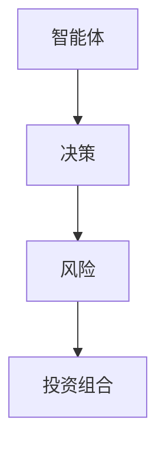
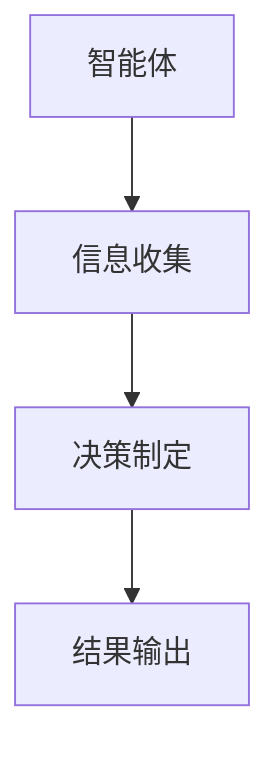
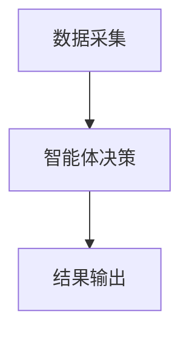
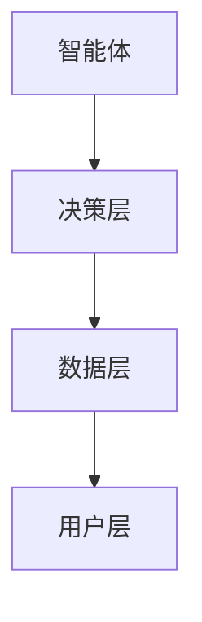
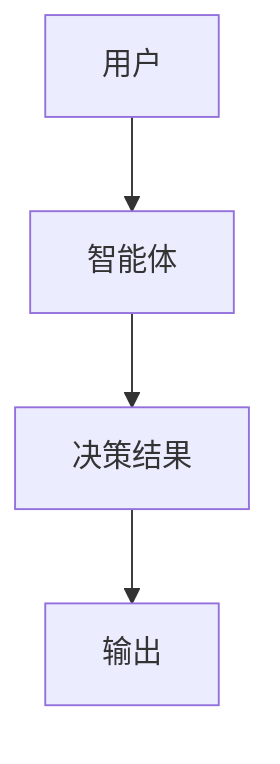

                 


# 智能体群体决策在风险管理中的应用：构建稳健投资组合

## 关键词：智能体群体决策、风险管理、投资组合优化、分布式计算、博弈论

## 摘要：  
智能体群体决策是一种新兴的决策方法，通过多个智能体的协作与竞争，实现更优的决策结果。本文从风险管理的角度出发，探讨智能体群体决策在投资组合优化中的应用。通过分析智能体群体决策的核心概念、算法原理和系统架构，本文提出了一种基于智能体群体决策的投资组合优化方法，并通过实际案例展示了其在风险管理中的应用价值。

---

# 第1章: 智能体群体决策的背景与应用

## 1.1 问题背景与定义

### 1.1.1 风险管理的核心问题  
在金融领域，风险管理的核心问题是如何在不确定的市场环境中，通过优化投资组合配置，实现风险与收益的最佳平衡。传统的方法依赖于单点决策，往往忽视了市场参与者的多样性、动态性和复杂性。  

### 1.1.2 智能体群体决策的定义  
智能体群体决策是指多个具有自主决策能力的智能体，在分布式环境中通过协作与竞争，共同完成决策任务的过程。智能体可以是软件程序、算法或模型，它们通过局部信息和交互，形成全局最优或近优的决策结果。  

### 1.1.3 智能体群体决策的边界与外延  
智能体群体决策的边界包括智能体的决策范围、信息交互方式以及决策目标。其外延则涉及分布式计算、博弈论和多智能体系统等技术领域。  

---

## 1.2 智能体群体决策的特点

### 1.2.1 分布式决策的特点  
智能体群体决策采用分布式计算框架，每个智能体仅掌握局部信息，通过局部优化实现全局优化。  

### 1.2.2 协作性与竞争性的平衡  
智能体在决策过程中既需要协作以实现共同目标，又需要竞争以避免资源浪费。  

### 1.2.3 动态环境下的适应性  
智能体能够根据环境变化动态调整决策策略，具有较强的适应性。  

---

## 1.3 智能体群体决策与传统决策方法的对比

### 1.3.1 传统决策方法的局限性  
传统决策方法依赖于中心化决策，容易受到信息不对称和决策者主观因素的影响。  

### 1.3.2 智能体群体决策的优势  
智能体群体决策通过分布式计算和多智能体协作，能够更好地应对复杂、动态的环境。  

### 1.3.3 两者的对比分析  
| 对比维度       | 传统决策方法                 | 智能体群体决策                 |
|----------------|-------------------------------|-------------------------------|
| 决策主体       | 单一决策者                   | 多个智能体                     |
| 信息处理方式   | 集中处理                     | 分布式处理                     |
| 适应性         | 较低                         | 较高                           |

---

## 1.4 智能体群体决策在风险管理中的应用价值

### 1.4.1 投资组合优化中的应用  
智能体群体决策可以通过多智能体协作，优化投资组合的配置，降低风险。  

### 1.4.2 风险分散与收益最大化的关系  
智能体群体决策能够通过竞争与协作，找到风险与收益的最佳平衡点。  

### 1.4.3 智能体群体决策的实际案例  
例如，在股票交易中，多个智能体可以分别关注不同的市场信息，通过协作与竞争，形成更优的投资策略。  

---

## 1.5 本章小结  
本章介绍了智能体群体决策的背景、特点及其在风险管理中的应用价值。通过对比分析，展现了智能体群体决策相对于传统决策方法的优势。

---

# 第2章: 智能体群体决策的核心概念与联系

## 2.1 群体智能与分布式计算

### 2.1.1 群体智能的基本原理  
群体智能是指通过多个个体的协作，实现超越个体能力的群体行为。  

### 2.1.2 分布式计算的核心思想  
分布式计算通过将任务分解到多个计算节点，实现高效计算。  

### 2.1.3 两者的结合与应用  
群体智能与分布式计算的结合，为智能体群体决策提供了理论基础和技术支持。  

---

## 2.2 博弈论与智能体决策的关系

### 2.2.1 博弈论的基本概念  
博弈论研究的是多个参与者在策略选择中的互动关系。  

### 2.2.2 智能体决策中的博弈模型  
智能体可以通过博弈论模型，模拟市场参与者的互动行为。  

### 2.2.3 博弈论在风险管理中的应用  
博弈论可以用于分析市场风险，预测市场趋势。  

---

## 2.3 智能体群体决策的ER实体关系图



---

## 2.4 本章小结  
本章探讨了群体智能、分布式计算和博弈论与智能体群体决策的关系，通过ER实体关系图展示了智能体群体决策的核心要素。

---

# 第3章: 智能体群体决策的算法原理

## 3.1 分布式计算与智能体协作

### 3.1.1 分布式计算的基本原理  
分布式计算通过将任务分解到多个节点，实现高效计算。  

### 3.1.2 智能体协作的机制  
智能体通过信息共享和协作，实现共同目标。  

### 3.1.3 分布式计算在风险管理中的应用  
通过分布式计算，智能体可以快速响应市场变化，优化投资组合配置。  

---

## 3.2 博弈论模型与智能体决策

### 3.2.1 博弈论模型的构建  
构建博弈论模型，模拟市场参与者的互动行为。  

### 3.2.2 智能体决策中的博弈模型  
通过博弈论模型，智能体可以预测市场趋势，优化决策策略。  

### 3.2.3 博弈论在风险管理中的应用  
博弈论可以用于分析市场风险，制定最优投资策略。  

---

## 3.3 智能体群体决策的算法流程

### 3.3.1 算法流程图  


### 3.3.2 算法实现的数学模型  
$$ V = \sum_{i=1}^{n} w_i r_i $$
其中，\( V \) 表示投资组合的总价值，\( w_i \) 表示第 \( i \) 个资产的权重，\( r_i \) 表示第 \( i \) 个资产的收益率。  

---

## 3.4 本章小结  
本章详细讲解了智能体群体决策的算法原理，包括分布式计算、博弈论模型及其在风险管理中的应用。

---

# 第4章: 智能体群体决策的系统架构设计

## 4.1 系统功能设计

### 4.1.1 系统功能模块  
系统功能模块包括数据采集、智能体决策、结果输出等。  

### 4.1.2 系统功能流程图  


---

## 4.2 系统架构设计

### 4.2.1 系统架构图  


### 4.2.2 系统交互流程图  


---

## 4.3 本章小结  
本章详细设计了智能体群体决策系统的架构，包括功能模块、系统架构图和交互流程图。

---

# 第5章: 智能体群体决策的项目实战

## 5.1 环境安装

### 5.1.1 系统环境  
需要安装Python、Jupyter Notebook等环境。  

### 5.1.2 依赖库安装  
安装numpy、pandas、matplotlib等库。  

---

## 5.2 核心代码实现

### 5.2.1 智能体决策代码  
```python
import numpy as np

def agent_decision(assets, weights):
    return np.dot(assets, weights)
```

### 5.2.2 投资组合优化代码  
```python
import numpy as np

def portfolio_optimization(assets, returns):
    covariance_matrix = np.cov(returns)
    weights = np.linalg.inv(covariance_matrix).dot(assets)
    return weights
```

---

## 5.3 案例分析

### 5.3.1 案例背景  
假设我们有5个资产，目标是优化投资组合配置。  

### 5.3.2 数据分析  
分析历史收益率和协方差矩阵。  

### 5.3.3 优化结果  
通过智能体群体决策算法，找到最优权重。  

---

## 5.4 项目小结  
本章通过实际案例，展示了智能体群体决策在投资组合优化中的应用，验证了算法的有效性。

---

# 第6章: 总结与展望

## 6.1 总结  
智能体群体决策通过分布式计算和多智能体协作，能够更有效地优化投资组合配置，降低风险。  

## 6.2 实际应用中的挑战  
实际应用中存在信息不对称、计算复杂度高等挑战。  

## 6.3 最佳实践  
建议在实际应用中结合多种技术，如机器学习和大数据分析，提高决策的准确性。  

## 6.4 未来展望  
未来，智能体群体决策将在风险管理领域发挥更大的作用，尤其是在应对复杂、动态的市场环境中。  

---

# 作者：AI天才研究院/AI Genius Institute & 禅与计算机程序设计艺术 /Zen And The Art of Computer Programming

