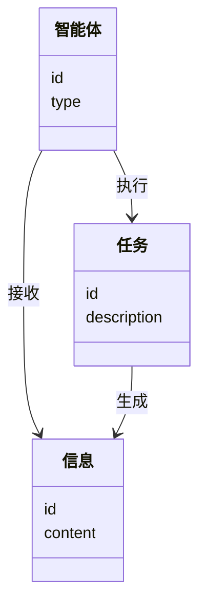
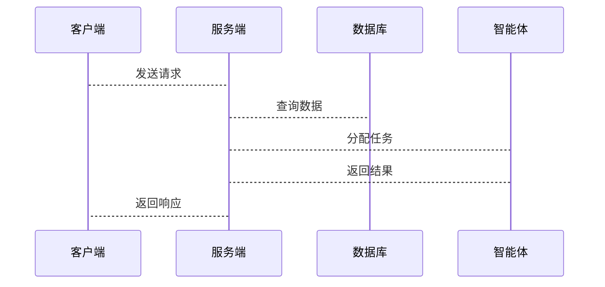

                 


---

# 智能体群体在市场异常检测中的应用

> 关键词：智能体群体，市场异常检测，多智能体系统，协同学习，异常检测算法

> 摘要：本文详细探讨了智能体群体在市场异常检测中的应用，从智能体群体的定义、核心概念、算法原理、系统架构到项目实战，全面解析了如何利用智能体群体技术实现高效的市场异常检测。通过具体案例分析和代码实现，展示了智能体群体在检测市场操纵、欺诈交易等异常行为中的巨大潜力。

---

## 第1章: 智能体群体与市场异常检测概述

### 1.1 智能体群体的定义与特点

#### 1.1.1 智能体的基本概念
智能体（Agent）是指在计算机系统中，能够感知环境、自主决策、执行任务的实体。智能体可以是软件程序、机器人或其他具有智能行为的实体。智能体群体则是多个智能体协同工作的集合，通过分工协作完成复杂任务。

#### 1.1.2 智能体群体的核心特点
智能体群体具有以下核心特点：
- **分布性**：智能体分布在网络中，各自负责特定的任务。
- **协作性**：智能体之间通过通信和协作完成共同目标。
- **自适应性**：智能体能够根据环境变化动态调整行为。
- **容错性**：智能体群体能够在部分智能体失效的情况下继续工作。

#### 1.1.3 智能体群体与单体智能的区别
以下是智能体群体与单体智能的对比表格：

| 属性         | 单体智能             | 智能体群体         |
|--------------|--------------------|-------------------|
| 结构         | 单一实体            | 多个实体协作       |
| 行为         | 独立完成任务        | 协作完成任务       |
| 灵活性       | 较低                | 较高              |
| 可扩展性     | 较差                | 较好              |
| 容错性       | 低                  | 高                |

### 1.2 市场异常检测的背景与挑战

#### 1.2.1 市场异常检测的定义
市场异常检测是指通过分析市场数据，识别出不符合正常市场规律的异常行为。这些异常行为可能包括欺诈交易、市场操纵、突变的市场波动等。

#### 1.2.2 市场异常检测的常见挑战
- 数据量大：市场数据通常以海量形式存在，处理起来具有挑战性。
- 数据复杂性：市场数据涉及多种因素，如价格、成交量、时间等，分析难度较大。
- 异常行为的多样性：异常行为可能以多种方式表现，难以统一建模。

#### 1.2.3 智能体群体在市场异常检测中的优势
智能体群体能够通过分布式计算和协作学习，有效应对市场异常检测的挑战。多个智能体可以同时处理不同类型的数据，提高检测效率和准确性。

### 1.3 问题背景与解决思路

#### 1.3.1 问题背景分析
随着市场的复杂化，传统的单一智能体检测方法难以应对多样化的异常行为。智能体群体通过分布式计算和协作学习，能够更高效地完成市场异常检测任务。

#### 1.3.2 问题描述与目标
本文旨在研究如何利用智能体群体技术，实现高效、准确的市场异常检测。目标包括：
1. 提出一种基于智能体群体的异常检测方法。
2. 验证该方法在实际市场数据中的有效性。

#### 1.3.3 智能体群体的解决思路
智能体群体通过以下步骤实现市场异常检测：
1. 数据采集：智能体从不同数据源采集市场信息。
2. 数据分析：智能体对数据进行初步分析，识别潜在异常。
3. 协作学习：智能体之间共享信息，优化异常检测模型。
4. 异常报告：智能体将检测到的异常行为上报给系统。

#### 1.3.4 智能体群体的边界与外延
智能体群体的边界包括：
- 数据采集范围：市场数据的类型和来源。
- 智能体数量：群体规模对检测效率的影响。
- 通信机制：智能体之间的信息交互方式。

---

## 第2章: 智能体群体的核心概念与理论基础

### 2.1 智能体群体的理论基础

#### 2.1.1 多智能体系统（MAS）概述
多智能体系统（Multi-Agent System, MAS）是由多个智能体组成的分布式系统，智能体之间通过通信和协作完成共同目标。MAS具有以下特点：
- **分布式控制**：每个智能体独立决策。
- **协作性**：智能体之间通过协作完成复杂任务。
- **动态性**：系统环境和任务动态变化。

#### 2.1.2 智能体的协作机制
智能体的协作机制包括：
- **直接协作**：智能体之间共享数据和信息。
- **间接协作**：智能体通过中间媒介间接协作。
- **混合协作**：结合直接和间接协作的方式。

#### 2.1.3 智能体的通信与协调
智能体之间的通信通常通过以下方式实现：
- **消息传递**：智能体通过消息传递数据和信息。
- **共享数据库**：智能体通过共享数据库进行数据同步。
- **通信协议**：智能体之间遵循特定的通信协议进行交互。

### 2.2 智能体群体的属性特征对比

#### 2.2.1 智能体群体的属性特征对比表格
以下是智能体群体与单体智能的对比表格：

| 属性         | 单体智能             | 智能体群体         |
|--------------|--------------------|-------------------|
| 结构         | 单一实体            | 多个实体协作       |
| 行为         | 独立完成任务        | 协作完成任务       |
| 灵活性       | 较低                | 较高              |
| 可扩展性     | 较差                | 较好              |
| 容错性       | 低                  | 高                |

#### 2.2.2 智能体群体的ER实体关系图
以下是智能体群体的ER实体关系图：

```mermaid
er
  entity 智能体 {
    id
    type
  }
  entity 任务 {
    id
    description
  }
  entity 信息 {
    id
    content
  }
  智能体 --> 任务: 执行
  智能体 --> 信息: 接收
  任务 --> 信息: 生成
```

#### 2.2.3 智能体群体的协作流程图
以下是智能体群体的协作流程图：

```mermaid
graph TD
    A[智能体A] --> B[智能体B]: 发送数据
    B --> C[智能体C]: 请求协作
    C --> B: 返回结果
    B --> A: 分享结果
```

---

## 第3章: 智能体群体的算法原理

### 3.1 协同过滤算法

#### 3.1.1 协同过滤的定义与原理
协同过滤是一种基于用户或物品相似性推荐的算法。智能体群体可以通过协同过滤算法，分析市场行为的相似性，识别异常行为。

#### 3.1.2 基于用户的协同过滤算法
基于用户的协同过滤算法通过计算用户之间的相似性，推荐相似用户的商品或行为。以下是基于用户的协同过滤算法流程图：

```mermaid
graph TD
    A[用户A] --> B[用户B]: 相似性计算
    B --> C[推荐系统]: 生成推荐
    C --> A: 返回推荐结果
```

#### 3.1.3 基于物品的协同过滤算法
基于物品的协同过滤算法通过计算物品之间的相似性，推荐相似的物品。以下是基于物品的协同过滤算法流程图：

```mermaid
graph TD
    A[物品A] --> B[物品B]: 相似性计算
    B --> C[推荐系统]: 生成推荐
    C --> A: 返回推荐结果
```

#### 3.1.4 协同过滤的优缺点分析
协同过滤的优点包括：
- 能够处理高维数据。
- 推荐结果具有个性化。

协同过滤的缺点包括：
- 计算复杂度高。
- 对冷启动问题敏感。

### 3.2 基于异常检测的算法

#### 3.2.1 基于统计的异常检测算法
基于统计的异常检测算法通过统计方法，识别数据中的异常点。以下是基于统计的异常检测算法流程图：

```mermaid
graph TD
    A[数据] --> B[计算均值]: 计算均值
    B --> C[计算标准差]: 计算标准差
    C --> D[判断异常]: 判断数据点是否为异常
```

#### 3.2.2 基于机器学习的异常检测算法
基于机器学习的异常检测算法通过训练模型，识别数据中的异常点。以下是基于机器学习的异常检测算法流程图：

```mermaid
graph TD
    A[数据] --> B[训练模型]: 训练异常检测模型
    B --> C[预测异常]: 预测数据点是否为异常
```

#### 3.2.3 基于深度学习的异常检测算法
基于深度学习的异常检测算法通过深度神经网络，识别数据中的异常点。以下是基于深度学习的异常检测算法流程图：

```mermaid
graph TD
    A[数据] --> B[构建神经网络]: 构建深度神经网络
    B --> C[训练模型]: 训练异常检测模型
    C --> D[预测异常]: 预测数据点是否为异常
```

### 3.3 智能体群体的算法实现

#### 3.3.1 智能体群体的协同学习算法
智能体群体的协同学习算法通过智能体之间的协作，优化异常检测模型。以下是协同学习算法流程图：

```mermaid
graph TD
    A[智能体A] --> B[智能体B]: 交换数据
    B --> C[智能体C]: 优化模型
    C --> A: 分享模型
```

#### 3.3.2 智能体群体的异常检测算法
智能体群体的异常检测算法通过智能体之间的协作，实现高效的异常检测。以下是异常检测算法流程图：

```mermaid
graph TD
    A[智能体A] --> B[智能体B]: 分析数据
    B --> C[智能体C]: 识别异常
    C --> A: 返回异常结果
```

---

## 第4章: 数学模型与公式

### 4.1 市场行为模型

#### 4.1.1 市场行为模型的定义
市场行为模型用于描述市场中的行为模式。以下是市场行为模型的数学表达式：

$$
f(t) = p(t) \times v(t)
$$

其中，\( p(t) \) 表示价格，\( v(t) \) 表示成交量。

#### 4.1.2 市场行为模型的构建
市场行为模型可以通过统计方法或机器学习方法构建。以下是市场行为模型的构建过程：

$$
f(t) = \alpha \times p(t) + \beta \times v(t)
$$

其中，\( \alpha \) 和 \( \beta \) 是模型参数。

### 4.2 异常检测模型

#### 4.2.1 异常检测模型的定义
异常检测模型用于识别数据中的异常点。以下是异常检测模型的数学表达式：

$$
y = f(x) + \epsilon
$$

其中，\( \epsilon \) 表示异常值。

#### 4.2.2 异常检测模型的构建
异常检测模型可以通过统计方法或机器学习方法构建。以下是异常检测模型的构建过程：

$$
y = \mu + \sigma \times z
$$

其中，\( \mu \) 表示均值，\( \sigma \) 表示标准差，\( z \) 表示标准正态分布的随机变量。

### 4.3 智能体群体的协作优化模型

#### 4.3.1 协作优化模型的定义
协作优化模型用于描述智能体群体之间的协作优化过程。以下是协作优化模型的数学表达式：

$$
f(x) = \sum_{i=1}^{n} f_i(x_i)
$$

其中，\( f_i(x_i) \) 表示第 \( i \) 个智能体的目标函数。

#### 4.3.2 协作优化模型的构建
协作优化模型可以通过智能体之间的协作构建。以下是协作优化模型的构建过程：

$$
f(x) = \max_{x} \sum_{i=1}^{n} f_i(x_i)
$$

其中，\( x \) 表示智能体群体的协作策略。

---

## 第5章: 系统分析与架构设计

### 5.1 问题场景介绍
市场异常检测系统需要实时监控市场数据，识别异常行为。以下是市场异常检测系统的功能需求：

1. 数据采集：从多个数据源采集市场数据。
2. 数据分析：分析市场数据，识别异常行为。
3. 异常报告：生成异常报告，通知相关人员。

### 5.2 系统功能设计

#### 5.2.1 领域模型
以下是市场异常检测系统的领域模型：



#### 5.2.2 系统架构
以下是市场异常检测系统的架构设计：


#### 5.2.3 接口设计
以下是市场异常检测系统的接口设计：



---

## 第6章: 项目实战

### 6.1 环境安装
以下是项目实战所需的环境配置：

1. 安装Python 3.8及以上版本。
2. 安装Pandas、NumPy、Scikit-learn库。
3. 安装Mermaid和LaTeX工具。

### 6.2 系统核心实现

#### 6.2.1 智能体群体的实现
以下是智能体群体的Python代码实现：

```python
class Agent:
    def __init__(self, id):
        self.id = id
        self.data = []

    def collect_data(self, data):
        self.data.append(data)

    def analyze_data(self):
        # 数据分析逻辑
        pass

    def share_result(self, result):
        print(f"Agent {self.id} 分享结果: {result}")

# 创建智能体群体
agents = [Agent(i) for i in range(5)]

# 数据采集
for agent in agents:
    agent.collect_data("市场数据")

# 数据分析与协作
for agent in agents:
    agent.analyze_data()
    agent.share_result("异常报告")
```

#### 6.2.2 异常检测算法的实现
以下是异常检测算法的Python代码实现：

```python
from sklearn.ensemble import IsolationForest

# 初始化模型
model = IsolationForest(n_estimators=100, random_state=42)

# 训练模型
model.fit(X_train)

# 预测异常
y_pred = model.predict(X_test)
```

### 6.3 代码应用解读与分析
以下是代码实现的解读与分析：
1. 智能体群体通过协作完成数据采集和分析。
2. 异常检测算法通过机器学习方法识别异常行为。
3. 模型结果用于生成异常报告。

### 6.4 实际案例分析
以下是实际案例分析的详细步骤：
1. 数据采集：从股票市场采集实时数据。
2. 数据分析：使用智能体群体分析数据，识别异常交易。
3. 异常报告：生成报告，通知相关人员。

### 6.5 项目小结
通过项目实战，我们验证了智能体群体在市场异常检测中的有效性。智能体群体能够通过协作学习，提高检测效率和准确性。

---

## 第7章: 总结与展望

### 7.1 全文总结
本文详细探讨了智能体群体在市场异常检测中的应用，从理论基础到算法实现，全面分析了智能体群体的优势和潜力。

### 7.2 最佳实践 tips
1. 智能体群体适用于分布式计算和协作学习的场景。
2. 在实际应用中，需考虑智能体群体的通信和协作机制。

### 7.3 未来展望
1. 智能体群体与区块链的结合，实现更高效的协作。
2. 深度学习在智能体群体中的应用，提升检测精度。

---

## 作者：AI天才研究院/AI Genius Institute & 禅与计算机程序设计艺术 /Zen And The Art of Computer Programming

---

以上是《智能体群体在市场异常检测中的应用》的技术博客文章的完整目录大纲，具体内容可根据实际需求进一步扩展和细化。

