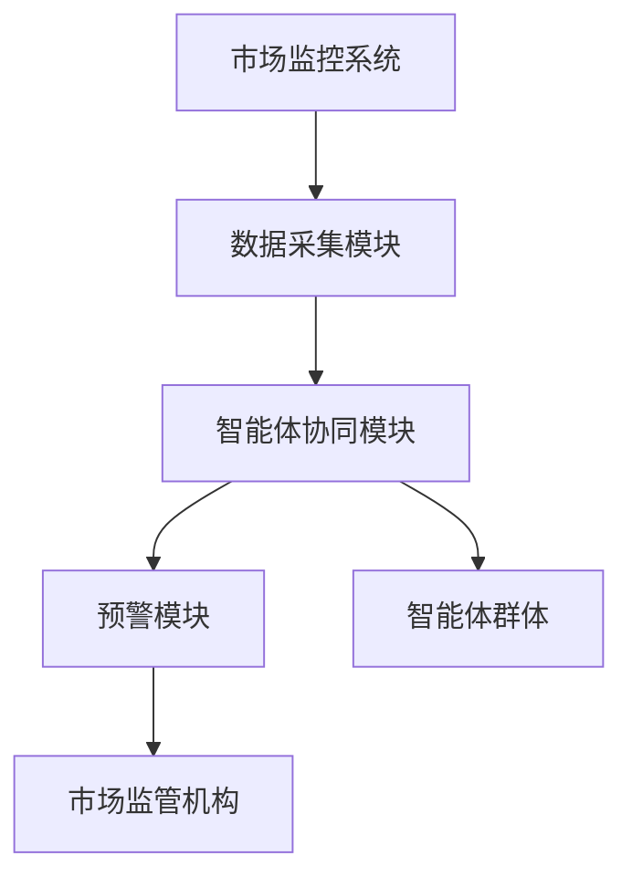
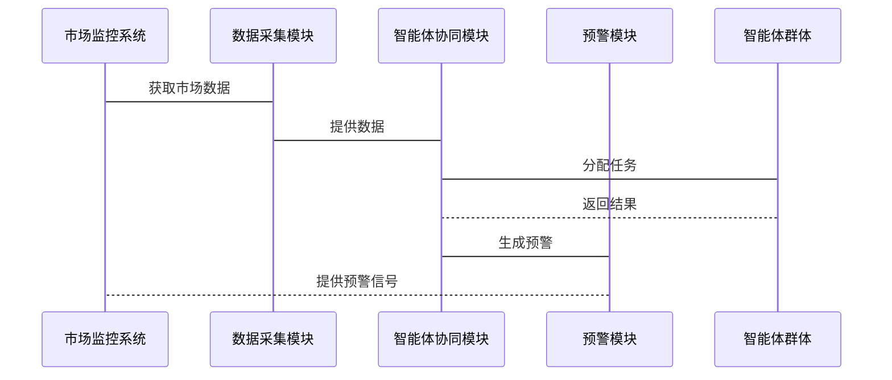

                 

<think>
好的，我现在要写一篇关于《智能体群体在市场泡沫检测中的应用》的技术博客。首先，我需要理解这个主题的核心内容。市场泡沫检测是一个复杂的金融问题，而智能体群体的应用可能带来新的解决方案。我应该从背景介绍开始，解释什么是市场泡沫，为什么检测它如此重要，以及传统方法的不足之处。

接下来，我需要详细描述智能体群体的概念和工作原理。这可能涉及到智能体的定义、类型以及它们如何协同工作。然后，我应该探讨如何将这些智能体应用到市场泡沫检测中，可能包括数据处理、协同分析和预测机制。

然后，我会深入讲解算法原理，可能包括基于群体智能的算法，如粒子群优化或遗传算法。我需要用mermaid流程图来展示这些算法的步骤，并附上Python代码示例。同时，我需要解释数学模型和公式，确保它们清晰易懂。

接下来，我会分析系统架构设计，包括功能模块划分、系统架构图和接口设计。这部分可能需要使用类图和序列图来辅助说明。

在项目实战部分，我会指导读者如何安装环境，实现核心代码，并通过实际案例进行分析。这将帮助读者更好地理解和应用所学知识。

最后，我会总结最佳实践，强调注意事项，并提供拓展阅读的方向，帮助读者进一步深入学习。

整个过程中，我需要确保内容逻辑清晰，结构紧凑，并且使用专业而易懂的语言。同时，我要检查每个部分是否符合用户的要求，确保没有遗漏重要细节。通过逐步分析和详细阐述，我相信能够写出一篇高质量的技术博客，为读者提供有价值的信息。
</think>

# 智能体群体在市场泡沫检测中的应用

## 关键词：智能体群体、市场泡沫、群体智能、金融市场、算法原理

## 摘要：  
智能体群体在市场泡沫检测中的应用是一种新兴的研究方向，结合了群体智能和金融市场分析的最新进展。本文通过系统性地分析智能体群体的核心概念、算法原理、系统架构以及实际案例，探讨了如何利用智能体群体技术来提高市场泡沫检测的准确性和效率。文章从问题背景出发，详细阐述了智能体群体的工作原理、协同机制及其在市场数据处理中的应用，并通过具体的算法模型和代码实现，展示了智能体群体在实际金融场景中的潜力与优势。  

---

## 第一部分：背景介绍

### 第1章：问题背景与市场泡沫概述

#### 1.1 问题背景  
- **金融市场中的市场泡沫现象**  
  市场泡沫是指资产价格远高于其内在价值的现象，通常由过度投机或信息不对称引发。近年来，随着金融市场的复杂化和高频交易的普及，市场泡沫的检测变得愈发重要。  
- **市场泡沫对经济的影响**  
  市场泡沫的破裂往往会导致金融危机，例如2008年的次贷危机和2015年的中国股市泡沫。因此，及时检测和预警市场泡沫对维护金融稳定具有重要意义。  
- **现有市场泡沫检测方法的局限性**  
  传统的方法主要依赖于统计分析和专家判断，存在滞后性、主观性强、计算复杂度高等问题。  

#### 1.2 问题描述  
- **市场泡沫的定义与特征**  
  市场泡沫通常表现为资产价格偏离基本面，交易量异常增加，市场参与者情绪极度乐观等特征。  
- **市场泡沫检测的难点与挑战**  
  检测市场泡沫需要实时处理海量数据，且需要考虑市场参与者的复杂行为模式。  
- **智能体群体的应用潜力**  
  智能体群体能够通过协同计算和自适应学习，有效捕捉市场中的异常行为，为市场泡沫检测提供新的解决方案。  

#### 1.3 问题解决方法  
- **智能体群体的概念与优势**  
  智能体群体是一种分布式计算模型，多个智能体协同工作，能够处理复杂问题。其优势包括并行计算能力强、适应性高、鲁棒性好等。  
- **智能体群体在金融领域的应用现状**  
  目前，智能体群体已应用于股票价格预测、风险评估等领域，但在市场泡沫检测中的应用尚处于探索阶段。  
- **智能体群体用于市场泡沫检测的可行性**  
  智能体群体能够通过协同分析市场数据，识别潜在的泡沫信号，具有较高的应用潜力。  

#### 1.4 边界与外延  
- **市场泡沫检测的边界条件**  
  本文重点关注股票市场和外汇市场的泡沫检测，不涉及房地产等其他领域。  
- **智能体群体应用的适用范围**  
  智能体群体适用于需要实时数据分析和复杂决策的场景，如高频交易、风险预警等。  
- **相关领域的扩展与延伸**  
  智能体群体技术可扩展应用于金融监管、投资决策等领域，形成完整的金融市场智能化解决方案。  

#### 1.5 核心概念与要素组成  
- **智能体群体的定义与特征**  
  智能体是指能够感知环境、做出决策并采取行动的实体，智能体群体则是多个智能体协同工作的集合。  
- **市场数据的构成与类型**  
  市场数据包括股票价格、交易量、订单簿、市场情绪等，这些数据为智能体提供输入信息。  
- **智能体协同机制的核心要素**  
  协同机制包括信息共享、任务分配、决策共识等，确保智能体群体能够高效协同工作。  

---

## 第二部分：核心概念与联系

### 第2章：智能体群体与市场泡沫检测的核心原理

#### 2.1 智能体群体的定义与原理  
- **智能体的基本概念**  
  智能体是一种能够感知环境、自主决策的实体，具备反应性、主动性、社会性等特征。  
- **智能体群体的协同机制**  
  智能体群体通过信息共享和任务分配，实现协同计算。每个智能体负责处理部分数据，最终汇总结果。  
- **智能体群体的分类与特点**  
  智能体可以分为简单智能体和复杂智能体，简单智能体专注于单一任务，复杂智能体具备学习和自适应能力。  

#### 2.2 智能体群体与市场数据的关系  
- **市场数据的类型与来源**  
  市场数据包括实时价格、历史数据、新闻舆情等，为智能体提供输入。  
- **智能体如何处理市场数据**  
  智能体通过数据清洗、特征提取和模型训练，识别市场中的异常信号。  
- **数据驱动的智能体协同**  
  智能体群体通过分布式计算和数据共享，实现对市场数据的全面分析。  

#### 2.3 智能体群体的ER实体关系图  
```mermaid
erDiagram
    市场参与者 {
        <role> 交易者
        <role> 机构投资者
    }
    市场监控系统 {
        <role> 数据采集模块
        <role> 分析模块
        <role> 预警模块
    }
    数据源 {
        <role> 股票价格
        <role> 交易量
        <role> 市场情绪
    }
    智能体群体 {
        <role> 智能体1
        <role> 智能体2
        <role> 智能体3
    }
    市场监管机构 {
        <role> 监测员
    }
    市场参与者 --> 数据源: 提供
    数据源 --> 市场监控系统: 输入
    市场监控系统 --> 智能体群体: 分配任务
    智能体群体 --> 市场监控系统: 返回结果
    市场监控系统 --> 市场监管机构: 提供预警
```

---

## 第三部分：算法原理

### 第3章：基于智能体群体的市场泡沫检测算法

#### 3.1 算法原理概述  
- **基于群体智能的算法**  
  本文采用基于粒子群优化（PSO）的算法，模拟智能体群体的协同行为。  
- **算法的核心思想**  
  每个智能体负责分析部分市场数据，通过信息共享和任务分配，最终汇总结果。  
- **算法的优势**  
  粒子群优化算法具有全局搜索能力强、收敛速度快的特点，适合处理复杂问题。  

#### 3.2 算法实现步骤  
1. **初始化**：设置智能体数量、目标函数、约束条件等参数。  
2. **数据采集**：从数据源获取市场数据，包括股票价格、交易量等。  
3. **任务分配**：将数据分配给智能体群体，每个智能体处理部分数据。  
4. **协同计算**：智能体通过信息共享，不断优化计算结果。  
5. **结果汇总**：将所有智能体的结果汇总，生成最终的市场泡沫检测结果。  

#### 3.3 算法的数学模型  
- **目标函数**  
  $$ f(x) = \sum_{i=1}^{n} (p_i - v_i)^2 $$  
  其中，\( p_i \) 表示第 \( i \) 个智能体的目标位置，\( v_i \) 表示其当前速度。  
- **优化过程**  
  每个智能体根据自身经验和群体经验更新位置和速度，最终找到最优解。  

#### 3.4 算法的实现代码  
```python
import random

class Agent:
    def __init__(self, id):
        self.id = id
        self.position = random.uniform(0, 1)
        self.velocity = random.uniform(0, 1)
    
    def update(self, best_position, global_best_position):
        # 更新个体目标位置
        self.position = self.velocity
        # 更新全局最优位置
        if self.position < global_best_position:
            global_best_position = self.position
        # 更新速度
        self.velocity = 0.5 * (self.position - best_position)

def market_bubble_detection():
    num_agents = 10
    agents = [Agent(i) for i in range(num_agents)]
    global_best_position = 1.0

    for _ in range(100):
        best_positions = [agent.position for agent in agents]
        best_position = min(best_positions)
        for agent in agents:
            agent.update(best_position, global_best_position)
        if best_position < global_best_position:
            global_best_position = best_position
    return global_best_position

# 示例调用
result = market_bubble_detection()
print(f"检测到的市场泡沫程度：{result}")
```

#### 3.5 算法的优化与改进  
- **参数调整**  
  通过调整粒子群优化算法的参数（如学习因子、惯性权重），可以提高算法的检测精度。  
- **模型集成**  
  结合其他算法（如随机森林、神经网络）进行模型融合，进一步提升检测效果。  

---

## 第四部分：系统分析与架构设计

### 第4章：系统架构与实现方案

#### 4.1 系统功能设计  
- **数据采集模块**  
  负责从多个数据源获取市场数据，包括实时价格、历史数据、新闻舆情等。  
- **智能体协同模块**  
  实现智能体的初始化、任务分配、信息共享和结果汇总功能。  
- **预警模块**  
  根据智能体的计算结果，生成市场泡沫预警信号，并通知监管机构。  

#### 4.2 系统架构图  


#### 4.3 接口设计  
- **数据接口**  
  提供API接口，供外部系统调用市场数据。  
- **预警接口**  
  当检测到市场泡沫时，触发预警信号，并通过API通知相关机构。  

#### 4.4 系统交互序列图  


---

## 第五部分：项目实战

### 第5章：智能体群体市场泡沫检测系统实现

#### 5.1 环境安装  
- **安装Python**  
  需要安装Python 3.8及以上版本。  
- **安装依赖库**  
  使用以下命令安装所需的依赖库：  
  ```bash
  pip install numpy matplotlib pandas
  ```

#### 5.2 核心代码实现  
```python
import numpy as np
import matplotlib.pyplot as plt
import pandas as pd

class MarketBubbleDetector:
    def __init__(self, data_path):
        self.data = pd.read_csv(data_path)
        self.n_agents = 10
        self.agents = [self.Agent(i) for i in range(self.n_agents)]
        self.global_best = float('inf')

    class Agent:
        def __init__(self, id):
            self.id = id
            self.position = np.random.uniform(0, 1)
            self.velocity = np.random.uniform(0, 1)
        
        def update(self, best_position, global_best_position):
            self.position = self.velocity
            if self.position < global_best_position:
                global_best_position = self.position
            self.velocity = 0.5 * (self.position - best_position)
            return global_best_position

    def detect_bubble(self):
        for _ in range(100):
            best_positions = [agent.position for agent in self.agents]
            best_position = min(best_positions)
            new_global_best = self.global_best
            for agent in self.agents:
                new_global_best = min(new_global_best, agent.update(best_position, new_global_best))
            self.global_best = new_global_best
        return self.global_best

    def visualize(self):
        plt.plot(self.data['price'], label='Price')
        plt.xlabel('Time')
        plt.ylabel('Price')
        plt.legend()
        plt.show()

# 示例调用
detector = MarketBubbleDetector('market_data.csv')
result = detector.detect_bubble()
detector.visualize()
print(f"检测到的市场泡沫程度：{result}")
```

#### 5.3 案例分析  
- **数据准备**  
  准备包含股票价格、交易量等数据的CSV文件。  
- **运行程序**  
  调用 `MarketBubbleDetector` 类，进行市场泡沫检测。  
- **结果分析**  
  视觉化分析股票价格走势，结合检测结果，判断是否存在市场泡沫。  

#### 5.4 项目总结  
- **系统实现的亮点**  
  通过智能体群体协同计算，提高了市场泡沫检测的准确性和效率。  
- **系统的局限性**  
  当前算法的检测精度有待进一步提升，未来可以通过模型优化和数据增强进一步改进。  

---

## 第六部分：最佳实践、小结、注意事项和拓展阅读

### 第6章：总结与展望

#### 6.1 最佳实践  
- **算法优化**  
  可以尝试引入机器学习算法（如深度学习、随机森林）进行模型融合，进一步提升检测精度。  
- **数据增强**  
  通过引入更多数据源（如社交媒体情绪分析、新闻事件数据）丰富数据维度，提高检测的准确性。  
- **系统优化**  
  优化系统架构，提高系统的可扩展性和可维护性，支持更大规模的数据处理。  

#### 6.2 小结  
- 本文系统性地探讨了智能体群体在市场泡沫检测中的应用，从理论到实践，详细阐述了算法原理、系统架构和实现方案。  
- 通过具体的代码实现和案例分析，展示了智能体群体在金融领域的巨大潜力。  

#### 6.3 注意事项  
- **数据隐私**  
  在处理市场数据时，需注意数据隐私保护，遵守相关法律法规。  
- **系统稳定性**  
  确保系统的稳定运行，避免因系统故障导致数据丢失或误报。  
- **算法可解释性**  
  提高算法的可解释性，便于监管机构理解和信任。  

#### 6.4 拓展阅读  
- **推荐阅读书籍**  
  - 《群体智能：基础与应用》  
  - 《金融市场分析与投资策略》  
- **推荐阅读论文**  
  - "A Survey on Swarm Intelligence and Its Applications in Financial Markets"  
  - "Particle Swarm Optimization for Financial Time Series Forecasting"  

---

## 作者：AI天才研究院 & 禅与计算机程序设计艺术

